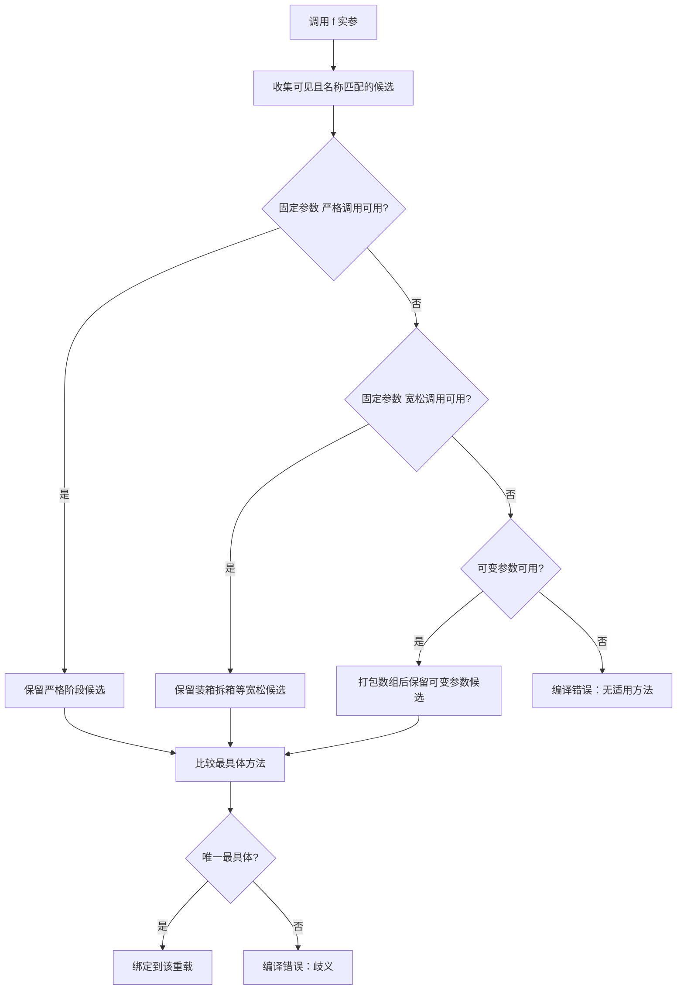

# Java 方法定义与重载

> **本章定位：语言规则权威页。** 只负责方法声明、方法签名、重载候选集、编译期解析、宽化/装箱/可变参数优先级、最具体匹配、`null` 歧义与泛型擦除。参数传递见 [参数传递机制.md](参数传递机制.md)，方法重写与动态分派见 [继承与方法重写.md](继承与方法重写.md) 和 [多态与动态绑定.md](多态与动态绑定.md)。

## 6.1 先记住三条主线

```text
声明：方法是什么
↓
签名：哪些声明可以共存
↓
调用：编译器从候选集中选哪一个
↓
执行：实例方法若被重写，再按运行时类型分派
```

方法重载是编译期问题；方法重写后的实例分派是运行期问题。不要用“运行时参数类型”解释普通重载。

## 6.2 方法声明由什么组成

```java
public static <T extends Number> T convert(
        T value,
        String format
) throws IllegalArgumentException {
    return value;
}
```

声明可以包含：

- 修饰符：`public`、`static`、`final` 等；
- 类型参数：`<T extends Number>`；
- 返回类型；
- 方法名；
- 形参列表；
- `throws` 声明；
- 方法体，或抽象/接口方法的分号。

调用只提供方法名和实参表达式。编译器先根据可见性、静态上下文和参数类型构造候选集，再做重载解析。

## 6.3 方法签名与重载边界

对普通重载，最实用的判断是：**方法名 + 形参类型序列**。形参名不构成区别，返回类型也不构成区别。

```java
void save(String value) {}
void save(int value) {}
void save(String value, int retry) {}
```

下面不能仅靠返回类型共存：

```java
int parse(String text) { return 0; }
// long parse(String text) { return 0L; } // ❌ return type is not enough
```

以下也不是普通重载区分条件：

| 改变项 | 能否单独形成重载 | 说明 |
| --- | --- | --- |
| 参数名 | 否 | 只影响方法体内部引用 |
| 返回类型 | 否 | 调用可能不使用返回值，无法可靠选择 |
| `throws` | 否 | 异常检查不是签名选择条件 |
| `public`/`private` | 否 | 影响可见性，不增加参数维度 |
| `static` | 否 | 同名同参不能靠静态/实例共存 |
| 参数类型、顺序、数量 | 是 | 形成不同形参类型序列 |

泛型声明还受擦除约束：`List<String>` 与 `List<Integer>` 擦除后都是 `List`，不能仅靠类型参数重载。

## 6.4 实例方法、静态方法与调用上下文

```java
class Counter {
    int next = 1;
    static String kind() { return "class"; }
    int value() { return next; }
}
```

- 实例方法有隐含接收者 `this`，可访问实例状态；
- 静态方法没有 `this`，只能直接访问静态成员；
- 静态方法的选择主要按编译时类型/声明位置，不是动态重写；
- `obj.staticMethod()` 的写法可以编译，但表达式中的对象并不决定静态分派，通常应改成 `Counter.kind()`。

方法重写规则统一放在继承页；本页只负责调用前的重载解析。

## 6.5 重载解析的四步模型

设有：

```java
void pick(int value) {}
void pick(long value) {}
void pick(Integer value) {}
void pick(Object value) {}
void pick(int... values) {}
```

编译器按以下顺序寻找适用方法，前一阶段找到可用候选后通常不会进入后一阶段：

1. **固定参数 + 严格调用**：恒等转换、基本类型宽化、引用宽化；
2. **固定参数 + 宽松调用**：在可用范围内加入装箱、拆箱和必要的引用宽化；
3. **可变参数调用**：最后才把实参打包成数组。

所以：

```java
pick(1);                  // pick(int)，严格恒等匹配
pick((short) 1);          // pick(int)，基本类型宽化
pick(Integer.valueOf(1)); // pick(Integer)，引用恒等匹配
pick("text");             // pick(Object)，引用宽化
pick(1, 2, 3);             // pick(int...)，只有可变参数形态可用
```

“基本类型宽化优先于装箱”“装箱优先于可变参数”不是经验口诀，而是这三个适用阶段的结果。

## 6.6 重载解析图



也可直接看 [重载解析图](../../图示/Java/方法重载解析.svg)。图示只表达选择阶段，不替代 JLS 的完整方法调用转换规则。

## 6.7 最具体匹配

同一阶段可能有多个候选，编译器还要选择更具体者：

```java
void describe(Object value) {}
void describe(CharSequence value) {}
void describe(String value) {}

describe("x"); // String 最具体
```

如果两个候选互不构成更具体关系，调用就会歧义：

```java
void route(String value) {}
void route(Integer value) {}

// route(null); // ❌ String 与 Integer 都可接收 null，无法选更具体者
```

接口之间也可能出现多个最具体默认候选；那是接口默认方法冲突，见 [接口.md](接口.md)，不要与普通重载歧义混为一谈。

## 6.8 `null` 的重载陷阱

`null` 可以转换到任意引用类型，但不能转换为基本类型：

```java
void send(String value) {}
void send(Object value) {}

send(null); // 选择 String，因为 String 比 Object 更具体
```

下面会歧义：

```java
void send(String value) {}
void send(Integer value) {}

// send(null); // ❌ 两个引用类型没有唯一最具体者
```

可用显式转换表达意图：

```java
send((String) null);
```

公共 API 不宜堆叠多个互不相关的引用类型重载，尤其不要让 `null` 成为常见调用路径的编译错误来源。

## 6.9 可变参数：便利语法与 API 成本

```java
void log(String tag, Object... values) {}
```

调用时，`values` 在方法体内表现为数组。可变参数只能是最后一个形参；调用 `log("x")` 时数组可以为空，调用 `log("x", null)` 还可能需要区分“一个 null 数组”和“一个 null 元素”的警告语义。

优先级上，固定参数方法优先于可变参数：

```java
void f(Object value) {}
void f(Object... values) {}

f("x"); // 固定参数版本
```

设计建议：

- 高频调用、性能敏感路径避免无意创建临时数组；
- 参数语义复杂时使用明确的请求对象；
- 对外 API 避免同时提供大量装箱重载和可变参数重载；
- 需要传入集合时，不要用 `Object...` 掩盖类型约束。

## 6.10 重载与重写同时存在

```java
class Parent {
    void speak(Object value) { System.out.println("parent-object"); }
}

class Child extends Parent {
    @Override
    void speak(Object value) { System.out.println("child-object"); }

    void speak(String value) { System.out.println("child-string"); }
}

Parent ref = new Child();
ref.speak("x"); // 先按 Parent 的候选选择 speak(Object)，再动态分派到 Child
```

必须分两层说：

```text
编译时类型 Parent
→ 决定候选集与重载选择：speak(Object)

运行时对象 Child
→ 决定可重写实例方法的最终实现：Child.speak(Object)
```

子类新增的 `speak(String)` 不会让父类引用在运行时重新做一次重载匹配。完整动态分派链见 [多态与动态绑定.md](多态与动态绑定.md)，配套示例见 [OverloadResolutionDemo.java](../../示例代码/src/main/java/com/xuegucheng/javatechreview/OverloadResolutionDemo.java)、[OverloadResolutionDemoTest.java](../../示例代码/src/test/java/com/xuegucheng/javatechreview/OverloadResolutionDemoTest.java) 和 [示例代码/README.md](../../示例代码/README.md)。

## 6.11 泛型方法与擦除

类型参数能增强调用点检查，但不能绕过 JVM 签名和擦除约束：

```java
<T> void copy(T value) {}
// void copy(Object value) {} // ❌ 擦除后与上面冲突
```

也不能这样重载：

```java
void read(java.util.List<String> values) {}
// void read(java.util.List<Integer> values) {} // ❌ 擦除后同为 List
```

泛型重写、桥接方法和名称冲突的完整规则由 [Java泛型与类型安全.md](Java泛型与类型安全.md) 统一维护；这里仅保留“重载声明必须在擦除后仍可区分”的边界。

## 6.12 返回值、异常与可达性

非 `void` 方法的每条正常完成路径都必须返回兼容值：

```java
int sign(int value) {
    if (value > 0) return 1;
    if (value < 0) return -1;
    return 0;
}
```

返回类型可以参与赋值类型检查，却不能单独参与重载选择。`throws` 影响调用方的受检异常检查，却不能单独产生重载。`finally` 中的 `return` 会覆盖前面的返回或异常，应避免这种控制流。

## 6.13 方法设计的最小检查表

| 问题 | 检查 |
| --- | --- |
| 签名 | 是否只依赖参数类型序列区分重载？ |
| 候选 | 调用点的编译时类型能看到哪些方法？ |
| 转换 | 是否意外从宽化进入装箱或可变参数阶段？ |
| `null` | 是否存在互不相关的引用类型重载？ |
| 泛型 | 擦除后是否发生名称冲突？ |
| 运行时 | 这是重载选择，还是重写后的动态分派？ |
| API | 重载数量是否让调用意图变得不清楚？ |

## 6.14 与其他权威页的边界

- 参数是值还是引用副本：见 [参数传递机制.md](参数传递机制.md)；
- 数值宽化、窄化和二元数值提升：见 [类型转换与数值精度.md](类型转换与数值精度.md)；
- 方法重写、协变返回、异常和桥接：见 [继承与方法重写.md](继承与方法重写.md) 与 [Java泛型与类型安全.md](Java泛型与类型安全.md)；
- 动态绑定与多态：见 [多态与动态绑定.md](多态与动态绑定.md)；
- 可运行验证：见 [示例代码/README.md](../../示例代码/README.md)。
