# equals、hashCode 与 Hash 集合契约

> **本章定位：面试主线章。**
>
> `equals()` 和 `hashCode()` 单独看只是 `Object` 的两个方法，但一旦对象进入 `HashMap`、`HashSet`，它们就变成了 Hash 集合能否正确工作的基础契约。
>
> 这章不做 API 百科，重点只抓 8 条面试主线：
>
> **`==` 与 equals → equals 契约 → hashCode 契约 → HashMap 如何查 key → 为什么必须成对重写 → 可变 key 为什么危险 → HashSet 如何去重 → 工程对象如何设计 equality。**
>
> 重点流程尽量使用 Mermaid 图解释，源码只保留真正会被追问的判断路径。语义基于 **Java 21**，Hash 集合实现以 JDK 8+ 为主。

---

## 05.1 一张图建立整章的面试地图

如果面试官问：

> `equals()` 和 `hashCode()` 有什么关系？

推荐先给出这一版总回答：

> `equals()` 定义两个对象在逻辑上是否相等，`hashCode()` 把对象映射到哈希空间。Java 规定：如果两个对象 equals 相等，那么它们的 hashCode 必须相等；反过来 hashCode 相等不代表 equals 一定相等，因为哈希冲突是允许的。HashMap / HashSet 会先根据 hash 定位桶，再在桶内通过 `==` 或 `equals()` 做最终确认。因此对象只要要作为 HashMap 的 key 或放入 HashSet，equals/hashCode 就必须表达同一套稳定的 equality 语义。

整章可以先压缩成下面这张图：

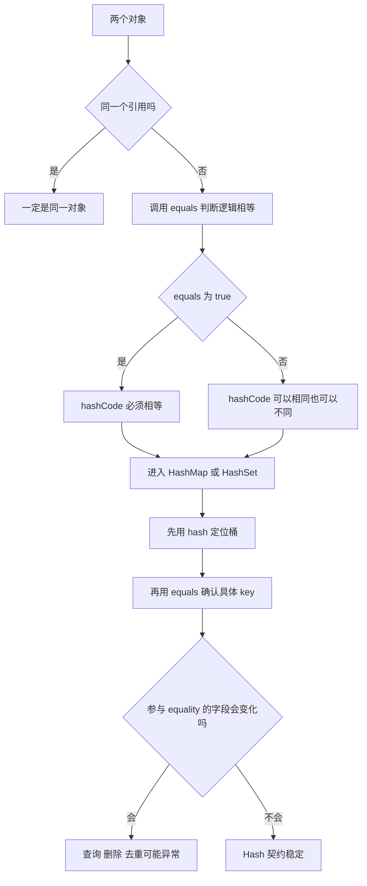

面试高频追问基本都来自这张图：

```text
1. == 和 equals 有什么区别？
2. equals 的五大契约是什么？
3. equals 相等为什么 hashCode 必须相等？
4. hashCode 相等为什么不一定 equals？
5. HashMap 查 key 时到底怎么使用 hashCode 和 equals？
6. 只重写 equals 不重写 hashCode 会怎样？
7. 为什么可变对象不适合作为 HashMap key？
8. HashSet 为什么能去重？
9. record / Lombok / Entity 的 equals 应该怎么设计？
10. HashSet 和 TreeSet 判断“重复”的标准一样吗？
```

本章的目标不是多，而是把这 10 个问题讲透。

---

## 05.2 `==`、equals 与 equals 契约

### 先说结论

对于引用类型：

```text
==
→ 判断两个引用是否指向同一个对象

equals
→ 判断两个对象是否满足当前类定义的逻辑相等语义
```

例如：

```java
String a = new String("Java");
String b = new String("Java");

System.out.println(a == b);      // false
System.out.println(a.equals(b)); // true
```

可以用这张图理解：

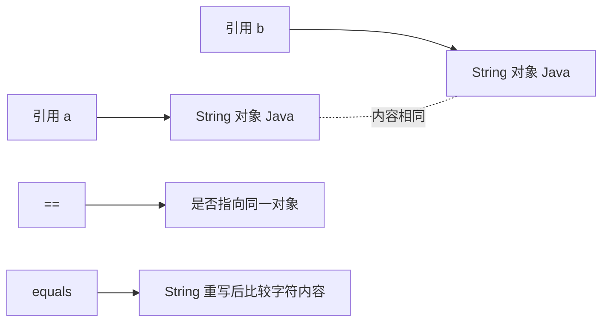

### Object 默认 equals 其实仍然是 `==`

`Object.equals()` 的默认实现本质上是：

```java
public boolean equals(Object obj) {
    return this == obj;
}
```

所以不要把：

> equals 比内容

当成绝对规则。

准确说法是：

> **equals 比较“这个类定义的逻辑相等语义”。如果类没有重写 equals，默认仍然是对象身份相等。**

例如：

```java
class User {
    long id;
    String name;
}
```

两个字段完全相同但分别 `new` 出来的 User：

```text
u1.equals(u2) == false
```

因为默认仍然在比较：

```text
u1 == u2
```

### equals 五大契约怎么理解

面试常说：

```text
自反性 Reflexive
对称性 Symmetric
传递性 Transitive
一致性 Consistent
非空性 Non-null
```

不要只背名词，直接看关系：

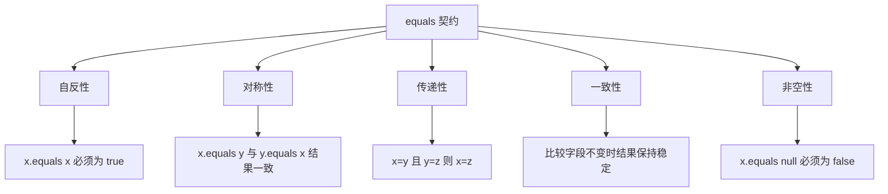

真正值得面试展开的是两个坑。

#### 坑 1：继承容易破坏对称性和传递性

例如父类只比较坐标：

```java
class Point {
    int x;
    int y;
}
```

子类又增加颜色：

```java
class ColorPoint extends Point {
    String color;
}
```

如果父类认为“坐标相同就相等”，子类认为“坐标 + 颜色都相同才相等”，就可能出现：

```text
Point.equals(ColorPoint)     → true
ColorPoint.equals(Point)     → false
```

流程：

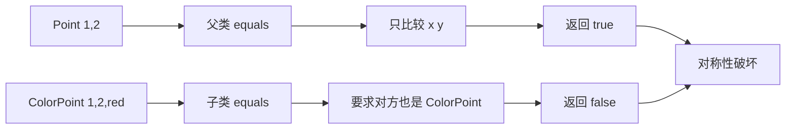

这也是为什么值对象常常更适合：

```text
final class
record
组合优于继承
```

#### 坑 2：可变字段容易破坏一致性

如果 equals 基于：

```text
username
status
amount
```

而这些字段运行中会变化，那么同一个对象的 equality 也可能变化。

普通对象可能只是语义混乱；一旦进入 HashMap / HashSet，就可能直接出现查不到、删不掉的问题，后面重点讲。

### ⭐ 面试口述版（1）

> 引用类型的 `==` 判断是否是同一个对象，而 equals 是类定义的逻辑相等规则。Object 默认 equals 实际上仍然是 `this == obj`，只有重写以后才可能变成值相等。equals 需要满足自反、对称、传递、一致和非空五个契约，其中工程上最容易出问题的是继承破坏对称性/传递性，以及可变字段导致 equality 不稳定。

---

## 05.3 hashCode 契约：它不是对象唯一 ID

### hashCode 到底解决什么问题

不要把 hashCode 理解成：

> 每个对象唯一的数字编号。

正确理解是：

> **hashCode 是对象到 int 哈希空间的一次映射，目的是帮助哈希表快速缩小搜索范围。它允许冲突，并不要求唯一。**

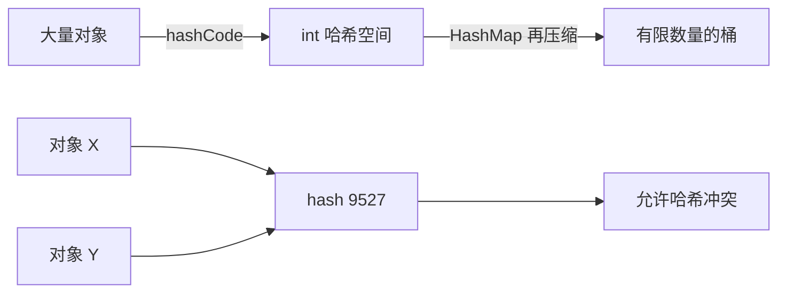

所以完全可能：

```java
x.hashCode() == y.hashCode()
```

但：

```java
x.equals(y) == false
```

### equals 与 hashCode 的关系只有一个方向是强制的

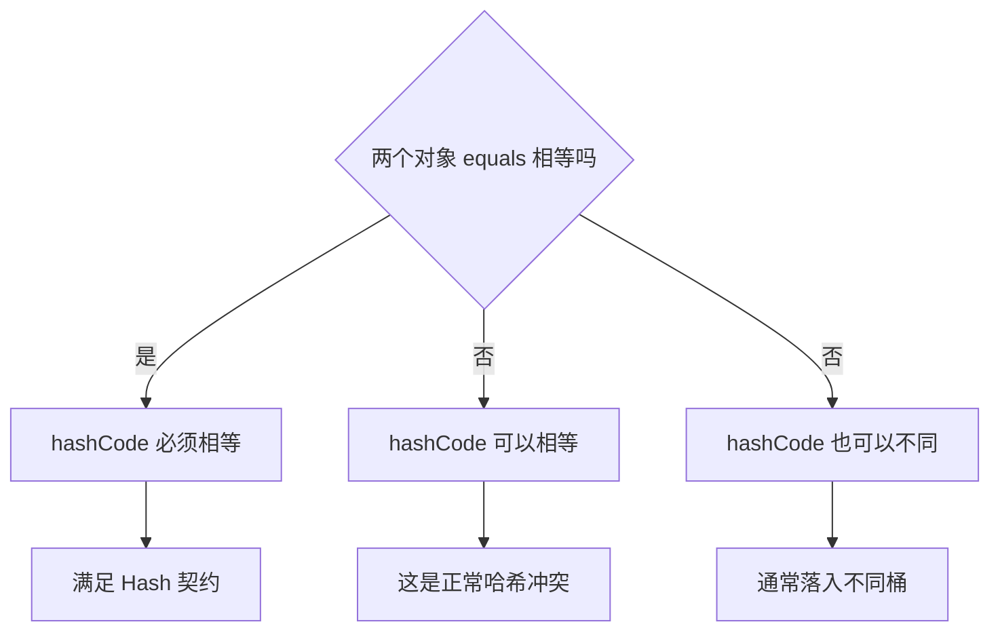

必须记住：

```text
equals 相等 → hashCode 一定相等
hashCode 相等 → equals 不一定相等
```

在一个**正确遵守 Java 契约的类**里，还可以反推：

```text
hashCode 不同
→ equals 不可能为 true
```

否则就违反了：

```text
equals true → hashCode 必须相等
```

### 为什么 Java 要设计成这样

因为 hashCode 的职责不是最终判等，而是：

```text
先快速缩小候选范围
```

真正精确判断仍然交给：

```text
equals
```

如果要求 hashCode 永远唯一，那么实际上很难在有限的 32 位 int 空间里对无限可能的对象做到这一点，也没有必要。

### ⭐ 面试口述版（2）

> hashCode 不是对象唯一编号，它只是一个用于哈希定位的 int 值，允许冲突。Java 的核心契约是 equals 相等的两个对象 hashCode 必须相等，但 hashCode 相等不代表 equals 相等。原因是 hashCode 只负责快速缩小候选范围，最终相等判断仍然由 equals 完成。

---

## 05.4 本章最重要的图：HashMap 如何同时使用 hashCode 和 equals

上一章已经讲过 HashMap 的结构，这里只聚焦一个问题：

> `map.get(key)` 到底怎么判断找到的是不是目标 key？

完整流程：

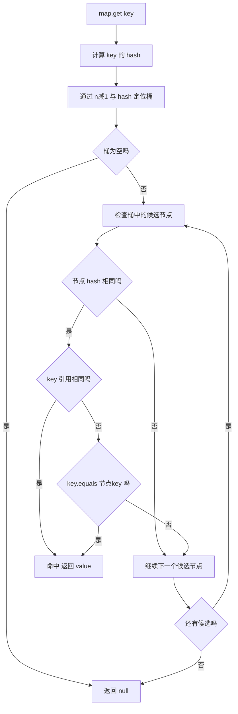

把它压缩成两层就非常容易理解：

```text
第一层：hash / hashCode
        ↓
快速判断“可能在哪里”

第二层：== / equals
        ↓
最终确认“到底是不是它”
```

HashMap 中最核心的 key 匹配判断可以概括成：

```java
if (e.hash == hash &&
    ((k = e.key) == key || (key != null && key.equals(k)))) {
    // key 匹配
}
```

也就是：

```text
1. hash 必须匹配
2. 如果 key 是同一引用，直接命中
3. 否则继续调用 equals 做逻辑判断
```

### 为什么先比较 hash，再调用 equals

因为 int 比较非常便宜，而 equals 可能很复杂。

例如一个对象的 equals 可能要比较：

```text
多个 String
多个字段
甚至嵌套对象
```

如果 hash 已经不同，在正确遵守契约的前提下就可以直接排除，不需要继续调用 equals。

### hashCode 为什么不能代替 equals

假设两个不同对象碰巧有相同 hash：

```text
对象 A → hash 100
对象 B → hash 100
```

如果 HashMap 只看 hash：

```text
hash 相同
→ 错误地认为是同一个 key
```

所以正确流程必须继续：

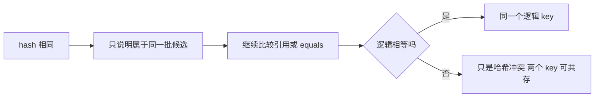

### ⭐ 面试口述版（3）

> HashMap 不是靠 hashCode 直接判断 key 是否相等。它先根据 hash 定位桶，在桶中先比较节点 hash，hash 相同后再判断 key 是否同一引用，如果不是才调用 equals 做最终确认。所以 hashCode 解决快速定位问题，equals 解决冲突后的精确判等问题。

---

## 05.5 为什么 equals 和 hashCode 必须成对设计

这是本章最经典的一组追问。

### 情况一：只重写 equals，不重写 hashCode

```java
final class User {
    private final long id;

    User(long id) {
        this.id = id;
    }

    @Override
    public boolean equals(Object o) {
        return o instanceof User user && id == user.id;
    }

    // 故意不重写 hashCode
}
```

此时：

```java
User u1 = new User(1);
User u2 = new User(1);

u1.equals(u2); // true
```

但因为仍然继承 Object 的 hashCode，它们可能得到不同 hash：

```text
u1 → H1
u2 → H2
```

放进 HashSet 后失败链路如下：

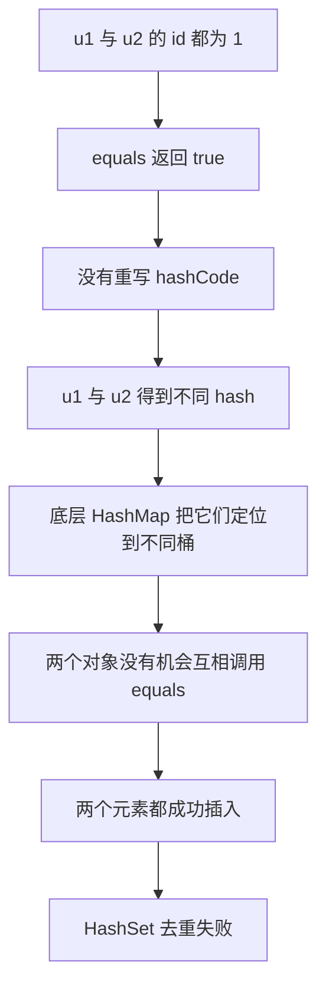

这里最关键的一句话是：

> **equals 本身没有错，错在逻辑相等的两个对象被 hash 提前分流到了不同桶，导致 equals 根本没有比较机会。**

### 情况二：只重写 hashCode，不重写 equals

反过来，即使：

```text
u1.hashCode() == u2.hashCode()
```

它们进入同一个桶后仍然要继续：

```text
u1 == u2        → false
u1.equals(u2)   → false
```

因为 Object 默认 equals 仍然比较引用。

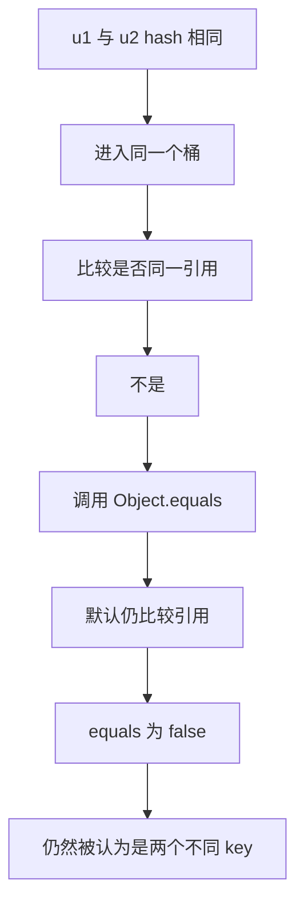

所以只要你定义了新的逻辑 equality：

```text
只重写 equals   ❌
只重写 hashCode ❌
```

应该把二者看成一个整体设计：

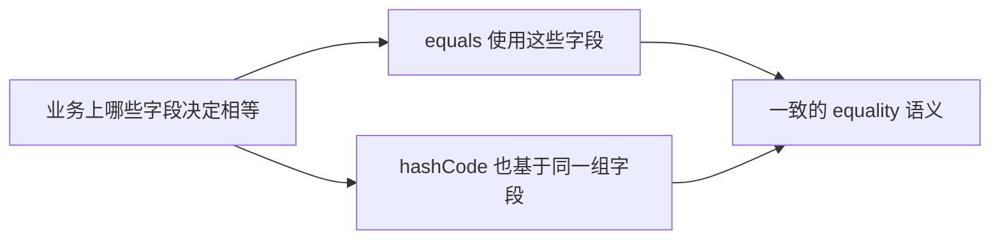

### 推荐普通值对象写法

```java
public final class SkuKey {

    private final Long warehouseId;
    private final Long skuId;

    public SkuKey(Long warehouseId, Long skuId) {
        this.warehouseId = warehouseId;
        this.skuId = skuId;
    }

    @Override
    public boolean equals(Object o) {
        if (this == o) {
            return true;
        }
        if (!(o instanceof SkuKey skuKey)) {
            return false;
        }
        return Objects.equals(warehouseId, skuKey.warehouseId)
                && Objects.equals(skuId, skuKey.skuId);
    }

    @Override
    public int hashCode() {
        return Objects.hash(warehouseId, skuId);
    }
}
```

这里最值得记的不是模板，而是：

```text
equals 使用 warehouseId + skuId
hashCode 也使用 warehouseId + skuId
```

---

## 05.6 可变 key：工程中最隐蔽的 HashMap 坑之一

假设：

```java
class UserKey {
    private String username;

    // equals/hashCode 都基于 username
}
```

先执行：

```java
UserKey key = new UserKey("alice");
map.put(key, "data");
```

假设此时：

```text
username = alice
hash = H1
定位到 bucket 3
```

随后：

```java
key.setUsername("bob");
```

现在同一个对象重新计算 hashCode 可能得到：

```text
hash = H2
理论位置 = bucket 9
```

但 HashMap 并不会自动搬迁之前插入的节点：

```text
真实节点仍然留在 bucket 3
```

再执行：

```java
map.get(key)
```

就会发生：

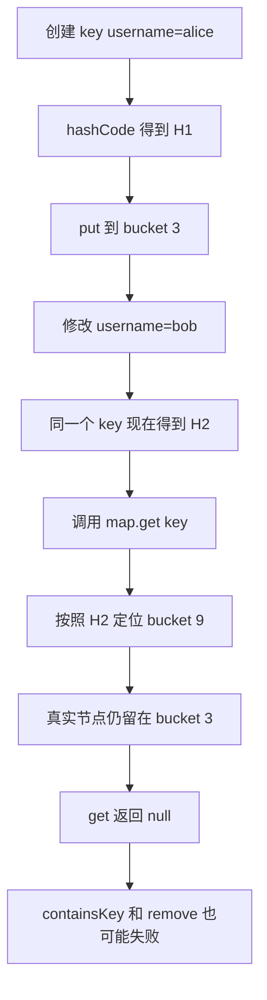

特别反直觉的是：

```text
map.size() 仍然可能是 1
```

节点没有消失，只是**按新的 equality 状态已经找不到它**。

### 为什么 String 特别适合做 HashMap key

不是因为 String 有“魔法”，而是因为它满足几个关键条件：

```text
不可变
hashCode 稳定
equals 语义明确
实现成熟
```

类似适合作为 key 的还有：

```text
Integer / Long
UUID
Enum
不可变 Value Object
设计合理的 record
```

### record 为什么很适合组合 key

例如：

```java
public record SkuKey(long warehouseId, long skuId) {
}
```

record 会根据 components 自动生成值语义的：

```text
equals
hashCode
toString
```

特别适合表达：

```text
仓库 ID + SKU ID
租户 ID + 用户 ID
订单号 + 行号
```

这类稳定组合键。

但要注意：**record 只是浅不可变。**

例如：

```java
record BadKey(List<String> parts) {
}
```

虽然 `parts` 引用不能重新赋值，但：

```java
key.parts().add("x");
```

仍然能改变 List 内容，从而可能改变 equals/hashCode 结果。

所以最终原则不是：

> key 必须写成 final。

而是：

> **作为 Hash key 期间，参与 equals/hashCode 的状态必须稳定。**

---

## 05.7 HashSet 为什么能去重，以及它和 TreeSet 有什么不同

### HashSet 本质上复用了 HashMap 的 key 规则

可以把 HashSet 简化理解成：

```java
private transient HashMap<E, Object> map;
private static final Object PRESENT = new Object();
```

执行：

```java
set.add(element);
```

本质类似：

```java
map.put(element, PRESENT);
```

因此：

```text
HashSet 中的元素
        ↓
就是底层 HashMap 的 key
```

### HashSet.add 去重流程

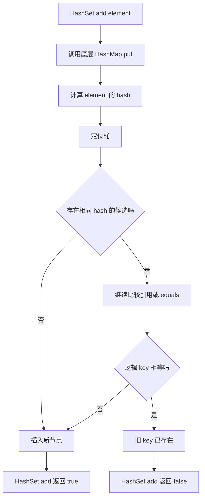

所以：

```java
Set<User> users = new HashSet<>();
```

能不能正确去重，最终取决于：

```text
User.equals/hashCode 是否正确表达了“什么叫重复”
```

而不是：

```text
字段肉眼看起来是否相同
```

### 为什么 add 要返回 boolean

```text
true
→ 原集合中不存在逻辑相等元素，本次新增成功

false
→ 已经存在逻辑相等元素，没有真正增加集合大小
```

### HashSet 与 TreeSet 的判重标准不是一回事

HashSet：

```text
hashCode + equals
```

TreeSet：

```text
Comparable.compareTo
或
Comparator.compare
```

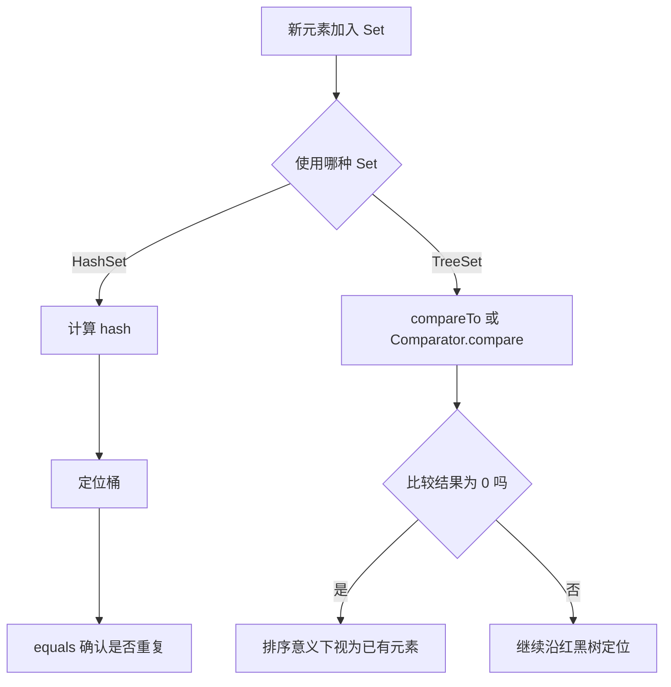

因此完全可能：

```text
a.equals(b) == false
```

但：

```text
comparator.compare(a, b) == 0
```

此时：

```text
HashSet 可能保留两个
TreeSet 可能只保留一个
```

这也是后面学习 TreeSet / TreeMap 时必须重新建立的契约。

### ⭐ 面试口述版（4）

> HashSet 底层使用 HashMap 保存元素，元素就是 HashMap 的 key，value 使用统一占位对象。因此 HashSet 去重本质上就是 HashMap 的 key 判重：先 hash 定位桶，再通过 equals 确认。TreeSet 不一样，它主要依赖 compareTo 或 Comparator，如果比较结果为 0，就认为处于同一个排序位置，所以 Comparator 与 equals 语义不一致时，两种 Set 的行为可能不同。

---

## 05.8 工程对象到底应该怎么设计 equals/hashCode

这是本章从“八股”走向工程实践最重要的一部分。

不要一看到 POJO 就：

```text
IDE → Generate equals/hashCode → 全字段勾选
```

应该先问：

> **这个对象的“相等”到底意味着什么？**

### 一张决策图先做分类

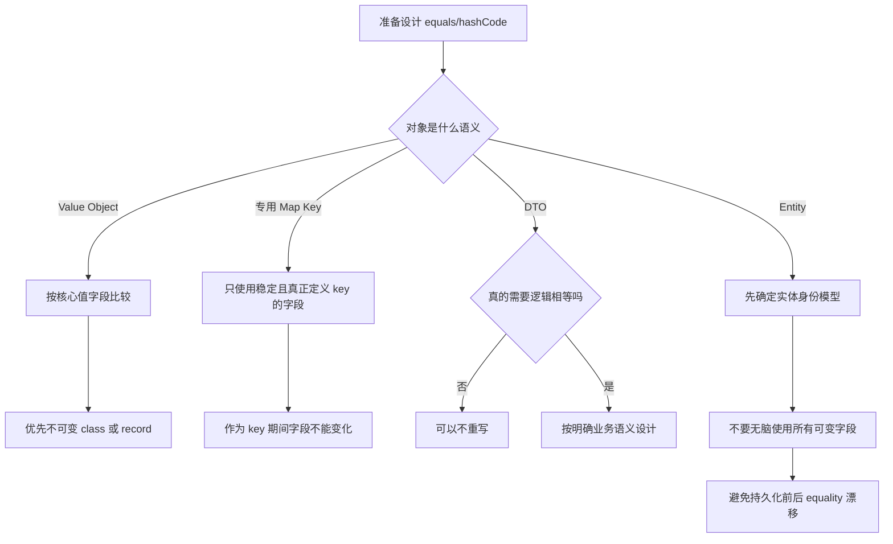

### 1. Value Object：最适合完整值相等

例如：

```java
public record WarehouseSkuKey(Long warehouseId, Long skuId) {
}
```

如果两个对象：

```text
warehouseId 相同
skuId 相同
```

业务上就是同一个值。

这种对象最适合：

```text
不可变
按值 equals
按同样字段 hashCode
```

### 2. DTO：不是所有 DTO 都需要重写

很多 DTO 只是：

```text
接收参数
传输数据
返回接口结果
```

如果根本不会参与：

```text
HashSet 去重
HashMap key
contains/remove
对象相等判断
```

就没有必要为了“完整”强行定义 equality。

面试中可以直接说：

> equals/hashCode 不是 POJO 的标配，而应该由对象是否存在明确逻辑身份语义决定。

### 3. Entity：最忌讳把所有可变字段都塞进去

例如订单实体：

```text
Order
├─ id
├─ status
├─ amount
├─ receiverName
└─ updateTime
```

如果这些字段全部参与 equals/hashCode，那么：

```text
status 改变
amount 改变
updateTime 改变
```

都可能改变 equality。

如果对象已经在 HashSet 或作为 Map key：

```text
风险立即出现
```

Entity 首先应该问的是：

> 什么定义了“这是同一个实体”？

而不是：

> 哪些字段可以让 IDE 自动勾上？

### 4. 只用数据库自增 ID 也要注意生命周期

典型过程：

```text
new Entity
id = null
    ↓
持久化
    ↓
id = 1001
```

如果 id 参与 hashCode：

```text
持久化前后 hashCode 发生变化
```

如果对象在此期间已经放进 Hash 集合，也可能出现可变 key 同类问题。

因此 ORM Entity 的 equality 要结合：

```text
ID 生成策略
业务身份
代理对象
实体生命周期
```

统一设计，不要套固定模板。

### 5. Lombok `@Data` 为什么不能代替建模

`@Data` 很方便，但：

> **代码生成正确，不等于业务 equality 设计正确。**

风险本质不是 Lombok，而是你是否真的希望：

```text
这些字段共同定义“两个对象是否相等”
```

合理顺序应该是：

```text
先设计 equality
↓
再决定手写、IDE、record 或 Lombok 生成
```

而不是反过来。

---

## 05.9 三个实验，把最容易混淆的链路跑一遍

本章不做大量实验，只保留 3 个最有价值的。

### 实验一：只重写 equals，HashSet 去重失败

```java
import java.util.HashSet;
import java.util.Set;

public class EqualsOnlyDemo {

    static final class User {
        private final long id;

        User(long id) {
            this.id = id;
        }

        @Override
        public boolean equals(Object o) {
            return o instanceof User user && id == user.id;
        }
    }

    public static void main(String[] args) {
        User u1 = new User(1);
        User u2 = new User(1);

        System.out.println("equals = " + u1.equals(u2));

        Set<User> set = new HashSet<>();
        set.add(u1);
        set.add(u2);

        System.out.println("size = " + set.size());
    }
}
```

典型输出：

```text
equals = true
size = 2
```

解释链路：

```text
逻辑相等
→ 默认 hashCode 不一致
→ 进入不同桶
→ equals 没有比较机会
→ 去重失败
```

### 实验二：修改 key 后，HashMap 为什么“找不到”它

```java
import java.util.HashMap;
import java.util.Map;
import java.util.Objects;

public class MutableKeyDemo {

    static final class UserKey {
        private String username;

        UserKey(String username) {
            this.username = username;
        }

        void setUsername(String username) {
            this.username = username;
        }

        @Override
        public boolean equals(Object o) {
            return o instanceof UserKey key
                    && Objects.equals(username, key.username);
        }

        @Override
        public int hashCode() {
            return Objects.hash(username);
        }
    }

    public static void main(String[] args) {
        Map<UserKey, String> map = new HashMap<>();

        UserKey key = new UserKey("alice");
        map.put(key, "data");

        System.out.println(map.get(key));

        key.setUsername("bob");

        System.out.println(map.get(key));
        System.out.println(map.size());
    }
}
```

典型现象：

```text
data
null
1
```

最值得理解的是：

```text
get 返回 null
但 size 仍是 1
```

节点没丢，只是新的 hash 已经找不到旧桶。

### 实验三：HashSet 与 TreeSet 的“重复”标准不同

```java
import java.util.Comparator;
import java.util.HashSet;
import java.util.Set;
import java.util.TreeSet;

public class SetEqualityDemo {

    record User(long id, String name) {
    }

    public static void main(String[] args) {
        User a = new User(1, "Alice");
        User b = new User(2, "Alice");

        Set<User> hashSet = new HashSet<>();
        hashSet.add(a);
        hashSet.add(b);

        Set<User> treeSet = new TreeSet<>(Comparator.comparing(User::name));
        treeSet.add(a);
        treeSet.add(b);

        System.out.println("HashSet size = " + hashSet.size());
        System.out.println("TreeSet size = " + treeSet.size());
    }
}
```

输出：

```text
HashSet size = 2
TreeSet size = 1
```

原因：

```text
HashSet
→ record equals 比较 id + name
→ a 与 b 不相等

TreeSet
→ Comparator 只比较 name
→ Alice 与 Alice 的 compare 结果为 0
→ TreeSet 认为重复
```

---

## 05.10 高频面试追问与最终复习图

这一章不需要 50 道题，真正值得掌握的是下面 15 个问题。

### Q1：`==` 和 equals 有什么区别？

> 基本类型 `==` 比值；引用类型 `==` 判断是否同一对象；equals 是类定义的逻辑相等语义。Object 默认 equals 仍然等价于引用相等。

### Q2：equals 的五大契约？

```text
自反
对称
传递
一致
非空
```

追问时重点讲：

```text
继承容易破坏对称/传递
可变字段容易破坏一致性
```

### Q3：equals 与 hashCode 的关系？

```text
equals 相等 → hashCode 必须相等
hashCode 相等 → equals 不一定相等
```

### Q4：为什么 hashCode 相等不代表对象相等？

> 因为哈希冲突是合法的，hashCode 只负责缩小候选范围，最终还需要 equals 判定。

### Q5：为什么重写 equals 通常必须重写 hashCode？

> 否则逻辑相等对象可能进入不同桶，导致 HashMap / HashSet 根本没有机会调用 equals，破坏 key 查询或 Set 去重语义。

### Q6：HashMap 判断 key 相等只看 hashCode 吗？

不是。核心是：

```text
hash 匹配
且
key == oldKey 或 key.equals(oldKey)
```

### Q7：hashCode 不同的两个对象可能 equals 相等吗？

如果类正确遵守契约：

```text
不可能
```

否则说明实现本身违反了 Java 约定。

### Q8：为什么可变对象不适合作为 HashMap key？

> 参与 equals/hashCode 的字段变化后，新 hash 可能定位到另一个桶，但节点还在旧桶，导致 get、containsKey、remove 等找不到它。

### Q9：为什么 String 很适合作为 HashMap key？

核心不是“常用”，而是：

```text
不可变
equals/hashCode 稳定
语义明确
```

### Q10：HashSet 为什么能去重？

> HashSet 底层基于 HashMap，元素作为 key，value 使用固定占位对象，所以去重直接复用 HashMap 的 key 判重逻辑。

### Q11：HashSet.add 为什么返回 boolean？

```text
true  → 新元素真的加入了
false → 已有逻辑相等元素
```

### Q12：两个字段完全一样的对象放进 HashSet 一定只剩一个吗？

不一定。

关键看这个类有没有正确实现：

```text
equals/hashCode
```

### Q13：record 为什么适合作为 Map key？

> record 天然表达值语义，并根据 components 自动生成 equals/hashCode，组件引用不可重新赋值，很适合不可变组合键。但 record 只是浅不可变，组件内部如果可变仍然要小心。

### Q14：Lombok `@Data` 生成 equals/hashCode 就一定安全吗？

不一定。

> Lombok 可以帮你生成代码，但不能替你决定哪些字段应该定义业务 identity。

### Q15：HashSet 与 TreeSet 判重一样吗？

```text
HashSet → hashCode + equals
TreeSet → compareTo / Comparator.compare == 0
```

### 最终心智模型

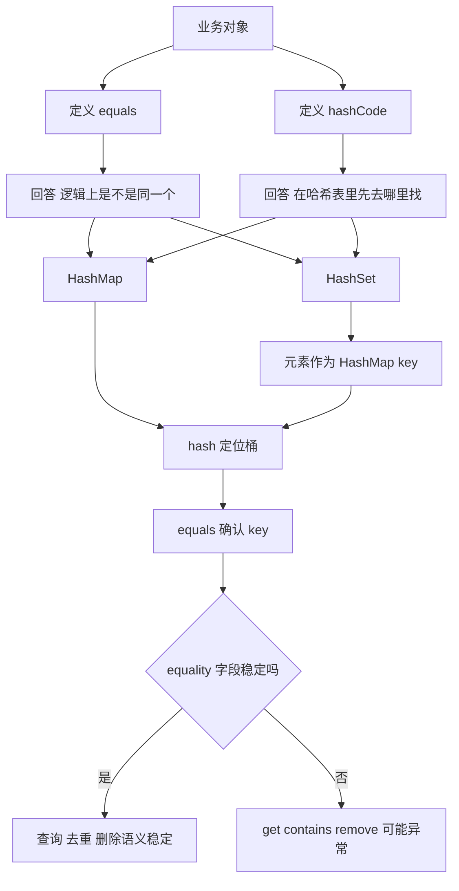

### 面试最终回答模板

如果面试官只给你 1 分钟：

> equals 用于定义对象的逻辑相等语义，hashCode 用于把对象映射到哈希空间。Java 规定 equals 相等的两个对象 hashCode 必须相等，但 hashCode 相等不代表 equals 相等，因为哈希冲突允许存在。HashMap 和 HashSet 正是依赖这个契约工作的：先根据 hash 定位桶，再在桶内通过引用相等或 equals 做最终 key 判断。因此如果重写 equals 却没有正确重写 hashCode，逻辑相等对象可能进入不同桶，导致 HashSet 去重失败或 HashMap 查询异常。工程上还要避免修改作为 Hash key 的 equality 字段，否则节点仍在旧桶，而新的 hash 已经去另一个桶查找，get/remove 就可能失败。

### 面试前复习清单

```text
[ ] == 与 equals 的准确区别
[ ] Object.equals 默认实现
[ ] equals 五大契约
[ ] equals 相等为什么 hashCode 必须相等
[ ] hashCode 相等为什么 equals 不一定相等
[ ] HashMap get 如何使用 hash 与 equals
[ ] 为什么 equals/hashCode 要成对设计
[ ] 只重写 equals 会怎样
[ ] 只重写 hashCode 会怎样
[ ] 为什么可变 key 危险
[ ] 为什么 String 很适合做 key
[ ] HashSet 为什么可以去重
[ ] HashSet.add 为什么返回 boolean
[ ] record 为什么适合作为 Value Object key
[ ] Entity 为什么不能无脑全字段 equality
[ ] HashSet 与 TreeSet 的判重区别
```

---

## 05.11 与前后章节的知识链

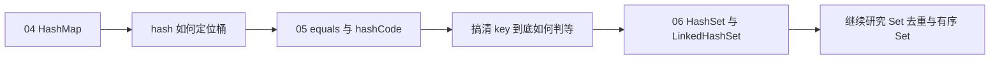

学习顺序是：

```text
先理解 HashMap 怎么找 key
→ 再理解 equals/hashCode 怎么定义 key
→ 最后看 HashSet 怎么复用 HashMap 完成去重
```

这三章连起来，就是一条完整的 Hash 集合面试主线。
