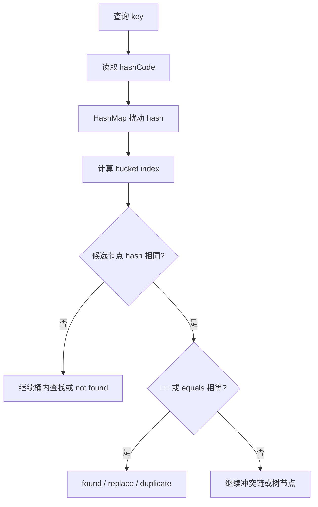

# Hash 集合如何消费 equals/hashCode 契约

> **本章定位：Collections 消费视角 · P0 · JDK 8+ / Java 21。**
>
> [Java Core equality contract](../../01-java-core/deep-dive/equals-and-hashcode-contract.md) 是 `==`、`Object.equals`、五项 equals 契约、hashCode 契约、继承、record、ORM 代理和可变 equality 的唯一权威来源。本章不重新定义这些规则，只解释 HashMap、HashSet 和 LinkedHashSet 如何消费它们。

## 1. 面试先给结论

Hash 集合的判定链只有一条：

```text
HashMap key lookup
    ↓
hashCode()
    ↓
hash spreading
    ↓
bucket index
    ↓
candidate hash compare
    ↓
== / equals
    ↓
found / not found
```

`hashCode` 负责把搜索范围缩小到候选桶，`==` 或 `equals` 负责在候选节点中确认逻辑相等。哈希相同不代表对象相等；equals 相等则必须保证 hashCode 相等，否则容器无法可靠完成查找和去重。



## 2. HashMap 如何消费 equality

### 2.1 hash spreading 不是最终判等

以 JDK 8+ OpenJDK 主线的 HashMap 为例，key 的 hash 会先经过扰动：

```java
static final int spread(Object key) {
    int h = key.hashCode();
    return h ^ (h >>> 16);
}
```

实际实现还要处理 `null` key，并将结果映射到 table 的索引。常见容量为 2 的幂时，索引可以抽象为：

```text
index = (table.length - 1) & spreadHash
```

这一步只是在有限数量的桶中定位候选范围。它不证明两个 key 相等，也不要求不同 key 必须得到不同 hash。

### 2.2 桶内匹配顺序

桶内查找可以压缩成：

```java
if (node.hash == hash
        && (node.key == key || (key != null && key.equals(node.key)))) {
    // 命中
}
```

真实 JDK 源码还包含树节点、泛型转换和边界分支；这里要记住的顺序是：

1. 先比较节点保存的 hash；
2. hash 不同，按正确契约可直接排除；
3. hash 相同，先尝试引用相等；
4. 不是同一引用时，调用 equals 做最终逻辑判断；
5. 不相等则继续冲突链或树结构。

因此 `hashCode` 是快速筛选条件，不是业务 ID，也不是 equals 的替代品。

### 2.3 `==` 为什么出现在 equals 之前

如果查询 key 与节点中的 key 是同一个对象，已经可以确认相等，不需要再调用 equals。这样既是快速路径，也避免把 equals 的副作用或异常行为引入本来已经确定的身份命中。

但不要据此把 HashMap 理解成“只按引用去重”。两个不同对象只要在同一个候选桶中并且 equals 相等，同样会命中。

## 3. 哈希冲突不等于 key 相等

构造两个不同 key 但返回同一个 hash：

```java
record CollidingKey(String id) {
    @Override
    public int hashCode() {
        return 42;
    }
}
```

只要 record 的 equals 仍按 `id` 判断，下面两个 key 可以同时存在：

```java
Map<CollidingKey, String> values = new HashMap<>();
values.put(new CollidingKey("a"), "A");
values.put(new CollidingKey("b"), "B");
// size == 2：同 hash，equals 不相等
```

这也是仓库中 [HashMapCollisionDemo](../../examples/src/main/java/com/xuegucheng/javatechreview/HashMapCollisionDemo.java) 的验证目标。

## 4. 三种契约错误的后果

### 4.1 只重写 equals，不重写 hashCode

如果两个对象 equals 相等，但仍继承不同的 identity hashCode，它们可能进入不同桶。HashMap/HashSet 在错误的候选范围内查找，自然无法稳定发现“逻辑上相等”的另一个对象。

这里不再解释 equals 五项契约和实现模板，统一跳转 [Java equality contract](../../01-java-core/deep-dive/equals-and-hashcode-contract.md)。

### 4.2 hashCode 很差，但契约仍然正确

所有 key 都返回同一个常量 hash，正确性未必立即破坏：容器仍可在同一个桶内逐个调用 equals。但候选范围退化，查找、插入和删除的性能会明显变差；当节点达到实现阈值时，JDK 8+ 还可能使用树节点降低冲突链退化。

```text
hashCode 差但契约正确 → 主要是性能问题
equals 相等但 hashCode 不同 → 契约错误与查找正确性问题
```

### 4.3 equals 相等，但 hashCode 不同

这违反 hashCode 契约。容器不能保证它们落入同一个候选桶，因此可能出现两个逻辑相等 key、`containsKey` 查不到或 HashSet 去重失败。

## 5. mutable key 的 bucket drift

对象作为 key 插入后，HashMap 不会因为对象内部字段变化而自动搬迁节点：

```text
put(key)                 → 按旧 hash 放入 bucket A
修改参与 equality 的字段 → key.hashCode() 变成新值
get/remove(key)          → 按新 hash 查 bucket B
```

结果可能是：对象仍然在 table 的 A 中，但通过当前 key 已经找不到它。问题不是 HashMap 忘记保存对象，而是 key 的定位依据发生了变化。

工程边界：

- 优先使用不可变值对象、record 或专用复合 key；
- 不把会变化的状态字段放进 key 的 equality；
- 实体自然键和数据库 ID 的生命周期选择，见 [Java equality contract](../../01-java-core/deep-dive/equals-and-hashcode-contract.md)；
- 这条约束同样适用于 HashSet 的元素。

## 6. HashSet 如何复用 HashMap

HashSet 的消费关系可以简化为：

```java
HashSet<E>
≈ HashMap<E, Object>
```

```java
private transient HashMap<E, Object> map;
private static final Object PRESENT = new Object();

public boolean add(E element) {
    return map.put(element, PRESENT) == null;
}
```

因此：

- Set 元素直接作为 HashMap key；
- 去重完全复用 HashMap 的 hash、bucket、`==`/equals 判定；
- `add` 返回 `true` 表示没有旧 key，返回 `false` 表示命中已有逻辑相等 key；
- HashSet 能放一个 `null`，因为底层 HashMap 允许一个 `null` key；
- HashSet 不需要再定义一套 equals/hashCode 规则。

HashSet 的结构与遍历细节见 [HashSet 与 LinkedHashSet](./hashset-and-linkedhashset.md)；本页只负责解释它如何消费 HashMap 的 key 规则。

## 7. LinkedHashSet 的顺序是增量能力

LinkedHashSet 保留 HashSet 的判重链路，再通过 LinkedHashMap 的双向链表维护 encounter order：

```text
HashSet 的 hash 去重
    +
LinkedHashMap 的 before / after
    =
LinkedHashSet 的去重 + 顺序
```

普通重复 `add` 不应被理解成一次新的插入：key 已经命中，集合大小不增加，原有 encounter order 也不因重复值重新排到尾部。Java 21 的 `SequencedSet` 首尾能力属于版本 API 增量，完整实现说明见 [HashSet 与 LinkedHashSet](./hashset-and-linkedhashset.md)。

## 8. HashSet 与 TreeSet 的 duplicate semantic 不同

两个 Set 都不允许“重复元素”，但重复的定义不同：

| 容器 | 定位/排序结构 | 判重依据 | 适合的语义 |
| --- | --- | --- | --- |
| `HashSet` | HashMap | `hashCode` + equals | equality 相等 |
| `LinkedHashSet` | LinkedHashMap | `hashCode` + equals | equality 相等且保留 encounter order |
| `TreeSet` | TreeMap / 有序树 | `compareTo` 或 Comparator 返回 0 | 排序关系相同 |

例如 `BigDecimal("1.0")` 与 `BigDecimal("1.00")` 的 `equals` 和 `compareTo` 语义并不完全相同，因此它们在 HashSet 与 TreeSet 中可能出现不同的元素数量。这不是哪个集合“错误”，而是业务选择了不同的 duplicate semantic。

## 9. key 设计决策框架

当一个类型要进入 HashMap/HashSet，先问四个问题：

1. 这是值对象、DTO 还是实体？
2. 哪些字段构成稳定的 equality identity？
3. 对象放入容器后，这些字段是否可能变化？
4. 业务需要 equality、排序关系还是对象身份？

不要在本页复制 ORM 代理、继承 equality、record 数组组件或实体暂态 ID 的完整讨论。它们的唯一权威来源是 [Java equality contract](../../01-java-core/deep-dive/equals-and-hashcode-contract.md)。

一个合理的结果可能是：

```text
稳定复合值 → record / 不可变 Value Object → HashMap key
需要保序去重 → LinkedHashSet
需要排序/范围 → TreeSet
暂态且 equality 不稳定的实体 → 避免直接作为 Hash key
```

## 10. 关键工程边界

- HashMap、HashSet、LinkedHashSet 都不是因为“平均 O(1)”就自动线程安全；并发语义由并发模块接管。
- HashMap 的 table、扰动函数、树化阈值和扩容细节属于 JDK 实现观察，必须绑定版本，不能写成所有 Map 实现的规范保证。
- Hash 冲突处理改善平均性能，不会修复错误的 equality 契约。
- 应用层预去重不能替代数据库唯一约束、幂等键或最终一致性机制。
- key 的 equality 方法应保持无外部 I/O、无懒加载副作用和可预测成本。

## 11. 高频面试追问链

```text
HashMap 如何找到 key？
→ hashCode
→ hash spreading
→ bucket index
→ 节点 hash compare
→ == / equals
→ 命中或继续冲突结构
```

继续追问时按这条顺序回答：

1. hashCode 相同是否代表 key 相等？不代表，冲突允许存在。
2. 为什么还要 equals？hash 只缩小候选范围，equals 做最终判等。
3. 只重写 equals 会怎样？逻辑相等对象可能进入不同桶。
4. hashCode 全返回常量会怎样？通常先表现为性能退化，契约未必错误。
5. 修改 key 字段会怎样？节点不会自动换桶，可能 bucket drift。
6. HashSet 为什么能去重？元素作为 HashMap key，复用同一条判重链路。
7. LinkedHashSet 多了什么？额外维护 encounter order。
8. TreeSet 为什么不同？它按 Comparable/Comparator 的 0 结果判重。

## 12. 常见误区

### 误区 1：hashCode 相同就是重复

错误。hash 相同只说明两个 key 进入同一候选范围；equals 不相等时仍可共存。

### 误区 2：HashSet 有时看起来有序

错误。HashSet 不维护插入历史，观察到的顺序可能只是当前 hash、容量和实现状态的结果。

### 误区 3：LinkedHashSet 重复 add 会刷新顺序

错误。重复 key 不增加新节点，通常也不会被当成新的首次插入。

### 误区 4：TreeSet 与 HashSet 的重复标准相同

错误。一个看 equality/hash，一个看排序关系。

### 误区 5：把可变业务实体直接当长期 key

风险高。只要参与 equality 的字段变化，就可能造成 contains/remove 失效。

## 13. 最终心智模型

```text
对象相等性定义
    ↓ 由 Java Core 唯一维护
HashMap 消费 hashCode 缩小范围
    ↓
HashMap 消费 == / equals 最终判等
    ↓
HashSet 复用 key 规则完成去重
    ↓
LinkedHashSet 增加 encounter order
    ↓
TreeSet 改用 compareTo / Comparator 的排序相等
```

## 一句话复盘

> Hash 集合不重新发明 equality：HashMap 先用 hashCode 定位候选桶，再用 `==`/equals 最终判等；HashSet 复用这条 key 规则，LinkedHashSet 只增加顺序，TreeSet 则使用排序关系定义“重复”。
