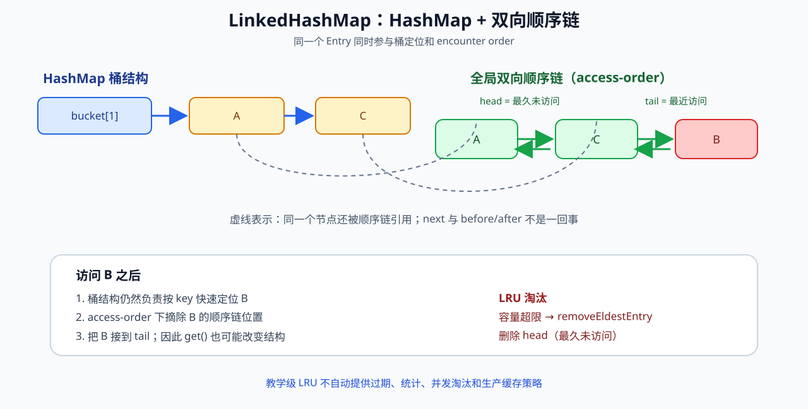

# 有序 Map 与 LRU

> **P0 · JDK 8+；SequencedMap 标记 Java 21+ · 5 分钟复习**

## 面试结论

LinkedHashMap 在 HashMap 的桶结构之外维护一条双向链表。`insertion-order` 按插入顺序遍历；`access-order` 在访问后移动节点，使链尾代表最近访问，从而可以用 `removeEldestEntry` 实现教学级固定容量 LRU。



## 面试追问链

```text
HashMap 为什么不能保序？
    ↓
LinkedHashMap 多了什么？
    ↓
get() 为什么可能改变结构？
    ↓
为什么双向链能 O(1) 摘除并移到尾部？
    ↓
removeEldestEntry 何时触发？
    ↓
为什么示例 LRU 不等于生产缓存？
```

## 工程边界

- `get()` 在 access-order 下可能是结构性修改，所以并发迭代需要特别谨慎。
- `Collections.synchronizedMap` 只提供外层同步协议，不自动带来完整缓存能力、过期、并发淘汰和统计。
- 生产本地缓存通常还需要容量、时间、并发、刷新、统计等策略，不能把 LinkedHashMap 示例直接当 Caffeine 替代品。

## Deep Dive

- [LinkedHashMap 与 LRU](../deep-dive/linkedhashmap-and-lru.md)
- [HashMap](../deep-dive/hashmap.md)
- [HashSet 与 LinkedHashSet](../deep-dive/hashset-and-linkedhashset.md)

## Runnable Example

- [LinkedHashMapLruDemo.java](../../examples/src/main/java/com/xuegucheng/javatechreview/LinkedHashMapLruDemo.java)
- [对应测试](../../examples/src/test/java/com/xuegucheng/javatechreview/LinkedHashMapLruDemoTest.java)

## 一句话复盘

> HashMap 负责快找，双向链负责顺序；access-order 让“最近访问”可以被直接表达，但不等于生产缓存方案。
