# HashSet 与 LinkedHashSet：去重、顺序与工程选型

> **本章定位：面试主线章。**
>
> `HashSet` 本身并没有重新发明一套哈希结构，它的核心思想非常直接：
>
> **把元素当成 `HashMap` 的 key，用 HashMap 的 key 判重能力实现 Set。**
>
> `LinkedHashSet` 则是在这套“哈希去重”能力上，再增加一条双向链表，维护元素的顺序。
>
> 这章不做 Set API 百科，只抓 8 条面试主线：
>
> **HashSet 为什么能去重 → add 到底怎么走 → hashCode/equals 在哪里参与 → 为什么遍历无序 → LinkedHashSet 如何保序 → Java 21 SequencedSet → 三种 Set 如何选 → 工程中怎么做“去重但保序”。**
>
> 为了方便理解，本章对核心机制优先使用 Mermaid 流程图。语义以 **Java 21** 为基准，HashSet / LinkedHashSet 的核心实现按 JDK 8+ 主线理解。

> **边界声明**：`equals`、`hashCode`、相等性五条规则、继承/代理相等策略的唯一权威来源是 [Java Core：equals 与 hashCode 契约](../../01-Java核心/02-深度解析/equals与hashCode契约.md)。本章只解释 HashSet/LinkedHashSet 如何消费该契约；HashMap 的扰动、桶、树化和 resize 细节见 [HashMap](HashMap原理与源码分析.md)。

---

## 06.1 一张图建立整章的面试地图

如果面试官问：

> HashSet 为什么不能放重复元素？

推荐先给出这一版：

> `HashSet` 底层基于 `HashMap`。元素会作为 HashMap 的 key，value 使用一个固定占位对象。调用 `HashSet.add(e)` 本质上就是调用 `map.put(e, PRESENT)`。HashMap 会先根据 hash 定位桶，再通过 `==` 或 `equals()` 判断桶中是否已经存在逻辑相等的 key。如果旧 key 已存在，put 返回旧 value，HashSet.add 就返回 false；如果不存在，插入成功，add 返回 true。所以 HashSet 的去重规则，本质就是 HashMap 的 key 判重规则。

整章主线可以压缩成这张图：

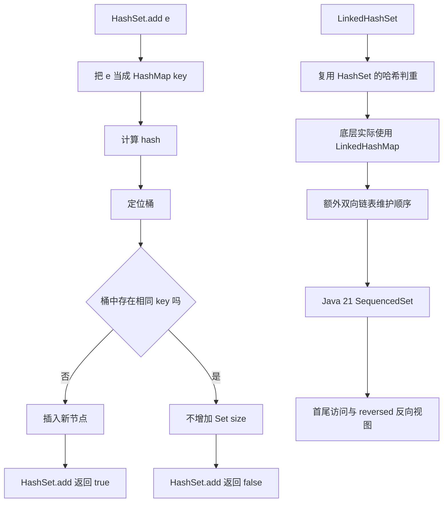

面试最常继续追问：

```text
1. HashSet 底层为什么用 HashMap？
2. HashSet.add 为什么返回 boolean？
3. HashSet 判断重复到底看 hashCode 还是 equals？
4. hashCode 相同但 equals 不同，还能同时放进 HashSet 吗？
5. HashSet 为什么允许一个 null？
6. HashSet 为什么不能保证遍历顺序？
7. LinkedHashSet 是怎么保证插入顺序的？
8. LinkedHashSet 比 HashSet 多了什么成本？
9. Java 21 的 SequencedSet 给 LinkedHashSet 增加了什么能力？
10. HashSet、LinkedHashSet、TreeSet 应该怎么选？
```

这一章的核心不是记 API，而是把这 10 个问题串成一条完整链路。

---

## 06.2 HashSet 的本质：HashMap 只用 key，不用 value

### 先说结论

`HashSet<E>` 可以先理解成：

```text
HashSet<E>
≈
HashMap<E, Object>
```

其中：

```text
E
→ 作为 HashMap 的 key

Object
→ 所有元素都共用同一个 PRESENT 占位对象
```

结构图：

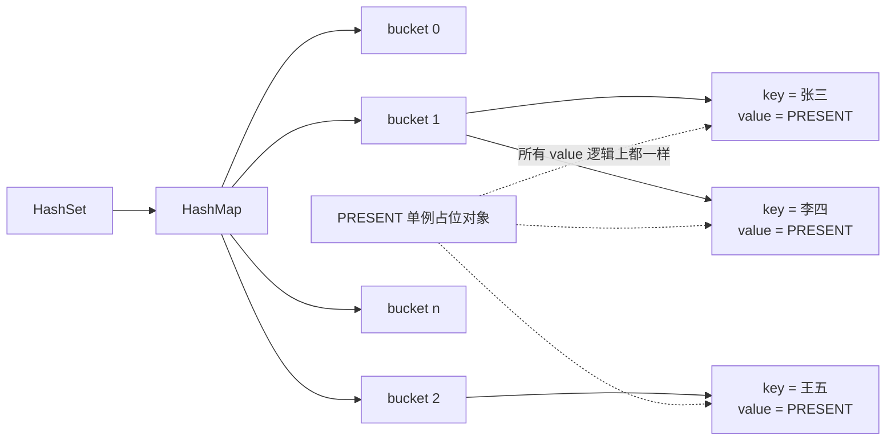

可以把 HashSet 的核心字段简化理解成：

```java
private transient HashMap<E, Object> map;

private static final Object PRESENT = new Object();
```

核心 `add`：

```java
public boolean add(E e) {
    return map.put(e, PRESENT) == null;
}
```

这一行源码实际上已经解释了 HashSet 最重要的两个问题：

```text
为什么能去重？
→ key 不能出现两个逻辑相等的版本

为什么 add 返回 boolean？
→ 根据 HashMap.put 是否替换了已有 key 判断
```

---

### 为什么不是自己再实现一套哈希表？

因为 Set 和 Map 在底层有大量相同问题：

```text
如何计算 hash
如何定位桶
如何处理哈希冲突
如何扩容
什么时候树化
如何根据 equals 确认 key
如何删除节点
```

如果 HashSet 自己再实现一次，相当于重复维护一套 HashMap。

所以更合理的复用方式是：

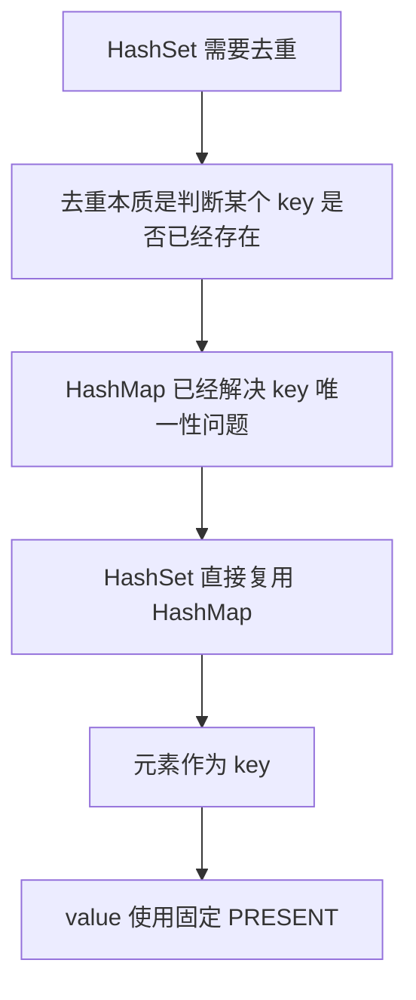

这也是 Java 集合框架中一个很典型的设计：

> **不是为了“继承”而复用，而是通过组合复用成熟的数据结构能力。**

---

### ⭐ 面试口述版（1）

> HashSet 底层其实是 HashMap。HashSet 中的元素会作为 HashMap 的 key，value 全部使用同一个静态 PRESENT 对象占位。这样 HashSet 不需要自己实现 hash、扩容、链表树化和 key 判重逻辑，直接复用 HashMap 即可。HashSet.add 本质就是 `map.put(e, PRESENT) == null`，如果之前不存在相同 key 就返回 true，如果已经存在逻辑相等的 key 就返回 false。

---

## 06.3 HashSet.add 完整流程：真正的去重发生在哪里？

这是本章最重要的一张图。

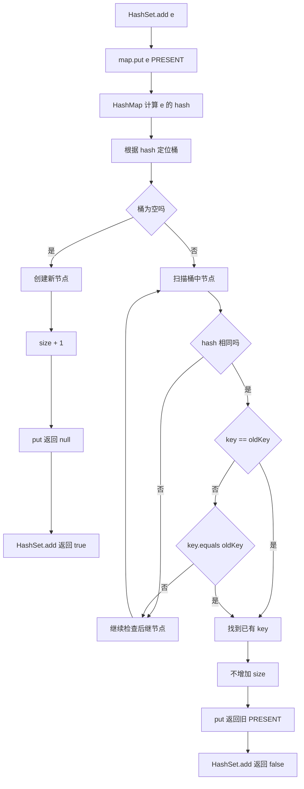

注意真正的判重不是：

```text
只比较 hashCode
```

而是：

```text
hash 负责缩小查找范围
equals 负责最终确认逻辑相等
```

把上一章的知识直接接过来：

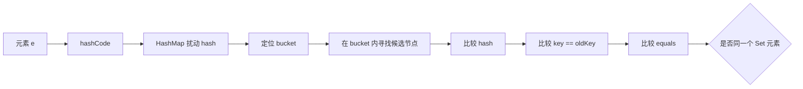

所以：

> **HashSet 的“去重规则”不是 HashSet 自己定义的，而是由元素的 `hashCode()` + `equals()` 契约决定的。**

---

## 06.4 HashSet 如何消费相等性契约

本节只保留容器侧的后果，不重新定义 `equals`/`hashCode`：

| 对象关系 | HashSet 的容器侧结果 |
| --- | --- |
| hash 不同、equals 不同 | 通常落入不同候选桶，两个元素都可保留 |
| hash 相同、equals 不同 | 这是正常碰撞；同桶不同节点，两个元素都可保留 |
| hash 相同、equals 相同 | 命中已有 key，第二次 `add` 返回 `false` |
| equals 相同、hash 不同 | 违反契约，可能落入不同桶并出现重复逻辑元素 |

记忆链路只有一句：

> **hash 负责缩小候选范围，`==`/`equals` 负责在候选节点上确认；契约定义回 Java Core，桶实现定义回 HashMap。**

因此本章不会再次展开相等性的五条规则、`getClass`/`instanceof` 策略、record 或 ORM 代理选择；这些内容统一放在 [equals 与 hashCode 契约](../../01-Java核心/02-深度解析/equals与hashCode契约.md)。

### ⭐ 面试口述版（2）

> HashSet 的判重先按 hash 找候选桶，再在桶内按引用相等或 equals 做最终判断。hash 相同但 equals 不同只是碰撞；equals 相同但 hash 不同则违反契约，可能导致去重失败。不要把 HashSet 的实现流程和 equality 规则混成两套教材。

---

## 06.5 HashSet.add 为什么返回 boolean？

很多人会用 HashSet，却没注意：

```java
boolean add(E e)
```

为什么不是像 `List.add` 那样只关心“添加”？

因为 Set 的业务语义天然包含：

```text
本次到底有没有新增一个元素
```

流程：

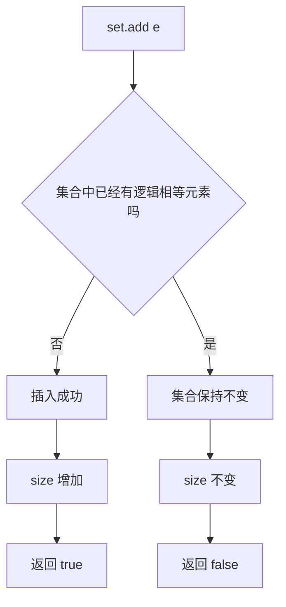

这在工程上非常有价值。

例如：

```java
if (!processedOrderIds.add(orderId)) {
    throw new IllegalStateException("订单重复处理");
}
```

这一行同时完成：

```text
检查是否存在
+
不存在则写入
```

相比：

```java
if (!set.contains(id)) {
    set.add(id);
}
```

语义更直接。

不过注意：

> 这并不意味着普通 HashSet 因此就变成线程安全的原子“check-and-add”容器。

并发集合属于并发章节，本章只讨论单线程语义。

---

## 06.6 HashSet 为什么可以放一个 null？

先记结论：

> **HashSet 可以放一个 null，因为底层 HashMap 允许一个 null key。**

流程可以画成：

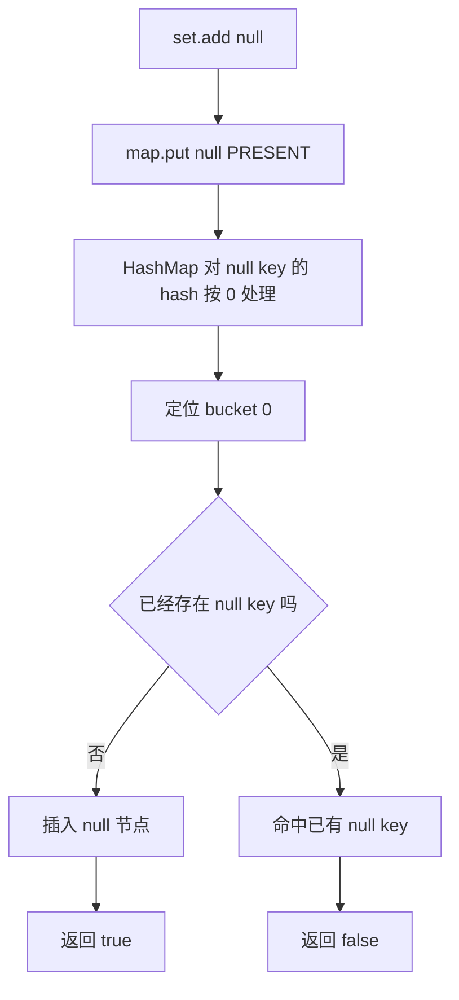

所以：

```java
Set<String> set = new HashSet<>();

System.out.println(set.add(null)); // true
System.out.println(set.add(null)); // false
System.out.println(set.size());    // 1
```

重点不是死记：

```text
HashSet 允许 null
```

而是能解释：

```text
因为元素就是 HashMap key
→ HashMap 允许一个 null key
→ HashSet 自然允许一个 null 元素
```

---

## 06.7 HashSet 为什么“无序”？

这里最容易出现一个错误表达：

> HashSet 是随机的。

不准确。

更准确的说法：

> **HashSet 不保证元素的迭代顺序。实际顺序由 HashMap 的桶分布、容量、hash、扩容状态等实现细节共同决定，因此不能把某次运行观察到的顺序当成 API 契约。**

为什么？

因为它遍历的是 HashMap 的桶结构，而不是“插入历史”。

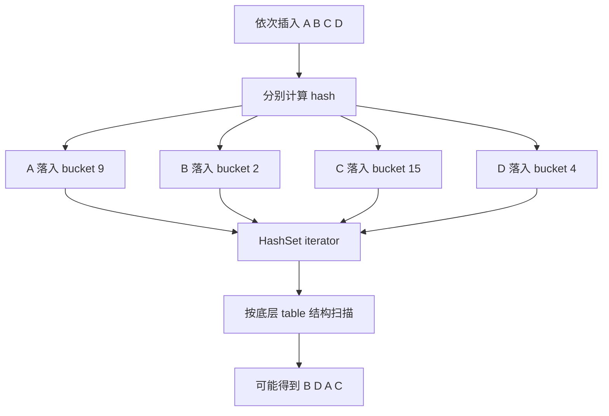

插入顺序：

```text
A → B → C → D
```

遍历顺序可能：

```text
B → D → A → C
```

而扩容后，节点重新分布：

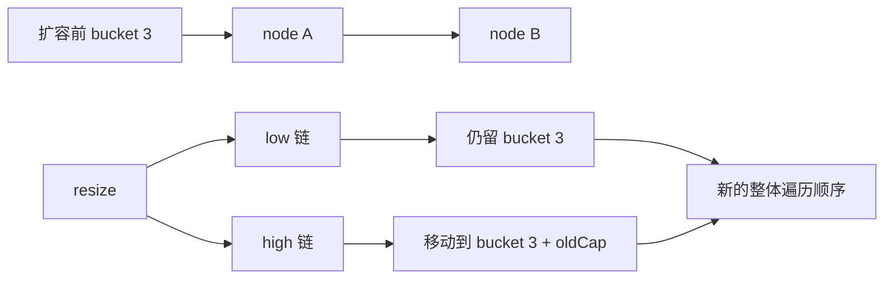

所以：

> **HashSet 的“无序”是“不承诺顺序”，不是“每次都故意随机打乱”。**

---

### 一个很实用的面试陷阱

下面代码：

```java
Set<Integer> set = new HashSet<>();
set.add(1);
set.add(2);
set.add(3);
System.out.println(set);
```

你运行很多次可能都看到：

```text
[1, 2, 3]
```

不能因此得出：

```text
HashSet 会保持 Integer 的自然顺序
```

这只是当前这些值、当前容量、当前实现下的桶布局碰巧如此。

API 契约仍然是：

```text
不保证迭代顺序
```

---

## 06.8 HashSet 的时间复杂度：别只背 O(1)

常见面试回答：

```text
add O(1)
contains O(1)
remove O(1)
```

作为平均复杂度没问题，但 5 年以上开发最好再补两层。

---

### 第一层：这是期望 / 平均复杂度

理想情况下：

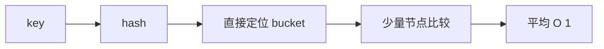

但如果大量冲突：

```text
bucket 内链表很长
```

就需要继续扫描。

JDK 8+ 冲突严重时会在满足条件后树化，降低极端查找退化风险。

这部分底层机制已经在 HashMap 章节讲过，本章只需要知道：

> HashSet 的性能上限和退化路径，完全继承 HashMap。

---

### 第二层：遍历复杂度不只看 size

这是非常值得面试加分的一点。

HashSet 遍历底层需要扫描 HashMap table。

可以近似理解：

```text
iteration cost
≈
size + capacity
```

示意：

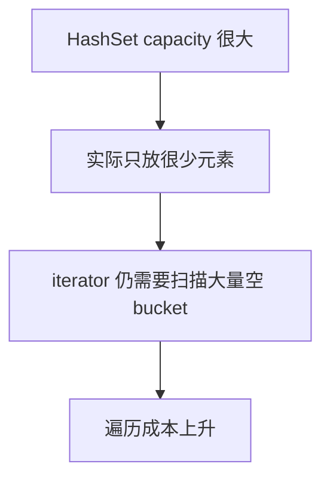

所以如果你创建一个极大容量 HashSet：

```java
Set<Integer> set = new HashSet<>(1_000_000);
```

但只存 10 个元素，虽然：

```text
contains
```

仍然通常很快，

但：

```text
完整遍历
```

会因为底层 table 很稀疏而存在额外成本。

这也是为什么：

> **初始容量不是越大越好。**

---

## 06.9 容量、负载因子与初始化：真正要记什么？

HashSet 底层是 HashMap，因此容量规则基本继承 HashMap。

默认可以理解为：

```text
默认 loadFactor = 0.75
底层 table 首次真正需要存储时再初始化
容量保持 2 的幂
达到 threshold 后扩容
```

这里不重复 HashMap 章节的 `tableSizeFor`、`resize` 位运算细节。

本章只需要抓住工程意义：

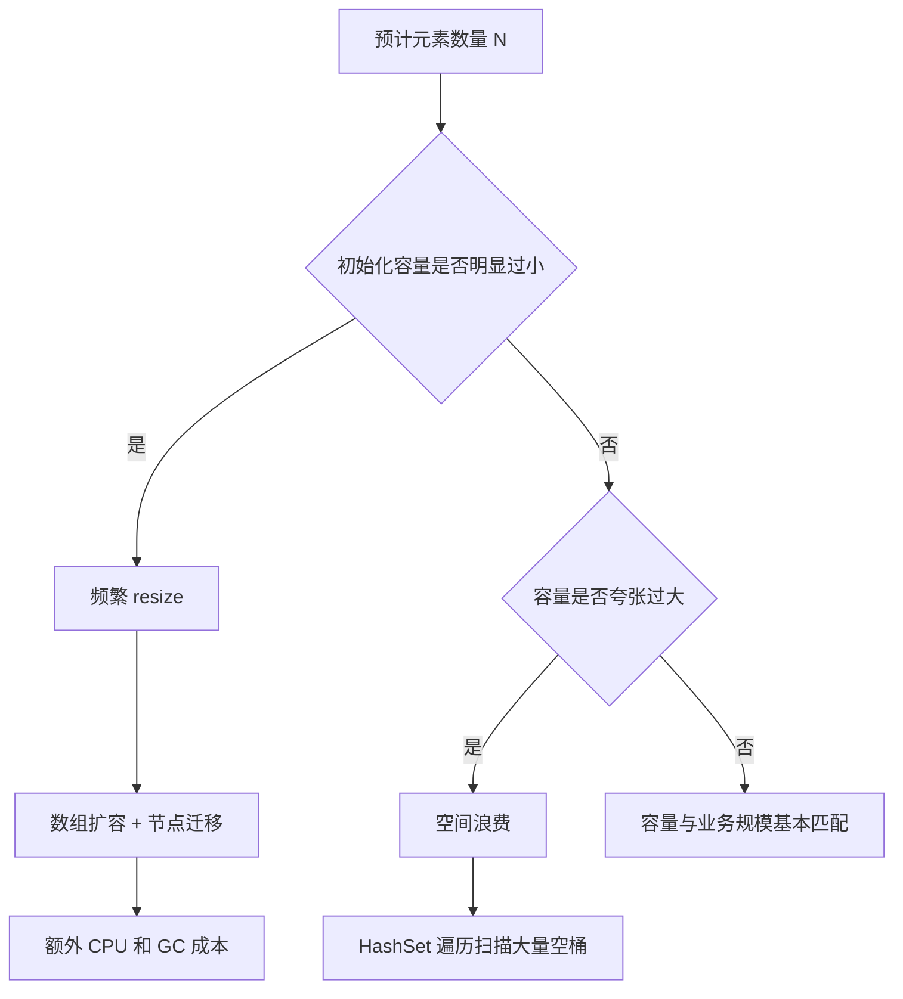

所以不要形成两个极端：

```text
默认容量永远最好      ❌
容量越大越省扩容      ❌
```

更合理的是：

> 如果明确知道会一次性放很多元素，可以根据预估规模初始化；如果规模很小或者不确定，默认配置通常足够。

---

## 06.10 可变对象进入 HashSet：为什么 contains 和 remove 会失效？

这是 `equals/hashCode` 与 HashSet 结合后最值得掌握的工程坑。

假设：

```java
class User {
    String username;

    @Override
    public boolean equals(Object o) {
        ...
    }

    @Override
    public int hashCode() {
        return Objects.hash(username);
    }
}
```

然后：

```java
User user = new User("alice");

Set<User> set = new HashSet<>();
set.add(user);

user.username = "bob";
```

发生了什么？

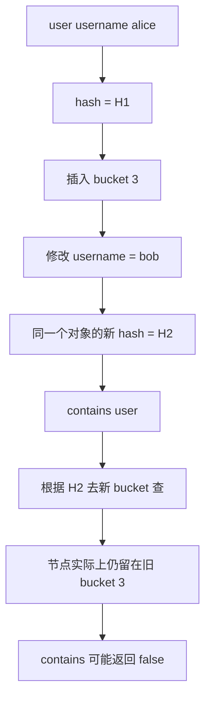

重点在于：

> HashSet 不会因为对象字段改变，自动把已经存在的节点重新 hash、重新搬桶。

节点还是原来的节点：

```text
bucket 3 → user
```

但你现在再查询：

```text
user.hashCode() → bucket 9
```

自然找不到。

`remove(user)` 也可能失败：

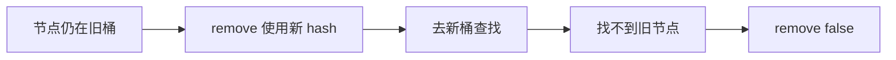

---

### 工程建议

如果对象要进入：

```text
HashSet
HashMap key
```

参与 `equals/hashCode` 的字段最好满足：

```text
稳定
不可变
生命周期内不修改
```

典型安全选择：

```text
String
UUID
Long ID
不可变 Value Object
record
```

---

### ⭐ 面试口述版（3）

> HashSet 最危险的坑之一是修改已经入 Set 对象中参与 equals/hashCode 的字段。对象插入时是根据旧 hash 放进某个桶的，字段修改后 hashCode 变了，但 HashSet 不会自动迁移这个节点。之后 contains/remove 会按新 hash 去另一个桶查，因此可能出现“对象明明还在集合里，却 contains false、remove 也删不掉”的现象。所以作为 HashSet 元素时，参与 equality 的字段最好保持不可变。

---

## 06.11 LinkedHashSet 是什么：HashSet + 顺序链表

先给结论：

> **LinkedHashSet = HashSet 的哈希去重能力 + LinkedHashMap 的双向链表顺序能力。**

继承关系可以简化为：

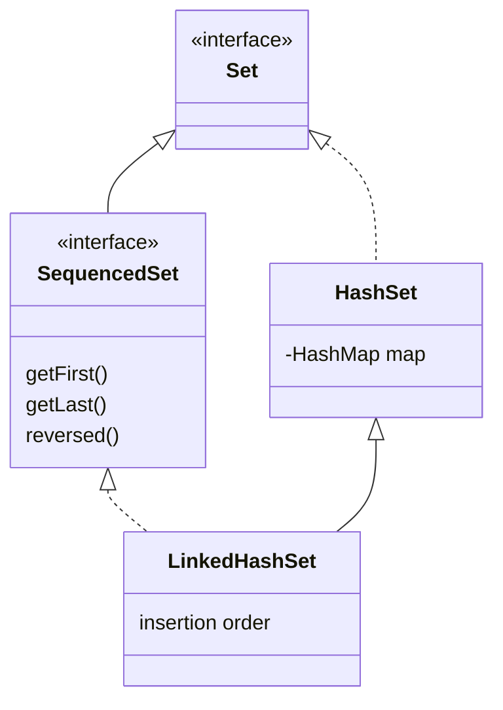

LinkedHashSet 仍然需要：

```text
hashCode
equals
HashMap bucket
```

所以它的去重逻辑和 HashSet 没有本质变化。

变化在于：

> 每个元素除了参与哈希桶结构，还会参与一条维护 encounter order 的双向链表。

---

## 06.12 LinkedHashSet 的底层结构：两套结构同时存在

这是理解 LinkedHashSet 最关键的一张图。

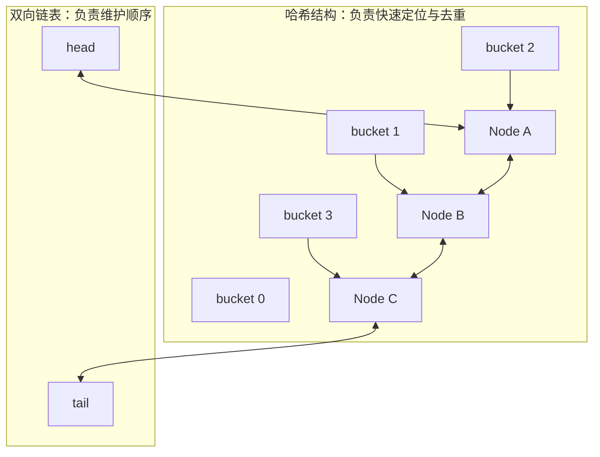

假设插入：

```text
A → B → C
```

即使 hash 分布是：

```text
A → bucket 2
B → bucket 1
C → bucket 3
```

LinkedHashSet 遍历仍然按照顺序链表：

```text
A → B → C
```

因此它同时拥有两种能力：

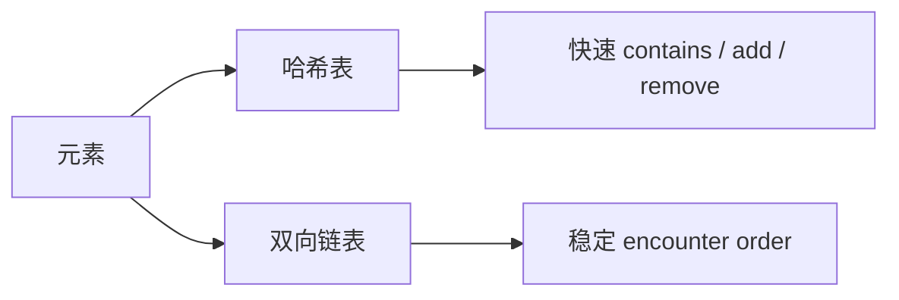

---

## 06.13 LinkedHashSet 为什么能保持插入顺序？

普通 HashSet：

```text
iterator
→ 扫 HashMap table
→ 顺序取决于 bucket
```

LinkedHashSet：

```text
iterator
→ 沿双向链表
→ 顺序来自维护的 encounter order
```

对比：

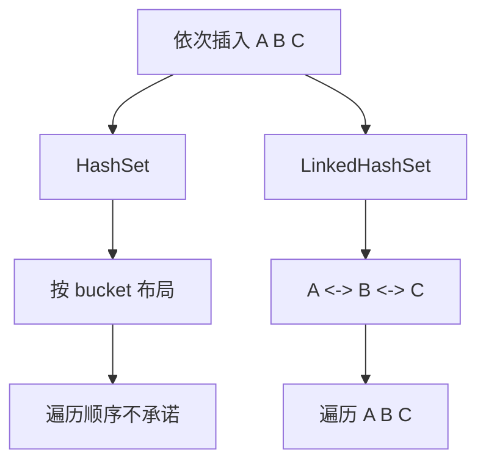

所以：

```java
Set<String> set = new LinkedHashSet<>();

set.add("A");
set.add("B");
set.add("C");

System.out.println(set);
```

语义上可以依赖：

```text
[A, B, C]
```

这与 HashSet 不同。

---

## 06.14 重复 add 会不会把元素移动到最后？

这是一个很好的面试追问。

传统 `add`：

```java
set.add("A");
set.add("B");
set.add("C");
set.add("A");
```

结果仍然是：

```text
A → B → C
```

因为普通 `add(A)` 发现已经存在 A 后：

```text
不会创建新元素
不会把 A 当成一次新的普通插入
```

流程：

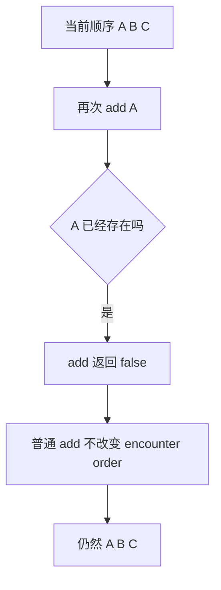

但是 Java 21 引入 SequencedSet 之后：

```text
如果你明确调用 addFirst / addLast
```

就属于显式调整首尾顺序的语义，后面单独讲。

---

## 06.15 Java 21：LinkedHashSet 正式进入 SequencedSet 体系

Java 21 的集合框架有一个很重要的变化：

```text
JEP 431: Sequenced Collections
```

对于 Set 体系，可以先抓住：

```text
SequencedSet
→ 一个拥有明确 encounter order 的 Set
```

LinkedHashSet 在 Java 21 中属于 SequencedSet。

心智模型：

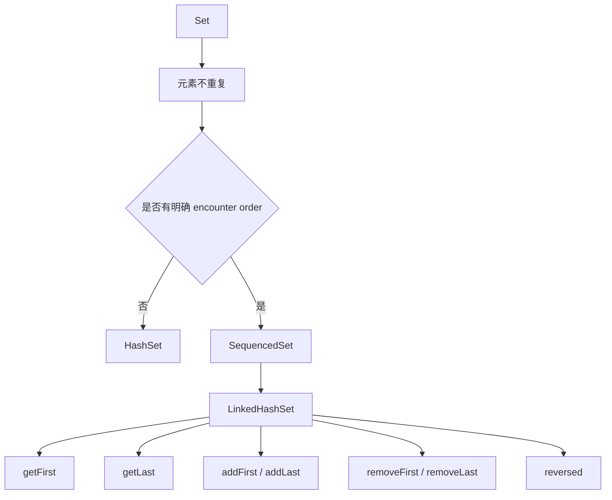

这让 LinkedHashSet 的定位更清晰：

> 它不只是“一个碰巧有序的 HashSet”，而是一个正式具有顺序语义的 Set。

---

## 06.16 `getFirst()` / `getLast()`：以前为什么麻烦？

Java 21 之前，如果想拿 LinkedHashSet 的第一个元素，经常会看到：

```java
E first = set.iterator().next();
```

拿最后一个就更麻烦。

Java 21 后可以直接：

```java
E first = set.getFirst();
E last = set.getLast();
```

语义图：

```mermaid
flowchart LR
    H[head] --> A[A]
    A <--> B[B]
    B <--> C[C]
    C --> T[tail]

    GF[getFirst] --> A
    GL[getLast] --> C
```

对于面试来说，重点不是记几个新 API，而是理解：

> **Sequenced Collections 把“第一个、最后一个、反向视图”从具体集合的偶然能力，提升成统一接口契约。**

---

## 06.17 `addFirst()` / `addLast()`：Java 21 下可以显式调整顺序

假设当前：

```text
A → B → C
```

执行：

```java
set.addFirst("C");
```

语义是把 C 放到 encounter order 的最前面：

```text
C → A → B
```

流程：

```mermaid
flowchart TD
    A[当前 A B C] --> B[addFirst C]
    B --> C{C 已经存在吗}

    C -- 否 --> D[新增 C]
    D --> E[挂到链表头部]

    C -- 是 --> F[从原顺序位置摘除]
    F --> G[重新挂到链表头部]

    E --> H[新的 encounter order]
    G --> H
```

同理：

```java
set.addLast("A");
```

可以把已有 A 显式调整到最后。

这和普通：

```java
set.add("A")
```

不是一回事。

对比：

```mermaid
flowchart LR
    A[普通 add 已存在元素] --> B[顺序不变]
    C[addFirst 已存在元素] --> D[移动到首部]
    E[addLast 已存在元素] --> F[移动到尾部]
```

---

## 06.18 `reversed()`：反向集合还是新集合？

Java 21 很容易被问：

```java
SequencedSet<E> reversed = set.reversed();
```

应该怎么理解？

核心：

> **它是反向顺序视图，不是简单复制一份完全独立的新集合。**

假设原集合：

```text
A → B → C
```

反向视图：

```text
C → B → A
```

图：

```mermaid
flowchart LR
    subgraph Original[原 LinkedHashSet]
        A1[A] <--> B1[B]
        B1 <--> C1[C]
    end

    subgraph Reversed[reversed 视图]
        C2[C] <--> B2[B]
        B2 <--> A2[A]
    end

    Original <--> |底层元素关联| Reversed
```

因此要避免这种错误理解：

```text
reversed()
=
new LinkedHashSet<>(反转结果)
```

不准确。

它更接近：

```text
同一个底层集合的反向观察窗口
```

这和前面 ArrayList 的：

```text
subList
reversed
```

一样，都要建立“视图”意识。

---

## 06.19 Java 21 顺序 API 的面试主线

不用把所有方法散着背。

直接记一张图：

```mermaid
flowchart TD
    A[LinkedHashSet encounter order] --> B[首部]
    A --> C[尾部]
    A --> D[反向视图]

    B --> B1[getFirst]
    B --> B2[addFirst]
    B --> B3[removeFirst]

    C --> C1[getLast]
    C --> C2[addLast]
    C --> C3[removeLast]

    D --> D1[reversed]
```

面试回答：

> Java 21 通过 Sequenced Collections 统一了有明确 encounter order 的集合接口。LinkedHashSet 现在实现 SequencedSet，可以直接访问和操作首尾元素，也可以拿到 reversed 反向视图。这比以前通过 iterator 手工拿首元素、自己构造反转集合语义更清晰。

---

## 06.20 LinkedHashSet 的代价：为什么不总是用它？

既然 LinkedHashSet：

```text
能去重
又有顺序
```

为什么不无脑替代 HashSet？

因为维护顺序是有成本的。

普通 HashSet 节点主要服务：

```text
hash bucket
```

LinkedHashSet 背后的 LinkedHashMap 节点还需要维护类似：

```text
before
after
```

示意：

```mermaid
flowchart LR
    H[HashSet 节点] --> A[hash]
    H --> B[key]
    H --> C[value]
    H --> D[next]

    L[LinkedHashSet 背后节点] --> E[hash]
    L --> F[key]
    L --> G[value]
    L --> I[next]
    L --> J[before]
    L --> K[after]
```

因此代价包括：

```text
每个节点更多引用字段
插入/删除时额外维护链表
额外的内存占用
```

所以选型不是：

```text
LinkedHashSet 功能更多
→ 永远更好
```

而是：

```mermaid
flowchart TD
    A[需要 Set 去重] --> B{是否需要稳定 encounter order}
    B -- 否 --> C[HashSet]
    B -- 是 --> D[LinkedHashSet]
```

---

## 06.21 一个容易忽略的优势：LinkedHashSet 遍历通常只跟 size 相关

HashSet 遍历大致要扫描：

```text
table capacity + 实际元素
```

LinkedHashSet 因为维护了顺序链表，迭代可以沿链表走：

```text
head → node → node → tail
```

图：

```mermaid
flowchart TD
    A[HashSet iteration] --> B[扫描 table]
    B --> C[跳过空 bucket]
    C --> D[访问节点]
    D --> E[成本受 capacity 影响]

    F[LinkedHashSet iteration] --> G[沿顺序链表]
    G --> H[只访问实际节点]
    H --> I[成本主要跟 size 相关]
```

这意味着：

> 在一个底层容量非常大但元素很少的集合里，LinkedHashSet 的遍历特性甚至可能比 HashSet 更稳定。

当然，不能为了这个点就无脑选择 LinkedHashSet。

它只是说明：

> 两者差异不只是“一个有序，一个无序”，底层遍历方式也不同。

---

## 06.22 HashSet vs LinkedHashSet vs TreeSet：面试选型表

这是 Set 体系最值得记的一张表。

| 维度 | HashSet | LinkedHashSet | TreeSet |
|---|---|---|---|
| 核心结构 | HashMap | LinkedHashMap | TreeMap / 红黑树 |
| 去重依据 | `hashCode + equals` | `hashCode + equals` | `compareTo / Comparator == 0` |
| 遍历顺序 | 不保证 | encounter order | 排序顺序 |
| add / contains 平均复杂度 | O(1) | O(1) | O(log n) |
| 是否允许 null | 通常可有一个 null | 通常可有一个 null | 自然排序下一般不允许 null |
| 额外空间 | 较低 | 更高，需要顺序链表 | 红黑树节点 |
| 典型场景 | 只关心去重 | 去重且保序 | 去重且需要排序/范围能力 |

选型图：

```mermaid
flowchart TD
    A[需要 Set] --> B{需要排序吗}

    B -- 是 --> C[TreeSet]
    B -- 否 --> D{需要保留 encounter order 吗}

    D -- 是 --> E[LinkedHashSet]
    D -- 否 --> F[HashSet]

    C --> G[Comparator / Comparable]
    E --> H[hashCode + equals + 双向链表]
    F --> I[hashCode + equals]
```

---

## 06.23 HashSet 和 TreeSet 的“重复”不是一个概念

这点必须和上一章关联起来。

HashSet：

```text
hashCode
+
equals
```

TreeSet：

```text
compareTo == 0
或
Comparator.compare(a, b) == 0
```

图：

```mermaid
flowchart LR
    A[元素 a b] --> H[HashSet]
    A --> T[TreeSet]

    H --> H1[hash 定位]
    H1 --> H2[equals 判等]

    T --> T1[红黑树查找]
    T1 --> T2[compare == 0 判重]
```

所以完全可能出现：

```text
a.equals(b) == false
```

但是：

```text
comparator.compare(a, b) == 0
```

TreeSet 仍然认为它们“重复”。

这也是下一章 TreeMap / TreeSet 会继续深入的点。

---

## 06.24 工程场景一：去重但必须保留用户输入顺序

这是 LinkedHashSet 最经典的工程价值。

例如用户输入：

```text
SKU-3
SKU-1
SKU-3
SKU-2
SKU-1
```

需求：

```text
去重
但保持第一次出现顺序
```

期望结果：

```text
SKU-3
SKU-1
SKU-2
```

最直接：

```java
List<String> skuList = List.of(
        "SKU-3", "SKU-1", "SKU-3", "SKU-2", "SKU-1"
);

Set<String> unique = new LinkedHashSet<>(skuList);
```

流程：

```mermaid
flowchart TD
    A[原始输入 SKU3 SKU1 SKU3 SKU2 SKU1] --> B[LinkedHashSet]

    B --> C1[第一次 SKU3 → 插入]
    C1 --> C2[第一次 SKU1 → 插入]
    C2 --> C3[第二次 SKU3 → 已存在 跳过]
    C3 --> C4[SKU2 → 插入]
    C4 --> C5[第二次 SKU1 → 已存在 跳过]

    C5 --> D[SKU3 → SKU1 → SKU2]
```

这比：

```java
new HashSet<>(list)
```

更适合需要：

```text
“第一次出现顺序”
```

的业务。

---

## 06.25 工程场景二：WMS 扫码去重但不能打乱作业顺序

例如拣货员连续扫码：

```text
箱码 A
箱码 B
箱码 A
箱码 C
```

业务要求：

```text
同一箱码只处理一次
同时保留首次扫描顺序
```

可以用：

```java
LinkedHashSet<String> scannedBoxes = new LinkedHashSet<>();
```

业务流程：

```mermaid
flowchart TD
    A[扫码 boxCode] --> B{scannedBoxes.add 返回 true 吗}

    B -- 是 --> C[首次扫描]
    C --> D[进入后续处理]
    D --> E[顺序仍按首次扫码维护]

    B -- 否 --> F[重复扫码]
    F --> G[直接提示或忽略]
```

相比：

```text
List
```

你不需要每次 O(n) 手工 `contains` 再 add。

相比：

```text
HashSet
```

又不会失去首次扫描顺序。

---

## 06.26 工程场景三：数据库 IN 查询结果恢复原请求顺序

假设请求：

```text
[sku5, sku2, sku8]
```

数据库：

```sql
WHERE sku_code IN (...)
```

返回顺序未必和入参一致。

一种常见业务需求是：

```text
去掉重复请求 SKU
并保留原请求 encounter order
```

LinkedHashSet 可以先处理请求：

```mermaid
flowchart TD
    A[请求 SKU 列表] --> B[LinkedHashSet 去重保序]
    B --> C[批量数据库查询]
    C --> D[Map sku -> entity]
    D --> E[按 LinkedHashSet 顺序重新组装]
    E --> F[最终结果顺序与首次请求一致]
```

这里 LinkedHashSet 的价值不是“性能神奇”，而是：

> **把业务上的 encounter order 显式建模出来。**

---

## 06.27 什么时候不要用 Set 去重？

看到“去重”两个字，不等于一定要 `HashSet`。

先问业务语义：

```mermaid
flowchart TD
    A[需求说 去重] --> B{重复的定义是什么}

    B --> C[对象 equals 相等]
    C --> D[HashSet / LinkedHashSet]

    B --> E[某个业务字段相同]
    E --> F[按 businessKey 建 Map 或先转换 key]

    B --> G[Comparator compare == 0]
    G --> H[TreeSet]

    B --> I[数据库唯一约束]
    I --> J[DB unique index 才是最终一致性边界]
```

例如：

```java
class Order {
    Long id;
    String orderNo;
    String customerId;
}
```

业务说：

> 按 orderNo 去重。

并不代表一定要给整个 `Order` 重写 equals/hashCode 只比较 orderNo。

可能更清晰：

```java
Set<String> seenOrderNos = new HashSet<>();
```

或者：

```java
Map<String, Order> orderByNo = ...
```

原则：

> **集合 equality 设计应该服务对象自身语义，而不是为了某一次临时去重随便修改 equals/hashCode。**

---

## 06.28 Set 选型不是只看时间复杂度

很多面试答案停留在：

```text
HashSet O(1)
TreeSet O(log n)
```

工程上应该再问：

```text
我到底需要什么语义？
```

完整决策图：

```mermaid
flowchart TD
    A[需要一组不重复元素] --> B{重复定义是什么}

    B -->|equals / hashCode| C{需要 encounter order 吗}
    B -->|Comparator| D[TreeSet]

    C -- 否 --> E[HashSet]
    C -- 是 --> F[LinkedHashSet]

    E --> G{是否作为高频遍历结构}
    F --> H[顺序语义清晰]

    D --> I[排序 + floor ceiling 范围能力]
```

选型优先级应该是：

```text
1. 业务语义是否匹配
2. 正确性
3. 顺序需求
4. 性能
5. 内存
```

而不是：

```text
谁 O(1) 就选谁
```

---

## 06.29 源码主线：LinkedHashSet 为什么能复用 LinkedHashMap？

面试通常不要求你背构造函数源码，但要知道设计关系。

可以把内部初始化简化理解成：

```text
HashSet
默认使用 HashMap

LinkedHashSet
通过 HashSet 的内部构造路径
让 map 实际指向 LinkedHashMap
```

结构：

```mermaid
flowchart TD
    A[HashSet] --> B[map 字段]
    B --> C[默认 HashMap]

    D[LinkedHashSet extends HashSet] --> E[复用同一个 map 字段]
    E --> F[实际初始化为 LinkedHashMap]

    F --> G[HashMap 的 hash 去重能力]
    F --> H[LinkedHashMap 的双向链表顺序]
```

这就是为什么 LinkedHashSet：

```text
无需自己再维护一套 Set 判重源码
```

它仍然可以直接复用：

```text
add
contains
remove
size
```

这些 HashSet 逻辑，

而底层 Map 换成 LinkedHashMap 后，自然获得顺序能力。

---

## 06.30 为什么 LinkedHashSet 不等于“HashSet 外面再套一个 LinkedList”？

这是理解数据结构设计的好问题。

如果真的设计成：

```text
HashSet + LinkedList
```

那么每次：

```text
add
remove
```

需要自己同时维护两个独立容器。

例如删除：

```mermaid
flowchart TD
    A[remove e] --> B[从 HashSet 删除]
    A --> C[还要从 LinkedList 找 e]
    C --> D[LinkedList 可能需要 O n 查找]
    D --> E[两套结构一致性维护复杂]
```

而 LinkedHashMap 的做法更紧凑：

```text
一个 Entry / Node
同时属于
哈希桶结构
+
顺序双向链表
```

图：

```mermaid
flowchart LR
    A[同一个 Entry] --> B[hash bucket next]
    A --> C[before]
    A --> D[after]
```

这样：

```text
hash 定位
顺序遍历
删除
```

可以围绕同一批节点完成。

---

## 06.31 高频误区：LinkedHashSet 是“排序集合”吗？

不是。

LinkedHashSet 的顺序是：

```text
encounter order
```

通常对应：

```text
插入顺序
```

而不是：

```text
自然排序
Comparator 排序
```

对比：

```mermaid
flowchart LR
    IN[插入 30 10 20] --> LHS[LinkedHashSet]
    IN --> TS[TreeSet]

    LHS --> L1[30 10 20]
    TS --> T1[10 20 30]
```

所以：

```text
LinkedHashSet
→ 有序，但不是“排序”

TreeSet
→ 排序集合
```

面试时建议避免只说：

> LinkedHashSet 是有序 Set。

更准确：

> LinkedHashSet 维护 encounter order；TreeSet 维护基于比较器的排序顺序。

---

## 06.32 高频误区：Set 里的对象不能修改吗？

不是所有字段都不能改。

准确说：

> **不要修改参与 equals/hashCode 的字段。**

例如：

```java
class User {
    final Long id;       // equality 只基于 id
    String displayName;  // 不参与 equality
}
```

如果：

```text
equals/hashCode 只使用 id
```

修改：

```text
displayName
```

不会改变 hash bucket。

图：

```mermaid
flowchart TD
    A[User id=100 name=Alice] --> B[hashCode 只基于 id]
    B --> C[进入 bucket 5]

    C --> D[修改 name=Bob]
    D --> E[id 不变]
    E --> F[hash 不变]
    F --> G[contains/remove 仍正常]
```

真正危险的是：

```text
修改 id
且 id 参与 hashCode
```

---

## 06.33 高频误区：Set 天然能解决数据库唯一性吗？

不能。

HashSet 的约束范围通常只是：

```text
当前 JVM
当前对象
当前集合实例
```

数据库唯一约束解决的是：

```text
多个线程
多个 JVM
多个服务实例
最终写入数据库
```

边界图：

```mermaid
flowchart TD
    A[应用内 HashSet] --> B[可以提前过滤重复输入]
    B --> C[减少无效请求]

    D[数据库 UNIQUE INDEX] --> E[最终数据一致性约束]

    B --> F[不能替代]
    F --> E
```

例如订单号唯一：

```text
HashSet
→ 可以做批次内预去重

数据库 unique(order_no)
→ 最终正确性兜底
```

这是非常典型的“语言容器”和“业务一致性边界”的区别。

---

## 06.34 实验与 examples 边界

本章不做实验堆量，只保留 3 个真正能帮助理解的验证片段；完整运行入口统一见 [04-示例代码/README.md](../04-示例代码/README.md)。

---

### 实验一：验证 HashSet 的判重依赖 equals/hashCode

### 目标

观察两个不同对象在正确 equality 设计下只保留一个。

```java
record User(long id, String name) {}

Set<User> set = new HashSet<>();
User u1 = new User(1L, "Alice");
User u2 = new User(1L, "Alice");
u1 == u2;        // false
u1.equals(u2);   // true
set.add(u1);     // true
set.add(u2);     // false
set.size();      // 1
```

核心流程：

```mermaid
flowchart TD
    A[u1 add] --> B[集合为空]
    B --> C[插入成功 true]

    D[u2 add] --> E[hash 定位到候选桶]
    E --> F[equals u1 为 true]
    F --> G[认为重复]
    G --> H[add false]
```

---

### 实验二：验证可变 hash 字段导致 contains/remove 异常

```java
final class User {
    String username;
    User(String username) { this.username = username; }
    @Override public boolean equals(Object o) {
        return o instanceof User u && Objects.equals(username, u.username);
    }
    @Override public int hashCode() { return Objects.hash(username); }
}

Set<User> set = new HashSet<>();
User user = new User("alice");
set.add(user);
user.username = "bob";
set.contains(user); // 通常 false
set.remove(user);   // 通常 false
```

这里要观察的不是某个神奇 JVM bug，而是：

```text
旧 hash 入桶
→ 修改 equality 字段
→ 新 hash 查询
→ 查询路径变了
```

---

### 实验三：Java 21 LinkedHashSet 的 SequencedSet 能力

```java
LinkedHashSet<String> set = new LinkedHashSet<>();
set.addAll(List.of("A", "B", "C"));
set.getFirst(); // A
set.getLast();  // C
set.addFirst("C"); // [C, A, B]
set.addLast("C");  // [A, B, C]
SequencedSet<String> reversed = set.reversed(); // [C, B, A]
```

这个实验重点观察：

```mermaid
flowchart LR
    A[A B C] --> B[addFirst C]
    B --> C[C A B]
    C --> D[addLast C]
    D --> E[A B C]
    E --> F[reversed]
    F --> G[C B A]
```

---

## 06.35 面试高频题：只保留真正值得问的 18 题

### Q1：HashSet 底层是什么？

> HashSet 底层基于 HashMap，元素作为 HashMap 的 key，value 使用统一的 PRESENT 占位对象。

---

### Q2：HashSet 为什么能去重？

> 因为 HashMap 的 key 具有唯一语义。HashSet.add 本质调用 map.put，先用 hash 定位桶，再通过引用相等或 equals 判断 key 是否已经存在。

---

### Q3：HashSet.add 为什么返回 boolean？

> 如果底层 HashMap 原来不存在该 key，插入后返回 true；如果已经存在逻辑相等 key，集合不变化，返回 false。

---

### Q4：HashSet 判断重复只看 hashCode 吗？

> 不是。hashCode/hash 只负责缩小查找范围，最终还要通过 `==` 或 equals 确认逻辑相等。

---

### Q5：两个对象 hashCode 一样，能同时放进 HashSet 吗？

> 可以。只要 equals 不相等，它们就是普通哈希冲突，可以作为两个不同元素共存。

---

### Q6：两个对象 equals 相等，但 hashCode 不同会怎样？

> 违反 hashCode 契约。它们可能被放到不同桶，HashSet 无法在桶内比较 equals，最终出现两个逻辑相等对象，导致去重失败。

---

### Q7：HashSet 为什么允许一个 null？

> 因为元素就是 HashMap key，而 HashMap 允许一个 null key，所以 HashSet 也允许一个 null 元素。

---

### Q8：HashSet 为什么不保证顺序？

> 它的 iterator 依赖 HashMap 的桶结构，遍历顺序受 hash、容量、冲突和 resize 等影响，不记录插入历史，因此 API 不承诺 encounter order。

---

### Q9：HashSet 是随机顺序吗？

> 不能简单说随机。准确说是不保证迭代顺序。某次运行可能看起来稳定，但不能作为业务契约依赖。

---

### Q10：修改 HashSet 元素字段有什么风险？

> 如果修改的是参与 equals/hashCode 的字段，hash 可能变化，但节点不会自动迁移桶，之后 contains/remove 可能按新 hash 去错误的桶查，导致查不到或删不掉。

---

### Q11：LinkedHashSet 底层是什么？

> LinkedHashSet 继承 HashSet，但底层 Map 实际使用 LinkedHashMap，因此同时具有 HashMap 的哈希判重能力和双向链表维护的 encounter order。

---

### Q12：LinkedHashSet 为什么能保持顺序？

> LinkedHashMap 节点除了参与哈希桶结构，还通过 before/after 形成双向链表；迭代时沿这条顺序链表，而不是直接按 HashMap table 扫描。

---

### Q13：LinkedHashSet 再次 add 已存在元素，会移到最后吗？

> 普通 `add` 不会。已存在元素 add 返回 false，原 encounter order 保持不变。Java 21 如果明确调用 `addFirst` / `addLast`，则可以重新定位到首尾。

---

### Q14：LinkedHashSet 和 TreeSet 都是“有序 Set”，区别是什么？

> LinkedHashSet 维护 encounter/insertion order；TreeSet 维护 Comparator 或 Comparable 定义的排序顺序。一个是“按进入集合的顺序”，一个是“按大小关系排序”。

---

### Q15：HashSet、LinkedHashSet、TreeSet 怎么选？

```text
只去重
→ HashSet

去重 + 保序
→ LinkedHashSet

去重 + 排序 / 范围查询
→ TreeSet
```

---

### Q16：LinkedHashSet 为什么比 HashSet 占更多内存？

> 因为底层 LinkedHashMap 节点还要维护前驱/后继引用，用于双向链表顺序，所以单节点元数据更多。

---

### Q17：Java 21 的 SequencedSet 解决什么问题？

> 它把具有 encounter order 的 Set 抽象成统一接口，提供首尾访问、首尾插入/删除和 reversed 反向视图，让 LinkedHashSet 的顺序能力成为正式接口契约。

---

### Q18：HashSet 能替代数据库唯一索引吗？

> 不能。HashSet 只能约束当前内存集合，数据库唯一索引才是跨线程、跨 JVM、跨服务实例后的最终持久化唯一性边界。

---

## 06.36 十个高频易错点

### 1. ❌ `hashCode` 相同就是重复

正确：

```text
hash 相同
→ 只说明进入同一个候选范围
→ 还需要 equals 最终判断
```

---

### 2. ❌ HashSet 去重只依赖 equals

正确：

```text
先 hash 定位
再 equals
```

如果 equals 相等但 hashCode 不同，同样可能去重失败。

---

### 3. ❌ HashSet 的遍历顺序是随机的

正确：

> 不保证顺序，不等于每次随机。

---

### 4. ❌ LinkedHashSet 会自动排序

正确：

> 它维护 encounter order，不负责按大小排序。

---

### 5. ❌ LinkedHashSet 再 add 一次会移动到末尾

正确：

> 普通 add 不改变已有元素位置；Java 21 可以显式调用 addFirst/addLast 调整。

---

### 6. ❌ Set 里的对象任何字段都不能改

正确：

> 重点是不要修改参与 equals/hashCode 的字段。

---

### 7. ❌ HashSet 只允许非 null

正确：

> HashSet 可以保存一个 null。

---

### 8. ❌ 初始容量越大越好

正确：

> 过小可能频繁扩容，过大浪费空间，而且 HashSet 遍历还可能受底层 capacity 影响。

---

### 9. ❌ LinkedHashSet 的 O(1) 就说明永远优于 TreeSet

正确：

> 数据结构首先看业务语义。需要排序、floor/ceiling、范围能力时 TreeSet 更合适。

---

### 10. ❌ 应用里用 HashSet 去重后就不用数据库唯一约束

正确：

> 内存预去重只能做前置优化，最终持久化唯一性仍需数据库约束等一致性机制。

---

## 06.37 工程实践建议：真正值得记的 12 条

1. **只需要去重且不关心顺序，优先 HashSet。**
2. **需要“去重 + 保留首次出现顺序”，优先 LinkedHashSet。**
3. **需要排序或范围查询，考虑 TreeSet。**
4. **作为 Set 元素的 Value Object，尽量保持 equality 字段不可变。**
5. **不要为了某个临时业务去重需求随意修改实体类 equals/hashCode。**
6. **按某个字段去重时，可以直接维护 `Set<BusinessKey>`，语义往往更清晰。**
7. **已知数据量很大时，合理预估容量，避免连续 resize。**
8. **不要依赖 HashSet 当前看起来“刚好有序”的遍历结果。**
9. **批量接口如果需要保留用户输入顺序，可使用 LinkedHashSet 做第一轮去重。**
10. **LinkedHashSet 的顺序语义应该是业务需要，而不是为了“保险”无脑替换 HashSet。**
11. **应用层 Set 去重不能替代数据库唯一索引、幂等键等最终一致性约束。**
12. **Java 21 项目中，把 LinkedHashSet 当成 SequencedSet 理解，比只记“有序 HashSet”更准确。**

---

## 06.38 最终心智模型

整章最后压成一张图：

```mermaid
flowchart TD
    A[Set 不允许逻辑重复元素] --> B{重复规则是什么}

    B -->|hashCode + equals| C[Hash 家族]
    B -->|Comparator / Comparable| D[TreeSet]

    C --> E{需要 encounter order 吗}
    E -- 否 --> F[HashSet]
    E -- 是 --> G[LinkedHashSet]

    F --> H[HashMap]
    H --> I[元素作为 key]
    I --> J[hash 定位桶]
    J --> K[equals 最终判重]

    G --> L[LinkedHashMap]
    L --> M[复用 hash 判重]
    L --> N[双向链表维护顺序]

    N --> O[Java 21 SequencedSet]
    O --> P[getFirst / getLast]
    O --> Q[addFirst / addLast]
    O --> R[reversed]

    K --> S{equality 字段是否稳定}
    S -- 否 --> T[contains / remove 可能失效]
    S -- 是 --> U[集合语义稳定]
```

---

## 06.39 一分钟面试回答模板

如果面试官问：

> HashSet 和 LinkedHashSet 讲一下。

可以直接回答：

> HashSet 底层基于 HashMap，元素作为 HashMap 的 key，value 使用统一 PRESENT 对象。add 本质调用 map.put，所以去重流程和 HashMap key 判重一致：先根据 hash 定位桶，再通过引用相等或 equals 最终确认，如果 key 已存在则 add 返回 false。HashSet 不保证遍历顺序，因为它没有维护插入历史，iterator 依赖底层哈希桶结构。
>
> LinkedHashSet 可以理解为 HashSet 的哈希去重能力加 LinkedHashMap 的双向链表顺序能力。它仍然使用 hashCode + equals 去重，但额外维护 encounter order，因此适合“去重但保留首次出现顺序”的场景。代价是每个节点需要额外维护前后引用，内存会更高。Java 21 之后 LinkedHashSet 实现 SequencedSet，可以直接做 getFirst、getLast、addFirst、addLast 和 reversed 反向视图。
>
> 工程上只去重用 HashSet，需要去重保序用 LinkedHashSet，需要排序和范围能力用 TreeSet。另外要避免修改已经放进 HashSet/LinkedHashSet 中参与 equals/hashCode 的字段，否则 hash 改变后 contains/remove 可能失效。

---

## 06.40 面试前快速复习清单

```text
[ ] HashSet 为什么底层使用 HashMap
[ ] PRESENT 占位对象是什么作用
[ ] HashSet.add 完整调用链
[ ] add 为什么返回 boolean
[ ] hashCode 与 equals 分别负责什么
[ ] hash 相同但 equals 不同会怎样
[ ] equals 相同但 hash 不同会怎样
[ ] HashSet 为什么允许一个 null
[ ] HashSet 为什么不保证遍历顺序
[ ] 为什么不能依赖某次观察到的 HashSet 顺序
[ ] HashSet 遍历为什么受 capacity 影响
[ ] 修改 equality 字段为什么 contains/remove 失败
[ ] LinkedHashSet 底层为什么是 LinkedHashMap
[ ] 哈希表 + 双向链表如何同时工作
[ ] LinkedHashSet 为什么保持 encounter order
[ ] 普通重复 add 为什么不改变顺序
[ ] Java 21 SequencedSet 是什么
[ ] getFirst / getLast 的意义
[ ] addFirst / addLast 与普通 add 的区别
[ ] reversed 为什么是视图思维
[ ] HashSet vs LinkedHashSet vs TreeSet
[ ] HashSet 和 TreeSet 判重规则的区别
[ ] 去重但保留输入顺序应该选什么
[ ] Set 为什么不能替代数据库唯一约束
```

---

## 06.41 与前后章节的知识链

```mermaid
flowchart LR
    A[04 HashMap] --> B[理解 hash table 与 key 定位]
    B --> C[05 equals 与 hashCode]
    C --> D[理解 key 的 equality 契约]
    D --> E[06 HashSet 与 LinkedHashSet]
    E --> F[理解去重与 encounter order]
    F --> G[07 LinkedHashMap 与 LRU]
    G --> H[继续理解双向链表与 access order]
```

这几章不要割裂复习。

真正完整的面试链路应该是：

```text
HashMap
→ hash 怎么定位 key

equals/hashCode
→ key 到底怎么判相等

HashSet
→ 如何复用 Map key 唯一性完成去重

LinkedHashSet
→ 如何在去重基础上增加顺序

LinkedHashMap
→ 双向链表如何进一步支持 insertion order / access order / LRU
```

下一章进入：

> **`LinkedHashMap与LRU缓存.md`**

这会把本章“哈希表 + 双向链表”的结构继续向前推进，并重点回答：

```text
为什么 LinkedHashMap 能保序？
accessOrder 到底是什么？
为什么 get 也可能修改链表？
removeEldestEntry 怎么实现简单 LRU？
为什么生产缓存通常不用手写 LinkedHashMap，而更倾向 Caffeine？
```
