# LinkedHashMap 与 LRU 缓存：顺序、访问链表与缓存淘汰

> **本章定位：面试主线章。**
>
> `LinkedHashMap` 是集合框架里非常适合“顺着源码一路追问”的一个类，因为它把三个高频面试点串在了一起：
>
> **HashMap → 双向链表 → LRU。**
>
> 这章不做 API 百科，只解决 8 个真正重要的问题：
>
> **LinkedHashMap 比 HashMap 多了什么 → insertion-order 怎么维护 → access-order 怎么维护 → 为什么 get() 也可能修改结构 → 节点怎么移动到尾部 → removeEldestEntry 怎么实现 LRU → Java 21 SequencedMap 带来了什么 → 为什么生产缓存通常不用手写 LinkedHashMap。**
>
> 语义以 **Java 21** 为基准，底层核心实现按 JDK 8+ 主线理解。重点机制优先使用 Mermaid 图，不要求背完整源码，只要求能顺着关键钩子讲清楚。

> **本章唯一负责 LinkedHashMap 的顺序链表、`accessOrder`、LRU 和 Java 21 `SequencedMap` 增量。** HashMap 的桶/resize 回到 [HashMap](HashMap原理与源码分析.md)，key 的 equality 契约回到 [Java Core 对象契约](../../01-Java核心/深度解析/equals与hashCode契约.md)。

---

## 07.1 一张图建立整章的面试地图

如果面试官问：

> LinkedHashMap 和 HashMap 有什么区别？

推荐先答：

> `LinkedHashMap` 继承自 `HashMap`，所以哈希定位、冲突处理、扩容、树化这些能力仍然来自 HashMap。它额外给节点维护 `before / after` 两个引用，把所有有效节点串成一条双向链表，从而维护明确的 encounter order。默认是插入顺序；如果构造时开启 `accessOrder=true`，每次访问节点后会把节点移动到链表尾部，因此可以自然表达“最近使用”的顺序，再配合 `removeEldestEntry()` 就能实现一个简单的 LRU 缓存。

整章可以压缩成：

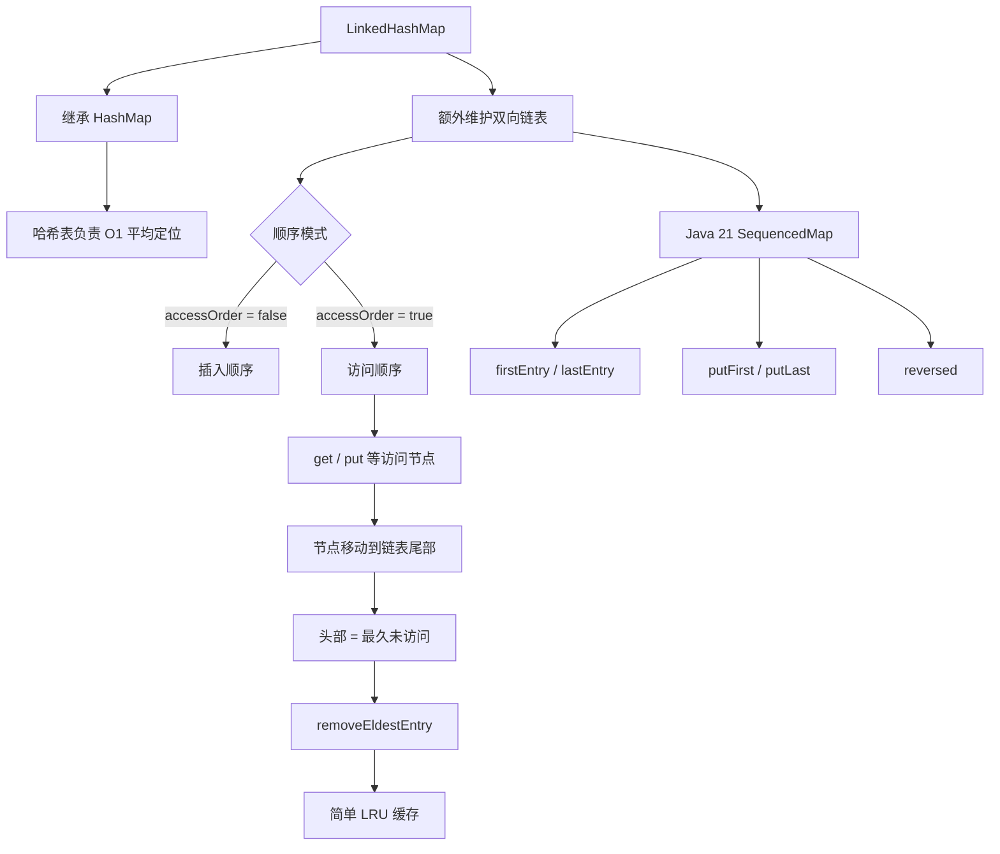

面试最常继续追问：

```text
1. LinkedHashMap 底层到底是什么结构？
2. before / after 和 HashMap 的 next 有什么区别？
3. 默认到底是插入顺序还是访问顺序？
4. accessOrder=true 后 get() 为什么会改变遍历顺序？
5. afterNodeAccess() 做了什么？
6. 为什么访问节点要移动到尾部？
7. 谁是 LRU 中最久未使用的节点？
8. removeEldestEntry() 在什么时候触发？
9. 为什么 LinkedHashMap 可以实现 LRU？
10. 这个 LRU 为什么不适合直接当生产缓存？
11. LinkedHashMap 是线程安全的吗？
12. Java 21 SequencedMap 有什么意义？
```

---

## 07.2 LinkedHashMap 的本质：HashMap + 一条双向链表

### 先说结论

可以先建立这个心智模型：

```text
LinkedHashMap
=
HashMap 的哈希索引
+
所有节点组成的一条双向链表
```

两套结构承担不同职责：

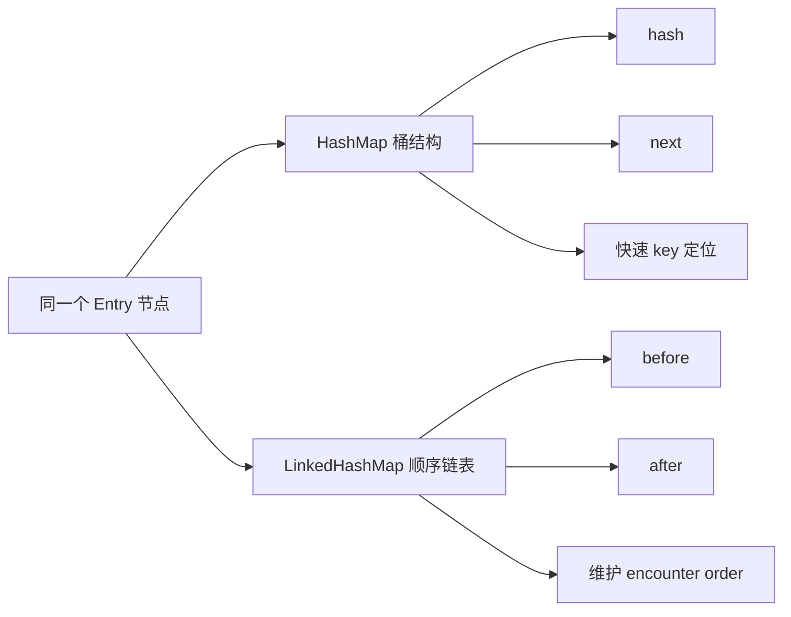

所以 LinkedHashMap 不是：

```text
一个 HashMap
+
另外再 new 一个 LinkedList
```

而是：

> **同一批节点，同时存在于哈希桶结构和顺序双向链表中。**

---

### 结构图：同一个节点属于两种关系

假设插入：

```text
A → B → C → D
```

哈希分布可能完全不是这个顺序：

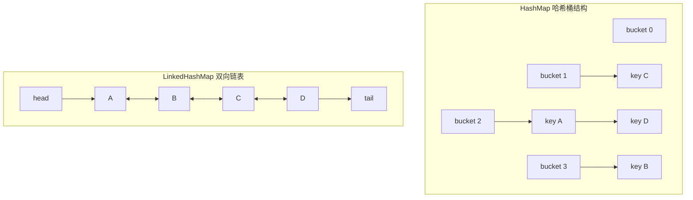

真正实现时：

```text
图中的 A1 与 A2 不是两份对象
而是同一个节点的两种关系视角
```

因此：

```text
HashMap 的 next
→ 服务“同一个桶里的冲突链”

LinkedHashMap 的 before / after
→ 服务“全局 encounter order”
```

这是本章最重要的结构区别。

---

## 07.3 `next`、`before`、`after` 到底分别干什么？

很多人看源码时会被三个指针绕晕。

直接画：

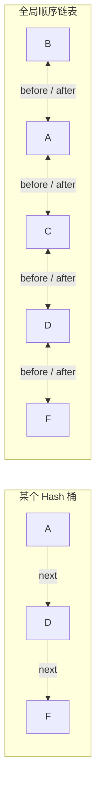

解释：

```text
next
→ “这个桶发生哈希冲突后，下一个节点是谁？”

before / after
→ “整个 LinkedHashMap 的顺序里，我前后是谁？”
```

同一个节点：

```text
D
```

可能：

```text
在 bucket 2 中排在 A 后面
```

但在 encounter order 里：

```text
排在 C 后面、F 前面
```

两套关系完全可以不同。

---

### ⭐ 面试口述版

> LinkedHashMap 的节点除了继承 HashMap 节点原本用于桶内冲突链的 `next` 外，还额外维护 `before` 和 `after`，把所有节点串成全局双向链表。`next` 只描述同一个桶里的节点关系，`before/after` 描述整个 Map 的 encounter order。LinkedHashMap 能保序，本质不是改变了 HashMap 的桶结构，而是多维护了一条全局双向链表。

---

## 07.4 默认模式：insertion-order 插入顺序

LinkedHashMap 默认构造时：

```java
new LinkedHashMap<>()
```

采用：

```text
accessOrder = false
```

也就是：

> **按插入顺序维护 encounter order。**

例如：

```java
Map<String, Integer> map = new LinkedHashMap<>();

map.put("A", 1);
map.put("B", 2);
map.put("C", 3);
```

顺序链表：

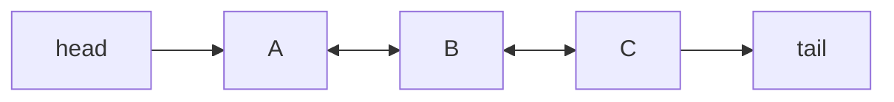

即使它们的 hash 桶位置是：

```text
B → bucket 1
A → bucket 7
C → bucket 3
```

遍历仍然：

```text
A → B → C
```

---

## 07.5 为什么覆盖旧 value 不会变成“重新插入”？

假设：

```java
map.put("A", 1);
map.put("B", 2);
map.put("C", 3);

map.put("B", 200);
```

在默认 insertion-order 模式下：

```text
顺序仍然是 A → B → C
```

因为：

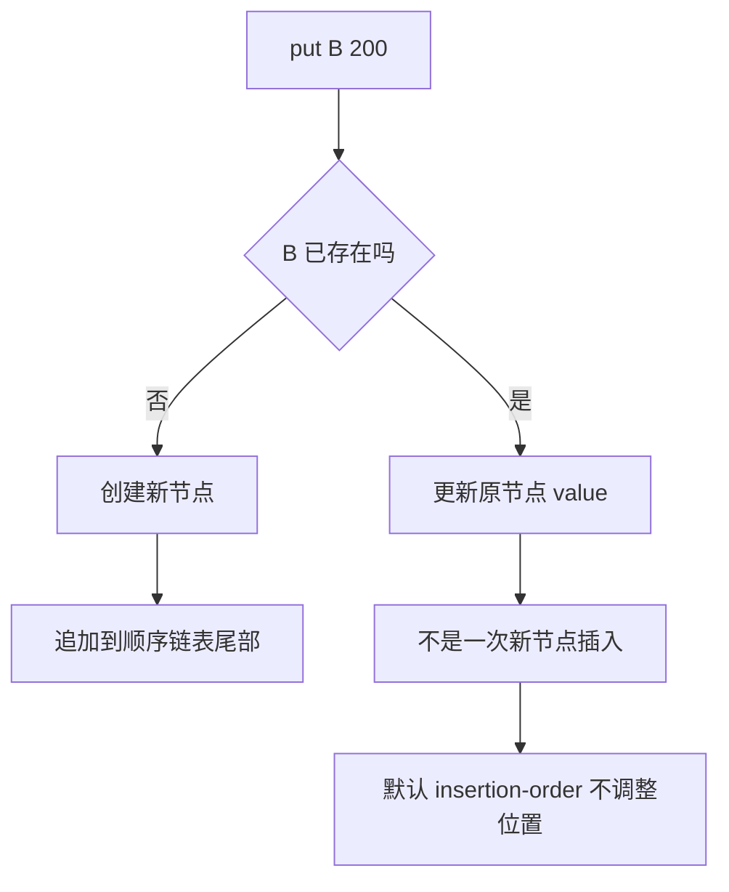

所以要区分：

```text
put 一个新 key
→ 新节点加入链表尾部

put 一个已有 key
→ 更新 value
→ 默认不改变插入顺序
```

---

## 07.6 LinkedHashMap 是怎么把新节点接到链表尾部的？

源码不要求背，但要知道关键钩子。

HashMap 在创建普通节点时有工厂方法：

```text
newNode(...)
```

LinkedHashMap 会覆盖节点创建逻辑，让新节点除了进入桶结构，还连接到顺序链表尾部。

抽象流程：

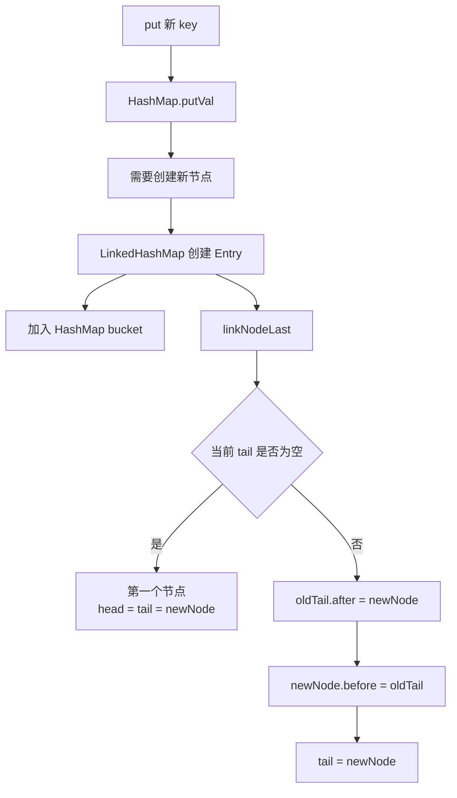

所以插入链表尾部本质就是标准双向链表追加。

---

## 07.7 删除节点时为什么也要维护两套结构？

删除一个节点不能只从 HashMap 桶里摘掉。

假设顺序：

```text
A ↔ B ↔ C ↔ D
```

删除 C：

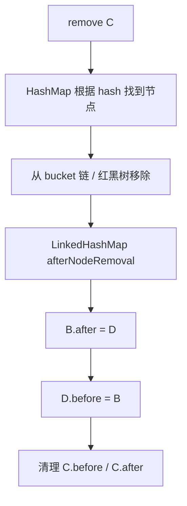

结果：

```text
A ↔ B ↔ D
```

因此 LinkedHashMap 的新增、删除、访问都需要考虑：

```text
哈希结构
+
顺序链表
```

这也是它比 HashMap 多出的维护成本。

---

## 07.8 关键切换：什么是 access-order？

LinkedHashMap 最有面试价值的构造函数：

```java
new LinkedHashMap<>(initialCapacity, loadFactor, true);
```

第三个参数：

```text
accessOrder = true
```

表示：

> **顺序不再表示“谁先插入”，而表示“谁最近被访问”。**

假设最开始插入：

```text
A → B → C → D
```

此时链表：

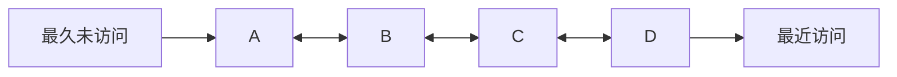

访问：

```java
map.get("B");
```

之后：

```text
A → C → D → B
```

B 被移动到尾部：

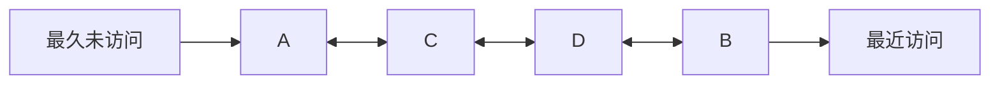

这就是 LRU 的基础。

---

## 07.9 为什么 access-order 下尾部代表“最近使用”？

因为设计规则就是：

> **每次发生有效访问，就把该节点移动到链表尾部。**

于是自然形成：

```text
head
↓
最久没访问

...

tail
↓
刚刚访问
```

流程：

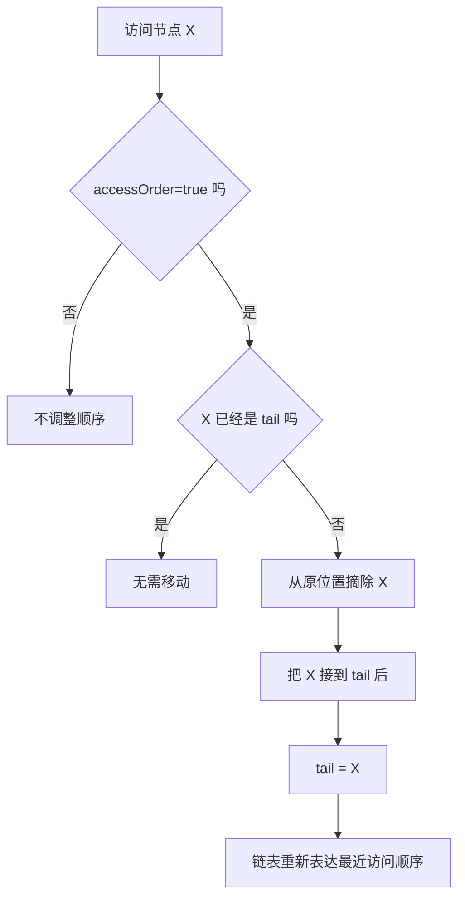

所以 LRU 并不需要：

```text
每次访问都记录一个时间戳
然后淘汰时扫描最小时间
```

双向链表已经把顺序维护好了。

---

## 07.10 `get()` 为什么也可能修改 LinkedHashMap？

这是这章最值得面试追问的问题之一。

普通 HashMap：

```java
map.get(key);
```

一般理解为：

```text
只读操作
```

但 access-order LinkedHashMap 中：

```java
map.get(key);
```

命中后会：

```text
把节点移动到尾部
```

也就是说它改变了内部顺序结构。

完整流程：

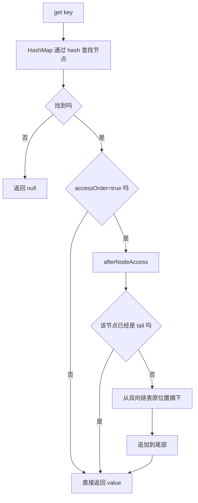

因此：

> **在 access-order 模式下，get 是“逻辑读”，但不是“结构只读”。**

---

## 07.11 `afterNodeAccess()` 到底做什么？

不要求背源码，但面试要能顺着图解释。

假设：

```text
A ↔ B ↔ C ↔ D
```

访问 B。

第一步：把 B 从中间摘掉：

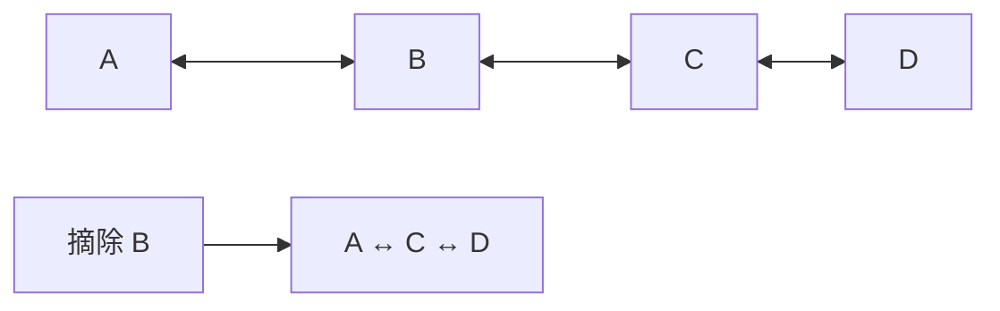

本质修改：

```text
A.after = C
C.before = A
```

第二步：把 B 挂到尾部：

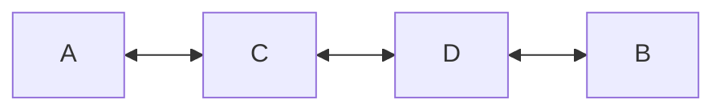

修改：

```text
D.after = B
B.before = D
tail = B
```

所以最终：

```text
A → C → D → B
```

这就是 `afterNodeAccess()` 最重要的逻辑。

---

## 07.12 为什么必须是双向链表？

如果只有单向链表：

```text
A → B → C → D
```

访问 C 后要把 C 移到尾部，需要找到：

```text
C 的前驱 B
```

但单向节点只知道：

```text
next
```

不知道：

```text
prev
```

就可能需要从 head 再扫描一次。

流程会变成：

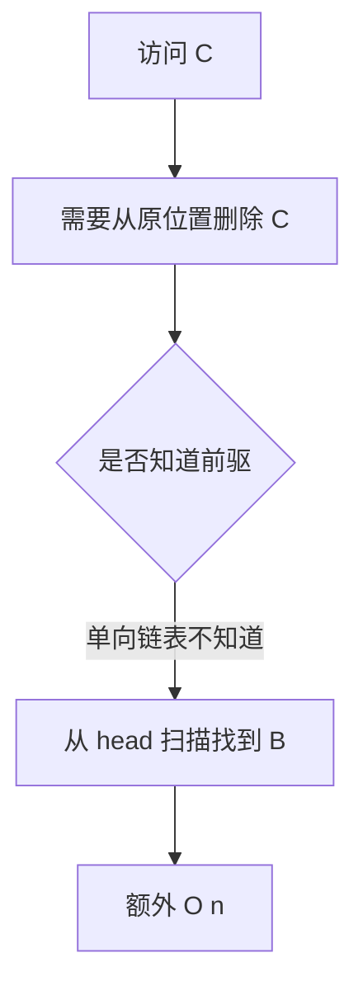

双向链表：

```text
C.before = B
C.after = D
```

可以直接摘除：

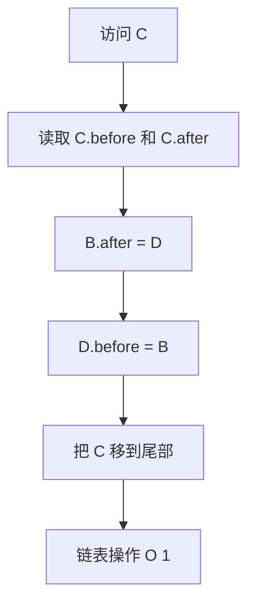

因此 LRU 常见的数据结构组合就是：

```text
HashMap
+
双向链表
```

---

## 07.13 LRU 到底是什么？

LRU：

> **Least Recently Used，最近最少使用。**

缓存容量有限时：

```text
谁最长时间没有被访问
→ 谁优先被淘汰
```

假设容量 3：

```text
先访问 A、B、C
```

当前：

```text
A → B → C
```

其中：

```text
A 最久未使用
C 最近使用
```

然后访问 A：

```text
B → C → A
```

再放入 D：

```text
容量将变成 4
```

应该淘汰：

```text
B
```

得到：

```text
C → A → D
```

完整图：

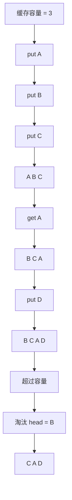

---

## 07.14 为什么 HashMap + 双向链表正好适合 LRU？

LRU 需要两种能力：

```text
1. 根据 key 快速找到缓存项
2. 根据“最近使用顺序”快速移动和淘汰节点
```

分别对应：

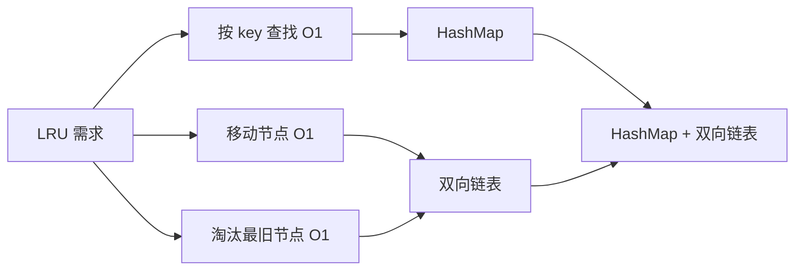

如果只有 HashMap：

```text
知道 value
但不知道谁最久未使用
```

如果只有 LinkedList：

```text
能维护顺序
但按 key 查找可能 O(n)
```

组合后：

```text
get
→ HashMap O(1) 找节点
→ 双向链表 O(1) 移尾

evict
→ 直接拿 head O(1)
```

这就是经典 LRU 的数据结构答案。

---

## 07.15 `removeEldestEntry()`：LinkedHashMap 如何自动淘汰最老节点？

LinkedHashMap 留了一个扩展钩子：

```java
protected boolean removeEldestEntry(Map.Entry<K, V> eldest)
```

默认：

```text
返回 false
```

也就是不自动删除。

如果想限制容量：

```java
class LruCache<K, V> extends LinkedHashMap<K, V> {

    private final int capacity;

    LruCache(int capacity) {
        super(capacity, 0.75f, true);
        this.capacity = capacity;
    }

    @Override
    protected boolean removeEldestEntry(Map.Entry<K, V> eldest) {
        return size() > capacity;
    }
}
```

关键：

```text
accessOrder = true
+
size() > capacity 时移除 eldest
```

---

## 07.16 `eldest` 为什么就是 LRU 节点？

在 access-order 模式：

```text
head
=
最久没有访问的节点
```

所以：

```text
eldest
=
顺序链表最前面的节点
```

流程：

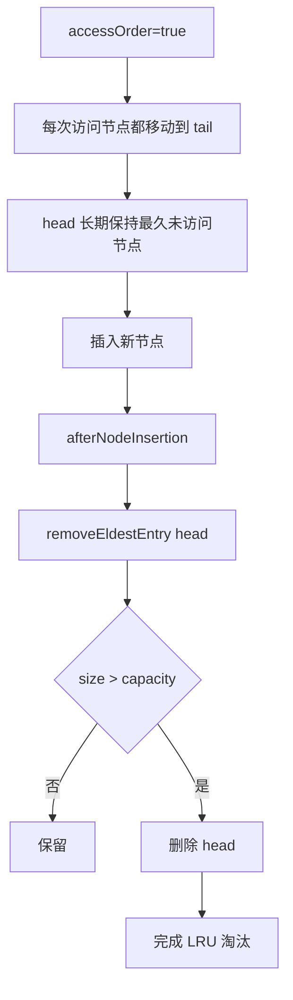

这就是 `removeEldestEntry` 能实现 LRU 的根本原因。

---

## 07.17 `removeEldestEntry()` 什么时候调用？

面试答法不要说成：

> 每次 get 都检查容量。

不对。

核心理解：

> **它主要发生在新增映射之后，用来决定是否移除当前 eldest entry。**

典型流程：

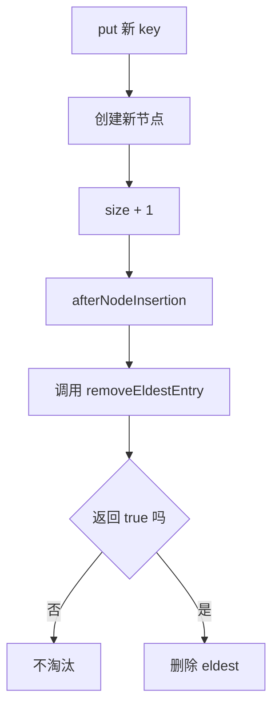

而：

```text
get
```

主要做的是：

```text
accessOrder=true 时移动节点顺序
```

不是插入新元素，因此不会因为单纯 get 而让 size 超容量。

---

## 07.18 一个完整的 LRU 访问流程

假设：

```text
capacity = 3
```

当前：

```text
A ↔ B ↔ C
```

---

### 第一步：get(A)

```mermaid
flowchart TD
    A[get A] --> B[HashMap 找到 A]
    B --> C[afterNodeAccess]
    C --> D[从 head 摘除 A]
    D --> E[追加到 tail]
    E --> F[B C A]
```

---

### 第二步：put(D)

```mermaid
flowchart TD
    A[put D] --> B[HashMap 新建 D]
    B --> C[链表尾部追加 D]
    C --> D[B C A D]
    D --> E[size = 4]
    E --> F[removeEldestEntry B]
    F --> G[4 > capacity 3]
    G --> H[删除 B]
    H --> I[C A D]
```

最终：

```text
C
→ 当前最久未访问

D
→ 刚刚写入，最近使用
```

---

## 07.19 手写 LRU：面试真正需要会到什么程度？

不需要背几十行代码。

只需要记住四个关键点：

```mermaid
flowchart TD
    A[手写 LinkedHashMap LRU] --> B[继承 LinkedHashMap]
    B --> C[构造器 accessOrder=true]
    C --> D[保存 capacity]
    D --> E[重写 removeEldestEntry]
    E --> F[return size > capacity]
```

最小版本：

```java
import java.util.LinkedHashMap;
import java.util.Map;

public class LruCache<K, V> extends LinkedHashMap<K, V> {

    private final int capacity;

    public LruCache(int capacity) {
        super(capacity, 0.75f, true);
        this.capacity = capacity;
    }

    @Override
    protected boolean removeEldestEntry(Map.Entry<K, V> eldest) {
        return size() > capacity;
    }
}
```

这段代码的面试价值不在于“记住代码”，而在于你能解释：

```text
为什么 true？
→ access-order

为什么 eldest 是 LRU？
→ 每次访问都把节点移到 tail

为什么 size > capacity？
→ 新节点插入后才检查淘汰

为什么性能平均 O(1)？
→ HashMap 查找 + 双向链表移动
```

---

## 07.20 LRU 中 `put` 也算“使用”吗？

在 access-order LinkedHashMap 中，不要把“使用”只理解成 `get()`。

核心思想是：

> 某些会访问或更新现有映射的方法，也会影响访问顺序。

面试不需要背完整方法清单，只要知道：

```text
get
getOrDefault
put / putIfAbsent
compute 系列
merge
```

这类对现有条目的有效访问/更新，可能触发访问顺序调整。

可以统一理解成：

```mermaid
flowchart TD
    A[对某个已存在 entry 操作] --> B{该操作是否构成 LinkedHashMap 的 access}
    B -- 否 --> C[顺序不变]
    B -- 是 --> D{accessOrder=true}
    D -- 否 --> C
    D -- 是 --> E[afterNodeAccess]
    E --> F[节点移到 tail]
```

真正面试重点：

> **不要只死记 get 会移动，理解 access-order 是一套“访问后调整节点”的策略。**

---

## 07.21 insertion-order 与 access-order 对比

这是本章核心对比表。

| 维度 | insertion-order | access-order |
|---|---|---|
| `accessOrder` | false | true |
| 默认模式 | ✅ | ❌ |
| 顺序含义 | 插入 encounter order | 最近访问顺序 |
| `get()` 命中后 | 顺序不变 | 节点移到尾部 |
| 覆盖已有 key | 通常不改变插入位置 | 可能作为访问调整顺序 |
| 典型场景 | 稳定输出顺序 | LRU |
| head 含义 | 最早插入 | 最久未访问 |
| tail 含义 | 最近插入 | 最近访问 |

一张图：

```mermaid
flowchart TD
    A[初始 A B C] --> B[get A]

    B --> C[insertion-order]
    C --> C1[A B C]

    B --> D[access-order]
    D --> D1[B C A]
```

---

## 07.22 为什么 access-order LinkedHashMap 的迭代更“危险”？

因为访问可能修改顺序链表。

假设你一边迭代：

```java
for (String key : map.keySet()) {
    ...
}
```

另一段逻辑对同一个 access-order LinkedHashMap 调：

```java
map.get("A");
```

`get()` 可能修改 encounter order。

从 fail-fast 的角度，要意识到：

```text
它不再是纯只读操作
```

示意：

```mermaid
flowchart TD
    A[Iterator 保存 expectedModCount] --> B[遍历过程中]
    B --> C[另一个结构性顺序修改发生]
    C --> D[modCount 变化]
    D --> E[Iterator 后续检查]
    E --> F[可能抛 ConcurrentModificationException]
```

重点：

> **LinkedHashMap 本来就不是线程安全容器，access-order 又让一些“看起来像读”的操作具备结构修改语义，更不能把它当并发缓存使用。**

---

## 07.23 LinkedHashMap 是线程安全的吗？

不是。

无论：

```text
insertion-order
```

还是：

```text
access-order
```

LinkedHashMap 都没有提供并发安全保证。

多线程并发：

```text
put
remove
resize
链表维护
access-order 节点移动
```

都可能发生竞争。

特别是 access-order：

```mermaid
flowchart TD
    A[Thread A get X] --> C[准备移动 X 到 tail]
    B[Thread B get Y] --> D[准备移动 Y 到 tail]

    C --> E[修改 before / after / tail]
    D --> E
    E --> F[没有内部并发同步保证]
    F --> G[数据竞争 / 可见性 / 结构一致性风险]
```

所以：

> 手写 `LinkedHashMap + removeEldestEntry` LRU 适合面试、单线程、小工具；不能因为逻辑上“是缓存”就直接作为高并发生产缓存。

---

## 07.24 `Collections.synchronizedMap` 能不能把它变成生产缓存？

可以提供一层同步包装：

```java
Map<K, V> map = Collections.synchronizedMap(
    new LinkedHashMap<K, V>(16, 0.75f, true)
);
```

但这不意味着它就成为成熟缓存组件。

它主要解决：

```text
基本访问同步
```

并没有自动提供：

```text
过期时间
最大权重
异步加载
刷新
统计
高并发优化
淘汰策略治理
缓存穿透/击穿设计
```

所以：

```mermaid
flowchart TD
    A[LinkedHashMap] --> B[Collections.synchronizedMap]
    B --> C[获得粗粒度同步]
    C --> D[仍然只是 Map]
    D --> E[不是专业 Cache]
```

---

## 07.25 为什么生产缓存更推荐 Caffeine？

如果只是面试：

```text
LinkedHashMap LRU
```

非常合适。

如果是生产本地缓存：

> 通常更推荐 Caffeine 这类专业缓存库。

原因不是简单一句“性能更好”，而是能力边界完全不同。

对比：

| 能力 | LinkedHashMap LRU | Caffeine |
|---|---|---|
| 固定条目数上限 | 可以手写 | 支持 |
| LRU 思维演示 | 很适合 | 内部策略更先进 |
| 并发访问 | 不原生安全 | 专门为并发优化 |
| 按时间过期 | 需自己实现 | 支持 |
| 按权重淘汰 | 需自己实现 | 支持 |
| Loading Cache | 需自己实现 | 支持 |
| 异步加载 | 需自己实现 | 支持 |
| 刷新 | 需自己实现 | 支持 |
| 命中率统计 | 需自己实现 | 支持 |
| 淘汰策略 | 简单 LRU | 更复杂、更高命中率的策略 |

概念图：

```mermaid
flowchart TD
    A[需要本地缓存] --> B{只是算法题 / 面试 / 小工具}
    B -- 是 --> C[LinkedHashMap LRU]

    B -- 否 --> D{生产环境}
    D -- 是 --> E[Caffeine 等专业缓存]
    E --> F[并发]
    E --> G[过期]
    E --> H[权重]
    E --> I[统计]
    E --> J[加载 / 刷新]
```

---

## 07.26 一个重要认知：Caffeine 不是“更快的 LinkedHashMap LRU”

面试时最好不要说：

> Caffeine 就是高级版 LRU。

过度简化。

更准确：

> LinkedHashMap 的 access-order 可以实现经典 LRU；Caffeine 是专业缓存库，淘汰策略和并发实现都比简单 LRU 复杂，目标是在高并发下获得更高吞吐和更好的缓存命中率。

因此知识关系是：

```text
LinkedHashMap LRU
→ 用来理解缓存淘汰的基础模型

Caffeine
→ 工程化缓存系统
```

而不是：

```text
二者底层完全一样
```

---

## 07.27 LRU 也不是所有缓存场景的最优策略

LRU 假设：

> 最近使用过的数据，未来更可能再次被使用。

很多场景成立，但不是绝对。

例如一次全表扫描：

```text
A B C D E F G ...
```

可能不断把真正热点数据挤出去。

示意：

```mermaid
flowchart TD
    A[热点 H 长期有价值] --> B[突然发生大批一次性扫描]
    B --> C[A B C D E F 持续进入]
    C --> D[纯 LRU 不区分访问频率]
    D --> E[H 可能因为暂时未访问被淘汰]
```

所以专业缓存策略还会考虑：

```text
访问频率
新鲜度
权重
时间
窗口
```

这也是为什么生产缓存不应停留在“手写 LRU 就够了”。

---

## 07.28 Java 21：LinkedHashMap 实现 SequencedMap

Java 21 引入 Sequenced Collections。

对于 Map：

```text
SequencedMap<K, V>
```

用于表达：

> **具有明确 encounter order 的 Map。**

LinkedHashMap 在 Java 21 中实现 SequencedMap。

主线：

```mermaid
flowchart TD
    A[Map] --> B[普通键值映射]
    B --> C{是否有明确 encounter order}

    C -- 否 --> D[HashMap]
    C -- 是 --> E[SequencedMap]
    E --> F[LinkedHashMap]

    F --> G[firstEntry]
    F --> H[lastEntry]
    F --> I[putFirst / putLast]
    F --> J[pollFirstEntry / pollLastEntry]
    F --> K[reversed]
```

这和上一章：

```text
LinkedHashSet → SequencedSet
```

是同一套 Java 21 API 演进。

---

## 07.29 `firstEntry()` / `lastEntry()`：顺序语义终于变成正式 API

以前要拿第一个 entry，常见写法：

```java
map.entrySet().iterator().next();
```

Java 21：

```java
map.firstEntry();
map.lastEntry();
```

结构：

```mermaid
flowchart LR
    H[head] --> A[A=1]
    A <--> B[B=2]
    B <--> C[C=3]
    C --> T[tail]

    F[firstEntry] --> A
    L[lastEntry] --> C
```

在 insertion-order 模式：

```text
first
→ 最早插入

last
→ 最晚插入
```

在 access-order 模式：

```text
first
→ 最久未访问

last
→ 最近访问
```

所以同一个 API 的业务解释取决于：

```text
当前 encounter order 到底代表什么
```

---

## 07.30 `pollFirstEntry()` / `pollLastEntry()` 有什么用？

它们不仅读取，还会移除。

例如 access-order：

```text
firstEntry
→ LRU 候选

pollFirstEntry
→ 直接取出并移除最久未访问 entry
```

流程：

```mermaid
flowchart TD
    A[access-order LinkedHashMap] --> B[head = LRU]
    B --> C[pollFirstEntry]
    C --> D[返回 head entry]
    D --> E[从 Map 删除该 entry]
    E --> F[原第二个节点成为新 head]
```

这让 Java 21 下很多首尾队列式操作更直接。

---

## 07.31 `putFirst()` / `putLast()`：显式控制 encounter order

假设：

```text
A → B → C
```

执行：

```java
map.putFirst("C", 300);
```

可以把 C 放到 encounter order 首部：

```text
C → A → B
```

而：

```java
map.putLast("A", 100);
```

可以把 A 放到尾部。

图：

```mermaid
flowchart TD
    A[当前 A B C] --> B[putFirst C]
    B --> C[C A B]
    C --> D[putLast C]
    D --> E[A B C]
```

这与普通：

```java
put
```

的默认位置语义不同。

---

## 07.32 `reversed()`：反向视图，不是复制

Java 21：

```java
SequencedMap<K,V> reversed = map.reversed();
```

核心理解：

> **这是顺序反转的视图，不是简单复制出一个独立 LinkedHashMap。**

原 Map：

```text
A → B → C
```

反向视图：

```text
C → B → A
```

示意：

```mermaid
flowchart LR
    subgraph Original[原 Map]
        A1[A] <--> B1[B]
        B1 <--> C1[C]
    end

    subgraph Reverse[reversed 视图]
        C2[C] <--> B2[B]
        B2 <--> A2[A]
    end

    Original <--> |关联同一底层映射| Reverse
```

这延续了前面集合章节反复强调的：

```text
view
≠
copy
```

---

## 07.33 Java 21 下 access-order + SequencedMap 更容易表达 LRU

以前想拿 LRU 节点：

```text
entrySet().iterator().next()
```

现在语义可以直接表达：

```java
Map.Entry<K,V> lru = map.firstEntry();
```

如果想直接移除：

```java
Map.Entry<K,V> removed = map.pollFirstEntry();
```

心智模型：

```mermaid
flowchart TD
    A[accessOrder=true] --> B[head = LRU]
    B --> C[firstEntry]
    C --> D[查看 LRU]

    B --> E[pollFirstEntry]
    E --> F[移除 LRU]
```

但注意：

> Java 21 新 API 让“表达”更直接，不会自动把 LinkedHashMap 变成线程安全的专业缓存。

---

## 07.34 工程场景一：固定顺序输出 Map

例如接口要求：

```json
{
  "orderNo": "...",
  "skuCode": "...",
  "qty": 10
}
```

如果你的业务明确要求某些动态字段按构造顺序输出：

```java
Map<String, Object> fields = new LinkedHashMap<>();

fields.put("orderNo", orderNo);
fields.put("skuCode", skuCode);
fields.put("qty", qty);
```

核心价值：

```text
Map 语义
+
稳定 encounter order
```

流程：

```mermaid
flowchart LR
    A[业务按顺序 put 字段] --> B[LinkedHashMap]
    B --> C[双向链表记录 encounter order]
    C --> D[后续遍历按同样顺序输出]
```

不过是否需要依赖 JSON 属性顺序，要以具体协议和业务契约为准，不要为了“看起来整齐”把顺序当成不必要的强约束。

---

## 07.35 工程场景二：批量请求去重后恢复结果顺序

假设请求顺序：

```text
sku3 → sku1 → sku2
```

你可以：

```text
LinkedHashMap<sku, result>
```

按照请求 encounter order 组装。

例如：

```mermaid
flowchart TD
    A[请求 sku3 sku1 sku2] --> B[批量查询]
    B --> C[查询结果无固定顺序]
    C --> D[按原请求顺序 put 到 LinkedHashMap]
    D --> E[sku3 -> result3]
    E --> F[sku1 -> result1]
    F --> G[sku2 -> result2]
```

如果只用 HashMap：

```text
正确性可能没问题
但不能依赖遍历顺序表达业务顺序
```

---

## 07.36 工程场景三：一个小型最近访问列表

例如后台管理页面只需要：

```text
记录当前用户最近查看过的 20 个 SKU
```

数据量很小、单线程上下文：

```text
LinkedHashMap accessOrder
```

可以非常方便。

流程：

```mermaid
flowchart TD
    A[查看 SKU] --> B{Map 已存在吗}
    B -- 是 --> C[get / put 使其移动到 tail]
    B -- 否 --> D[新增到 tail]
    C --> E[最近访问顺序更新]
    D --> E
    E --> F{size > 20}
    F -- 是 --> G[移除 head]
    F -- 否 --> H[结束]
    G --> H
```

但如果变成：

```text
全站共享高并发缓存
```

就应该重新评估专业缓存组件。

---

## 07.37 工程场景四：WMS 最近操作单据缓存

例如某个客户端本地想保留：

```text
最近查看的 50 个出库单
```

用途只是：

```text
提高 UI / 本地服务快速返回
```

且不承担最终业务一致性。

可以理解为：

```mermaid
flowchart TD
    A[查看 outboundNo] --> B[访问本地 LinkedHashMap]
    B --> C[命中则移动到最近位置]
    B --> D[未命中则查询数据源]
    D --> E[写入 tail]
    E --> F{超过 50}
    F -- 是 --> G[淘汰最久未访问]
    F -- 否 --> H[保留]
```

但必须明确：

```text
缓存不是事实源
```

真正库存、订单状态等仍然以数据库 / 权威服务为准。

---

## 07.38 LinkedHashMap vs HashMap：工程上怎么选？

不要回答：

```text
LinkedHashMap 有序，所以更好
```

应该问：

```text
是否真的需要 encounter order？
```

决策图：

```mermaid
flowchart TD
    A[需要 Map] --> B{是否需要稳定 encounter order}
    B -- 否 --> C[HashMap]
    B -- 是 --> D{顺序代表什么}

    D -->|插入历史| E[LinkedHashMap insertion-order]
    D -->|最近访问| F[LinkedHashMap access-order]

    F --> G{是否生产缓存}
    G -- 否 --> H[小型 LRU 可用 LinkedHashMap]
    G -- 是 --> I[优先评估 Caffeine]
```

---

## 07.39 LinkedHashMap vs TreeMap：都是“有序 Map”吗？

中文里常说：

```text
LinkedHashMap 有序
TreeMap 有序
```

但两种“序”完全不同。

LinkedHashMap：

```text
encounter order
```

TreeMap：

```text
key 的排序顺序
```

对比：

```mermaid
flowchart LR
    IN[put 30 10 20] --> L[LinkedHashMap]
    IN --> T[TreeMap]

    L --> L1[30 10 20]
    T --> T1[10 20 30]
```

所以：

```text
LinkedHashMap
→ 记录进入/访问顺序

TreeMap
→ 根据 Comparable / Comparator 排序
```

下一章 TreeMap/TreeSet 会继续展开。

---

## 07.40 LinkedHashMap 的复杂度怎么回答？

面试可以先答：

```text
get / put / remove
平均 O(1)
```

因为 key 定位仍然依赖 HashMap。

额外的链表操作：

```text
追加尾部
中间摘除
移动到尾部
```

只要已经拿到节点，一般都是：

```text
O(1)
```

图：

```mermaid
flowchart TD
    A[get key] --> B[HashMap 平均 O1 找节点]
    B --> C[access-order 时双向链表 O1 移动]
    C --> D[总体平均 O1]
```

但要补一句：

> LinkedHashMap 的哈希查找性能边界仍然继承 HashMap；哈希冲突、扩容等复杂情况依然存在。

---

## 07.41 遍历复杂度为什么和 HashMap 有差异？

HashMap 遍历：

```text
需要扫描 table
+
访问实际节点
```

LinkedHashMap：

```text
沿全局双向链表遍历实际节点
```

对比：

```mermaid
flowchart TD
    A[HashMap iteration] --> B[扫描 bucket 数组]
    B --> C[跳过空 bucket]
    C --> D[访问节点]
    D --> E[成本与 capacity + size 相关]

    F[LinkedHashMap iteration] --> G[从 head 沿 after]
    G --> H[只访问真实 entry]
    H --> I[成本主要与 size 相关]
```

这和上一章 LinkedHashSet 是一致的，因为 LinkedHashSet 底层就是 LinkedHashMap。

---

## 07.42 内存为什么比 HashMap 更高？

因为每个顺序节点要额外保存：

```text
before
after
```

概念对比：

```mermaid
flowchart LR
    H[HashMap Node] --> H1[hash]
    H --> H2[key]
    H --> H3[value]
    H --> H4[next]

    L[LinkedHashMap Entry] --> L1[hash]
    L --> L2[key]
    L --> L3[value]
    L --> L4[next]
    L --> L5[before]
    L --> L6[after]
```

所以：

> 如果业务完全不关心顺序，HashMap 通常更直接，也少维护一条链表。

---

## 07.43 实验与 examples 边界

本章仍然只保留真正帮助理解的验证片段；完整运行入口统一见 [示例代码/README.md](../../示例代码/README.md)。

---

### 实验一：insertion-order 与 access-order 对比

```java
Map<String, Integer> insertionOrder = new LinkedHashMap<>();
insertionOrder.put("A", 1);
insertionOrder.put("B", 2);
insertionOrder.put("C", 3);
insertionOrder.get("A"); // {A=1, B=2, C=3}

Map<String, Integer> accessOrder = new LinkedHashMap<>(16, 0.75f, true);
accessOrder.putAll(insertionOrder);
accessOrder.get("A"); // {B=2, C=3, A=1}
```

核心观察：

```mermaid
flowchart LR
    A[A B C] --> B[get A]

    B --> C[insertion order]
    C --> D[A B C]

    B --> E[access order]
    E --> F[B C A]
```

---

### 实验二：用 `removeEldestEntry()` 实现固定容量 LRU

```java
class LruCache<K, V> extends LinkedHashMap<K, V> {
    private final int capacity;
    LruCache(int capacity) {
        super(capacity, 0.75f, true);
        this.capacity = capacity;
    }
    @Override protected boolean removeEldestEntry(Map.Entry<K, V> eldest) {
        return size() > capacity;
    }
}

LruCache<String, Integer> cache = new LruCache<>(3);
cache.put("A", 1);
cache.put("B", 2);
cache.put("C", 3);
cache.get("A");
cache.put("D", 4); // {C=3, A=1, D=4}
```

核心过程：

```mermaid
flowchart LR
    A[A B C] --> B[get A]
    B --> C[B C A]
    C --> D[put D]
    D --> E[B C A D]
    E --> F[淘汰 B]
    F --> G[C A D]
```

---

### 实验三：Java 21 SequencedMap

```java
LinkedHashMap<String, Integer> map = new LinkedHashMap<>();
map.put("A", 1);
map.put("B", 2);
map.put("C", 3);
map.firstEntry(); // A=1
map.lastEntry();  // C=3
map.putFirst("C", 30);
map.putLast("C", 300);
SequencedMap<String, Integer> reversed = map.reversed();
Map.Entry<String, Integer> first = map.pollFirstEntry();
```

这个实验主要建立：

```text
first / last
putFirst / putLast
reversed view
pollFirstEntry
```

四组顺序语义。

---

## 07.44 高频面试题：只保留真正值得问的 18 题

### Q1：LinkedHashMap 和 HashMap 最大区别是什么？

> LinkedHashMap 继承 HashMap 的哈希表能力，同时额外维护一条所有节点组成的双向链表，因此拥有明确的 encounter order。默认维护插入顺序，也可以通过 `accessOrder=true` 维护访问顺序。

---

### Q2：LinkedHashMap 底层是不是 HashMap + LinkedList？

> 心智模型可以这么理解，但实现上不是维护两个独立容器。LinkedHashMap 的同一个节点同时参与 HashMap 桶结构和全局双向链表，通过 `next` 维护桶内关系，通过 `before/after` 维护顺序关系。

---

### Q3：`next` 和 `before/after` 有什么区别？

> `next` 是 HashMap 桶中发生哈希冲突后的节点链接；`before/after` 是 LinkedHashMap 全局 encounter order 的双向链表链接。

---

### Q4：LinkedHashMap 默认是什么顺序？

> 默认 `accessOrder=false`，也就是 insertion-order，按插入 encounter order 遍历。

---

### Q5：已有 key 再 put 一次，默认会移动到末尾吗？

> insertion-order 下不会，它只是更新原节点 value，不视为一次新的节点插入。

---

### Q6：什么是 access-order？

> 构造 LinkedHashMap 时将 `accessOrder` 设为 true，条目顺序表示访问新旧关系。有效访问后，节点会被移动到链表尾部，因此 head 表示最久未访问，tail 表示最近访问。

---

### Q7：为什么 `get()` 会改变 access-order LinkedHashMap？

> 因为 get 命中后会触发 `afterNodeAccess()`，把访问节点从原链表位置摘下并追加到尾部。所以它是逻辑读，但会修改内部顺序结构。

---

### Q8：为什么 LRU 用双向链表，不用单向链表？

> 访问某个节点后需要 O(1) 从任意位置摘除并移到尾部。双向节点能直接拿到前驱和后继；单向链表通常还需要从 head 扫描寻找前驱，可能退化到 O(n)。

---

### Q9：LinkedHashMap 为什么可以实现 LRU？

> access-order 会把最近访问节点移动到 tail，因此 head 始终是最久未访问节点；再通过 `removeEldestEntry()` 在新增后判断容量并删除 head，就形成经典 LRU。

---

### Q10：`removeEldestEntry()` 什么时候执行？

> 主要在新增映射后的插入钩子中被检查，用于判断是否移除当前 eldest entry；不是每次 get 都做容量淘汰。

---

### Q11：LRU 的 get/put 为什么平均 O(1)？

> key 查找靠 HashMap 平均 O(1)，节点摘除、追加尾部、删除 head 都是双向链表 O(1)，所以整体平均 O(1)。

---

### Q12：LinkedHashMap 是线程安全的吗？

> 不是。尤其 access-order 下 get 都可能修改链表结构，多线程并发读写不能依赖它保证结构一致性。

---

### Q13：用 synchronizedMap 包一层就能当生产缓存吗？

> 只能获得基本同步语义，仍然缺少专业缓存需要的过期、权重、加载、刷新、统计、高并发淘汰等能力。

---

### Q14：为什么生产本地缓存通常更推荐 Caffeine？

> Caffeine 是为高并发缓存场景设计的专业缓存库，支持容量/权重淘汰、时间过期、加载刷新、异步、统计等能力，淘汰策略也不是简单 LinkedHashMap LRU。

---

### Q15：LinkedHashMap 和 TreeMap 都“有序”，区别是什么？

> LinkedHashMap 的顺序是插入/访问 encounter order；TreeMap 的顺序是 key 按 Comparable/Comparator 的排序顺序。

---

### Q16：LinkedHashMap 遍历为什么通常比 HashMap 更不受 capacity 影响？

> LinkedHashMap iterator 可以沿全局双向链表只访问实际 entry；HashMap 迭代需要扫描底层 table，因此成本还受 capacity 影响。

---

### Q17：Java 21 SequencedMap 有什么意义？

> 把具有 encounter order 的 Map 抽象成统一接口，正式提供 `firstEntry/lastEntry`、`putFirst/putLast`、`pollFirstEntry/pollLastEntry` 和 `reversed` 等首尾及反向视图能力。

---

### Q18：Java 21 有了 `pollFirstEntry()`，还需要 `removeEldestEntry()` 吗？

> 两者解决的问题不同。`pollFirstEntry()` 是调用者显式移除首 entry；`removeEldestEntry()` 是 LinkedHashMap 插入流程中的自动淘汰扩展钩子，更适合固定容量 LRU 的自管理模式。

---

## 07.45 十个高频易错点

### 1. ❌ LinkedHashMap 自己实现了另一套 HashMap

正确：

> 它继承 HashMap，哈希定位、冲突、扩容等核心机制仍然是 HashMap。

---

### 2. ❌ `next` 就是 LinkedHashMap 的顺序链表

正确：

```text
next
→ 桶内冲突链

before / after
→ 全局顺序链表
```

---

### 3. ❌ LinkedHashMap 默认就是 LRU

正确：

> 默认是 insertion-order。只有 `accessOrder=true` 才建立最近访问顺序。

---

### 4. ❌ access-order 只有 get 会移动节点

正确：

> 不要只死记 get。多种对现有 mapping 的有效访问/更新方法都可能影响 access order。

---

### 5. ❌ get 是纯读，所以多线程 get 一定安全

正确：

> access-order 下 get 可能修改双向链表顺序。

---

### 6. ❌ `removeEldestEntry()` 每次访问都会触发

正确：

> 它主要配合新增 mapping 后的插入流程做淘汰判断。

---

### 7. ❌ LinkedHashMap LRU 就是成熟生产缓存

正确：

> 它只是经典 LRU 的很好教学/小型实现，不等于具备专业缓存组件能力。

---

### 8. ❌ LinkedHashMap 和 TreeMap 的“有序”是一回事

正确：

```text
LinkedHashMap
→ encounter order

TreeMap
→ sorted order
```

---

### 9. ❌ `reversed()` 返回独立复制

正确：

> Java 21 SequencedMap 的 reversed 是反向视图思维。

---

### 10. ❌ 只要时间复杂度 O(1)，LinkedHashMap 就比 HashMap 更好

正确：

> LinkedHashMap 需要额外顺序链表和节点引用；如果没有顺序需求，HashMap 更直接。

---

## 07.46 工程实践建议：真正值得记的 12 条

1. **只需要 key-value 且不关心顺序，优先 HashMap。**
2. **需要稳定插入顺序，使用 insertion-order LinkedHashMap。**
3. **需要简单最近访问顺序，可使用 access-order LinkedHashMap。**
4. **面试手写 LRU 时，优先用 `accessOrder=true + removeEldestEntry()` 解释。**
5. **不要把 access-order LinkedHashMap 的 get 当成内部结构只读操作。**
6. **生产高并发缓存优先评估 Caffeine，而不是自己维护 synchronized LinkedHashMap。**
7. **如果业务只需要排序，不要误用 LinkedHashMap，应考虑 TreeMap。**
8. **不要为了“输出好看”无意义依赖 Map 顺序；先确认顺序是否属于业务契约。**
9. **Java 21 项目中把 LinkedHashMap 当 SequencedMap 理解，首尾语义会更清晰。**
10. **理解 `reversed()` 是视图，避免误认为一定复制数据。**
11. **缓存不能成为权威事实源，库存、订单等核心状态仍应以数据库/权威服务为准。**
12. **面试讲 LRU 时先讲数据结构和 O(1) 原因，再讲 LinkedHashMap 实现，不要只背四行代码。**

---

## 07.47 最终心智模型

整章最后压缩成：

```mermaid
flowchart TD
    A[LinkedHashMap] --> B[HashMap]
    B --> C[hash 定位 key]
    A --> D[双向链表]

    D --> E[before / after]
    E --> F{accessOrder}

    F -->|false| G[插入顺序]
    F -->|true| H[访问顺序]

    H --> I[访问节点]
    I --> J[afterNodeAccess]
    J --> K[节点移到 tail]

    K --> L[head = 最久未访问]
    L --> M[removeEldestEntry]
    M --> N[固定容量 LRU]

    A --> O[Java 21 SequencedMap]
    O --> P[firstEntry / lastEntry]
    O --> Q[putFirst / putLast]
    O --> R[pollFirst / pollLast]
    O --> S[reversed]

    N --> T{生产缓存吗}
    T -- 小型 / 面试 --> U[LinkedHashMap 足够]
    T -- 高并发生产 --> V[优先 Caffeine]
```

---

## 07.48 一分钟面试回答模板

如果面试官问：

> LinkedHashMap 原理以及怎么实现 LRU？

可以直接回答：

> LinkedHashMap 继承 HashMap，所以 key 的哈希定位、冲突处理、扩容和树化仍然来自 HashMap。它额外在节点上维护 before 和 after，把所有 entry 串成一条全局双向链表，因此能够维护明确的 encounter order。默认 `accessOrder=false`，表示插入顺序；如果构造时设成 `accessOrder=true`，每次访问已有 entry 后会触发 `afterNodeAccess()`，把这个节点从原位置摘掉并移动到链表尾部，因此 head 就是最久没有访问的节点，tail 是最近访问的节点。
>
> 基于这个特性可以非常简单地实现 LRU：构造一个 access-order LinkedHashMap，然后重写 `removeEldestEntry()`，当 `size() > capacity` 时返回 true。因为 eldest 就是链表 head，也就是 Least Recently Used 节点。get/put 平均是 O(1)，原因是 HashMap 负责 O(1) key 定位，双向链表负责 O(1) 节点移动和淘汰。
>
> 但这种方式更适合面试、算法题和小型单线程缓存。LinkedHashMap 本身不是线程安全的，而且没有过期、权重、刷新、统计等专业缓存能力，生产本地缓存通常更推荐 Caffeine。Java 21 之后 LinkedHashMap 还实现了 SequencedMap，可以直接使用 firstEntry、lastEntry、putFirst、putLast、pollFirstEntry 和 reversed 等顺序 API。

---

## 07.49 面试前快速复习清单

```text
[ ] LinkedHashMap = HashMap + 双向链表
[ ] next 与 before/after 的区别
[ ] 同一个节点为什么可以同时属于两种结构
[ ] 默认 insertion-order
[ ] 覆盖已有 key 为什么默认不改变位置
[ ] accessOrder=true 的意义
[ ] get 为什么可能改变结构
[ ] afterNodeAccess 的节点移动过程
[ ] 为什么节点移动必须依赖双向链表
[ ] head / tail 在 access-order 中分别代表什么
[ ] LRU 的定义
[ ] HashMap + 双向链表为什么适合 LRU
[ ] removeEldestEntry 的作用
[ ] removeEldestEntry 的触发时机
[ ] 手写 LRU 四个关键点
[ ] LinkedHashMap 为什么不是线程安全缓存
[ ] synchronizedMap 的能力边界
[ ] 为什么生产缓存更推荐 Caffeine
[ ] LRU 为什么不一定总是最佳淘汰策略
[ ] LinkedHashMap vs TreeMap 的顺序差异
[ ] Java 21 SequencedMap
[ ] firstEntry / lastEntry
[ ] putFirst / putLast
[ ] pollFirstEntry / pollLastEntry
[ ] reversed 是视图
```

---

## 07.50 与前后章节的知识链

```mermaid
flowchart LR
    A[04 HashMap] --> B[哈希表与 key 定位]
    B --> C[05 equals / hashCode]
    C --> D[理解 key equality]
    D --> E[06 HashSet / LinkedHashSet]
    E --> F[哈希去重 + 顺序链表]
    F --> G[07 LinkedHashMap / LRU]
    G --> H[访问顺序 + 缓存淘汰]
    H --> I[08 TreeMap / TreeSet]
    I --> J[红黑树 + 排序 + Navigable API]
```

这一章真正需要形成的知识链是：

```text
HashMap
→ 为什么能 O(1) 找 key

LinkedHashMap
→ 在 HashMap 节点上再挂 before/after

insertion-order
→ 记录插入 encounter order

access-order
→ 访问后把节点移到 tail

head
→ 最久未访问

removeEldestEntry
→ 自动删除 head

最终
→ 经典 LRU
```

下一章进入：

> **`TreeMap / TreeSet（待建立的独立 Deep Dive）`**

下一章会继续保持“面试主线 + 图解优先”，重点画清：

```text
为什么 TreeMap 不依赖 hashCode？
compare == 0 为什么就算同一个 key？
红黑树为什么能保证 O(log n)？
put 时怎么一路比较找到插入位置？
插入后为什么要变色 / 左旋 / 右旋？
TreeSet 为什么只是 TreeMap 的 key 集合？
floor / ceiling / higher / lower 到底怎么找？
```
