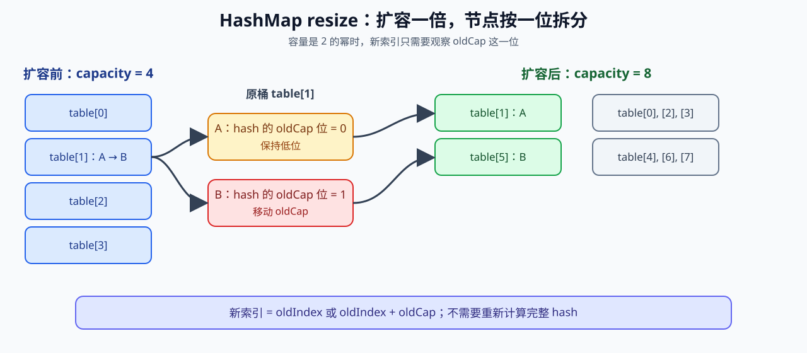

# HashMap 与 Hash 集合

> **P0 · JDK 8+ 实现主线 · 5 分钟复习**

## 面试结论

JDK 8+ 的 HashMap 可以用“Node 数组 + 冲突链 + 条件树化”理解。`put` 先扰动 hash，再用 `(n - 1) & hash` 定位桶；桶内再用 key 的 hash 与 `equals` 判断。容量超过阈值时 resize，扩容通常按低位/高位拆分迁移。



## 面试追问链

```text
HashMap 是什么？
    ↓
如何定位 bucket？为什么容量偏好 2 的幂？
    ↓
冲突如何处理？什么时候树化？
    ↓
resize 如何迁移？为什么不必重新计算完整 hash？
    ↓
equals/hashCode 如何共同判等？
    ↓
为什么 HashMap 不能直接用于并发共享？
```

## HashSet 的增量

HashSet 把元素作为 HashMap 的 key，value 只是占位对象；因此 HashSet 的去重仍然依赖同一套 `equals/hashCode` 契约。LinkedHashSet 再维护顺序链；LinkedHashMap 则在 HashMap 节点上增加双向顺序链。

## 高频坑

- `hashCode` 相同不等于对象相等，也不意味着一定覆盖。
- 可变 key 放入 Map 后修改参与相等性的字段，可能再也找不到。
- `0.75`、树化阈值和具体扩容倍率是实现/版本相关细节，不要当作所有 Map 的 API 契约。
- HashMap、HashSet、LinkedHashMap 都不是自动线程安全容器。

## Deep Dive

- [HashMap](../深度解析/HashMap原理与源码分析.md)
- [Hash 集合契约](../深度解析/Hash集合与equals-hashCode契约.md)
- [HashSet 与 LinkedHashSet](../深度解析/HashSet与LinkedHashSet.md)

## Runnable Example

- [HashMapCollisionDemo.java](../../示例代码/src/main/java/com/xuegucheng/javatechreview/HashMapCollisionDemo.java)
- [对应测试](../../示例代码/src/test/java/com/xuegucheng/javatechreview/HashMapCollisionDemoTest.java)

## 一句话复盘

> HashMap 负责定位和迁移，equals/hashCode 负责逻辑判等；HashSet 只是复用这条链。
