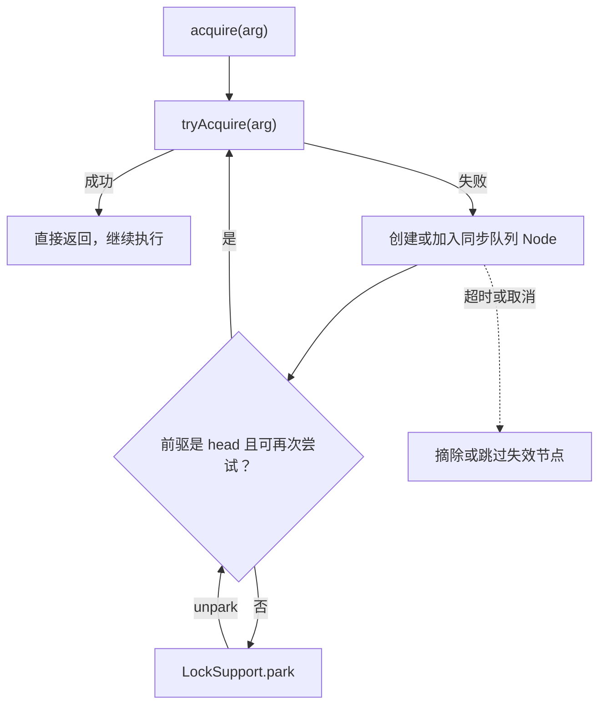

# AQS 核心原理

> 面试定位：Java 同步器的共享骨架与源码主线
> Java 版本：字段、节点和状态命名按 Java 21
> P0/P1：P0
> 前置知识：volatile、CAS、park/unpark 和线程中断
> 本文不负责：复制 AbstractQueuedSynchronizer 全部源码

## AQS 是什么

AQS 是 `AbstractQueuedSynchronizer` 的缩写，是 JDK 提供的同步器骨架。它位于 `java.util.concurrent.locks` 包中，目标不是直接提供一把“万能锁”，而是把多个同步器都会遇到的竞争、排队、阻塞、唤醒和取消流程抽出来复用。

AQS 本身不决定“什么情况下算获取成功”。它把这个问题交给具体同步器的子类；子类定义同步状态 `state` 的含义以及 `tryAcquire`、`tryRelease` 或 shared 版本的成功条件，AQS 再负责把失败线程组织进等待队列，并在状态变化后安排重新竞争。

因此可以先记住这句话：

> AQS 是“同步状态协议 + 阻塞等待框架”的组合。它不是具体锁，也不是存放业务任务的普通队列。

概念图：[AQS 是什么与职责分工 SVG](../03-图示/AQS/AQS是什么与职责分工.svg)。

### 先看最小源码骨架

下面只摘出能说明职责的源码行，完整的入队、取消、唤醒和重试循环不在这里展开。字段与方法名按 Java 21；完整实现可查看 [OpenJDK JDK 21 的 AQS 源码](https://github.com/openjdk/jdk21u/blob/master/src/java.base/share/classes/java/util/concurrent/locks/AbstractQueuedSynchronizer.java)。

首先，AQS 只保存同步状态，并提供原子读写能力；它不解释 `state` 到底代表重入次数、许可数还是计数器：

~~~java
// AQS：保存同步状态，但不规定 state 的业务含义
private volatile int state;

protected final int getState() {
    return state;
}

protected final void setState(int newState) {
    state = newState;
}

protected final boolean compareAndSetState(int expect, int update) {
    return U.compareAndSetInt(this, STATE, expect, update);
}
~~~

其次，AQS 把“什么情况下算获取/释放成功”留给具体同步器子类：

~~~java
// AQS 默认不替子类决定同步语义；具体同步器需要覆盖这些钩子
protected boolean tryAcquire(int arg) {
    throw new UnsupportedOperationException();
}

protected boolean tryRelease(int arg) {
    throw new UnsupportedOperationException();
}

protected int tryAcquireShared(int arg) {
    throw new UnsupportedOperationException();
}

protected boolean tryReleaseShared(int arg) {
    throw new UnsupportedOperationException();
}
~~~

例如，项目中的最小独占同步器只定义“尝试拿到状态”的条件；返回 `false` 后，排队、阻塞和唤醒交给 AQS：

~~~java
static final class Mutex extends AbstractQueuedSynchronizer {
    @Override
    protected boolean tryAcquire(int ignored) {
        if (compareAndSetState(0, 1)) {
            setExclusiveOwnerThread(Thread.currentThread());
            return true;  // 成功：当前线程拿到同步状态
        }
        return false;     // 失败：AQS 接管排队、阻塞和重试
    }
}
~~~

Java 21 中，多个公开获取入口还会汇聚到 AQS 的内部主入口。这里仅保留方法签名，方法体省略：

~~~text
// acquire(...) 内部负责入队、park、唤醒、取消和重新竞争
final int acquire(Node node, int arg,
                  boolean shared, boolean interruptible,
                  boolean timed, long time)
~~~

这几段源码串起来就是 AQS 的边界：子类定义同步语义，AQS 提供状态与等待机制，调用方负责正确配对获取和释放。项目中的可运行版本见 [AqsLockDemo.java](../04-示例代码/src/main/java/com/xuegucheng/javatechreview/concurrency/AqsLockDemo.java)。

## AQS 与具体同步器如何分工

| 层次 | 主要责任 | 典型问题 |
| --- | --- | --- |
| 具体同步器子类 | 解释 `state`，实现获取/释放条件，决定独占或共享协议 | “许可还有多少？”“当前线程能否重入？” |
| AQS | 管理同步队列、节点连接、CAS 竞争、park/unpark、取消和 shared 传播 | “失败线程在哪里等？”“释放后唤醒谁？” |
| 调用方 | 正确配对获取与释放，维护业务条件和异常清理 | “是否 finally 释放？”“条件谓词是否重新检查？” |

常见映射如下：

| 同步器 | AQS 模式 | `state` 的典型含义 |
| --- | --- | --- |
| `ReentrantLock` | exclusive | 当前线程的重入次数 |
| `Semaphore` | shared | 剩余许可数 |
| `CountDownLatch` | shared | 尚未完成的计数 |
| `ReentrantReadWriteLock` | 读 shared、写 exclusive | 读写持有状态的组合编码 |
| `Condition` | 与某把锁绑定的条件等待协议 | 不是独立的锁；节点会在条件队列和同步队列之间转移 |

这也是为什么阅读 AQS 源码时不能只背 `state`：同一个模板在不同同步器里代表不同协议。AQS 负责通用等待机制，子类负责同步语义。

## 先说结论

AQS 的核心可以分成两层：

~~~text
子类同步协议
  ├─ state 的含义
  ├─ tryAcquire / tryRelease
  └─ exclusive / shared 规则

AQS 通用等待机制
  ├─ FIFO 风格的双向同步等待队列
  ├─ CAS 竞争与节点连接
  ├─ LockSupport.park / unpark
  └─ 中断、超时、取消和 shared 传播
~~~

`state` 只是同步状态容器，不直接等于“锁”。只有把它放进具体子类的协议中，才能知道它表示重入次数、许可数、闸门计数还是其他状态。

## 30 秒回答

> 线程先通过 tryAcquire 或 tryAcquireShared 尝试获取同步状态，成功就继续；失败后进入同步队列，在前驱没有释放资格时 park。释放方修改 state，并通过队列协作唤醒后继；被唤醒的线程还要重新竞争。AQS 的 exclusive/shared 是获取协议，不是固定业务含义。Java 21 的 Node 使用 prev、next、waiter、status，不能把 JDK 8 的 waitStatus 字段无版本说明地当作当前实现。head 是队列哨兵或已出队头节点，不等于当前持锁线程。

## 问题：失败获取怎么办

只靠 while 自旋会浪费 CPU，只靠一个全局 wait 集合又难以表达前驱关系、取消和共享传播。AQS 的抽象是：

1. 先快速尝试获取；
2. 失败者加入同步队列；
3. 没有获取资格时 park；
4. 释放或状态传播时 unpark 后继；
5. 被唤醒后重新尝试；
6. 超时、中断或取消时摘除或跳过失效节点。

这是一种阻塞同步器队列，不是拿来存放业务任务的普通 BlockingQueue。

## Java 21 的 AQS 核心字段

通过 Java 21 的类签名可以看到：

- volatile int state；
- volatile Node head；
- volatile Node tail；
- Node.prev 和 Node.next；
- Node.waiter；
- volatile int Node.status；
- WAITING、CANCELLED、COND 等状态常量。

源码阅读时要先确认目标 JDK。JDK 8 资料中常见的 waitStatus、thread 等名称，在 Java 21 中不能直接照抄。

## exclusive 获取路径

图中主线是 `acquire(arg)`（不响应中断），因此使用非限时的 `LockSupport.park`。限时获取变体会使用 `parkNanos`，中断和超时最终还会进入取消或返回路径。JDK 21 里 6 个公开获取入口最终共用同一个 `acquire(node, arg, shared, interruptible, timed, time)` 实现，差异主要由 `shared`、`interruptible` 和 `timed` 参数决定：

独立结构图：[AQS 与 Condition 双队列 SVG](../03-图示/AQS/AQS与Condition双队列.svg)。

| 入口 | interruptible | timed | 中断/超时后的行为 |
| --- | --- | --- | --- |
| `acquire(arg)` | false | false | 忽略中断继续等待，成功后补一次 self-interrupt |
| `acquireInterruptibly(arg)` | true | false | 取消排队节点并抛 InterruptedException |
| `tryAcquireNanos(arg, nanos)` | true | true | 中断抛异常；超时摘除节点返回 false |
| `acquireShared(arg)` | false | false | 忽略中断继续等待，成功后补一次 self-interrupt，并按 shared 协议传播 |
| `acquireSharedInterruptibly(arg)` | true | false | 中断取消排队节点并抛 InterruptedException，成功时按 shared 协议传播 |
| `tryAcquireSharedNanos(arg, nanos)` | true | true | 中断抛异常；超时摘除节点返回 false |

对照阅读时先确认目标方法落在哪一行，再把中断/超时语义叠加到这条主线上。

抽象流程：

~~~text
acquire(arg)
  ↓
tryAcquire(arg)
  ├─ 成功：返回
  └─ 失败：创建或加入 Node
             ↓
        检查前驱和获取资格
             ├─ 可以再次尝试：tryAcquire
             └─ 不能尝试：park
                         ↓
                    被 unpark / 中断 / 超时唤醒
                         ↓
                    重新检查并循环
~~~

AQS 不替子类决定 state 的含义，也不保证每个子类天然公平。公平性通常由子类的 tryAcquire 是否检查队列前驱决定。

## 为什么 state 是 volatile

state 需要在不同线程之间被观察和更新：

- getState 需要看到其他线程释放或修改后的状态；
- setState 需要发布新的同步状态；
- compareAndSetState 需要原子地竞争更新。

volatile 提供观察和顺序边界，CAS 提供条件更新；两者仍然围绕子类定义的状态协议工作。

## 为什么需要双向链表

prev 和 next 不是为了模拟一个普通任务队列，而是为了同步等待管理：

- 找到前驱，判断当前节点何时有资格重新竞争；
- 从 tail 追加等待者；
- 释放时向后寻找可唤醒节点；
- 取消或超时后跳过失效节点；
- 在竞争和并发取消下保持队列连接的可修复性。

取消节点会让队列管理更难。AQS 的清理路径可能延迟处理失效节点，而不是要求所有链路每次都立即完美整理。

## park 与 unpark

park 把持续失败的线程从主动自旋变成阻塞，避免占满 CPU。unpark 给线程一个继续运行的许可，但不保证立即调度，也不保证恢复后直接获得同步状态。

因此“释放锁后 unpark 了线程”不等于“该线程马上执行”，它仍要经过调度和重新竞争。

## shared 模式

exclusive 模式通常一次只允许一个成功者；shared 模式允许多个线程根据 state 和传播规则共同获得资格。Semaphore 的多个 permit、CountDownLatch 的门闩打开都属于 shared 思路。

tryAcquireShared 返回值常用于表达：

- 负数：获取失败；
- 零：当前线程成功但不需要继续传播；
- 正数：成功且可能还有其他共享者可以继续。

具体含义由子类协议决定，不能把返回值当成统一业务数字。

## Condition 为什么有两个队列

Condition.await 的线程不是直接留在同步队列里等待条件：

1. 线程持有独占同步状态；
2. await 把节点放入 Condition 队列；
3. 释放当前线程持有的同步状态；
4. 等待 signal、signalAll、中断或超时；
5. signal 把节点转移到同步队列；
6. 线程重新竞争同步状态；
7. 成功获取后 await 才返回。

这解释了为什么 signal 后线程不能立即继续执行，以及为什么 await 必须在持有锁时调用。

## head 是不是当前持锁线程

不是。head 通常是同步队列的哨兵或最近处理过的头节点，线程信息和同步持有者之间没有这种直接等价关系。ReentrantLock 的 owner 由它自己的同步器语义维护；AQS 队列 head 只描述排队结构。

## Runnable Example

[AqsLockDemo](../04-示例代码/src/main/java/com/xuegucheng/javatechreview/concurrency/AqsLockDemo.java) 用一个极简 Mutex 只实现独占 state：

- state 为 0 表示未持有；
- tryAcquire 用 CAS 抢到 state；
- tryRelease 校验当前持有者并清零；
- acquire/release、排队和 park/unpark 由 AQS 提供。

它是源码阅读示例，不是生产锁实现，没有公平、可中断、超时和完整诊断能力。

## 高频追问

- AQS 是什么？同步器骨架，不是具体锁。
- state 为什么不是锁本身？它只是由子类解释的同步状态。
- tryAcquire 为什么由子类实现？不同同步器的成功条件不同。
- 为什么 park？失败时避免一直占用 CPU。
- unpark 是否等价于立即执行？不等价，仍要调度和重新竞争。
- 为什么不是普通阻塞队列？节点承载的是同步资格、前驱关系和取消传播。
- exclusive/shared 区别？一次独占获取与可传播的共享获取协议。

## 一句话复盘

AQS 的关键不是背一条队列，而是理解 state 如何被子类解释，以及失败线程如何通过队列、park、唤醒和取消完成可复用的同步协议。
