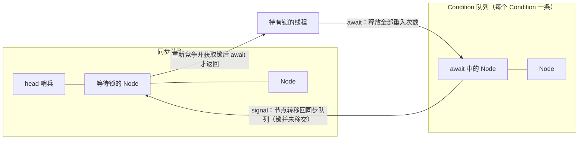

# ReentrantLock 与 Condition

> 面试定位：AQS 在独占锁和条件等待中的落地
> Java 版本：ReentrantLock 与 AQS 关键路径按 Java 21
> P0/P1：P0
> 前置知识：CAS 和线程生命周期；AQS 基本概念见 [AQS 核心原理](AQS核心原理.md)
> 本文不负责：复制全部 Lock API 和完整 ConditionObject 源码

## ReentrantLock 和 Condition 是什么

### ReentrantLock

`ReentrantLock` 是 JDK 提供的显式互斥锁实现。它基于 AQS 的 exclusive 模式，允许同一个线程重复获取同一把锁；每获取一次，重入层级增加一次，必须配对 `unlock` 才能真正释放。

与 `synchronized` 相比，`ReentrantLock` 把获取和释放写进 API，因此可以额外提供可中断获取、限时获取、公平模式和多个 Condition 等能力，但也把释放责任交给调用方。

### Condition

`Condition` 是绑定在某把 Lock 上的条件等待协议，不是另一把锁。它把“等待条件”和“竞争锁”分成两步：`await` 释放当前锁并进入条件队列，`signal` 把节点转移到同步队列，线程重新获取锁后 `await` 才返回。

完整的同步器骨架见 [AQS 核心原理](AQS核心原理.md)；本文只关注它在独占锁和条件等待中的具体落地。

## 先说结论

ReentrantLock 把 AQS 的 state 解释为持有次数：第一次获取把 state 从 0 变为 1，当前持有线程再次获取则递增，unlock 递减到 0 才真正释放。FairSync 和 NonfairSync 的差异主要在首次获取是否优先检查队列前驱。

Condition 把“等待条件”和“锁竞争”分成两个队列。await 释放当前锁并进入条件队列；signal 只是把等待者转移到同步队列，线程还必须重新获得锁才能继续。

## 30 秒回答

> ReentrantLock 基于 AQS 的独占模式，state 表示重入次数，owner 记录当前线程。非公平模式允许新来的线程在某些路径直接竞争，公平模式会检查是否有排在前面的等待者，但公平不是绝对的时间顺序。tryLock 的无参形式即使锁配置为公平，也可能直接插队；需要遵守公平策略时可以使用带超时的 tryLock。Condition.await 需要先持有锁，调用后释放所有重入层级，signal 后节点先回到同步队列，重新获得锁后 await 才返回。

## ReentrantLock 的获取与释放

~~~java
lock.lock();
try {
    update();
} finally {
    lock.unlock();
}
~~~

必须把 unlock 放在 finally。与 synchronized 的结构化释放相比，ReentrantLock 的灵活性换来了手工释放责任。

state 和 owner 的抽象关系：

~~~text
state = 0
  → 第一次获取：owner=currentThread，state=1
  → 同一线程再次获取：state=2、3...
  → 每次 unlock：state--
  → state=0：owner 清空，唤醒后继
~~~

如果其他线程调用 unlock，应该失败；如果少解锁一次，后继线程会长期等待；如果多解锁一次，会抛出 IllegalMonitorStateException。

## FairSync 与 NonfairSync

非公平锁的典型目标是减少排队检查和上下文切换，让刚好到达的线程有机会快速获取。公平锁会在获取路径上考虑已有前驱，降低插队概率，但可能降低吞吐。

公平不等于：

- 等待时间严格排序；
- 没有线程饥饿的绝对证明；
- 业务请求一定按提交时间完成；
- tryLock 无参调用一定排队。

ReentrantLock 的无参 tryLock 明确允许在公平锁上直接尝试获取；需要把等待也纳入公平策略时，使用带时间参数的形式并处理 InterruptedException。

## lock、tryLock、lockInterruptibly

| API | 边界 |
| --- | --- |
| lock | 等待期间不会因 interrupt 提前退出，也不会抛 `InterruptedException`；成功获取后恢复等待期间收到的中断状态 |
| lockInterruptibly | 等待获取期间响应中断，并抛出 `InterruptedException` |
| tryLock | 立即尝试，失败返回 false；无参形式可能插队 |
| tryLock(timeout) | 在时间上限内等待，可响应中断并抛出 `InterruptedException` |
| unlock | 释放一次重入层级，必须由持有线程调用 |

`lock()` 不是“完全不处理中断”：它把中断从控制流中延后处理，先完成获取，再把中断状态补回当前线程；真正把中断作为等待取消点的是 `lockInterruptibly()` 和带超时的 `tryLock`。阅读 AQS 时，这正对应非 interruptible 与 interruptible 获取入口的区别。

超时不是失败后的自动回滚，业务要明确返回、降级或重试策略。

## Condition 的两个队列

Object.wait 只有一个 monitor 等待集合；同一把 ReentrantLock 可以创建多个 Condition：

~~~java
Condition notEmpty = lock.newCondition();
Condition notFull = lock.newCondition();
~~~

典型有界缓冲区可以让生产者等 notFull，让消费者等 notEmpty，避免所有线程被 notifyAll 一起唤醒后再竞争。

await 的关键流程：

1. 检查当前线程是否持有锁；
2. 把节点加入 Condition 队列；
3. 释放所有重入次数；
4. 等待 signal、signalAll、中断或超时；
5. 被 signal 的节点转移到同步队列；
6. 重新获取原来的重入次数；
7. await 返回或抛出中断异常。

signal 不能在不持有锁时调用，因为它需要修改该 Condition 的等待协议；signal 也不直接把锁交给被唤醒线程。

## synchronized + wait/notify 的比较

| 维度 | synchronized + wait/notify | ReentrantLock + Condition |
| --- | --- | --- |
| 锁结构 | 语言内置 monitor | 显式 Lock |
| 条件队列 | 一个隐含等待集合 | 一把锁可有多个 Condition |
| 取消/超时获取 | monitor 获取不可中断 | 可中断、可超时 |
| 释放责任 | 自动 | finally 手工 unlock |
| 误用风险 | 较低 | 忘记 unlock 或条件不匹配 |

选择不是新旧或性能之争，而是协议复杂度是否需要显式能力。

## 关键源码路径

- ReentrantLock.sync：持有的同步器；
- FairSync / NonfairSync：公平与非公平获取入口；
- tryAcquire：重入计数和队列前驱判断；
- tryRelease：减少 state、释放 owner；
- ConditionObject：条件队列、signal 转移和重新获取；
- AQS.acquire / release：通用排队、阻塞和唤醒；
- Java 21 源码对照：[OpenJDK ReentrantLock.java](https://github.com/openjdk/jdk21u/blob/master/src/java.base/share/classes/java/util/concurrent/locks/ReentrantLock.java)。

## Runnable Example

[AqsLockDemo](../04-示例代码/src/main/java/com/xuegucheng/javatechreview/concurrency/AqsLockDemo.java) 是教学级独占同步器；它帮助理解 state、tryAcquire 和 tryRelease，不提供 ReentrantLock 的完整能力。

## 高频追问

- state 如何表示重入次数？每次同线程获取递增，每次 unlock 递减。
- 公平锁公平在哪里？获取路径会考虑已有排队前驱。
- 公平锁是不是绝对公平？不是，调度、取消、tryLock 和执行时机仍会影响。
- tryLock 为什么可能破坏公平？无参 tryLock 直接尝试，不遵守公平排队。
- await 为什么释放锁？让其他线程进入临界区改变条件。
- signal 后为什么不能继续？被唤醒线程先进入同步队列，必须重新获取锁。

## 一句话复盘

ReentrantLock 把 AQS 的 state 变成重入次数，Condition 把条件等待与锁竞争分层；灵活性越高，释放、取消和条件谓词的工程责任越明确。
