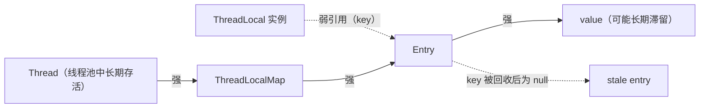

# ThreadLocal 原理与内存泄漏

> 面试定位：线程隔离、ThreadLocalMap 和线程池清理责任
> Java 版本：ThreadLocalMap 结构重点按 Java 21
> P0/P1：P0
> 前置知识：线程池、弱引用、开放寻址和对象生命周期
> 本文不负责：GC 算法和所有引用类型的完整教程

## 先说结论

ThreadLocal 不是把 value 存在 ThreadLocal 对象里，而是让当前 Thread 通过自己的 ThreadLocalMap 按 ThreadLocal key 找到 value：

~~~text
Thread
  ↓
ThreadLocalMap
  ↓
Entry[]：WeakReference<ThreadLocal<?>> key + strong value
~~~

key 被 GC 后，Entry 可能变成 stale，但 value 仍由线程强引用。ThreadLocalMap 只会在后续访问、设置、删除或扩容路径中机会式清理，因此线程池长期复用线程会放大泄漏和请求数据残留风险。正确边界是 try/finally/remove。

## 30 秒回答

> ThreadLocal 为每个线程提供一份独立值，数据实际放在 Thread 的 ThreadLocalMap 中。Map 的 Entry 继承 WeakReference，key 是弱引用，value 是强引用；key 被回收后 value 不会因此立刻消失。ThreadLocalMap 会在部分操作中清理 stale entry，但不能替代显式 remove。在线程池里工作线程长期存活，任务结束后如果不清理，既可能保留大对象，也可能让下一个任务读到上一个请求的数据。set(null) 只是把 value 设为空，通常仍保留 entry，不等于 remove。

## 为什么需要 ThreadLocal

共享参数逐层传递有时会让接口污染，完全共享又需要同步。ThreadLocal 适合把“当前执行上下文”绑定到线程，例如：

- 请求追踪上下文；
- 事务或租户上下文的教学示例；
- 只读格式化器或解析状态；
- 线程内复用且不能跨线程共享的临时对象。

它不是跨线程传递方案，也不是自动生命周期管理器。异步切换线程、线程池提交和 CompletableFuture 链路都要重新设计上下文传播。

## Java 21 的实际结构

Java 21 的 Thread 包含 threadLocals 字段，类型是 ThreadLocal.ThreadLocalMap。ThreadLocalMap 内部有 table、size、threshold；Entry 继承 WeakReference<ThreadLocal<?>>，额外持有 Object value。

这意味着引用方向是：

~~~text
Thread → ThreadLocalMap → Entry → value
             ↑
      Entry 弱引用 ThreadLocal key
~~~

ThreadLocal 本身不反向拥有所有线程中的值。一个 ThreadLocal key 可能被回收，但存活的 Thread 仍然可以通过 map 持有 value。

GC 根指向 Thread，Thread 强引用链 ThreadLocalMap → Entry → value；key 一侧只剩弱引用，回收后 Entry 变 stale，value 是否滞留取决于后续是否触清理。

## 为什么不是 HashMap

ThreadLocalMap 是 ThreadLocal 专用的轻量结构，使用数组和开放寻址，而不是 HashMap 的桶、链表和树：

- key 的身份就是 ThreadLocal 对象，不需要通用 Map API；
- 每个线程只访问自己的 map，不需要 map 级并发安全；
- 采用开放寻址和线性探测减少节点对象；
- stale entry 的发现和清理可以嵌入 get、set、remove 和 rehash。

ThreadLocal 的 hashCode 使用递增的探测增量，目的是让连续创建的 key 在数组中分布得更均匀；这不改变 key 的对象身份语义。

## 开放寻址与 stale entry

发生 hash 冲突时，ThreadLocalMap 沿数组继续探测：

~~~text
初始槽位
  ↓ 冲突
下一个槽位
  ↓ 仍冲突
继续线性探测
  ↓
找到相同 key、空槽或 stale entry
~~~

stale entry 是 key 已经被 GC 的 entry。set 一个新 key、get 一个已有 key、remove 或 rehash 时，代码可能顺便清理相邻 stale entry，但清理不是后台定时任务，也不是每次都全表扫描。

## key 弱引用为什么仍然可能泄漏

假设：

1. 线程池工作线程长期存活；
2. 任务创建了一个临时 ThreadLocal；
3. 任务结束后没有 remove；
4. 临时 ThreadLocal 没有其他强引用，被 GC；
5. ThreadLocalMap 的 Entry key 变成 null；
6. value 仍然由存活线程的 map 强引用。

如果线程之后很少访问该槽位，value 可能长时间保留。这是“弱 key + 强 value + 长生命周期线程”的组合风险。

ThreadLocal 泄漏之外还有数据串用风险：如果 key 仍然存活或业务使用固定静态 ThreadLocal，但任务不覆盖旧值，下一个请求可能读取上一个请求的数据。

## remove、set(null) 和 finally

推荐：

~~~java
try {
    requestContext.set(context);
    process();
} finally {
    requestContext.remove();
}
~~~

set(null) 通常只修改 Entry 的 value，key 和槽位仍在 map 中；remove 会删除 entry 并触发必要的探测修复和清理。因此二者不是完全等价的资源释放操作。

## 线程池为什么放大问题

new Thread 任务结束后线程也结束，ThreadLocalMap 随线程失去根引用；线程池线程则会不断接收新任务。把 ThreadLocal 当作“请求级变量”时，必须把生命周期绑定到任务，而不是绑定到线程：

~~~text
任务开始 → set
任务执行 → get
任务结束 → finally remove
线程继续复用
~~~

如果任务跨越异步执行器，ThreadLocal 也不会自动复制到新线程。需要显式传参、上下文装饰器或选择支持上下文传播的框架能力，并清楚传播和清理的代价。

## 关键源码路径

- Thread.threadLocals：值的实际归属；
- ThreadLocal.get/set/remove：当前线程 map 的访问；
- ThreadLocalMap.getEntry：命中和线性探测；
- replaceStaleEntry、expungeStaleEntry、cleanSomeSlots：stale 清理；
- rehash、resize：负载过高时的整理；
- Entry：弱 key 和强 value 的连接点。

## 工程边界

- 只在确实需要线程隔离时使用，不用它隐藏大量业务依赖；
- 所有任务级上下文都在 finally 中 remove；
- 不在线程池中保存请求级大对象；
- 不把 ThreadLocal 当作跨线程上下文传递机制；
- 使用静态 ThreadLocal 时尤其要定义类卸载和清理边界；
- 监控线程池线程存活、任务上下文大小和请求数据串用。

## Runnable Example

[ThreadLocalCleanupDemo](../04-示例代码/src/main/java/com/xuegucheng/javatechreview/concurrency/ThreadLocalCleanupDemo.java) 使用单线程执行器验证 set/remove 后的后继任务看不到前一个任务的值，不通过分配巨大对象或依赖 GC 来证明泄漏。

## 高频追问

- key 为什么弱引用？降低 ThreadLocal key 本身造成长期持有的风险。
- key 弱引用为什么还会泄漏？value 仍由长期存活的 Thread 强引用。
- ThreadLocalMap 为什么不用 HashMap？线程私有、开放寻址和专用清理语义更合适。
- set(null) 与 remove 一样吗？不完全一样，remove 才是删除 entry 的清理语义。
- 线程池如何避免泄漏？把 set 和 remove 放在同一任务的 try/finally。

## 一句话复盘

ThreadLocal 把共享问题转成线程生命周期问题；在线程池里，remove 不是可选优化，而是任务边界的一部分。
