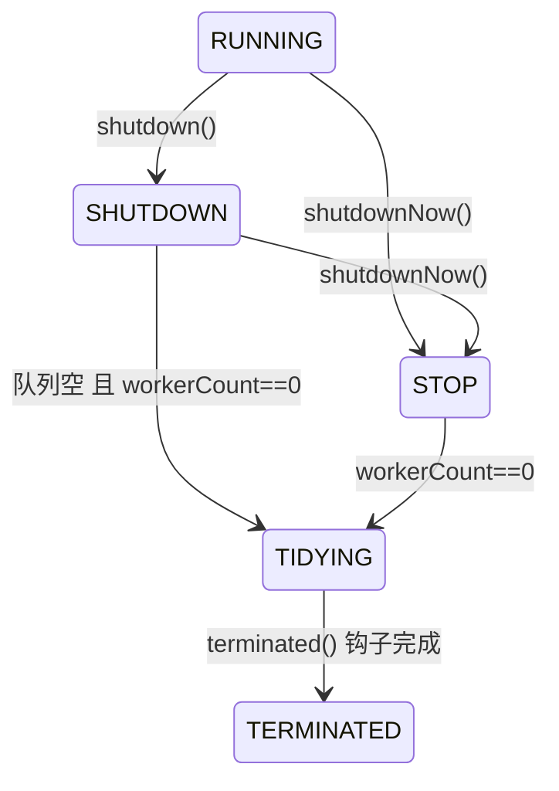
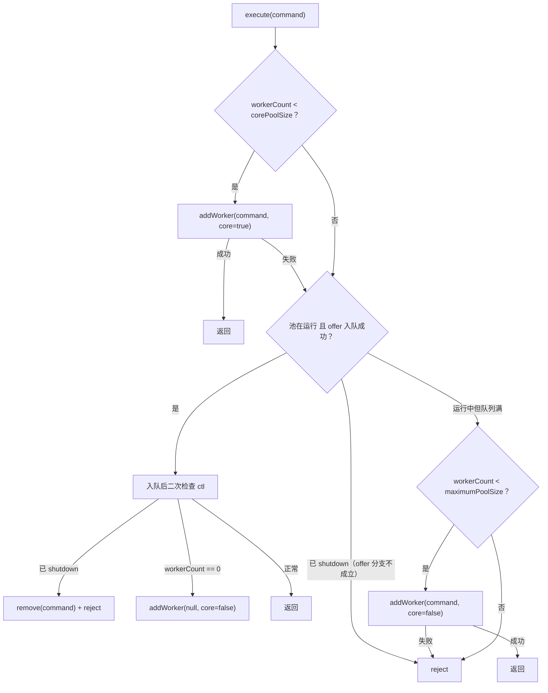

# ThreadPoolExecutor 线程池

> 面试定位：execute 决策、容量控制、拒绝和关闭
> Java 版本：核心实现路径按 Java 21
> P0/P1：P0
> 前置知识：线程生命周期、阻塞队列和中断
> 本文不负责：逐位展开 ctl 的所有常量计算

## ThreadPoolExecutor 是什么

如果每个任务都直接创建一个平台线程，任务突发时线程数量、创建成本、上下文切换和下游压力都会失去统一控制。线程池把“线程复用”和“任务排队”组合成一个有状态的执行器：提交者只提交任务，线程池负责决定由哪个 Worker 执行、是否排队、是否扩容以及过载时如何处理。

它解决的不是“让任务自动变快”，而是把线程数量、队列容量、任务执行和拒绝策略放进同一个容量协议中。理解这个协议，才知道 `corePoolSize`、`maximumPoolSize` 和 `workQueue` 为什么不能孤立配置。

## 先说结论

ThreadPoolExecutor 把运行状态和 worker 数量压缩在 ctl 中，用 Worker 集合、BlockingQueue 和拒绝策略共同管理任务。execute 的主线是核心线程、队列和最大线程，但每一步都要和线程池运行状态竞争，入队之后还会二次检查。

## 30 秒回答

> execute 首先尝试在 workerCount 小于 corePoolSize 时创建核心 Worker；否则尝试把任务放进 workQueue。入队成功后还要再次检查线程池是否仍在运行，并确认至少有 Worker 能处理队列；如果队列满且 workerCount 小于 maximumPoolSize，才创建非核心 Worker；否则执行拒绝策略。无界队列会让 maximumPoolSize 很难生效，CallerRunsPolicy 可以形成反压但会拖慢提交线程。shutdown 不接收新任务并处理已入队任务，shutdownNow 只尝试中断，不保证强制结束。

## ctl 的设计思想

ThreadPoolExecutor 用一个 AtomicInteger ctl 同时编码：

~~~text
高位：runState
低位：workerCount
~~~

这样可以用一次 CAS 同时观察或修改运行状态与 worker 数量，减少两个字段分别更新时的竞态窗口。面试重点是“状态和数量需要原子协调”，不必把每一位常数全部背下来。

常见运行状态与触发条件：

shutdown() 触发 RUNNING → SHUTDOWN；shutdownNow() 可从 RUNNING 或 SHUTDOWN 进入 STOP，随后中断 Worker 并调用 drainQueue() 清空等待队列。进入 TIDYING 的判断在 tryTerminate 中：SHUTDOWN 要求队列和 worker 都为空，STOP 只要求 worker 为零；TIDYING 时调用 terminated() 钩子，完成后进入 TERMINATED。

SHUTDOWN 仍可处理队列任务；STOP 不再处理队列，并尝试中断正在运行的任务。

## execute 的关键路径

注意 offer 失败的两条出路语义不同：池已 shutdown 时 addWorker 的状态预检直接返回 false（不会创建新 Worker），任务走拒绝；池在运行且仅因队列满而 offer 失败时，才轮到 maximumPoolSize 判断。

图示：[ThreadPoolExecutor 执行与状态 SVG](../03-图示/ThreadPoolExecutor/ThreadPoolExecutor执行与状态.svg)。

~~~text
1. workerCount < corePoolSize？
   是 → addWorker(command, true)
   否 → 进入队列判断

2. workQueue.offer(command)？
   是 → 重新检查 runState
        已关闭 → remove(command) + reject
        没有 worker → addWorker(null, false)
   否 → 继续判断

3. workerCount < maximumPoolSize？
   是 → addWorker(command, false)
   否 → reject
~~~

二次检查是重点：任务刚入队，shutdown 可能已经发生。若只记第一眼的“入队成功”，就会漏掉关闭竞争和无人消费队列的情况。

### `execute` 的 Java 21 教学剥离版

> 下面按 Java 21 的 `execute` 主线改写为教学版本，保留三步决策和入队后的二次检查；它不是可直接替换的 OpenJDK 源码复制，省略了字段访问、并发重试和实现防御细节。
>
> 源码对照：[OpenJDK JDK 21 ThreadPoolExecutor.java](https://github.com/openjdk/jdk21u/blob/master/src/java.base/share/classes/java/util/concurrent/ThreadPoolExecutor.java)

~~~java
public void execute(Runnable task) {
    if (task == null) throw new NullPointerException();

    int snapshot = ctl.get();
    if (workerCountOf(snapshot) < corePoolSize) {
        if (addWorker(task, true)) return;       // 第一选择：核心 Worker
        snapshot = ctl.get();                    // 创建失败，重新观察状态
    }

    if (isRunning(snapshot) && workQueue.offer(task)) {
        int recheck = ctl.get();                 // 入队后必须二次检查
        if (!isRunning(recheck) && remove(task)) {
            reject(task);                        // 关闭竞争：移出并拒绝
        } else if (workerCountOf(recheck) == 0) {
            addWorker(null, false);              // 队列有人但没有消费者
        }
    } else if (!addWorker(task, false)) {
        reject(task);                             // 队列满且无法扩到最大值
    }
}
~~~

源码阅读时把它压缩成一句话：先补核心线程，再尝试入队，入队后重新确认池状态；只有运行中且队列满，才尝试创建非核心线程，最后才进入拒绝策略。`addWorker` 的状态预检也意味着关闭后的任务不会因为“队列满”而偷偷创建新 Worker。

### Worker 为什么继承 AQS

Java 21 的 `ThreadPoolExecutor.Worker` 继承 AQS，但它不是用 AQS 实现线程池主锁，而是把自己当成一个简单的独占锁：Worker 正在执行任务时持有这个锁，空闲等待任务时通常不持有。线程池的 `interruptIdleWorkers` 可以先 `tryLock`，成功说明 Worker 没有执行任务，才允许中断它；正在执行任务的 Worker 获取失败，因此不会被“空闲线程清理”路径误伤。

~~~java
private final class Worker
        extends AbstractQueuedSynchronizer implements Runnable {
    Worker(Runnable firstTask) {
        setState(-1);                    // 启动前先禁止中断
        this.firstTask = firstTask;
        this.thread = threadFactory.newThread(this);
    }

    protected boolean tryAcquire(int ignored) {
        if (!compareAndSetState(0, 1)) return false;
        setExclusiveOwnerThread(Thread.currentThread());
        return true;                      // Worker 进入“执行中”
    }

    protected boolean tryRelease(int ignored) {
        setExclusiveOwnerThread(null);
        setState(0);
        return true;                      // Worker 回到可被检查状态
    }

    public void run() { runWorker(this); }
}
~~~

`runWorker` 启动任务循环前会先解开 Worker 的启动保护状态，执行每个任务前再持有这个 Worker 锁，任务结束后释放。这个 AQS 用法的价值是表达“空闲”和“执行中”的边界，而不是给每个任务再加一把业务锁；它也解释了为什么 `Worker` 的 lock 状态与线程池的 `mainLock`、workQueue 不能混为一谈。

## Worker、runWorker 与 getTask

Worker 负责把一个任务交给工作线程执行，并维护 worker 生命周期。runWorker 会循环从初始任务或 getTask 获取任务：

~~~text
Worker.run
  → runWorker
      → beforeExecute
      → task.run
      → afterExecute
      → getTask
      → 退出或继续
~~~

getTask 会考虑队列是否为空、线程池状态、keepAliveTime 和是否允许核心线程超时。Worker 异常退出后，ThreadPoolExecutor 还要判断是否补充 Worker，避免核心容量悄悄下降。

## 队列如何影响 maximumPoolSize

使用有界队列时，核心线程被占用、队列满后，maximumPoolSize 才有机会创建非核心线程。使用无界队列时，offer 通常一直成功，线程池会优先堆积任务而不是创建更多 Worker，所以 maximumPoolSize 可能基本不生效。

队列不是越大越好：

- 队列大可以吸收短时突发；
- 队列无限大可能把过载变成高延迟和 OOM；
- 队列太小会更快触发拒绝；
- 队列容量应和任务耗时、上游速率、下游承载和可接受延迟一起设计。

## 四种拒绝策略

| 策略 | 行为 | 适用边界 |
| --- | --- | --- |
| AbortPolicy | 抛出异常 | 希望调用方显式感知失败 |
| CallerRunsPolicy | 调用线程执行 | 需要简单反压，且调用线程可承受 |
| DiscardPolicy | 静默丢弃 | 只有明确允许丢弃时使用 |
| DiscardOldestPolicy | 丢弃队头后重试 | 只适合旧任务确实价值更低的队列 |

拒绝不是异常处理的末端，而是容量模型的一部分。线上要记录拒绝量、队列长度、活跃线程、任务等待时间和下游超时。

还有一个容易忽略的边界：线程池已经 shutdown 后再提交任务，CallerRunsPolicy 会检查运行状态，发现池已关闭时直接丢弃任务、不执行也不抛异常；只有 AbortPolicy 会以 RejectedExecutionException 显式失败。关闭期仍可能来任务的服务，要显式处理这个静默丢弃窗口。

## execute、submit 与异常

execute 接收 Runnable，任务异常可以到达执行线程的 UncaughtExceptionHandler；submit 把任务包装成 FutureTask，异常通常保存在 Future 中，调用方必须通过 get 观察。

~~~text
execute → 直接执行 Runnable → 异常走线程边界
submit  → FutureTask → 异常存入 Future → get 时重新抛出
~~~

“线程池吃掉异常”常常是调用方提交了 submit 却没有 get，也可能是任务内部自行捕获后没有记录。

## shutdown 与 shutdownNow

- shutdown：停止接收新任务，继续处理已提交任务；
- shutdownNow：尝试中断工作线程，返回尚未开始的队列任务；
- interrupt 仍然是协作式的，任务如果吞掉中断或卡在不可中断外部调用，不会立即停止；
- 关闭后要 awaitTermination，并对超时、未完成任务和资源清理做处理。

## 线程数配置

CPU 密集和 I/O 密集不能用一个绝对公式解决。CPU 核数只是初始估计，还要结合：

- 任务实际 CPU 时间与等待时间；
- CPU 利用率和上下文切换；
- p95/p99 RT；
- 外部连接池、数据库、下游限流；
- 队列等待和拒绝；
- 压测中的吞吐、错误率和资源曲线。

线程池的隔离通常比一个全局大池更重要：不同优先级、不同下游和不同耗时模型的任务应避免互相拖垮。

## 关键源码路径

- ctl、runStateOf、workerCountOf：状态与数量的组合；
- execute：核心决策和二次检查；
- addWorker：创建核心/非核心 Worker；
- Worker.run、runWorker：任务执行和异常边界；
- getTask：队列等待、keepAlive 和退出；
- reject、shutdown、shutdownNow：容量和生命周期。

## Runnable Example

[ThreadPoolSaturationDemo](../04-示例代码/src/main/java/com/xuegucheng/javatechreview/concurrency/ThreadPoolSaturationDemo.java) 用小核心数、小最大数和有界队列稳定展示 CallerRunsPolicy 反压。

## 高频追问

- 为什么不直接用两个字段表示状态和 workerCount？需要原子协调状态转换和数量变化。
- LinkedBlockingQueue 无界时 maximumPoolSize 生效吗？通常很难生效，因为任务先持续入队。
- newFixedThreadPool 为什么可能 OOM？默认无界队列会无限堆积任务。
- CallerRunsPolicy 为什么是反压？提交线程被任务占用，提交速率被迫下降。
- shutdownNow 能强制停任务吗？不能，只是尝试 interrupt。
- 线程池异常为什么消失？submit 未 get，或任务捕获异常后未传播。

## 一句话复盘

线程池是一个有状态的容量控制器，execute 的二次检查、队列边界、拒绝、取消和下游隔离比背线程数公式更重要。
