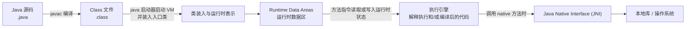

# JVM 执行模型与运行时数据区

> **P0 · Java 21 / JVMS 21 · 约 12 分钟**
>
> **一句话结论：** JVMS 定义程序运行期间的抽象数据结构和语义：Heap、Method Area 在 JVM 线程间共享；pc Register、JVM Stack 按线程创建；每次方法调用对应一个 Stack Frame。物理布局、对象表示和优化属于具体 JVM 实现。

本篇是 04-JVM 第一个运行时模型 Owner。配套资源：[执行模型 Mermaid](#先看程序怎样进入-jvm)、[运行时数据区 SVG](../03-图示/JVM/JVM运行时数据区.svg)、[面试速记](../01-面试速记/JVM核心模型与运行时数据区.md)。

## 30 秒口述

> 如果从 JVMS 的 Runtime Data Areas 来说，运行时数据区分为共享和线程私有两类：Heap 与 Method Area 在 JVM 线程间共享；每个线程有自己的 pc Register 和 JVM Stack，栈里按每次方法调用创建 Frame。Method Area 是规范中的逻辑区域，每个类或接口还有自己的 Run-Time Constant Pool。Java 21 HotSpot 把类元数据放在本地内存管理的 Metaspace，但它不等于 Method Area；DirectByteBuffer 的内容可能位于普通 GC 堆外，也不是 JVMS 单列的运行时区。运行时区域讲结构和生命周期，JMM 讲并发读写的可见性与顺序。

先回答抽象模型，再说明实现边界。不要把“方法区就是元空间”或“对象都在栈/堆上”当成物理布局结论。

## 先看程序怎样进入 JVM

传统构建和启动路径可以简化为：



- javac 是把源文件编译为 class 文件的 JDK 工具，不是 JVM 的运行时区域。
- java 启动器启动 JVM、装入指定入口类并调用 main；Java 21 也支持单源文件启动模式，因此图展示的是常见构建路径。
- 类装入、连接和初始化按运行需要发生；图中的类装入是概览，生命周期细节由后续 Class Loading Owner 负责。
- JVMS 规定抽象机器要表现出的行为，但不规定这些结构必须连续排列，也不要求使用某种解释器、JIT 编译器或本地数据结构。

## Runtime Data Areas：按生命周期看

JVMS §2.5 定义多个运行时数据区。有的在 JVM 启动时建立并在 JVM 结束时销毁，有的随线程创建并在线程结束时销毁。这个分类说明结构归属和生命周期，不是线程安全保证，也不是物理地址布局。

| 区域 | 生命周期 / 共享性 | 主要职责 |
| --- | --- | --- |
| Heap | JVM 级；所有 JVM 线程共享 | 为类实例和数组提供运行时分配区域，由自动存储管理机制回收。 |
| Method Area | JVM 级；所有 JVM 线程共享 | 保存每类结构，如运行时常量池、字段/方法数据和方法代码等；规范不指定其物理位置和管理策略。 |
| pc Register | 每个 JVM 线程各自拥有 | 对非 native 当前方法，记录当前正在执行的 JVM 指令位置；执行 native 方法时其值未定义。 |
| JVM Stack | 每个 JVM 线程各自拥有 | 保存方法调用的 Frames；局部变量、部分计算结果和调用/返回状态归属当前 Frame。 |
| Run-Time Constant Pool | 每个类或接口各自拥有 | Class File constant_pool 的运行时表示；由 JVMS 归入 Method Area。 |
| Native Method Stack | 视 JVM 实现而定；若提供通常按线程分配 | 可用于支持 native 方法或解释器实现；JVMS 允许实现不提供这类栈。 |

Heap 容纳不同线程可能共同引用的实例；Method Area 保存多个线程执行类代码时需要的每类结构；pc 和 JVM Stack 保存某一个线程此刻的指令位置与调用现场。Run-Time Constant Pool 是 Method Area 内按类/接口划分的逻辑结构，不是单独的全局区。

### 为什么线程私有不代表所指对象也私有

局部变量和方法参数属于各自线程的 Frame；它们保存的 reference 却可能指向 Heap 中同一个对象：

```text
Thread A 的 Frame: user ── reference ──┐
                                        ├──> Heap 中同一个 User 实例
Thread B 的 Frame: cachedUser ── reference┘
```

栈帧按线程隔离，引用目标仍可由多个线程共享。反过来，Heap 是共享区域也不意味着每个对象都被多线程访问。是否存在数据竞争、哪些写入可见，属于 JMM 与同步协议的问题，不由区域共享性直接推出。

## 一个方法执行时：调用就是创建 Frame

JVM Stack 是每线程的 Frame 序列。调用方法时创建并压入新 Frame；调用返回，或以未捕获异常结束时，当前 Frame 随该次调用完成而销毁。当前正在执行的方法对应当前 Frame。

```text
Thread
└── JVM Stack
    ├── Frame: caller()
    ├── Frame: service()
    └── Frame: current()  ← 当前调用
```

JVMS 规定每个 Frame 有自己的：

- **Local Variables**：局部变量数组，也用于保存方法参数。reference 类型槽位保存引用值，不是被引用对象本体。
- **Operand Stack**：字节码指令暂存和消费操作数的栈。
- **Run-Time Constant Pool reference**：指向当前方法所属类或接口的运行时常量池，支持符号引用解析等动态链接工作。
- **调用完成所需状态**：Frame 还承担方法返回值传递和异常分派等职责。这些能力不代表规范规定了固定字段布局。

示意代码：

```java
User user = new User();
use(user);
```

在 JVMS 抽象模型中，当前 Frame 的 Local Variables 保存局部变量 user 的引用值；Heap 是类实例和数组的运行时分配区域，User 实例按这个抽象模型归属 Heap；User 的每类字段/方法等结构归入 Method Area 的概念范围。引用位置和对象内容是两件事。

不能因此推导“对象都会物理分配在 Heap”。JVMS 不规定对象内部表示。Java 21 HotSpot 的逃逸分析可以让某些可标量替换的分配从生成代码中消失；这是优化后的机器代码不再需要那次对象分配，不是把对象搬到了 JVM Stack。只有语义允许时，优化才能不改变程序可观察行为。本篇仅立此边界，逃逸分析和对象布局由后续 Owner 深入。

## Method Area 与 HotSpot Metaspace

### 先分清规范词与实现词

- **Method Area 是 JVMS 的逻辑区域。** 它在线程间共享，承载每类运行时结构，例如 Run-Time Constant Pool、字段/方法数据及方法代码等。
- JVMS 说明 Method Area 在逻辑上属于 Heap，但不强制其物理位置、是否整理或具体管理方法。“逻辑上”不能直接等同于 HotSpot 普通对象堆里的连续区域。
- **Metaspace 是 HotSpot 管理类元数据的实现机制。** Java 21 HotSpot 的类元数据分配在本地内存中；这个物理管理事实不代表所有 JVM 必须有 Metaspace。
- HotSpot 曾使用 PermGen 管理相关类元数据；JDK 8 移除了 PermGen，类元数据改为在本地内存分配。这是 HotSpot 的演进史，不代表规范中的 Method Area 改名为 Metaspace。
- Method Area 和 Metaspace 所处抽象层不同，不能说成完全等价的一一映射。本篇不把每个 JVMS 概念强行映射到 HotSpot 的内部子结构。

> **面试纠错框**
>
> 不说“Java 8 后方法区变成元空间”。应说：“Method Area 是 JVMS 定义的逻辑运行时区域；Metaspace 是 Java 8 以后 HotSpot 用于类元数据的本地内存管理机制。规范概念和具体实现不能互换。”

HotSpot 的 Metaspace、类卸载与本地内存诊断由 P1 Owner“Metaspace与类卸载.md”负责；本篇只建立边界。

## Run-Time Constant Pool 与另外两种“常量池”

至少分开记住下面三层：

| 名称 | 所属层次 | 本篇要记住什么 |
| --- | --- | --- |
| Class File constant_pool | 二进制 class 文件结构 | 记录数字/字符串常量、类名、字段/方法符号等条目。 |
| Run-Time Constant Pool | JVMS 运行时结构 | 每个类或接口各有一个；它是对应 Class File constant_pool 的运行时表示，JVMS 将其分配在 Method Area。符号引用可在运行时解析。 |
| String.intern 的字符串池 | Java SE String API 的驻留语义 | String 类维护自己的字符串池；字符串字面量和字符串常量表达式会被驻留。它不是每类的 Run-Time Constant Pool 的别名，也不是 JVMS §2.5 单列的区域。 |

概念路径是：

```text
class 文件的 constant_pool 表
        ↓ JVM 创建该类或接口的运行时表示
该类或接口自己的 Run-Time Constant Pool
        ↓ 运行时按需解析其中的符号引用
```

Runtime Constant Pool 不是“JVM 全局常量池”，也不是“字符串池”的另一个名字。

## Direct Memory：进程视角里的边界项

Direct Memory 不是 JVMS §2.5 列出的 Runtime Data Area。不要把它和 Heap、JVM Stack、Method Area 画在同一个规范层级。

```text
JVMS Runtime Data Areas（规范抽象）
  ├── Heap
  ├── Method Area
  ├── pc Register / JVM Stack（按线程）
  ├── 每类的 Run-Time Constant Pool
  └── Native Method Stack（实现可选）

HotSpot / OS 进程内存视角（实现与平台相关）
  ├── 类元数据管理（Metaspace）
  ├── DirectByteBuffer 的内容存储（可能在普通 GC 堆外）
  ├── Code Cache
  └── 其他本地内存结构
```

下方清单只是两个不同视角的边界示意，不是 HotSpot 全部本地内存的完整账本：

- ByteBuffer 对象本身是 Java 对象；Java 21 ByteBuffer API 只保证 direct buffer 的内容**可能**位于普通 GC 堆之外，并说明它通常有较高的分配和释放成本。不要说每个 direct buffer 必然使用同一种物理分配方式。
- Metaspace 和 Code Cache 是 HotSpot 实现中的例子；它们不因此成为 JVMS §2.5 的区域。
- Native Memory Tracking 等工具属于后续诊断主题，本篇不解释其范围和命令。

## Runtime Data Areas 与 JMM 不是同一个模型

| 对比 | Runtime Data Areas | Java Memory Model（JMM） |
| --- | --- | --- |
| 回答的问题 | 执行期间有哪些运行时结构、各自如何归属线程以及生命周期如何 | 多线程读写共享变量时的可见性、顺序及原子性语义 |
| 主要依据 | JVMS §2.5、§2.6 | JLS §17，尤其 §17.4 |
| 代表性词汇 | Heap、Method Area、pc Register、JVM Stack、Frame | shared variables、synchronization actions、happens-before |
| 本篇职责 | 解释运行时区域及概念边界 | 不重复讲解 |

**Runtime Data Areas ≠ JMM。** JMM 的抽象不能直接画成 Heap/Stack/Method Area 图。共享变量语义、happens-before、安全发布和 volatile 规则只有一个 Owner：[Java 内存模型与 happens-before](../../03-并发编程/02-深度解析/Java内存模型与happens-before.md)。

## 错误模型快速纠正

| 容易说错 | 更准确的说法 |
| --- | --- |
| “方法区就是元空间。” | Method Area 是规范逻辑区域；Metaspace 是 Java 21 HotSpot 的类元数据管理实现。 |
| “Java 8 后方法区改名为元空间。” | HotSpot 移除了 PermGen 并改用本地内存分配类元数据；规范术语未改名。 |
| “局部变量都在栈上，所以对象在栈上。” | Frame 的 Local Variables 保存局部变量值；reference 与对象本体是不同东西。 |
| “对象要么在栈上，要么一定在堆上。” | JVMS 有抽象 Heap 模型，HotSpot 优化也可能消除可替换的分配；不能说逃逸对象被搬到栈上。 |
| “Direct Memory 是 JVM 的一个内存区域。” | DirectByteBuffer 内容可能使用普通 GC 堆外内存；Direct Memory 不在 JVMS §2.5 区域列表中。 |
| “常量池就是字符串池。” | Class File constant_pool、每类 Run-Time Constant Pool 与字符串驻留机制应分别辨认。 |
| “共享区都是线程安全的”或“线程私有数据无法关联共享对象”。 | 区域归属不能代替并发安全推理；线程私有 reference 可以指向多线程共同访问的 Heap 对象。 |
| “JVM 内存结构就是 JMM。” | 前者描述运行时结构，后者描述并发内存语义。 |

## StackOverflowError 与 OutOfMemoryError：只划清边界

这些错误有规范层面的触发边界，但完整诊断属于后续 Owner：

| 条件 | JVMS 关联的错误 |
| --- | --- |
| 线程计算需要的 JVM Stack 超过允许大小 | StackOverflowError |
| Native Method Stack（若实现提供）需要超过允许大小 | StackOverflowError |
| 新线程的栈无法建立，或可扩展的栈无法继续扩展 | OutOfMemoryError |
| Heap、Method Area 或构造 Run-Time Constant Pool 所需内存无法满足 | OutOfMemoryError |

因此不能把 StackOverflowError 简化成“局部变量太多”，也不能把所有 OutOfMemoryError 都归因于 Java Heap。本篇只讲结构关联，不进入故障分析。

## 常见追问链

从“JVM 内存结构是什么”按概念依赖展开：

1. 哪些运行时区域 JVM 线程共享，哪些按线程创建？
2. 一次方法调用在 JVM Stack 中发生什么？
3. Frame 的 Local Variables 保存 User 对象本体还是 reference？
4. reference 指向的对象在 JVMS 抽象模型中属于哪类区域？
5. Method Area 的规范职责是什么，为什么不能直接等同 Metaspace？
6. Run-Time Constant Pool 是全局一份还是每个类/接口一份？
7. DirectByteBuffer 的内容是不是 JVMS Runtime Data Area？
8. 运行时结构共享与 JMM 的共享变量语义有什么区别？
9. 栈空间不足为何可能对应 StackOverflowError 或 OutOfMemoryError？

StackOverflowError、不同来源的 OutOfMemoryError 只在此建立入口，不做分类诊断；细节由 JVM 诊断和故障排查 Owner 负责。

## 2 分钟展开版

> 我会先区分 JVMS 抽象和具体 JVM 实现。按 JVMS 21，Heap 与 Method Area 是所有 JVM 线程共享的运行时区域；每个线程有自己的 pc Register 和 JVM Stack，Native Method Stack 则由实现决定是否提供。每次方法调用会创建一个 Frame，里面有局部变量数组、操作数栈，并引用当前方法所属类或接口的 Run-Time Constant Pool；Frame 还负责支持动态链接、返回值和异常处理。
>
> 以 User user = new User() 为例，在抽象模型中，当前 Frame 的局部变量保存 user 的引用值，类实例属于 Heap 的分配模型，类级字段/方法等结构属于 Method Area 的逻辑范围。JVMS 不规定对象的物理布局；HotSpot 优化可能消除一些对象分配，但这不等于把对象放进 JVM Stack。
>
> Method Area 不能说成 Metaspace 的别名：前者是规范概念，后者是 Java 21 HotSpot 的类元数据本地内存管理实现。Run-Time Constant Pool 是每个类或接口一份、归于 Method Area 的运行时结构，与 class 文件里的 constant_pool 表和字符串驻留机制相关但并非同义词。Direct Memory 不是 JVMS §2.5 列出的区域；ByteBuffer API 只说其内容可能位于普通 GC 堆外。最后，运行时区域回答数据结构在哪里，JMM 回答并发读写的可见性和顺序，两者由不同 Owner 负责。

## 本章边界与后续 Owner

本文只建立整体执行模型、运行时区域、Frame 的最低限度概念和规范/实现边界。不展开对象布局、逃逸分析、类加载细节、GC、Metaspace 诊断、Direct Memory 配置、JIT 或完整 OOM 分类。按 [JVM Knowledge Map](../README.md) 的顺序，后续分别进入类加载、栈帧、对象创建、GC 与诊断；每个机制由其唯一 Owner 深入。

## 权威资料与实现边界

- [JVMS 21 §2.5：Run-Time Data Areas](https://docs.oracle.com/javase/specs/jvms/se21/html/jvms-2.html#jvms-2.5)、[§2.6：Frames](https://docs.oracle.com/javase/specs/jvms/se21/html/jvms-2.html#jvms-2.6)、[§2.7：Representation of Objects](https://docs.oracle.com/javase/specs/jvms/se21/html/jvms-2.html#jvms-2.7)
- [JVMS 21 §4.4：Class File Constant Pool](https://docs.oracle.com/javase/specs/jvms/se21/html/jvms-4.html#jvms-4.4)、[§5.1：Run-Time Constant Pool](https://docs.oracle.com/javase/specs/jvms/se21/html/jvms-5.html#jvms-5.1)
- [JDK 21 javac tool](https://docs.oracle.com/en/java/javase/21/docs/specs/man/javac.html)、[java launcher](https://docs.oracle.com/en/java/javase/21/docs/specs/man/java.html)
- [Java 21 HotSpot VM Guide：Class Metadata](https://docs.oracle.com/en/java/javase/21/gctuning/other-considerations.html)（PermGen 的历史变化和 HotSpot 类元数据本地内存管理）
- [Java 21 ByteBuffer API：Direct vs. non-direct buffers](https://docs.oracle.com/en/java/javase/21/docs/api/java.base/java/nio/ByteBuffer.html)
- [Java 21 String API：intern 与字符串规范池](https://docs.oracle.com/en/java/javase/21/docs/api/java.base/java/lang/String.html#intern())
- [Java 21 JVM Guide：Escape Analysis](https://docs.oracle.com/en/java/javase/21/vm/java-virtual-machine-guide.pdf)、[JLS 21 §17.4：Java Memory Model](https://docs.oracle.com/javase/specs/jls/se21/html/jls-17.html#jls-17.4)

撰写后续章节时仍按具体 JDK 和 JVM 实现复核，不把本文中的 HotSpot 观察上升为规范承诺。
