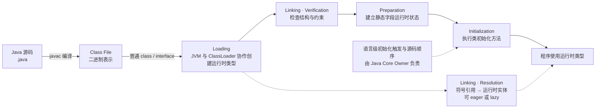
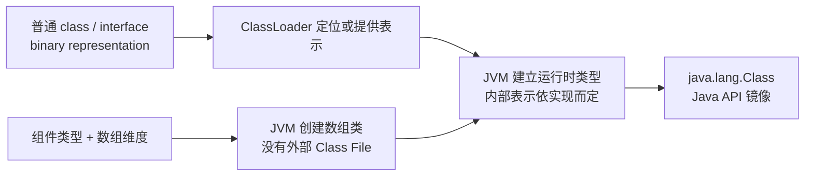

# 类文件与类加载生命周期

> **P0 · Java 21 / JVMS 21 / JLS 21 · 约 15 分钟**
>
> **一句话结论：** JVM 从类或接口的二进制表示创建运行时类型；链接把它接入虚拟机运行状态，其中验证和准备必须在初始化前完成，而符号引用解析可以按实现策略提前或按需发生；初始化才执行类级初始化方法。Class File、VM 内部运行时类型和 Java API 的 `Class<?>` 镜像是相关但不同的概念。

本篇是 04-JVM 的类文件与生命周期唯一 Owner。前置：[JVM 执行模型与运行时数据区](JVM执行模型与运行时数据区.md)。

## 面试先答

### 30～60 秒口述

> 我会把类进入 JVM 的过程分成 Loading、Linking 和 Initialization。普通类或接口先由 JVM 与类加载器协作取得二进制表示，并建立运行时类型；Linking 包括 Verification、Preparation 和 Resolution。验证检查二进制表示是否满足 JVM 的结构与类型约束；准备为静态字段建立运行时状态，通常先赋默认值，但 `ConstantValue` 有规范规定的特殊时机；解析把运行时常量池里的符号引用关联到对应运行时实体。解析可以 eager，也可以 lazy，甚至可能在初始化以后继续，所以不能把五个名词背成一条严格同步完成的流水线。初始化才执行类初始化方法 `<clinit>`；它与实例初始化方法 `<init>` 不同。`Class<?>` 是 Java 观察运行时类型的 API 镜像，不是 `.class` 文件，也不能与 VM 内部元数据画等号。

### 2 分钟展开

> `.java` 经 `javac` 形成 Class File 二进制表示；它含有类型结构、符号信息和 JVM 指令，不是当前 CPU 的原生机器码。Class File 不一定来自磁盘上的 `.class` 文件，JVM 和类加载器也可以使用其他来源提供的表示。Loading 的结果是 VM 中的运行时类或接口；数组类型没有外部 Class File，由 JVM 根据组件类型创建。
>
> Link 不是“再读一遍文件”：Verification 检查表示是否符合结构和类型约束，让 VM 可以依赖已验证的指令约束；Preparation 建立静态字段并赋默认值，显式字段初始化表达式通常在 Initialization 执行。例外要看 `ConstantValue`：带该属性的静态字段在类初始化中、调用 `<clinit>` 之前赋值，这不等于 Preparation 执行了 Java 源码。Resolution 针对类文件和运行时常量池里的符号引用，例如类名、字段/方法名及其类型描述；规范不要求所有引用在初始化前一次性解析。
>
> Initialization 执行类型的类初始化方法 `<clinit>`。哪些语言操作会触发初始化、字段与 `static` 块的源码顺序等由 Java Core 的 `static` 与类初始化 Owner 解释，本篇只说明它在 JVM 生命周期中的位置。最后，`ClassLoader.loadClass` 默认不初始化，`Class.forName(String)` 则相当于请求初始化；API 的不同重载需要分开看。

> **Owner Boundary**：本篇负责 JVMS 类文件、Loading、Linking、Resolution 和 Initialization 在生命周期中的位置。语言层初始化触发条件、父类/接口顺序、常量变量和初始化失败由 [static 与类初始化](../../01-Java核心/02-深度解析/static与类初始化.md) 唯一维护。类加载器委派、`loadClass`/`defineClass` 扩展、类身份案例由 README 中规划的 `ClassLoader双亲委派与类身份.md` Owner 负责，本篇只介绍其作为加载协作者的边界。

## 从 Class File 到可用类型

先把整个路径看成“二进制表示进入 VM 并建立运行时类型”，而不是把 `.class` 当成可直接交给 CPU 执行的文件：



主线箭头表达必要的生命周期依赖。虚线只表达 Resolution 与后续引用使用的关系，不表示它必须位于 Initialization 之前；JVMS 允许 VM 选择 eager 或 lazy 策略。验证和准备必须在类型初始化前完成，解析则可能在类型初始化后继续。[JVMS 21 Chapter 5](https://docs.oracle.com/javase/specs/jvms/se21/html/jvms-5.html)

## Class File 保存什么

JVMS 用 `ClassFile` 结构描述类文件。为理解生命周期，只需记住它大体分为：

```text
ClassFile {
    magic / version
    constant_pool
    access_flags / this_class / super_class / interfaces
    fields
    methods
    attributes
}
```

| 部分 | 对生命周期的作用 |
| --- | --- |
| 名称、版本和访问标记 | 标识二进制表示的类型，并供 JVM 检查其格式与约束。 |
| `constant_pool` | 保存常量以及类名、字段/方法名、描述符和成员引用等符号信息；后续解析会使用它。 |
| `fields` / `methods` | 描述声明的字段和方法；有 Code 属性的方法包含 JVM 指令。 |
| `attributes` | 携带规范定义的附加结构，例如方法的 `Code`、字段的 `ConstantValue`。 |

`.class` 是按 JVMS 格式编码的二进制表示，不是某台 CPU 的原生机器指令文件。一个类或接口的合法二进制表示也不要求一定作为外部文件存在；它可以由工具或运行时按格式提供。这里只用到理解类加载所需的结构，不枚举常量池 tag、属性清单或字节码指令。[JVMS 21 Chapter 4：Class File Format](https://docs.oracle.com/javase/specs/jvms/se21/html/jvms-4.html)

## Loading：取得表示并建立运行时类型

Loading 的核心是：对普通 class/interface，JVM 需要一个符合格式的二进制表示，并据此创建对应的运行时类或接口。它是 JVM 与 ClassLoader 协作的过程：类加载器负责定位或提供表示，JVM 根据它建立类型。表示可能来自本地文件、JAR 或模块路径、网络、运行期生成的字节等；文件系统只是常见来源。

### 三个相关对象不要混为一谈

| 概念 | 可以怎样理解 |
| --- | --- |
| Class File | 类或接口的二进制表示；`.class` 是常见载体，不是唯一来源。 |
| VM runtime type | JVM 已创建的运行时类或接口表示；其内部表示由 JVM 实现决定。 |
| `java.lang.Class<?>` | Java 程序反射和观察运行时类型的 API 镜像。它表示某个类型，但不是 Class File，也不是 VM 内部全部类型元数据的规范化容器。 |

因此，“读入 Class File 后，内部元数据就等于 `Class` 对象”不是 JVMS 保证的模型。Class API 说明 `Class` 实例表示运行中应用的类和接口；JVMS 则把 VM 内部表示留给实现。[Java 21 `Class` API](https://docs.oracle.com/en/java/javase/21/docs/api/java.base/java/lang/Class.html)、[JVMS 21 §5.3](https://docs.oracle.com/javase/specs/jvms/se21/html/jvms-5.html#jvms-5.3)

### 数组类型是特殊分支

数组类没有外部二进制表示，不是由 ClassLoader 再寻找一个普通 `.class` 文件定义出来的。JVM 根据组件类型和维度创建数组类；引用类型数组与其组件类型相关联，但这不意味着还存在一份数组 Class File。由此，`Target[]` 的数组类与 `Target` 普通类不能当成同一条“从文件读取”的路径。[JVMS 21 §5.3.3](https://docs.oracle.com/javase/specs/jvms/se21/html/jvms-5.html#jvms-5.3.3)

类型身份只先记一条边界：同名 class/interface 的运行时身份还与 defining loader 有关，具体机制由后续 `ClassLoader双亲委派与类身份.md` Owner 展开。加载后的类型也可能在满足条件时卸载；类加载器可达性和 HotSpot Metaspace 细节留给相应 P1 Owner。

### Class File 到 Runtime Type 的关系图

这张图专门回答“`.class`、运行时类型、`Class<?>` 与数组类是否同一物”：



箭头表示概念关联，不表示物理内存布局。Class File、VM 类型表示和 `Class<?>` 各处于不同抽象层。

## Linking：为什么 Loading 后还不能直接使用

Loading 让 VM 获得并创建类型；Linking 把它接入可执行的运行时状态。规范把 Linking 的工作分为 Verification、Preparation 和 Resolution，但没有要求每个实现都在同一时刻完成所有符号解析。把它们分开，是因为 VM 必须分别检查外部表示、建立类型状态，并在需要时把符号关系关联到运行时实体。

### Verification：检查 VM 将要依赖的约束

Class File 是二进制输入，VM 不能只因它有 `.class` 后缀就假定结构有效。Verification 检查类型表示是否满足 JVMS 对 class/interface 文件及指令的结构、类型等约束，例如指令边界、操作数类型与控制流约束。检查通过后，执行引擎可以依赖这些已经验证的约束，而不必把同一类格式检查机械地重复到每条指令上。[JVMS 21 §5.4.1](https://docs.oracle.com/javase/specs/jvms/se21/html/jvms-5.html#jvms-5.4.1)、[JVMS 21 §4.10](https://docs.oracle.com/javase/specs/jvms/se21/html/jvms-4.html#jvms-4.10)

验证是格式与类型约束检查，不是对代码行为的安全审批，也不保证代码没有副作用。传统教材常按若干验证类别讲解，那是组织内容的教学视角；本篇不把某套分类说成 JVMS 唯一规定的流水线。

### Preparation：默认状态与 `ConstantValue` 的准确边界

Preparation 为 class/interface 的静态字段建立运行时状态，并把它们初始化为类型默认值；这一步本身不执行 Java 字段初始化表达式或 `static` 块。普通显式初始化逻辑属于 Initialization。

`ConstantValue` 是必须单独标注的规范特例：若静态字段带有该属性，JVMS 规定它在声明类型的 Initialization 中、调用 `<clinit>` 之前取得属性代表的值。这个赋值不属于 Preparation，也不能推导出所有 `static final` 字段都带 `ConstantValue`。

| 声明示例 | Preparation | Initialization |
| --- | --- | --- |
| `static int count = 10;` | `count` 先有默认值 `0` | 显式初始化逻辑赋值 `10`。 |
| `static final int LIMIT = 20;`，且 Class File 有 `ConstantValue` | `LIMIT` 先有默认状态 | Initialization 中、`<clinit>` 调用前写入常量属性的值。 |
| `static final int LIMIT = Integer.parseInt("20");` | `LIMIT` 先有默认值 `0` | 运行 `<clinit>` 中的初始化逻辑；不能仅凭 `static final` 推断有 `ConstantValue`。 |

`ConstantValue` 属性只对静态字段按规范所述生效；`static final` 是源码修饰符组合，并不单独决定该字段具有什么 Class File 属性。常量变量、编译期内联和初始化触发语义由 [Java Core Owner](../../01-Java核心/02-深度解析/static与类初始化.md) 继续解释。[JVMS 21 §5.4.2](https://docs.oracle.com/javase/specs/jvms/se21/html/jvms-5.html#jvms-5.4.2)、[JVMS 21 §4.7.2：`ConstantValue`](https://docs.oracle.com/javase/specs/jvms/se21/html/jvms-4.html#jvms-4.7.2)

### Resolution：符号关系如何接到运行时实体

Class File 中的成员关系常以 symbolic reference 表示，例如目标类或接口的二进制名称、字段/方法名称和描述符。Resolution 根据这些符号关系定位、检查并关联相应的运行时类型、字段、方法或其他常量目标；运行时常量池是这些引用的重要载体，其归属和结构已由[运行时数据区 Owner](JVM执行模型与运行时数据区.md) 解释。

面试中常把结果简写成“符号引用变为直接引用”。这只是帮助记忆的教学表达，不代表 JVMS 规定了一个名叫“直接引用”的固定内存地址或数据结构。JVMS 规定解析结果的语义与错误时机，具体内部表示属于实现。

### Resolution 可以 lazy

JVMS 允许实现采用 eager 解析，也允许逐个符号引用在使用时 lazy 解析。某些实现的 Resolution 因此可能在类型已经初始化后继续。Linking 在逻辑上包含 Resolution，不代表所有符号引用都必须在 Initialization 之前一次解析完毕；如果某引用解析失败，错误在程序执行到需要该引用的相关操作时按规范时机报告。[JVMS 21 §5.4、§5.4.3](https://docs.oracle.com/javase/specs/jvms/se21/html/jvms-5.html#jvms-5.4)

## Initialization：执行类级初始化方法

Initialization 是 JVM 执行类或接口初始化方法的阶段。Class File 中的 `<clinit>` 是类/接口初始化方法；它通常承载静态字段初始化器和 `static` 块编译后的逻辑，但并非每个类都必须存在 `<clinit>`。哪些 Java 操作会触发它，属于 JLS 与 Java Core Owner 的主题。

不要把 `<clinit>` 与 `<init>` 混为一谈：

| 名称 | JVMS 定位 | 面试边界 |
| --- | --- | --- |
| `<clinit>` | class/interface initialization method，由 JVM 在 Initialization 阶段执行。 | 类级初始化，不是 Java 构造器。 |
| `<init>` | instance initialization method，通常对应 Java 源码中的构造器。 | 实例初始化路径；不等于类级 Initialization。 |

本篇不重讲初始化触发列表、父类/接口初始化次序、源码块顺序、初始化锁和失败恢复。请沿 [Java Core `static` 与类初始化 Owner](../../01-Java核心/02-深度解析/static与类初始化.md) 阅读这些语言级语义。[JVMS 21 §2.9.1–2.9.2](https://docs.oracle.com/javase/specs/jvms/se21/html/jvms-2.html#jvms-2.9.1)、[JVMS 21 §5.5](https://docs.oracle.com/javase/specs/jvms/se21/html/jvms-5.html#jvms-5.5)

### API 名称不能替代阶段定义

- `ClassLoader.loadClass(String)` 的 Java 21 API 行为等价于 `loadClass(name, false)`，默认不请求类初始化。
- `Class.forName(String)` 等价于 `Class.forName(className, true, currentLoader)`，会请求初始化；三参数重载中的 `initialize=false` 则不初始化。
- `loadClass`、`Class.forName` 是 API，不是 JVMS 阶段名。调用取得 `Class<?>` 镜像，不意味着调用方应把 Loading、Linking、Initialization 当成同一步。

上述是具体 Java 21 API 契约；完整的初始化触发条件仍由 [Java Core Owner](../../01-Java核心/02-深度解析/static与类初始化.md) 维护。[Java 21 `ClassLoader` API](https://docs.oracle.com/en/java/javase/21/docs/api/java.base/java/lang/ClassLoader.html)、[Java 21 `Class` API](https://docs.oracle.com/en/java/javase/21/docs/api/java.base/java/lang/Class.html)、[JLS 21 Chapter 12](https://docs.oracle.com/javase/specs/jls/se21/html/jls-12.html)

## 高频错误模型

| 错误说法 | 准确边界 |
| --- | --- |
| “类被加载就执行了 `static` 块。” | Loading 创建运行时类型；Initialization 才执行类初始化逻辑。 |
| “`Class.forName` 只是加载。” | 单参数 Java 21 API 请求初始化；显式控制的三参数重载需另看 `initialize`。 |
| “`ClassLoader.loadClass` 默认初始化类。” | 一参数 API 默认等价于 `loadClass(name, false)`。 |
| “Verification 是安全扫描，保证代码无害。” | 它检查 Class File 和指令约束，不替代权限控制或对程序副作用的审查。 |
| “Preparation 执行 `static` 初始化表达式；所有静态字段只会是默认值。” | Preparation 先设默认值；`ConstantValue` 静态字段在 Initialization 的 `<clinit>` 调用前有规范规定的赋值时机。 |
| “Resolution 一定在 Initialization 之前全部完成。” | JVMS 允许 eager 或 lazy；一些实现可在初始化后继续解析。 |
| “Class 对象就是 VM 内部元数据，数组类也来自普通 `.class`。” | `Class<?>` 是 Java API 镜像；数组类由 JVM 创建且没有外部二进制表示。 |
| “五个阶段是严格连续的物理流水线。” | 这是生命周期 mental model；Resolution 的实际时机可变，VM 内部表示也不由规范固定。 |

## 高频追问链

沿依赖关系回答，不只背阶段名：

1. **类加载过程有哪些阶段？** Loading → Linking（Verification、Preparation、Resolution）→ Initialization。
2. **Loading 产生什么？** JVM 根据普通 class/interface 的二进制表示创建运行时类型，ClassLoader 参与定位或提供表示。
3. **Class File 与 `Class<?>` 是什么关系？** 前者是二进制输入，后者是 Java 层运行时镜像，中间还有实现相关的 VM 类型表示。
4. **数组类也由 `.class` 文件加载吗？** 否，JVM 根据组件类型和维度创建。
5. **为什么要 Verification？** VM 需要确认输入满足格式、结构和指令类型约束。
6. **Preparation 后 `static int value = 10` 是多少？** 普通字段先是默认值 `0`，显式赋值在 Initialization 执行。
7. **`static final` 在 Preparation 时一定是默认值吗？** 要看 Class File 是否有 `ConstantValue`；该属性的赋值时机属于 Initialization、在 `<clinit>` 前。
8. **Resolution 解析什么？** 运行时常量池等位置中的符号关系，例如类型、字段、方法引用。
9. **Resolution 一定在初始化前完成吗？** 不一定；实现可以 eager 或 lazy，且可在初始化后继续。
10. **Loading 和 Initialization 有什么区别？** 前者创建运行时类型，后者执行类级初始化方法。
11. **`<clinit>` 和 `<init>` 有什么区别？** 前者是类/接口级初始化方法，后者是实例初始化方法。
12. **`loadClass` 和 `Class.forName` 都初始化吗？** Java 21 默认行为不同；前者不请求初始化，后者单参数形式请求初始化。
13. **具体委派链如何工作？** 下一篇 ClassLoader P0 Owner。
14. **为什么同名类可能不是同一类型？** defining loader 参与身份；下一篇 ClassLoader P0 Owner。

## 下一步与范围边界

接下来应进入 [JVM Knowledge Map](../README.md) 中的 P0 `ClassLoader双亲委派与类身份.md`，深入委派、加载器定义关系和运行时类型身份。栈帧、对象创建、类可达性和类卸载仍由各自唯一 Owner 负责；本篇没有建立示例模块，也不展开字节码百科、完整初始化规则或 ClassLoader 策略。

## 官方资料

- [JVMS 21 Chapter 4：Class File Format](https://docs.oracle.com/javase/specs/jvms/se21/html/jvms-4.html)，重点为 §4.1、§4.4、§4.7.2、§4.7.3。
- [JVMS 21 Chapter 5：Loading, Linking, and Initializing](https://docs.oracle.com/javase/specs/jvms/se21/html/jvms-5.html)，重点为 §5.1–§5.5。
- [JLS 21 Chapter 12：Execution](https://docs.oracle.com/javase/specs/jls/se21/html/jls-12.html)，用于语言级初始化语义边界。
- [Java 21 `Class` API](https://docs.oracle.com/en/java/javase/21/docs/api/java.base/java/lang/Class.html)、[Java 21 `ClassLoader` API](https://docs.oracle.com/en/java/javase/21/docs/api/java.base/java/lang/ClassLoader.html)。
- [Java 21 `javac` 工具](https://docs.oracle.com/en/java/javase/21/docs/specs/man/javac.html)、[Java 21 启动器](https://docs.oracle.com/en/java/javase/21/docs/specs/man/java.html)。

后续文章若讨论具体 HotSpot 行为、加载器策略或类卸载，仍需单独标明实现与版本，不把本篇的 JVMS mental model 延伸成未规定的物理结构。
