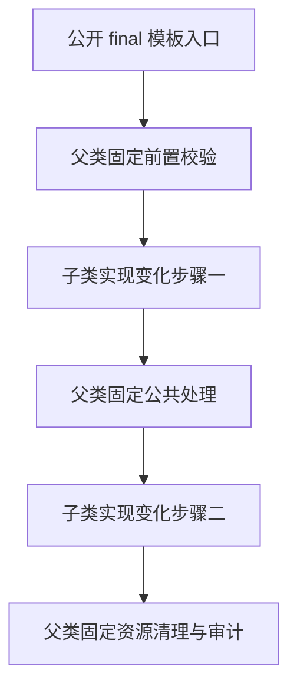
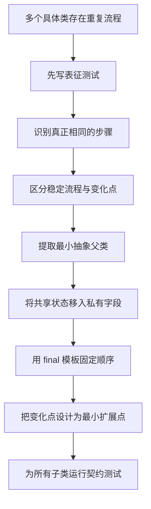

# Java 抽象类

> 本章聚焦 Java 抽象类的语言规则、继承契约和工程设计价值。抽象类不是“不能实例化的普通类”，而是用于表达具有共享状态、公共实现和稳定生命周期，但仍保留部分未完成行为的父类型。

## 13.1 本章定位

学完本章，应能够准确回答：

- 什么是抽象类，什么是抽象方法？
- 抽象类为什么不能直接实例化？
- 抽象类可以没有抽象方法吗？
- 抽象类可以拥有构造器、字段和普通方法吗？
- 抽象方法可以使用哪些访问修饰符和其他修饰符？
- 普通子类为什么必须实现全部可见抽象方法？
- 中间抽象子类如何部分实现、细化或重新抽象父类契约？
- 抽象类构造器在子类对象创建过程中承担什么职责？
- 为什么构造器中调用可重写方法是危险的？
- 抽象类如何建立并维护对象不变量？
- 抽象类、接口、组合和策略分别适合什么变化方向？
- 什么是模板方法模式，必选步骤、默认步骤和钩子有什么区别？
- 为什么模板方法不等于“父类里调用几个抽象方法”？
- 抽象类如何部分实现接口？
- 抽象父类如何处理接口默认方法冲突？
- 什么是骨架实现类，`AbstractList` 为什么是经典案例？
- 匿名子类、局部子类和 sealed 抽象类分别适合什么场景？
- 抽象类公共 API 如何演进，新增抽象方法为什么危险？
- 如何为抽象父类编写契约测试？
- 如何把重复实现重构为合理的抽象类，而不是制造脆弱基类？

本章不重复展开：

- 继承、方法重写、字段隐藏和构造顺序基础：见 `11-继承与重写.md`；
- 编译时类型、运行时类型与动态绑定：见 `12-多态与动态绑定.md`；
- 接口语法、默认方法和多实现：见 `14-接口设计.md`；
- 抽象类、接口、组合、策略与设计原则的系统取舍：见 `15-组合与设计原则.md`；
- `static` 与类初始化：见 `16-static与类初始化.md`；
- `final` 与常量设计：见 `17-final与常量设计.md`；
- JVM 方法调用指令、方法表与内联优化：放在 JVM 模块；
- Spring Bean 生命周期和依赖注入：放在 Spring 模块。

本章主线：

```text
识别稳定的父类型概念
↓
提取共享状态和公共实现
↓
用抽象方法声明必需的变化点
↓
用 final 模板固定不可破坏的流程
↓
通过受控扩展点允许子类定制
↓
通过契约测试验证所有子类可替换
```

---

## 13.2 抽象类解决什么问题

普通父类可能同时面临两类需求：

1. 多个子类确实共享状态、实现和生命周期；
2. 父类型自身又不是一个完整、可独立创建的业务对象。

例如报表导出：

```text
库存报表
出入库流水报表
波次执行报表
```

它们都可能共享：

- 导出任务编号；
- 创建时间；
- 权限校验；
- 进度记录；
- 临时文件管理；
- 异常与审计日志；
- 成功后的统一归档。

但数据查询和行转换不同：

```text
共享部分
→ 父类提供

变化部分
→ 子类实现
```

抽象类适合表达：

> 一个真实存在的父类型概念，它拥有统一状态和基础行为，但必须由更具体的子类型补全后才能形成完整对象。

### 13.2.1 抽象类不是代码复用工具箱

如果几个类只是“碰巧有几行相同代码”，但不存在稳定的父子类型关系，不应仅为了复用而继承抽象类。

更合适的手段可能是：

- 提取普通协作对象；
- 组合工具类；
- 注入策略；
- 提取纯函数；
- 使用装饰器；
- 使用默认方法。

### 13.2.2 抽象类必须同时回答两个问题

```text
为什么这些对象属于同一类型层次？
为什么共享状态和实现必须放在父类？
```

只回答“可以少写代码”通常不够。

---

## 13.3 抽象类的语言定义

使用 `abstract` 修饰的类是抽象类：

```java
public abstract class ReportTask {
}
```

抽象类可以包含：

- 实例字段；
- 静态字段；
- 构造器；
- 实例初始化块；
- 静态初始化块；
- 普通实例方法；
- 抽象实例方法；
- `final` 方法；
- 静态方法；
- 嵌套类、接口、枚举和记录类；
- 泛型类型参数。

抽象类本质上仍然是类，因此除“不能直接实例化”和“可以声明抽象实例方法”外，仍遵循普通类的大多数规则。

### 13.3.1 `abstract` 是类修饰符

```java
public abstract class BaseTask {
}
```

它表达该类不完整，必须通过具体子类使用。

### 13.3.2 `abstract` 与 `final` 不能同时修饰类

```java
// 编译错误：既要求继承补全，又禁止继承
public abstract final class InvalidType {
}
```

两者语义冲突：

```text
abstract
→ 允许或要求通过子类完成

final
→ 禁止产生子类
```

### 13.3.3 `abstract` 可以与 `sealed` 组合

```java
public abstract sealed class Payment
        permits CardPayment, WalletPayment {
}
```

`abstract` 表示父类不完整，`sealed` 表示允许的直接子类型集合受控，二者不冲突。

---

## 13.4 抽象类不能直接实例化

错误示例：

```java
public abstract class ReportTask {
}

// ReportTask task = new ReportTask();
// 编译错误：ReportTask is abstract; cannot be instantiated
```

### 13.4.1 不能实例化不等于不存在对象

可以创建具体子类对象：

```java
ReportTask task = new InventoryReportTask();
```

运行时对象中仍然包含父类部分：

```text
InventoryReportTask 对象
├── ReportTask 定义的状态
├── ReportTask 提供的实现
└── InventoryReportTask 补充的状态和实现
```

### 13.4.2 抽象类可以作为类型使用

抽象类可以用于：

- 变量类型；
- 字段类型；
- 参数类型；
- 返回类型；
- 泛型类型参数；
- 数组元素类型；
- 集合元素类型；
- `instanceof` 判断；
- 模式匹配。

```java
public void execute(ReportTask task) {
    task.run();
}
```

### 13.4.3 原因不是“JVM 不会分配内存”

禁止直接实例化首先是 Java 语言层规则。

更准确的理解是：

- 抽象类可能保留未实现行为；
- 即使没有抽象方法，作者也明确声明该类型不能作为完整实例存在；
- 编译器拒绝 `new AbstractType()`。

---

## 13.5 抽象类可以没有抽象方法

合法示例：

```java
public abstract class BaseEntity {

    private final long id;

    protected BaseEntity(long id) {
        this.id = id;
    }

    public final long id() {
        return id;
    }
}
```

该类没有抽象方法，但仍然不能直接实例化。

### 13.5.1 常见用途

- 表示概念上不完整的父类型；
- 禁止调用方创建过于宽泛的对象；
- 强制通过具体子类表达业务含义；
- 提供共享状态和公共实现；
- 控制继承体系入口；
- 配合 `sealed` 建立封闭层次；
- 作为骨架实现类。

### 13.5.2 关键结论

```text
含有抽象方法的类
→ 必须是抽象类

抽象类
→ 不一定含有抽象方法
```

### 13.5.3 不要滥用空抽象类

如果一个类：

- 没有共享状态；
- 没有共享实现；
- 没有稳定父类型语义；
- 只是为了“不让 new”；

可能更适合：

- 私有构造器；
- 静态工厂；
- 接口；
- sealed 接口；
- 组合对象。

---

## 13.6 抽象方法的基本语法

抽象方法只声明契约，不提供方法体：

```java
public abstract class ReportTask {

    protected abstract Object loadData();
}
```

### 13.6.1 以分号结束

```java
protected abstract Object loadData();
```

错误示例：

```java
// 编译错误：抽象方法不能有方法体
// protected abstract Object loadData() {
//     return null;
// }
```

### 13.6.2 抽象方法是实例方法

抽象方法依赖子类实例提供具体实现，并通过动态绑定执行：

```java
ReportTask task = new InventoryReportTask();
Object data = task.loadData();
```

### 13.6.3 抽象方法仍有完整方法签名

它可以声明：

- 访问权限；
- 返回类型；
- 方法名；
- 参数列表；
- 泛型方法类型参数；
- 可变参数；
- `throws` 子句；
- 注解。

```java
protected abstract <T> T convert(
        Object source,
        Class<T> targetType
) throws ConversionException;
```

### 13.6.4 抽象方法表达的是契约

契约不仅包括“方法存在”，还包括：

- 参数前置条件；
- 返回值语义；
- 是否允许返回 `null`；
- 异常语义；
- 副作用；
- 线程安全要求；
- 幂等性；
- 性能和资源边界。

这些内容不能仅靠方法签名完整表达，通常需要文档和契约测试补充。

---

## 13.7 抽象方法的修饰符限制

抽象方法不能与以下修饰符组合：

- `private`；
- `static`；
- `final`；
- `native`；
- `strictfp`；
- `synchronized`。

### 13.7.1 不能使用 `private`

```java
// private abstract void execute();
```

原因：

```text
abstract
→ 子类必须能够覆盖或实现

private
→ 子类不可见，不形成重写关系
```

### 13.7.2 不能使用 `static`

```java
// public abstract static void execute();
```

静态方法属于类，不参与实例方法动态绑定。

### 13.7.3 不能使用 `final`

```java
// public abstract final void execute();
```

`abstract` 要求提供实现，`final` 禁止覆盖，语义冲突。

### 13.7.4 不能使用 `native`

`native` 表示实现由本地代码提供；`abstract` 表示当前方法没有实现并等待子类覆盖，二者不能同时出现。

### 13.7.5 不能使用 `synchronized`

`synchronized` 修饰的是具体方法执行体的监视器获取行为；抽象方法没有方法体。

子类实现可以自行声明 `synchronized`，但这属于实现选择，不是父类抽象契约自动保证的属性。

### 13.7.6 可以使用哪些访问权限

类中的抽象方法可以是：

- `public`；
- `protected`；
- 包访问权限。

通常：

- 面向外部调用方的契约使用 `public`；
- 只供模板内部和子类实现的扩展点使用 `protected`；
- 包访问抽象方法需谨慎，尤其要考虑跨包继承。

---

## 13.8 含有抽象方法的类必须是抽象类

错误示例：

```java
// 编译错误
// public class ReportTask {
//     protected abstract Object loadData();
// }
```

正确示例：

```java
public abstract class ReportTask {

    protected abstract Object loadData();
}
```

### 13.8.1 原因

普通类可以被直接实例化，因此必须是具体类型。

如果普通类保留未实现实例方法，创建出的对象将无法完成该方法调用。

### 13.8.2 编译器在类型声明处阻止不完整类型

这比等到运行时调用时再失败更安全。

### 13.8.3 接口中的抽象方法规则不同

接口本身天然不可直接实例化，因此不需要在接口声明上额外写 `abstract interface`。

接口完整规则见第 14 章。

---

## 13.9 普通子类必须完成抽象契约

父类：

```java
public abstract class ReportTask {

    protected abstract Object loadData();

    protected abstract String render(
            Object data
    );
}
```

具体子类：

```java
public final class InventoryReportTask
        extends ReportTask {

    @Override
    protected Object loadData() {
        return List.of("SKU-1", "SKU-2");
    }

    @Override
    protected String render(Object data) {
        return data.toString();
    }
}
```

### 13.9.1 必须实现全部继承到的可实现抽象方法

具体类不能留下任何未完成的实例契约。

### 13.9.2 方法必须形成真正的重写

以下错误可能导致“看起来写了方法，实际没有实现抽象方法”：

- 参数类型不同，形成重载；
- 返回类型不兼容；
- 访问权限缩小；
- 方法名拼写错误；
- 泛型擦除后签名冲突；
- 抽象方法在跨包场景不可见。

因此始终使用 `@Override`：

```java
@Override
protected Object loadData() {
    return List.of();
}
```

### 13.9.3 访问权限不能缩小

父类：

```java
protected abstract void execute();
```

子类不能写成包访问：

```java
// @Override
// void execute() {
// }
```

可以保持 `protected` 或扩大为 `public`。

---

## 13.10 中间抽象子类可以部分实现

抽象层次可以逐步细化：

```java
public abstract class ImportTask {

    protected abstract Object read();

    protected abstract void validate(Object data);

    protected abstract void persist(Object data);
}
```

中间抽象类只实现部分步骤：

```java
public abstract class FileImportTask
        extends ImportTask {

    @Override
    protected final Object read() {
        return readFile(path());
    }

    protected abstract Path path();
}
```

具体子类继续补全：

```java
public final class CsvImportTask
        extends FileImportTask {

    @Override
    protected Path path() {
        return Path.of("data.csv");
    }

    @Override
    protected void validate(Object data) {
    }

    @Override
    protected void persist(Object data) {
    }
}
```

### 13.10.1 抽象性可以向下传递

中间抽象类不需要完成所有抽象方法。

### 13.10.2 每一层应增加真实语义

不推荐只有一层层空壳：

```text
BaseTask
→ AbstractTask
→ DefaultTaskBase
→ BusinessTaskBase
→ ConcreteTask
```

层次过深会增加：

- 调用路径理解成本；
- 状态来源追踪成本；
- 初始化顺序风险；
- 覆盖关系复杂度；
- 测试难度。

### 13.10.3 建议控制继承深度

业务代码中更常见、也更容易维护的是：

```text
抽象父类
→ 具体子类
```

或最多增加一层有明确职责的骨架类。

---

## 13.11 抽象类可以拥有构造器

抽象类不能直接 `new`，但可以定义构造器：

```java
public abstract class ReportTask {

    private final String taskId;

    protected ReportTask(String taskId) {
        this.taskId = Objects.requireNonNull(taskId);
    }
}
```

具体子类必须调用父类构造器：

```java
public final class InventoryReportTask
        extends ReportTask {

    public InventoryReportTask(String taskId) {
        super(taskId);
    }
}
```

### 13.11.1 构造器的职责

- 初始化父类字段；
- 校验父类参数；
- 建立父类不变量；
- 保存所有子类都必须具备的依赖；
- 统一完成不可跳过的基础初始化。

### 13.11.2 构造器不是抽象方法

构造器：

- 不被继承；
- 不能被重写；
- 不能声明为 `abstract`；
- 由子类构造器通过 `super(...)` 调用。

### 13.11.3 抽象类可以有多个构造器

```java
protected ReportTask(String taskId) {
    this(taskId, Clock.systemUTC());
}

protected ReportTask(
        String taskId,
        Clock clock
) {
    this.taskId = Objects.requireNonNull(taskId);
    this.clock = Objects.requireNonNull(clock);
}
```

但构造重载应保持一致的不变量规则。

---

## 13.12 构造器可见性设计

抽象类构造器通常使用 `protected` 或包访问权限。

### 13.12.1 `protected` 构造器

```java
protected ReportTask(String taskId) {
}
```

允许：

- 同包代码；
- 不同包子类。

适合可被外部扩展的抽象基类。

### 13.12.2 包访问构造器

```java
ReportTask(String taskId) {
}
```

限制只有同包代码可以直接调用。

即使外部类能够继承，也无法调用不可访问的父类构造器，因此可用于限制扩展边界。

### 13.12.3 `private` 构造器

```java
private ReportTask(String taskId) {
}
```

普通外部子类无法调用。

仍可用于：

- 只允许嵌套子类；
- 由父类内部静态工厂创建封闭实现；
- 与 sealed 设计配合。

### 13.12.4 `public` 构造器通常没有必要

即使是 `public`，抽象类仍不能直接实例化。

如果确实允许任意外部子类调用，`protected` 已足够表达意图。

---

## 13.13 子类对象的初始化顺序

创建具体子类对象时，必须先初始化父类部分。

简化顺序：

```text
为完整对象分配内存并设置默认值
↓
执行父类实例字段初始化与实例初始化块
↓
执行父类构造器体
↓
执行子类实例字段初始化与实例初始化块
↓
执行子类构造器体
```

示例：

```java
abstract class Parent {

    private String parentValue = initParent();

    Parent() {
        System.out.println("Parent constructor");
    }

    private String initParent() {
        System.out.println("Parent field");
        return "P";
    }
}

final class Child extends Parent {

    private String childValue = initChild();

    Child() {
        System.out.println("Child constructor");
    }

    private String initChild() {
        System.out.println("Child field");
        return "C";
    }
}
```

### 13.13.1 抽象类不改变初始化规则

抽象类只是不能直接实例化，其父类部分仍会在创建子类对象时正常初始化。

### 13.13.2 `super(...)` 必须先完成

子类构造器体执行前，父类构造链必须完成。

### 13.13.3 不要把对象发布到构造器外部

父类构造阶段不应：

- 注册 `this` 到全局集合；
- 启动线程并捕获 `this`；
- 提交异步任务；
- 调用外部回调；
- 发布领域事件；
- 调用可重写方法。

否则其他代码可能观察到半初始化对象。

---

## 13.14 抽象类中的实例字段

抽象类可以保存每个子类对象共享的基础状态：

```java
public abstract class Task {

    private final String taskId;
    private TaskStatus status;
    private final Instant createdAt;

    protected Task(
            String taskId,
            Instant createdAt
    ) {
        this.taskId = Objects.requireNonNull(taskId);
        this.createdAt = Objects.requireNonNull(createdAt);
        this.status = TaskStatus.CREATED;
    }
}
```

### 13.14.1 字段属于对象

每个具体子类实例都有自己的父类字段副本。

### 13.14.2 抽象类适合共享实例状态

这是抽象类与纯接口的重要差异之一。

适合共享：

- 标识；
- 生命周期状态；
- 通用配置；
- 必需依赖；
- 审计信息；
- 通用缓存；
- 统一统计数据。

### 13.14.3 不应共享无关状态

如果某个字段只对一个子类有意义，不应为了“方便”放入父类：

```java
abstract class Payment {
    // 只有银行卡支付需要，放在父类会污染模型
    // private String cardNumber;
}
```

这会产生：

- 大量可空字段；
- 非法状态组合；
- 子类对无关字段的困惑；
- 父类职责膨胀。

---

## 13.15 优先使用 private 字段维护不变量

不推荐：

```java
public abstract class Task {

    protected TaskStatus status;
}
```

任意子类都可以绕过规则直接修改：

```java
status = null;
```

推荐：

```java
public abstract class Task {

    private TaskStatus status;

    public final TaskStatus status() {
        return status;
    }

    protected final void transitionTo(
            TaskStatus next
    ) {
        if (!status.canTransitionTo(next)) {
            throw new IllegalStateException(
                    status + " -> " + next
            );
        }
        status = next;
    }
}
```

### 13.15.1 字段私有化的价值

- 集中校验；
- 维护不变量；
- 隔离内部表示；
- 允许未来重构；
- 防止子类形成隐式耦合；
- 降低并发可见性问题。

### 13.15.2 为子类暴露受控能力

可以通过：

- `protected final` 方法；
- 只读访问器；
- 不可变值对象；
- 明确命名的状态转换方法；
- 受保护的模板钩子。

### 13.15.3 `protected` 字段不是扩展点

字段暴露的是表示细节，而不是行为契约。

优先扩展行为，不要扩展内部存储。


---

## 13.16 抽象类中的普通实例方法

抽象类可以提供完整实现：

```java
public abstract class Task {

    public final void cancel() {
        ensureCancelable();
        doCancel();
        recordCancellation();
    }

    private void ensureCancelable() {
    }

    protected void doCancel() {
    }

    private void recordCancellation() {
    }
}
```

普通方法可以分为：

- 对外公开的稳定操作；
- 模板流程；
- 子类可覆盖的默认步骤；
- 子类不可覆盖的工具方法；
- 仅父类内部使用的私有方法。

### 13.16.1 公共实现应服务于父类型契约

父类不应变成杂乱的工具集合。

一个方法放入抽象父类，应至少满足：

- 对多数或全部子类有意义；
- 使用父类状态或参与统一流程；
- 语义属于该父类型；
- 不迫使子类依赖无关实现。

### 13.16.2 默认实现不等于可以随意覆盖

如果覆盖会破坏父类不变量，应使用：

- `final`；
- 私有辅助方法；
- 更窄、更明确的钩子；
- 组合对象。

### 13.16.3 不要在父类公开过多 `protected` 方法

每个 `protected` 方法都可能成为长期扩展契约。

发布后修改其：

- 参数；
- 返回值；
- 调用顺序；
- 线程模型；
- 异常语义；

都可能破坏已有子类。

---

## 13.17 final 方法固定不变量和流程

模板入口通常应声明为 `final`：

```java
public abstract class ExportTask {

    public final Path execute() {
        checkPermission();
        Object data = loadData();
        Path file = writeFile(data);
        archive(file);
        return file;
    }

    protected abstract Object loadData();

    protected abstract Path writeFile(Object data);

    private void checkPermission() {
    }

    private void archive(Path file) {
    }
}
```

### 13.17.1 为什么模板入口通常是 `final`

防止子类：

- 跳过权限校验；
- 忽略幂等处理；
- 改变事务边界；
- 忘记资源清理；
- 不记录审计日志；
- 绕过状态转换；
- 改变固定步骤顺序。

### 13.17.2 `final` 不是越多越好

需要允许扩展的步骤仍可设计为：

- 抽象方法；
- 可覆盖默认方法；
- 空钩子；
- 注入策略。

关键是明确：

```text
什么必须固定
什么必须实现
什么可以选择性定制
```

### 13.17.3 父类应控制流程，子类提供细节

这比让子类复制完整流程更能保证一致性。

---

## 13.18 抽象类中的静态成员

抽象类可以定义静态字段和静态方法：

```java
public abstract class Task {

    private static final int MAX_RETRY = 3;

    public static int maxRetry() {
        return MAX_RETRY;
    }
}
```

### 13.18.1 静态成员属于类

推荐通过类名访问：

```java
int maxRetry = Task.maxRetry();
```

### 13.18.2 静态方法不能是抽象方法

静态方法不参与实例动态绑定，不能要求“不同实例子类实现各自静态版本”。

### 13.18.3 静态方法隐藏不是重写

子类声明同签名静态方法时，按编译时类型或类名解析，不形成实例多态。

完整规则见第 11、12、16 章。

### 13.18.4 不要用静态状态共享实例生命周期

例如：

```java
public abstract class Task {
    // 所有实例共享，通常不是“每个任务的状态”
    private static TaskStatus status;
}
```

这会导致：

- 多实例互相污染；
- 并发安全问题；
- 测试隔离困难；
- 生命周期混乱。

---

## 13.19 抽象类中的嵌套类型

抽象类可以声明嵌套类、接口、枚举和记录类：

```java
public abstract class ImportTask {

    protected enum Phase {
        VALIDATE,
        READ,
        PERSIST
    }

    protected record Context(
            String taskId,
            Instant startedAt
    ) {
    }

    protected interface Listener {
        void onPhaseChanged(Phase phase);
    }
}
```

### 13.19.1 嵌套类型用于封装协作协议

适合表达：

- 只属于该抽象层次的上下文；
- 生命周期状态；
- 事件监听器；
- 模板执行结果；
- 内部策略接口。

### 13.19.2 控制可见性

只供父类内部使用：

```java
private static final class ExecutionState {
}
```

需要子类使用：

```java
protected record Context(...) {
}
```

需要公共 API 使用：

```java
public record Result(...) {
}
```

### 13.19.3 避免把抽象父类变成命名空间

与父类契约无关的类型应放在独立文件或独立包中。

---

## 13.20 泛型抽象类

抽象类可以声明类型参数：

```java
public abstract class Converter<S, T> {

    public abstract T convert(S source);
}
```

具体子类固定类型：

```java
public final class StringToIntegerConverter
        extends Converter<String, Integer> {

    @Override
    public Integer convert(String source) {
        return Integer.valueOf(source);
    }
}
```

### 13.20.1 泛型提高父类复用性

同一骨架可用于不同数据类型，同时保持编译期类型安全。

### 13.20.2 类型参数应表达真实变化维度

不推荐为了“看起来通用”引入大量类型参数：

```text
Base<A, B, C, D, E>
```

过多类型参数会：

- 增加声明和调用复杂度；
- 让错误信息难读；
- 暴露内部实现细节；
- 降低可替换性。

### 13.20.3 可以增加上界

```java
public abstract class EntityProcessor<
        T extends BaseEntity
> {

    protected abstract void process(T entity);
}
```

### 13.20.4 注意桥接方法和擦除

子类覆盖泛型方法时，编译器可能生成桥接方法以维持多态。

完整机制放在泛型和 JVM 模块。

---

## 13.21 抽象方法与协变返回类型

父类：

```java
public abstract class DocumentFactory {

    public abstract Document create();
}
```

子类可以返回更具体类型：

```java
public final class PdfDocumentFactory
        extends DocumentFactory {

    @Override
    public PdfDocument create() {
        return new PdfDocument();
    }
}
```

前提：

```text
PdfDocument 是 Document 的子类型
```

### 13.21.1 价值

子类调用方可以获得更具体的静态类型：

```java
PdfDocument document = factory.create();
```

同时父类型调用仍然成立：

```java
DocumentFactory factory =
        new PdfDocumentFactory();
Document document = factory.create();
```

### 13.21.2 基本类型不能协变

不能把父类 `int` 返回类型改为 `long`。

协变返回适用于引用类型。

### 13.21.3 不要过度具体化

若返回类型过于绑定实现，可能削弱统一抽象价值。

---

## 13.22 抽象方法与 throws 约束

父类抽象方法：

```java
protected abstract Object load()
        throws IOException;
```

子类实现可以：

- 不抛受检异常；
- 抛相同受检异常；
- 抛其更具体子类型；
- 抛任意非受检异常。

```java
@Override
protected Object load()
        throws FileNotFoundException {
    return List.of();
}
```

### 13.22.1 不能扩大受检异常范围

```java
// 编译错误：Exception 比 IOException 更宽
// @Override
// protected Object load() throws Exception {
// }
```

### 13.22.2 父类异常契约应有业务含义

不推荐：

```java
protected abstract void execute()
        throws Exception;
```

过宽异常会迫使所有调用方处理无法区分的失败。

更好的选择：

- 明确受检异常；
- 领域异常；
- 统一结果类型；
- 在模板边界转换异常。

### 13.22.3 模板入口可统一异常翻译

```java
public final Result execute() {
    try {
        return doExecute();
    } catch (IOException exception) {
        throw new TaskExecutionException(
                "load failed",
                exception
        );
    }
}
```

---

## 13.23 抽象子类可以重新抽象具体方法

父类提供具体实现：

```java
public class BaseFormatter {

    public String format(Object value) {
        return String.valueOf(value);
    }
}
```

抽象子类可以重新声明为抽象：

```java
public abstract class StrictFormatter
        extends BaseFormatter {

    @Override
    public abstract String format(Object value);
}
```

### 13.23.1 作用

在更严格的子层次中：

- 禁止继续使用宽泛默认实现；
- 强制具体子类提供专用实现；
- 收紧语义契约；
- 划分新的抽象边界。

### 13.23.2 只有抽象类能这么做

普通具体子类不能留下未实现方法。

### 13.23.3 使用边界

重新抽象会提高子类实现成本，不应仅为追求“纯粹抽象”。

应有明确理由证明父类默认实现不再满足该子层次。

---

## 13.24 抽象方法可以细化上层抽象契约

接口：

```java
public interface Reader {

    Object read() throws IOException;
}
```

抽象类可以继续声明抽象方法，并细化返回值与异常：

```java
public abstract class TextReader
        implements Reader {

    @Override
    public abstract String read()
            throws FileNotFoundException;
}
```

具体子类：

```java
public final class ConfigReader
        extends TextReader {

    @Override
    public String read() {
        return "config";
    }
}
```

### 13.24.1 细化内容

- 更具体的协变返回类型；
- 更窄的受检异常；
- 更强的文档语义；
- 更明确的注解约束。

### 13.24.2 不能违反可替换性

不能：

- 加强调用方前置条件；
- 削弱父契约后置条件；
- 扩大受检异常；
- 返回不兼容类型；
- 缩小访问权限。

---

## 13.25 抽象类可以部分实现接口

接口：

```java
public interface ImportProcessor {

    void validate();

    void read();

    void persist();
}
```

抽象类只实现通用步骤：

```java
public abstract class BaseImportProcessor
        implements ImportProcessor {

    @Override
    public final void validate() {
        System.out.println("common validation");
    }

    @Override
    public abstract void read();

    @Override
    public abstract void persist();
}
```

### 13.25.1 这是骨架实现的基础

接口负责对外契约，抽象类负责可选的共享实现。

调用方可以只依赖接口：

```java
ImportProcessor processor =
        new CsvImportProcessor();
```

实现方可以选择：

- 直接实现接口；
- 继承骨架抽象类；
- 使用其他实现方式。

### 13.25.2 避免强迫所有实现继承骨架类

因为 Java 类只能单继承。

将公共 API 放在接口、将便利实现放在抽象类，通常比只暴露抽象类更灵活。

### 13.25.3 接口与骨架类命名

常见形式：

```text
List
→ AbstractList

Map
→ AbstractMap

Set
→ AbstractSet
```

业务代码可以使用：

```text
PaymentGateway
→ AbstractPaymentGateway
```

但只有真实共享逻辑足够稳定时才值得创建。

---

## 13.26 抽象父类可以压制接口默认方法

接口提供默认方法：

```java
interface Auditable {

    default String auditType() {
        return "default";
    }
}
```

抽象父类可以把该方法重新声明为抽象：

```java
abstract class BaseTask
        implements Auditable {

    @Override
    public abstract String auditType();
}
```

具体子类必须实现：

```java
final class ExportTask extends BaseTask {

    @Override
    public String auditType() {
        return "export";
    }
}
```

### 13.26.1 类成员优先规则

类层次中的方法声明优先于接口默认方法。

抽象类可以明确表示：

```text
接口默认实现
在本继承层次中不够准确
```

### 13.26.2 适用场景

- 默认实现不满足该层次；
- 每个具体子类必须显式给出行为；
- 避免无意继承接口默认逻辑；
- 解决多个接口默认方法冲突。

### 13.26.3 不要无意义压制默认方法

如果接口默认实现已经正确，重新抽象只会增加样板代码。

---

## 13.27 包访问抽象方法的跨包陷阱

父类位于包 `p`：

```java
package p;

public abstract class Base {

    abstract void execute();
}
```

子类位于包 `q`：

```java
package q;

public class Child extends p.Base {

    public void execute() {
    }
}
```

看起来签名相同，但父类方法是包访问，对不同包子类不可见。

`Child.execute()` 不会正确实现那个不可见的抽象方法，具体类仍可能编译失败。

### 13.27.1 根因

重写要求子类能够继承并看到父类实例方法。

包访问成员只在同包可访问。

### 13.27.2 公共扩展点应使用 `protected` 或 `public`

如果抽象类允许跨包继承，其必需扩展点通常应是：

```java
protected abstract void execute();
```

### 13.27.3 包访问可用于限制外部实现

若有意只允许同包子类实现，可以使用包访问方法和构造器，但应：

- 清晰记录设计意图；
- 配合模块和包边界；
- 避免对外宣称可自由继承。

---

## 13.28 匿名子类

抽象类不能直接实例化，但可以创建匿名具体子类：

```java
ReportTask task = new ReportTask("T-1") {

    @Override
    protected Object loadData() {
        return List.of("A", "B");
    }

    @Override
    protected String render(Object data) {
        return data.toString();
    }
};
```

### 13.28.1 实际创建的不是抽象类实例

编译器生成一个匿名具体子类，并实例化该子类。

### 13.28.2 适合场景

- 测试替身；
- 一次性局部实现；
- 示例代码；
- 简短回调对象；
- 不值得单独命名的简单实现。

### 13.28.3 不适合场景

- 实现逻辑较长；
- 需要多处复用；
- 需要独立测试；
- 需要构造复杂依赖；
- 需要清晰业务名称；
- 需要序列化或框架扫描。

### 13.28.4 Lambda 不能替代普通抽象类

Lambda 只针对函数式接口，不针对抽象类。

即使抽象类只有一个抽象方法，也不能直接写：

```java
// ReportTask task = () -> data;
```

---

## 13.29 局部子类与工厂封装

可以在方法内部声明局部子类：

```java
static ReportTask createPreviewTask(
        List<String> rows
) {
    final class PreviewTask extends ReportTask {

        PreviewTask() {
            super("preview");
        }

        @Override
        protected Object loadData() {
            return rows;
        }

        @Override
        protected String render(Object data) {
            return data.toString();
        }
    }

    return new PreviewTask();
}
```

### 13.29.1 相比匿名子类的优点

- 可以定义构造器；
- 可以在方法内多次创建；
- 栈跟踪名称更可读；
- 实现逻辑更容易组织。

### 13.29.2 静态工厂隐藏具体实现

调用方只看到抽象类型：

```java
ReportTask task =
        ReportTasks.preview(rows);
```

工厂可以：

- 选择具体子类；
- 校验参数；
- 缓存实例；
- 隐藏实现类；
- 维护封闭层次。

### 13.29.3 复杂实现仍应独立命名

局部类只适合局部性很强的实现。

---

## 13.30 sealed 抽象类

Java 17 正式支持 sealed 类。

```java
public abstract sealed class Payment
        permits CardPayment, WalletPayment {

    public abstract Money amount();
}
```

直接子类必须明确声明：

- `final`；
- `sealed`；
- `non-sealed`。

```java
public final class CardPayment
        extends Payment {
}

public non-sealed class WalletPayment
        extends Payment {
}
```

### 13.30.1 价值

- 控制直接子类型集合；
- 明确领域允许的变体；
- 便于模式匹配穷尽分析；
- 防止外部任意继承；
- 保护父类不变量；
- 降低公共扩展契约压力。

### 13.30.2 抽象与 sealed 的分工

```text
abstract
→ 父类不完整

sealed
→ 子类型集合受控
```

### 13.30.3 适合封闭领域

- 支付结果；
- 订单状态事件；
- 解析结果；
- 命令执行结果；
- 协议消息；
- 领域错误。

### 13.30.4 不适合开放插件体系

如果第三方应自由扩展，sealed 会阻止外部实现。

---

## 13.31 抽象类与 record、enum 的边界

### 13.31.1 record 不能继承自定义抽象类

记录类隐式继承 `java.lang.Record`，不能再继承其他类。

它可以实现接口，但不能：

```java
// record Order(...) extends BaseEntity {
// }
```

### 13.31.2 record 适合数据载体

record 更适合：

- 不可变值；
- DTO；
- 消息；
- 查询结果；
- 领域值对象。

抽象类更适合：

- 共享状态；
- 统一生命周期；
- 模板流程；
- 受控扩展点。

### 13.31.3 enum 不能继承自定义抽象类

枚举隐式继承 `java.lang.Enum`。

但枚举可以声明抽象方法，并由每个枚举常量的匿名类体实现：

```java
public enum Operation {
    ADD {
        @Override
        int apply(int a, int b) {
            return a + b;
        }
    },
    SUBTRACT {
        @Override
        int apply(int a, int b) {
            return a - b;
        }
    };

    abstract int apply(int a, int b);
}
```

### 13.31.4 选择依据

```text
固定有限实例
→ enum

不可变数据值
→ record

共享状态和实现的可扩展类型层次
→ abstract class

独立能力契约
→ interface
```


---

## 13.32 模板方法模式

模板方法模式在父类中定义算法骨架，把部分步骤延迟到子类实现。



基本结构：

```java
public abstract class ImportTask {

    public final void execute() {
        validateRequest();
        Object source = readSource();
        Object normalized = normalize(source);
        persist(normalized);
        afterSuccess(normalized);
    }

    private void validateRequest() {
    }

    protected abstract Object readSource();

    protected Object normalize(Object source) {
        return source;
    }

    protected abstract void persist(Object data);

    protected void afterSuccess(Object data) {
    }
}
```

### 13.32.1 模板方法解决的核心问题

```text
流程顺序稳定
但部分步骤实现变化
```

### 13.32.2 它是继承式复用

优点：

- 固定主流程；
- 消除重复代码；
- 集中不变量；
- 强制执行公共步骤；
- 子类只关注差异。

代价：

- 子类与父类生命周期强耦合；
- 扩展点调用顺序隐含；
- 多个变化维度可能导致子类组合爆炸；
- 运行时切换行为不如策略灵活；
- 父类演进可能破坏子类。

### 13.32.3 适用条件

- 算法骨架长期稳定；
- 子类差异步骤清晰；
- 子类确实属于同一父类型；
- 共享状态和基础实现具有业务意义；
- 变化点数量有限。

---

## 13.33 必选步骤、默认步骤与钩子

模板中的扩展点应分类设计。

### 13.33.1 必选步骤

没有合理默认实现，每个具体子类必须实现：

```java
protected abstract Object loadData();
```

### 13.33.2 默认步骤

父类提供通用实现，子类必要时覆盖：

```java
protected Object normalize(Object data) {
    return data;
}
```

### 13.33.3 钩子方法

默认不做任何事，允许子类在特定时点插入行为：

```java
protected void afterSuccess(Object data) {
}
```

### 13.33.4 布尔钩子

子类决定是否执行某一步：

```java
protected boolean shouldArchive() {
    return true;
}
```

模板：

```java
if (shouldArchive()) {
    archive();
}
```

### 13.33.5 扩展点应该最小化

不推荐暴露一个可以任意改写整个流程的方法：

```java
protected void executeEverything() {
}
```

更好的扩展点应：

- 语义单一；
- 输入输出明确；
- 调用次数明确；
- 调用时机稳定；
- 异常语义明确；
- 不暴露父类内部可变状态。

---

## 13.34 一个完整的模板方法示例

```java
public abstract class AbstractExportTask<R> {

    private final String taskId;
    private final Path outputDirectory;

    protected AbstractExportTask(
            String taskId,
            Path outputDirectory
    ) {
        this.taskId = Objects.requireNonNull(taskId);
        this.outputDirectory =
                Objects.requireNonNull(outputDirectory);
    }

    public final Path execute() {
        validate();
        onStarted();

        try {
            List<R> rows = queryRows();
            List<R> normalized = normalize(rows);
            Path file = createOutputFile();
            writeRows(file, normalized);
            verify(file);
            onSucceeded(file, normalized.size());
            return file;
        } catch (RuntimeException exception) {
            onFailed(exception);
            throw exception;
        } finally {
            cleanup();
        }
    }

    private void validate() {
        if (taskId.isBlank()) {
            throw new IllegalStateException(
                    "taskId is blank"
            );
        }
    }

    protected abstract List<R> queryRows();

    protected List<R> normalize(List<R> rows) {
        return List.copyOf(rows);
    }

    protected abstract void writeRows(
            Path file,
            List<R> rows
    );

    protected void verify(Path file) {
    }

    protected void onStarted() {
    }

    protected void onSucceeded(
            Path file,
            int rowCount
    ) {
    }

    protected void onFailed(
            RuntimeException exception
    ) {
    }

    protected void cleanup() {
    }

    private Path createOutputFile() {
        return outputDirectory.resolve(
                taskId + ".tmp"
        );
    }
}
```

### 13.34.1 父类固定的内容

- 参数和状态校验；
- 生命周期顺序；
- 成功失败分支；
- 输出路径规则；
- 异常继续抛出；
- `finally` 清理。

### 13.34.2 子类实现的内容

- 数据查询；
- 文件格式写入；
- 可选标准化；
- 可选校验和事件钩子。

### 13.34.3 模板文档必须说明

- 每个扩展点调用几次；
- 是否可能并发调用；
- 是否允许返回 `null`；
- 是否允许修改传入集合；
- 抛异常后模板如何处理；
- 钩子之间的先后顺序；
- 是否处于事务或锁内。

---

## 13.35 异常与资源清理

模板方法经常承担统一资源治理。

### 13.35.1 使用 `try-finally`

```java
public final void execute() {
    Resource resource = acquire();
    try {
        process(resource);
    } finally {
        release(resource);
    }
}
```

### 13.35.2 优先 `try-with-resources`

```java
public final void execute() throws IOException {
    try (InputStream input = openInput()) {
        process(input);
    }
}
```

如果子类负责创建 `AutoCloseable`，父类应尽可能统一关闭。

### 13.35.3 不要让钩子吞掉主异常

不推荐：

```java
catch (Exception exception) {
    onFailed(exception);
    return;
}
```

如果失败钩子只是记录日志，不应改变主流程失败语义。

### 13.35.4 清理异常处理

资源清理失败时要考虑：

- 是否覆盖主异常；
- 是否作为 suppressed exception 保留；
- 是否告警；
- 是否需要补偿。

`try-with-resources` 能较好保留 suppressed exception。

### 13.35.5 抽象扩展点不要随意捕获所有异常

父类若捕获 `Throwable`，可能错误吞掉：

- `OutOfMemoryError`；
- `StackOverflowError`；
- 线程终止相关严重错误。

通常围绕可恢复异常设计。

---

## 13.36 事务、锁和异步边界

模板方法常被用于业务流程，但必须明确执行边界。

### 13.36.1 不要把未知子类代码放入长事务

```java
@Transactional
public final void execute() {
    validate();
    invokeRemoteService();
    persist();
}
```

若扩展点包含：

- HTTP 调用；
- 文件 IO；
- 大量计算；
- 等待外部回调；

会延长数据库事务和锁持有时间。

### 13.36.2 不要持锁调用开放扩展点

```java
synchronized (lock) {
    subclassHook();
}
```

子类实现不可控，可能：

- 阻塞；
- 再次获取其他锁；
- 回调父类；
- 形成死锁；
- 执行慢 IO。

### 13.36.3 异步会改变上下文

子类钩子若异步执行：

- 事务上下文通常不会自动传播；
- `ThreadLocal` 上下文可能丢失；
- 异常不会按同步调用链传播；
- 父类 `finally` 可能早于异步任务完成；
- 对象状态可能被并发访问。

### 13.36.4 模板应明确同步语义

```text
execute() 返回
是否意味着全部步骤已完成？
```

不要让不同子类给出互相矛盾的答案。

### 13.36.5 工程建议

- 模板只固定本地短流程；
- 外部调用使用独立协作对象；
- 事务边界尽量窄；
- 锁外执行不受控代码；
- 异步返回使用明确的 `CompletionStage` 或任务对象。

---

## 13.37 构造器中禁止调用可重写方法

父类：

```java
abstract class BaseTask {

    BaseTask() {
        initialize();
    }

    protected abstract void initialize();
}
```

子类：

```java
final class CsvTask extends BaseTask {

    private String path = "data.csv";

    @Override
    protected void initialize() {
        System.out.println(path.length());
    }
}
```

执行：

```java
new CsvTask();
```

父类构造器运行时，`CsvTask.path` 还只是默认值 `null`，可能抛出 `NullPointerException`。

### 13.37.1 动态绑定在构造期间仍然生效

父类调用可重写实例方法，实际可能进入子类实现。

### 13.37.2 安全调用范围

构造器中优先只调用：

- `private` 方法；
- `final` 方法；
- 静态纯函数；
- 不依赖子类状态的方法。

### 13.37.3 替代方案

- 构造完成后显式 `initialize()`；
- 静态工厂创建后执行初始化；
- Builder 完成装配；
- 使用组合对象；
- 将初始化数据作为构造参数传给父类。

### 13.37.4 两阶段初始化也有风险

公开 `initialize()` 可能导致：

- 忘记调用；
- 重复调用；
- 半初始化对象泄漏。

更推荐由工厂保证完整创建过程。

---

## 13.38 抽象类的继承契约

子类不仅要“编译通过”，还必须满足父类语义。

### 13.38.1 前置条件不能更强

父类允许任意非空字符串：

```text
子类不能偷偷要求字符串必须以 A 开头
```

否则调用方按父类契约传入合法值时，子类会失败。

### 13.38.2 后置条件不能更弱

父类承诺返回非空结果，子类不能返回 `null`。

### 13.38.3 不变量必须保持

父类规定：

```text
成功任务必须有完成时间
```

子类不能绕过状态转换，制造成功但无完成时间的对象。

### 13.38.4 异常语义应兼容

子类不能把正常输入变成不合理异常，也不应把父类声明的失败语义悄悄改变。

### 13.38.5 时间和副作用也是契约

如果父类类型被用于低延迟读取，某个子类却每次调用都进行远程阻塞，虽然类型签名合法，工程上仍可能不可替换。

### 13.38.6 契约应可验证

通过：

- 文档；
- 参数校验；
- `final` 方法；
- 不可变状态；
- 契约测试；
- 静态分析；
- 代码评审。

---

## 13.39 protected 字段和 protected 方法的风险

`protected` 是继承扩展机制，但也是耦合来源。

### 13.39.1 `protected` 字段风险更高

子类直接依赖表示：

```java
protected List<String> rows;
```

父类未来无法轻易：

- 改成其他集合类型；
- 增加不可变包装；
- 延迟加载；
- 增加同步；
- 增加校验。

### 13.39.2 `protected` 方法也是长期 API

虽然不是 `public`，但对所有外部子类可见。

发布公共抽象类后，`protected` 方法的兼容性压力接近公共 API。

### 13.39.3 优先级建议

```text
private final 状态
+
public final 稳定操作
+
少量 protected 抽象或默认扩展点
```

### 13.39.4 不要让子类知道过多流程细节

如果子类需要知道父类十几个字段和调用顺序才能正确工作，说明基类过于脆弱。

---

## 13.40 骨架实现类

骨架实现类同时使用接口和抽象类：

```text
接口
→ 定义公共契约

抽象类
→ 提供便利的部分实现

具体类
→ 补全最小必要方法
```

示例：

```java
public interface KeyValueStore<K, V> {

    V get(K key);

    void put(K key, V value);

    Set<K> keys();
}
```

骨架实现：

```java
public abstract class AbstractKeyValueStore<K, V>
        implements KeyValueStore<K, V> {

    @Override
    public final boolean containsKey(K key) {
        return keys().contains(key);
    }

    public final int size() {
        return keys().size();
    }
}
```

### 13.40.1 优点

- 调用方依赖接口；
- 实现方可复用抽象类；
- 不愿继承时仍可直接实现接口；
- 公共实现集中维护；
- 减少实现类样板代码。

### 13.40.2 骨架实现应最小化

它不应试图替实现类决定所有策略。

只实现可以可靠从基础操作推导出的行为。

### 13.40.3 模拟多继承实现

如果类已经继承其他父类，可以把骨架逻辑放进私有内部类或委托对象，再通过组合复用。

---

## 13.41 AbstractList 的设计启示

JDK 的 `AbstractList<E>` 是典型骨架实现类。

一个不可变随机访问列表通常只需实现核心操作：

```java
public final class FixedList<E>
        extends AbstractList<E> {

    private final List<E> values;

    public FixedList(List<E> values) {
        this.values = List.copyOf(values);
    }

    @Override
    public E get(int index) {
        return values.get(index);
    }

    @Override
    public int size() {
        return values.size();
    }
}
```

父类基于 `get()` 和 `size()` 提供许多其他行为。

### 13.41.1 设计思想

```text
找到最小原语操作
↓
由父类推导复合操作
↓
具体类只实现不可推导部分
```

### 13.41.2 需要理解可选操作

某些修改操作默认可能抛出：

```text
UnsupportedOperationException
```

子类若要支持修改，需要实现对应原语并维护 `modCount` 等约定。

### 13.41.3 启示

好的骨架类：

- 最小抽象方法集合；
- 其余实现可由原语可靠推导；
- 契约清晰；
- 默认行为一致；
- 子类实现成本低；
- 不暴露过多内部状态。

### 13.41.4 不要机械模仿 JDK

JDK 集合是稳定、通用、经过长期验证的基础契约。

普通业务场景未必需要创建自己的 `AbstractXxx` 层次。

---

## 13.42 抽象类与接口的边界

本节只给出本章所需边界，完整接口规则见第 14 章，系统选型见第 15 章。

| 维度 | 抽象类 | 接口 |
|---|---|---|
| 核心表达 | 同一类族的共享基础 | 独立能力或角色契约 |
| 实例状态 | 可以拥有 | 不能声明普通实例字段 |
| 构造器 | 可以拥有 | 没有实例构造器 |
| 继承数量 | 类只能继承一个父类 | 类可实现多个接口 |
| 可见性 | 可使用多种访问级别 | 抽象实例方法通常是 `public` |
| 共享实现 | 适合较强共享实现 | 默认方法适合较轻行为 |
| 生命周期 | 可统一管理 | 通常不负责实例生命周期 |
| 演进约束 | 新增抽象方法易破坏子类 | 新增抽象方法也易破坏实现类，默认方法可缓解 |

### 13.42.1 优先接口的场景

- 只描述能力；
- 实现类不共享状态；
- 需要多实现；
- 需要跨无关类层次；
- 调用方只关心契约；
- 需要函数式接口。

### 13.42.2 优先抽象类的场景

- 存在稳定 `is-a` 类族；
- 共享不可变状态；
- 需要统一构造过程；
- 共享大量实现；
- 需要 `protected` 扩展点；
- 需要固定模板流程。

### 13.42.3 常见组合

```text
public interface Task
public abstract class AbstractTask implements Task
public final class ExportTask extends AbstractTask
```

这比只暴露抽象类更灵活。

---

## 13.43 抽象类与组合、策略的边界

模板方法通过继承改变行为，策略模式通过组合注入行为。

### 13.43.1 模板方法

```java
public final void execute() {
    validate();
    process();
}

protected abstract void process();
```

特点：

- 行为在类型创建时固定；
- 子类与父类强绑定；
- 可以访问 `protected` 上下文；
- 适合稳定流程和少量变化点。

### 13.43.2 策略

```java
public final class Task {

    private final Processor processor;

    public Task(Processor processor) {
        this.processor = processor;
    }

    public void execute() {
        validate();
        processor.process();
    }
}
```

特点：

- 行为可独立替换；
- 可运行时配置；
- 多个变化维度可自由组合；
- 依赖关系更显式；
- 测试通常更简单。

### 13.43.3 选择规则

```text
变化与类型身份稳定绑定
且共享状态、生命周期明显
→ 抽象类 / 模板方法

变化是可插拔算法或政策
且需要自由组合、运行时替换
→ 策略 / 组合
```

### 13.43.4 子类爆炸是信号

如果出现：

```text
CsvFastEncryptedTask
CsvFastPlainTask
CsvSafeEncryptedTask
ExcelFastEncryptedTask
...
```

说明多个独立变化维度被编码进继承层次，应改为组合策略。

---

## 13.44 公共抽象基类的 API 演进

公共抽象类一旦允许外部继承，就形成扩展 API。

### 13.44.1 新增具体方法通常较安全

```java
public boolean isReady() {
    return true;
}
```

但仍可能与已有子类同签名方法发生行为或返回类型冲突。

### 13.44.2 新增抽象方法是破坏性变更

```java
protected abstract void verify();
```

已有子类没有实现，重新编译会失败。

旧二进制在特定调用路径上还可能出现 `AbstractMethodError`。

### 13.44.3 把具体方法改为抽象方法风险很高

这会撤销原有默认实现，破坏依赖该实现的子类。

### 13.44.4 把普通类改成抽象类也可能破坏调用方

原本执行：

```java
new BaseTask();
```

升级后会失去合法性。

### 13.44.5 更安全的演进方式

- 新增具有合理默认行为的具体方法；
- 新增独立接口；
- 注入新策略；
- 引入新版本抽象类；
- 使用适配器兼容旧子类；
- 提供迁移期废弃方法；
- 在主版本升级中明确破坏性变化。

### 13.44.6 公共基类应保守设计

对外可继承类应明确：

- 哪些方法允许重写；
- 哪些方法保证调用；
- 构造器约束；
- 线程安全语义；
- 序列化承诺；
- 版本兼容策略。

---

## 13.45 抽象类的测试设计

### 13.45.1 测试模板本身

通过最小测试子类验证：

- 固定步骤顺序；
- 必选步骤被调用；
- 成功钩子；
- 失败钩子；
- 异常传播；
- 资源清理；
- 状态转换。

```java
final class TestTask extends AbstractTask {

    final List<String> events =
            new ArrayList<>();

    @Override
    protected void process() {
        events.add("process");
    }
}
```

### 13.45.2 对所有具体子类运行契约测试

例如所有 `ReportTask` 都必须满足：

- 结果文件存在；
- 失败时状态为 `FAILED`；
- 成功时完成时间非空；
- 临时资源被清理；
- 同一任务不能重复成功提交。

### 13.45.3 使用抽象测试类复用测试契约

```java
abstract class ReportTaskContractTest {

    protected abstract ReportTask createTask();

    @Test
    void shouldProduceNonEmptyResult() {
        ReportTask task = createTask();
        assertFalse(task.execute().isEmpty());
    }
}
```

每个实现类测试继承该测试并提供工厂。

### 13.45.4 不要只测试覆盖率

关键是验证子类可替换性和父类不变量，而不是每个钩子“被执行过”。

### 13.45.5 避免过度 Mock 父类内部

如果必须 Mock 大量 `protected` 方法才能测试，说明模板职责可能过重或扩展点设计不清。

---

## 13.46 WMS 工程案例：入库单处理模板

业务流程：

```text
幂等校验
→ 单据校验
→ 读取明细
→ 库存处理
→ 更新单据状态
→ 记录操作日志
→ 发布领域事件
```

父类：

```java
public abstract class AbstractInboundHandler<C> {

    private final IdempotencyService idempotency;
    private final OperationLogService operationLog;
    private final DomainEventPublisher publisher;

    protected AbstractInboundHandler(
            IdempotencyService idempotency,
            OperationLogService operationLog,
            DomainEventPublisher publisher
    ) {
        this.idempotency = idempotency;
        this.operationLog = operationLog;
        this.publisher = publisher;
    }

    public final InboundResult handle(C command) {
        String businessKey = businessKey(command);
        idempotency.ensureNotProcessed(businessKey);
        validate(command);

        try {
            List<InboundLine> lines = loadLines(command);
            InboundResult result = process(command, lines);
            markCompleted(command, result);
            operationLog.recordSuccess(
                    businessKey,
                    result
            );
            publisher.publish(
                    toCompletedEvent(command, result)
            );
            return result;
        } catch (RuntimeException exception) {
            operationLog.recordFailure(
                    businessKey,
                    exception
            );
            throw exception;
        }
    }

    protected abstract String businessKey(C command);

    protected abstract void validate(C command);

    protected abstract List<InboundLine> loadLines(
            C command
    );

    protected abstract InboundResult process(
            C command,
            List<InboundLine> lines
    );

    protected abstract void markCompleted(
            C command,
            InboundResult result
    );

    protected abstract InboundCompletedEvent
            toCompletedEvent(
                    C command,
                    InboundResult result
            );
}
```

### 13.46.1 父类固定

- 幂等入口；
- 成功和失败日志；
- 领域事件发布时点；
- 主流程顺序；
- 异常传播。

### 13.46.2 子类变化

- ASN 入库；
- 采购入库；
- 调拨入库；
- 退货入库；
- 无单入库。

### 13.46.3 必须审查的边界

- 事件是否应在事务提交后发布；
- 外部接口是否处于数据库事务内；
- 幂等记录和业务提交是否原子；
- 子类处理是否可能长时间阻塞；
- 失败日志是否会覆盖主异常；
- 是否需要补偿或 Outbox。

### 13.46.4 不要让模板替代领域建模

如果各入库类型在状态机、库存模型和一致性边界上完全不同，强行放入同一模板会形成大量空钩子和条件分支。

---

## 13.47 从重复代码重构为抽象类

推荐渐进路径：



### 13.47.1 第一步：先证明流程真的相同

不要只看代码长得相似，还要比较：

- 前置条件；
- 失败语义；
- 事务边界；
- 幂等规则；
- 调用顺序；
- 资源生命周期；
- 性能要求。

### 13.47.2 第二步：先提取纯函数或协作对象

重复代码未必需要继承。

如果只是格式转换、校验或工具逻辑，优先组合。

### 13.47.3 第三步：提取最小共同父类

不要一次把所有字段和方法上移。

只上移已经稳定且真正共享的部分。

### 13.47.4 第四步：消除子类对父类表示的直接依赖

把 `protected` 字段改为私有字段和受控方法。

### 13.47.5 第五步：持续观察变化方向

若后续出现多个独立变化维度，应及时把部分钩子改为策略，而不是继续增加子类。

---

## 13.48 常见坏味道

### 13.48.1 脆弱基类

修改父类内部实现后，未知子类行为改变或失效。

### 13.48.2 过深继承层次

需要跨多层查找字段、方法和调用顺序。

### 13.48.3 空钩子过多

大多数子类实现为空，说明模板可能承载了不属于所有子类的职责。

### 13.48.4 子类依赖调用顺序

子类只有在某个隐含顺序下才正确，但父类文档未声明。

### 13.48.5 `protected` 状态泛滥

父类内部表示成为所有子类的隐式 API。

### 13.48.6 父类知道具体子类

```java
if (this instanceof CsvTask) {
}
```

说明抽象方向反转。

### 13.48.7 子类覆盖模板入口

绕过校验、日志、资源清理或状态机。

### 13.48.8 构造器动态调用

子类字段尚未初始化就执行子类逻辑。

### 13.48.9 继承只为复用工具方法

没有稳定 `is-a` 关系。

### 13.48.10 子类组合爆炸

多个独立变化维度被编码进类名和继承树。

### 13.48.11 公共抽象类频繁新增抽象方法

表明扩展协议不稳定，版本兼容风险高。

### 13.48.12 抽象父类成为上帝类

同时负责：

- 数据访问；
- 网络调用；
- 日志；
- 事务；
- 缓存；
- 序列化；
- 权限；
- 状态机。

应拆分协作对象。


---

## 13.49 建议实验

> 以下实验默认使用现代 JDK。故意展示编译错误的语句均已注释，取消注释后可观察编译器诊断。

### 实验一：抽象类不能直接实例化

```java
public class AbstractInstantiationDemo {

    abstract static class Animal {
        abstract void speak();
    }

    static final class Dog extends Animal {
        @Override
        void speak() {
            System.out.println("Dog");
        }
    }

    public static void main(String[] args) {
        // Animal animal = new Animal();
        Animal animal = new Dog();
        animal.speak();
    }
}
```

验证：

- 抽象类不能直接创建；
- 抽象类可以作为引用类型；
- 实际执行具体子类实现。

### 实验二：没有抽象方法的抽象类

```java
public class AbstractWithoutMethodDemo {

    abstract static class BaseEntity {
        private final long id;

        BaseEntity(long id) {
            this.id = id;
        }

        final long id() {
            return id;
        }
    }

    static final class Order extends BaseEntity {
        Order(long id) {
            super(id);
        }
    }

    public static void main(String[] args) {
        Order order = new Order(100L);
        System.out.println(order.id());
    }
}
```

验证抽象类可以不声明任何抽象方法。

### 实验三：具体子类必须实现全部抽象方法

```java
public class CompleteContractDemo {

    abstract static class Task {
        abstract void validate();
        abstract void execute();
    }

    static final class ExportTask extends Task {
        @Override
        void validate() {
            System.out.println("validate");
        }

        @Override
        void execute() {
            System.out.println("execute");
        }
    }

    public static void main(String[] args) {
        Task task = new ExportTask();
        task.validate();
        task.execute();
    }
}
```

尝试注释掉任意一个实现，观察具体子类编译失败。

### 实验四：中间抽象类部分实现

```java
public class PartialImplementationDemo {

    abstract static class Task {
        abstract void validate();
        abstract void execute();
    }

    abstract static class ValidatedTask extends Task {
        @Override
        final void validate() {
            System.out.println("common validation");
        }
    }

    static final class ImportTask extends ValidatedTask {
        @Override
        void execute() {
            System.out.println("import");
        }
    }

    public static void main(String[] args) {
        Task task = new ImportTask();
        task.validate();
        task.execute();
    }
}
```

观察中间抽象类只完成部分契约，具体子类完成剩余部分。

### 实验五：抽象类构造器与初始化顺序

```java
public class AbstractConstructorOrderDemo {

    abstract static class Parent {
        private final String value = initParent();

        Parent() {
            System.out.println("parent constructor");
        }

        private String initParent() {
            System.out.println("parent field");
            return "P";
        }
    }

    static final class Child extends Parent {
        private final String value = initChild();

        Child() {
            System.out.println("child constructor");
        }

        private String initChild() {
            System.out.println("child field");
            return "C";
        }
    }

    public static void main(String[] args) {
        new Child();
    }
}
```

预期顺序：

```text
parent field
parent constructor
child field
child constructor
```

### 实验六：构造器动态绑定风险

```java
public class ConstructorDispatchRiskDemo {

    abstract static class Parent {
        Parent() {
            printLength();
        }

        abstract void printLength();
    }

    static final class Child extends Parent {
        private String text = "Java";

        @Override
        void printLength() {
            System.out.println(
                    text == null
                    ? "text is not initialized"
                    : text.length()
            );
        }
    }

    public static void main(String[] args) {
        new Child();
    }
}
```

观察父类构造期间进入子类实现时，子类字段仍是默认值。

### 实验七：抽象方法非法修饰符

```java
public class AbstractModifierDemo {

    abstract static class ValidType {
        public abstract void publicMethod();
        protected abstract void protectedMethod();
        abstract void packageMethod();

        // private abstract void invalidPrivate();
        // static abstract void invalidStatic();
        // final abstract void invalidFinal();
        // native abstract void invalidNative();
        // synchronized abstract void invalidSynchronized();
        // strictfp abstract void invalidStrictfp();
    }

    public static void main(String[] args) {
        System.out.println("Uncomment invalid declarations");
    }
}
```

逐行取消注释，观察编译器拒绝互相冲突的修饰符。

### 实验八：匿名子类

```java
public class AnonymousAbstractClassDemo {

    abstract static class Formatter {
        abstract String format(String value);
    }

    public static void main(String[] args) {
        Formatter formatter = new Formatter() {
            @Override
            String format(String value) {
                return value.toUpperCase();
            }
        };

        System.out.println(formatter.format("java"));
        System.out.println(formatter.getClass().getName());
    }
}
```

验证创建的是匿名具体子类，而不是抽象类本身。

### 实验九：协变返回类型

```java
public class CovariantReturnDemo {

    static class Document {
    }

    static final class PdfDocument extends Document {
        void printPdf() {
            System.out.println("pdf");
        }
    }

    abstract static class Factory {
        abstract Document create();
    }

    static final class PdfFactory extends Factory {
        @Override
        PdfDocument create() {
            return new PdfDocument();
        }
    }

    public static void main(String[] args) {
        PdfFactory factory = new PdfFactory();
        PdfDocument document = factory.create();
        document.printPdf();
    }
}
```

验证子类覆盖方法可以返回父返回类型的子类型。

### 实验十：缩小受检异常

```java
import java.io.FileNotFoundException;
import java.io.IOException;

public class NarrowThrowsDemo {

    abstract static class Reader {
        abstract String read() throws IOException;
    }

    static final class FileReader extends Reader {
        @Override
        String read() throws FileNotFoundException {
            return "data";
        }
    }

    public static void main(String[] args)
            throws IOException {
        Reader reader = new FileReader();
        System.out.println(reader.read());
    }
}
```

验证子类可以缩小受检异常范围，不能扩大为 `Exception`。

### 实验十一：重新抽象具体方法

```java
public class ReabstractMethodDemo {

    static class BaseFormatter {
        String format(Object value) {
            return String.valueOf(value);
        }
    }

    abstract static class StrictFormatter
            extends BaseFormatter {
        @Override
        abstract String format(Object value);
    }

    static final class JsonFormatter
            extends StrictFormatter {
        @Override
        String format(Object value) {
            return "{\"value\":\"" + value + "\"}";
        }
    }

    public static void main(String[] args) {
        StrictFormatter formatter = new JsonFormatter();
        System.out.println(formatter.format("Java"));
    }
}
```

验证抽象子类可以要求更具体子类重新提供实现。

### 实验十二：抽象类部分实现接口

```java
public class PartialInterfaceDemo {

    interface Processor {
        void validate();
        void process();
    }

    abstract static class BaseProcessor
            implements Processor {
        @Override
        public final void validate() {
            System.out.println("common validation");
        }
    }

    static final class OrderProcessor
            extends BaseProcessor {
        @Override
        public void process() {
            System.out.println("process order");
        }
    }

    public static void main(String[] args) {
        Processor processor = new OrderProcessor();
        processor.validate();
        processor.process();
    }
}
```

验证抽象类不必完成接口的全部抽象方法。

### 实验十三：抽象父类压制接口默认方法

```java
public class AbstractWinsDefaultDemo {

    interface Named {
        default String name() {
            return "default";
        }
    }

    abstract static class Base implements Named {
        @Override
        public abstract String name();
    }

    static final class Child extends Base {
        @Override
        public String name() {
            return "child";
        }
    }

    public static void main(String[] args) {
        Named named = new Child();
        System.out.println(named.name());
    }
}
```

验证类层次的抽象声明可以要求具体子类覆盖接口默认实现。

### 实验十四：泛型抽象类

```java
public class GenericAbstractClassDemo {

    abstract static class Converter<S, T> {
        abstract T convert(S source);
    }

    static final class StringToInteger
            extends Converter<String, Integer> {
        @Override
        Integer convert(String source) {
            return Integer.valueOf(source);
        }
    }

    public static void main(String[] args) {
        Converter<String, Integer> converter =
                new StringToInteger();
        System.out.println(converter.convert("42") + 1);
    }
}
```

验证泛型参数在父类和具体子类之间的类型约束。

### 实验十五：模板方法执行顺序

```java
import java.util.ArrayList;
import java.util.List;

public class TemplateOrderDemo {

    abstract static class Task {
        final List<String> events = new ArrayList<>();

        final void execute() {
            events.add("validate");
            process();
            events.add("finish");
        }

        abstract void process();
    }

    static final class ExportTask extends Task {
        @Override
        void process() {
            events.add("process");
        }
    }

    public static void main(String[] args) {
        ExportTask task = new ExportTask();
        task.execute();
        System.out.println(task.events);
    }
}
```

预期：

```text
[validate, process, finish]
```

### 实验十六：异常时仍执行清理

```java
import java.util.ArrayList;
import java.util.List;

public class TemplateFinallyDemo {

    abstract static class Task {
        final List<String> events = new ArrayList<>();

        final void execute() {
            events.add("start");
            try {
                process();
                events.add("success");
            } finally {
                events.add("cleanup");
            }
        }

        abstract void process();
    }

    static final class FailedTask extends Task {
        @Override
        void process() {
            events.add("process");
            throw new IllegalStateException("failed");
        }
    }

    public static void main(String[] args) {
        FailedTask task = new FailedTask();
        try {
            task.execute();
        } catch (IllegalStateException exception) {
            System.out.println(exception.getMessage());
        }
        System.out.println(task.events);
    }
}
```

验证失败路径仍然进入 `finally`。

### 实验十七：sealed 抽象类

```java
public class SealedAbstractClassDemo {

    abstract sealed static class Result
            permits Success, Failure {
        abstract String message();
    }

    static final class Success extends Result {
        @Override
        String message() {
            return "success";
        }
    }

    static final class Failure extends Result {
        @Override
        String message() {
            return "failure";
        }
    }

    static String describe(Result result) {
        return switch (result) {
            case Success success -> success.message();
            case Failure failure -> failure.message();
        };
    }

    public static void main(String[] args) {
        System.out.println(describe(new Success()));
    }
}
```

验证 sealed 抽象类与穷尽模式匹配。需要支持相应模式 `switch` 的现代 JDK。

### 实验十八：枚举中的抽象方法

```java
public class EnumAbstractMethodDemo {

    enum Operation {
        ADD {
            @Override
            int apply(int left, int right) {
                return left + right;
            }
        },
        MULTIPLY {
            @Override
            int apply(int left, int right) {
                return left * right;
            }
        };

        abstract int apply(int left, int right);
    }

    public static void main(String[] args) {
        System.out.println(Operation.ADD.apply(2, 3));
        System.out.println(Operation.MULTIPLY.apply(2, 3));
    }
}
```

验证每个枚举常量可以通过常量特定类体实现抽象方法。

### 实验十九：继承 AbstractList 实现骨架列表

```java
import java.util.AbstractList;
import java.util.List;

public class SkeletalListDemo {

    static final class FixedList<E>
            extends AbstractList<E> {
        private final List<E> values;

        FixedList(List<E> values) {
            this.values = List.copyOf(values);
        }

        @Override
        public E get(int index) {
            return values.get(index);
        }

        @Override
        public int size() {
            return values.size();
        }
    }

    public static void main(String[] args) {
        List<String> values =
                new FixedList<>(List.of("A", "B", "C"));
        System.out.println(values.indexOf("B"));
        System.out.println(values.contains("C"));
    }
}
```

只实现 `get()` 和 `size()`，观察 `AbstractList` 提供的复合行为。

### 实验二十：抽象契约测试思想

```java
public class ContractTestDemo {

    abstract static class Counter {
        abstract void increment();
        abstract int value();
    }

    static final class SimpleCounter extends Counter {
        private int value;

        @Override
        void increment() {
            value++;
        }

        @Override
        int value() {
            return value;
        }
    }

    static void verifyCounterContract(Counter counter) {
        int before = counter.value();
        counter.increment();
        int after = counter.value();

        if (after != before + 1) {
            throw new AssertionError(
                    "counter contract violated"
            );
        }
    }

    public static void main(String[] args) {
        verifyCounterContract(new SimpleCounter());
        System.out.println("contract passed");
    }
}
```

把 `verifyCounterContract` 应用于所有具体实现，验证统一父类型契约。


---

## 13.50 高频面试题

### 13.50.1 基础规则

1. 什么是抽象类？
2. 什么是抽象方法？
3. 抽象类为什么不能直接实例化？
4. 抽象类不能实例化是否意味着子类对象中不存在父类部分？
5. 抽象类可以作为变量、参数和返回类型吗？
6. 抽象类可以没有抽象方法吗？
7. 没有抽象方法时为什么还要把类声明为抽象类？
8. 有抽象方法的类是否一定必须声明为抽象类？
9. 抽象类能否同时声明为 `final`？为什么？
10. 抽象类能否同时声明为 `sealed`？
11. 抽象类可以有实例字段吗？
12. 抽象类可以有静态字段和静态方法吗？
13. 抽象类可以有构造器吗？
14. 抽象类构造器在什么时候执行？
15. 抽象类构造器为什么通常使用 `protected`？
16. 抽象类构造器可以是 `private` 吗？有什么影响？
17. 抽象方法为什么没有方法体？
18. 抽象方法以什么符号结束？
19. 抽象方法可以是 `public`、`protected` 或包访问吗？
20. 抽象方法为什么不能是 `private`？
21. 抽象方法为什么不能是 `static`？
22. 抽象方法为什么不能是 `final`？
23. 抽象方法为什么不能是 `native` 或 `synchronized`？
24. 抽象方法可以声明泛型参数和 `throws` 吗？
25. 普通具体子类必须实现哪些抽象方法？
26. 子类实现抽象方法时能否缩小访问权限？
27. 为什么实现抽象方法时应使用 `@Override`？
28. 子类写了同名方法却仍未实现抽象方法，常见原因有哪些？
29. 抽象子类可以不实现全部抽象方法吗？
30. 抽象性如何在继承层次中继续向下传递？

### 13.50.2 继承与方法契约

31. 抽象子类能否把父类具体方法重新声明为抽象方法？
32. 重新抽象具体方法有什么适用场景？
33. 抽象方法覆盖时可以使用协变返回类型吗？
34. 子类实现抽象方法时能否扩大受检异常范围？
35. 子类能否不再声明父抽象方法中的受检异常？
36. 抽象类能否部分实现接口？
37. 抽象类实现接口时是否必须实现全部接口方法？
38. 具体子类继承部分实现接口的抽象类后需要做什么？
39. 抽象类能否重新抽象接口默认方法？
40. 类层次的方法与接口默认方法冲突时谁优先？
41. 包访问抽象方法为什么可能造成跨包继承陷阱？
42. 面向跨包扩展的抽象方法通常应使用什么可见性？
43. 抽象类可以定义 `final` 普通方法吗？
44. 为什么模板入口经常声明为 `final`？
45. 抽象类的静态方法是否参与动态绑定？
46. 抽象类中的字段访问是否具有多态性？
47. 抽象类中调用抽象方法时是否动态绑定？
48. `this.abstractMethod()` 和直接调用 `abstractMethod()` 有区别吗？
49. `super.method()` 是否会再次动态分派到当前子类？
50. 为什么不能在抽象类构造器中调用可重写方法？
51. 构造器动态调用可能观察到什么状态？
52. 如何避免构造器调用抽象方法的风险？
53. 两阶段初始化有什么问题？
54. 什么是父类不变量？
55. 子类如何破坏父类不变量？
56. 为什么父类字段通常应保持 `private`？
57. `protected` 字段为什么会形成脆弱基类？
58. `protected` 方法是否属于扩展 API？
59. 子类可替换父类需要满足哪些契约？
60. 子类能否加强前置条件或削弱后置条件？

### 13.50.3 模板方法与工程设计

61. 什么是模板方法模式？
62. 模板方法的稳定部分和变化部分分别放在哪里？
63. 必选抽象步骤、默认步骤和钩子方法有什么区别？
64. 什么是布尔钩子？
65. 模板方法适合什么场景？
66. 模板方法的主要优点是什么？
67. 模板方法的主要缺点是什么？
68. 模板方法与策略模式的核心区别是什么？
69. 什么场景应优先策略而不是抽象子类？
70. 子类组合爆炸说明什么问题？
71. 模板中为什么不应持锁调用开放扩展点？
72. 为什么不应把未知子类代码放进长事务？
73. 子类钩子异步执行会带来哪些语义变化？
74. 模板方法如何统一异常处理和资源清理？
75. 为什么模板文档必须说明钩子的调用时机和次数？
76. 什么是骨架实现类？
77. 骨架实现类为什么通常同时配合接口？
78. `AbstractList` 体现了什么设计思想？
79. 实现只读 `AbstractList` 通常最少需要覆盖哪些方法？
80. 匿名子类实际创建的是什么对象？
81. Lambda 为什么不能直接实现抽象类？
82. sealed 抽象类适合什么场景？
83. record 为什么不能继承自定义抽象类？
84. enum 如何声明并实现抽象方法？
85. 抽象类与接口应该如何选择？
86. 抽象类与组合应该如何选择？
87. 新增抽象方法为什么可能是破坏性 API 变更？
88. 把具体方法改成抽象方法可能导致什么兼容性问题？
89. 如何为所有具体子类编写统一契约测试？
90. 如何判断一个抽象基类是否设计合理？

---

## 13.51 易错点

### 误区一：抽象类就是包含抽象方法的类

**错误。** 抽象类可以没有任何抽象方法；它也可以通过“禁止直接实例化”表达概念上不完整的父类型。

### 误区二：抽象类不能创建对象，所以没有构造器

**错误。** 创建具体子类对象时仍需先构造父类部分，抽象类构造器负责初始化共享状态和建立不变量。

### 误区三：抽象类构造器不会执行

**错误。** 子类构造器会通过 `super(...)` 调用父类构造器。

### 误区四：抽象类只能包含抽象方法

**错误。** 它可以包含字段、构造器、普通方法、静态方法、`final` 方法、初始化块和嵌套类型。

### 误区五：抽象方法可以写空方法体

**错误。** 抽象方法没有方法体，以分号结束；空方法体是一个具体实现。

### 误区六：抽象方法可以是 `private`

**错误。** `private` 方法对子类不可见，无法被子类重写实现。

### 误区七：抽象方法可以是 `static`

**错误。** 静态方法属于类，不参与实例动态绑定。

### 误区八：抽象方法可以是 `final`

**错误。** `abstract` 要求子类实现，`final` 禁止覆盖，两者冲突。

### 误区九：抽象类可以同时是 `final`

**错误。** 抽象类需要允许通过子类完成，而 `final` 禁止继承。

### 误区十：抽象类不能是 sealed 类

**错误。** `abstract sealed class` 合法，分别表达“不完整”和“直接子类型集合受控”。

### 误区十一：普通子类可以只实现部分抽象方法

**错误。** 普通具体子类必须完成全部继承到的抽象契约；部分实现的子类也必须声明为抽象类。

### 误区十二：写了同名方法就一定实现了抽象方法

**错误。** 参数、返回类型、访问权限或可见性不符合重写规则时，可能只是重载或完全无关方法。

### 误区十三：子类实现抽象方法可以缩小访问权限

**错误。** 重写不能降低可访问性。

### 误区十四：子类可以抛出比父抽象方法更宽的受检异常

**错误。** 受检异常只能保持或缩小，不能扩大。

### 误区十五：抽象方法不能有返回值或参数

**错误。** 它可以拥有完整方法签名，包括泛型、参数、返回值和 `throws`。

### 误区十六：抽象类字段应使用 `protected` 方便子类访问

**错误。** `protected` 字段暴露内部表示，容易破坏不变量和形成脆弱基类；优先 `private` 字段配合受控方法。

### 误区十七：父类构造器调用抽象方法可以让子类提前初始化

**错误。** 子类字段尚未完成显式初始化，容易观察默认值或抛异常。

### 误区十八：构造器调用可重写方法时会先执行子类字段初始化

**错误。** 父类构造器先于子类字段初始化执行。

### 误区十九：抽象类的所有普通方法都应允许子类覆盖

**错误。** 维护不变量和固定流程的方法应使用 `final` 或 `private`。

### 误区二十：模板方法就是把所有步骤都声明为 abstract

**错误。** 模板价值在于固定稳定骨架，并只开放最小必要变化点。

### 误区二十一：模板入口不需要 final

**错误。** 如果子类覆盖入口即可跳过校验、清理或状态转换，模板无法保证不变量。

### 误区二十二：钩子方法越多，扩展性越好

**错误。** 过多扩展点会使调用顺序和状态耦合复杂，形成脆弱基类。

### 误区二十三：抽象类永远优于接口，因为可以写实现

**错误。** 接口支持多实现并更适合独立能力；抽象类占用唯一类继承位。

### 误区二十四：接口有默认方法后，抽象类没有价值

**错误。** 接口默认方法不能提供普通实例状态、构造过程和同等强度的受控生命周期。

### 误区二十五：为了复用几行代码就应该提取抽象类

**错误。** 没有稳定 `is-a` 关系时应优先组合、策略或纯函数。

### 误区二十六：抽象类和策略模式只是两种写法，没有设计差异

**错误。** 继承把变化绑定到类型，策略把变化作为可组合依赖。

### 误区二十七：匿名子类就是抽象类实例

**错误。** 实际创建的是编译器生成的匿名具体子类实例。

### 误区二十八：只有接口才能使用匿名实现

**错误。** 抽象类和普通可继承类也可以创建匿名子类。

### 误区二十九：抽象类只有一个抽象方法就可以用 Lambda

**错误。** Lambda 的目标类型必须是函数式接口，不是抽象类。

### 误区三十：抽象类实现接口后必须立刻实现全部方法

**错误。** 抽象类可以保留接口抽象方法，由具体子类完成。

### 误区三十一：接口默认方法一定会被继承

**错误。** 类层次中的具体或抽象声明具有优先级，抽象父类可以要求子类重新实现。

### 误区三十二：包访问抽象方法适合公共跨包扩展

**错误。** 不同包子类可能无法继承并正确实现该方法，应使用 `protected` 或 `public`。

### 误区三十三：公共抽象类新增抽象方法只是普通小改动

**错误。** 已有子类重新编译会失败，旧二进制在调用时可能出现链接错误。

### 误区三十四：把具体类改成抽象类不会影响兼容性

**错误。** 原来直接实例化该类的调用方会被破坏。

### 误区三十五：骨架实现类越完整越好

**错误。** 骨架类应基于最小原语可靠推导行为，过度承担策略会限制实现类。

### 误区三十六：继承 `AbstractList` 后所有写操作自动可用

**错误。** 某些修改操作默认可能抛 `UnsupportedOperationException`，需要实现相应原语并维护契约。

### 误区三十七：sealed 抽象类适合开放插件系统

**错误。** sealed 会限制直接子类型，开放扩展通常应使用非 sealed 接口或类。

### 误区三十八：record 可以继承业务抽象基类

**错误。** record 已隐式继承 `java.lang.Record`，只能实现接口。

### 误区三十九：契约测试只需要测父类一次

**错误。** 每个具体子类都应运行统一契约测试，验证可替换性。

### 误区四十：抽象层次越深越专业

**错误。** 过深继承会增加状态、调用和覆盖关系的理解成本；抽象应保持最小和稳定。

---

## 13.52 工程实践建议

1. 只有存在稳定父类型语义时才使用抽象类，不要只为代码复用建立继承。
2. 在创建抽象类前，先判断重复逻辑能否提取为组合对象或纯函数。
3. 抽象类应表达共享状态、公共实现或统一生命周期中的至少一项真实需求。
4. 父类字段默认使用 `private`，不要把内部表示暴露为 `protected` API。
5. 通过构造器注入父类必需依赖，并在构造期间建立完整不变量。
6. 抽象类构造器通常使用 `protected`；需要封闭扩展时使用包访问、私有构造器或 sealed。
7. 构造器中不要调用抽象方法或其他可重写实例方法。
8. 构造期间不要发布 `this`、启动线程、提交异步任务或注册外部回调。
9. 对外稳定操作优先设计为 `public final` 模板方法。
10. 只把真正变化的步骤开放为少量 `protected` 扩展点。
11. 没有合理默认实现的步骤使用抽象方法；有合理默认行为的步骤提供普通方法。
12. 可选通知点使用空钩子，但不要让钩子数量失控。
13. 为每个扩展点记录调用时机、调用次数、线程模型、异常和空值契约。
14. 子类实现抽象方法始终加 `@Override`。
15. 跨包扩展点使用 `protected` 或 `public`，谨慎使用包访问抽象方法。
16. 抽象方法的受检异常应具体，不要统一写成 `throws Exception`。
17. 使用协变返回类型时保持父类型统一语义，不要过度暴露实现细节。
18. 抽象子类重新抽象父类具体方法时，必须有明确的契约收紧理由。
19. 模板方法应统一处理资源关闭和失败状态，优先使用 `try-with-resources`。
20. 不要在持锁状态下调用开放的子类扩展点。
21. 不要把不可控远程调用放在长事务或长锁的模板范围内。
22. 模板中引入异步时，明确返回是否代表全部步骤完成。
23. 多个独立变化维度出现时，把部分扩展点重构为策略对象。
24. 子类数量快速增长时，检查是否发生组合爆炸。
25. 对外优先暴露接口，抽象类作为可选骨架实现，而不是唯一扩展方式。
26. 公共抽象类的 `protected` 方法按公共 API 标准维护兼容性。
27. 不要在小版本中向公共抽象类随意新增抽象方法。
28. 新能力优先考虑默认实现、独立接口、策略对象或新版本基类。
29. 为抽象父类编写模板流程测试，验证步骤顺序、异常和清理。
30. 为每个具体子类运行同一套契约测试。
31. 测试重点是父类型不变量和可替换性，而不只是代码覆盖率。
32. 避免通过反射或大量 Mock 访问父类内部状态；这通常意味着设计过度耦合。
33. 骨架实现类只实现可由最小原语可靠推导出的复合行为。
34. 继承 JDK 骨架类时阅读其可选操作、并发修改和性能契约。
35. 使用 sealed 抽象类时确保领域子类型集合确实封闭。
36. 开放插件体系不要使用 sealed 限死第三方实现。
37. 控制继承深度，每一层都必须增加明确业务或技术语义。
38. 发现父类频繁判断具体子类类型时，重新审视抽象方向。
39. 发现大多数子类都空实现某个抽象方法时，考虑拆分层次或改为可选策略。
40. 重构抽象父类前先建立表征测试，小步迁移并验证所有现有子类。

---

## 13.53 官方参考资料

### 13.53.1 Java Language Specification

- JLS Chapter 8: Classes
- JLS 8.1.1.1: abstract Classes
- JLS 8.4.3.1: abstract Methods
- JLS 8.4.8: Inheritance, Overriding, and Hiding
- JLS Chapter 13: Binary Compatibility

参考入口：

- <https://docs.oracle.com/javase/specs/jls/se26/html/jls-8.html>
- <https://docs.oracle.com/javase/specs/jls/se26/html/jls-13.html>

### 13.53.2 Java SE API

骨架实现案例：

- `java.util.AbstractCollection`
- `java.util.AbstractList`
- `java.util.AbstractSequentialList`
- `java.util.AbstractSet`
- `java.util.AbstractMap`
- `java.util.AbstractQueue`

参考入口：

- <https://docs.oracle.com/en/java/javase/26/docs/api/java.base/java/util/AbstractList.html>
- <https://docs.oracle.com/en/java/javase/26/docs/api/java.base/java/util/AbstractMap.html>

### 13.53.3 经典资料

- *Effective Java*：优先组合而不是继承、为继承设计并提供文档、骨架实现类；
- *Design Patterns*：Template Method；
- *Refactoring*：Pull Up Method、Pull Up Field、Form Template Method、Replace Inheritance with Delegation；
- *Java Concurrency in Practice*：开放调用、对象安全发布和继承下的线程安全约束。

### 13.53.4 阅读源码建议

阅读顺序：

```text
List
→ AbstractCollection
→ AbstractList
→ ArrayList
→ LinkedList
```

重点观察：

- 接口定义哪些契约；
- 骨架类实现哪些复合操作；
- 具体类实现哪些原语；
- 哪些操作默认不支持；
- `modCount` 如何服务快速失败迭代器；
- 文档如何说明子类最小实现要求。

---

## 13.54 本章总结

```text
抽象类表达具有共享基础、但不能独立完成语义的父类型
↓
抽象方法只声明实例行为契约，由具体子类实现
↓
抽象类可以拥有构造器、字段、普通方法、静态成员和 final 方法
↓
普通具体子类必须完成全部可见抽象契约
↓
中间抽象类可以部分实现、细化或重新抽象行为
↓
父类应使用 private 状态维护不变量
↓
final 模板固定稳定流程，最小 protected 扩展点承载变化
↓
构造器中禁止调用可重写方法，避免半初始化对象风险
↓
接口定义公共角色，抽象类可提供骨架实现
↓
多个独立变化维度应优先组合和策略，避免子类爆炸
↓
公共抽象类是扩展 API，演进时必须关注源码和二进制兼容
↓
契约测试验证所有具体子类真正可替换
```

关键判断：

```text
有稳定 is-a 关系
+
需要共享状态、构造过程或模板流程
→ 考虑抽象类

只描述独立能力
→ 优先接口

行为需要自由组合或运行时替换
→ 优先策略与组合

类型集合封闭且操作集中
→ 可考虑 sealed 类型与模式匹配
```

---

## 13.55 面试口述版

> 抽象类用于表达一个具有共享状态和公共实现、但自身仍不完整的父类型。它不能直接实例化，但可以作为字段、参数和返回类型参与多态，也可以拥有构造器、实例字段、普通方法、静态方法和 final 方法。包含抽象方法的类必须是抽象类，但抽象类不一定包含抽象方法。
>
> 抽象方法没有方法体，以分号结束，本质上是等待具体子类完成的实例方法契约。它不能和 private、static、final、native、synchronized 等修饰符组合。普通子类必须实现全部继承到的抽象方法，否则自身也必须声明为抽象类。子类实现时不能缩小访问权限，受检异常只能保持或缩小，返回值可以使用协变返回类型。
>
> 抽象类最大的工程价值是共享状态、统一构造过程和实现模板方法。父类通常用 public final 方法固定校验、处理、状态转换和清理顺序，把必须变化的步骤设计为少量 protected 抽象方法，把可选变化设计为默认方法或钩子。父类字段应优先 private，通过受控方法维护不变量，避免 protected 字段形成脆弱基类。构造器中不能调用可重写方法，因为动态绑定会进入尚未完成字段初始化的子类实现。
>
> 抽象类和接口不是互斥选择。接口更适合表达独立能力和公共契约，抽象类更适合提供共享状态和骨架实现，常见设计是接口加 AbstractXxx 骨架类。若变化是可插拔算法、存在多个独立变化维度或需要运行时替换，应优先组合和策略，避免子类爆炸。公共抽象类一旦允许外部继承，就属于扩展 API，新增抽象方法或把具体方法改成抽象方法都可能破坏已有子类，因此需要保守演进，并通过契约测试验证所有具体实现满足父类型语义。

