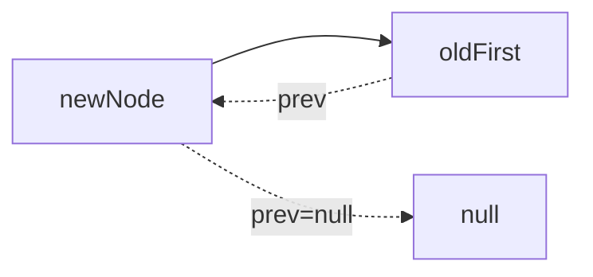

# LinkedList 原理与工程实践

> 本章承接 `02-ArrayList原理与工程实践`，从动态数组转向双向链表，重点区分 **List 契约、Deque 契约与 OpenJDK 实现细节**，并把节点结构、首尾操作、按索引访问、迭代器、内存成本和工程选型串成完整知识链。
>
> 示例以 **Java 21** 为编译基线；涉及 Java 21 Sequenced Collections 的 API 会单独说明。

---

## 03.1 本章定位

`LinkedList` 是 Java 集合框架中最典型的双向链表实现，同时实现 `List` 与 `Deque`。它经常被概括成“增删快、查询慢”，但这个结论过于粗糙：如果插入前必须先按索引找到节点，整体仍然可能是 O(n)；如果只是高频两端入队出队，`ArrayDeque` 往往又比 `LinkedList` 更值得优先考虑。

学完本章，应能够准确回答：

- LinkedList 为什么是双向链表，而不是单向链表？
- `first`、`last`、`Node.prev`、`Node.next` 分别解决什么问题？
- `get(index)` 为什么不是简单从头遍历？
- `add(index, e)` 为什么不能笼统说是 O(1)？
- 已经拿到节点之后插入、删除为什么可以是 O(1)？
- `ListIterator` 为什么特别适合 LinkedList？
- `LinkedList` 同时实现 `List` 与 `Deque` 有什么工程意义？
- `peek/poll/offer` 与 `getFirst/removeFirst/addFirst` 有什么差别？
- `push/pop` 为什么能把 LinkedList 当栈？
- 为什么现代 Java 代码通常优先用 `ArrayDeque` 做栈或队列？
- LinkedList 允许 `null`，为什么队列场景仍不建议放 null？
- fail-fast 为什么不是线程安全机制？
- Java 21 的 Sequenced API 对 LinkedList 有什么变化？
- `reversed()` 为什么是视图而不是拷贝？
- LinkedList 在内存、GC、CPU Cache 上为什么可能输给 ArrayList？

本章不讨论并发链表或阻塞队列；并发集合留在 `1.2-并发编程`。

---

## 03.2 学习主线

```text
List / Deque 契约
↓
双向链表 + first / last
↓
Node(item, prev, next)
↓
首尾插入与删除
↓
按索引定位 node(index)
↓
中间插入 / 删除
↓
Iterator / ListIterator / descendingIterator
↓
Queue / Deque / Stack 语义
↓
fail-fast 与并发边界
↓
Java 21 Sequenced API
↓
ArrayList / ArrayDeque 对比
↓
内存、GC 与工程选型
```

分析 LinkedList 操作时，先问三个问题：

1. **是否已经知道目标节点？**
2. **是否需要按索引先定位节点？**
3. **操作发生在首尾还是中间？**

这三个问题直接决定真实复杂度。

---

## 03.3 类型层次与双重身份

简化类型关系：

```text
Iterable<E>
└── Collection<E>
    ├── List<E>
    │   └── LinkedList<E>
    └── Queue<E>
        └── Deque<E>
            └── LinkedList<E>
```

OpenJDK 中 `LinkedList<E>` 继承 `AbstractSequentialList<E>`，并实现：

```text
List<E>
Deque<E>
Cloneable
Serializable
```

所以 LinkedList 同时具备：

- 列表：按顺序保存、允许重复、支持索引 API；
- 队列：队首查看、删除，队尾插入；
- 双端队列：首尾都能插入、删除、查看；
- 栈：通过 `push/pop/peek` 表达 LIFO。

这也是 LinkedList API 看起来比 ArrayList 多很多首尾方法的原因。

---

## 03.4 核心数据模型

概念模型：

```text
LinkedList
├── int size
├── Node first
└── Node last

Node
├── item
├── prev
└── next
```

示意：

```text
first
  ↓
┌─────┐    ┌─────┐    ┌─────┐
│  A  │ ⇄  │  B  │ ⇄  │  C  │
└─────┘    └─────┘    └─────┘
                         ↑
                        last
```

边界不变量：

```text
空表：
size = 0
first = null
last = null

非空：
first.prev = null
last.next = null
```

和 ArrayList 最大区别是：LinkedList 没有连续的引用数组，每个元素都被包装在独立节点中。

---

## 03.5 Node 为什么需要 prev 与 next

单向链表节点只需要：

```text
item + next
```

LinkedList 使用双向节点：

```text
prev + item + next
```

代价是每个节点多保存一个前驱引用，但换来：

- 可以从尾部向前遍历；
- 删除已知节点时可以直接定位前驱；
- `ListIterator.previous()` 可以常数时间向前走一步；
- `removeLast()` 不需要从头扫描；
- `node(index)` 可以从离 index 更近的一端开始。

这就是双向链表的核心交换：**更多内存换更强的双向导航能力。**

---

## 03.6 first 与 last 的价值

如果链表只保存 `first`，尾部追加需要从头找到最后一个节点，成本 O(n)。

LinkedList 同时保存 `last`：

```text
addLast   → 直接访问 last
removeLast→ 直接访问 last
getLast   → 直接访问 last
```

因此首尾操作可以避开遍历。

这是判断 LinkedList 是否适合某个场景的重要前提：**它真正有优势的是“已知链端或已知节点”的结构修改。**

---

## 03.7 空链表到第一个节点

插入第一个元素时，逻辑上需要同时维护：

```text
first = newNode
last  = newNode
size  = 1
```

节点本身：

```text
prev = null
next = null
```

此时 first 和 last 指向同一个节点。

后续第二个元素加入尾部后：

```text
first != last
```

这类边界状态是源码中最容易出现空指针或断链 bug 的地方，因此链表源码经常把首部、尾部操作拆成专门辅助方法。

---

## 03.8 linkFirst 的概念流程

在头部加入元素：

```text
保存旧 first
↓
创建新节点
prev = null
next = 旧 first
↓
first = 新节点
↓
如果原来为空：last = 新节点
否则：旧 first.prev = 新节点
↓
size++
```

Mermaid：



整个操作不需要遍历，因此典型复杂度为 O(1)。

---

## 03.9 linkLast 的概念流程

尾部追加：

```text
保存旧 last
↓
创建新节点
prev = 旧 last
next = null
↓
last = 新节点
↓
如果原来为空：first = 新节点
否则：旧 last.next = 新节点
↓
size++
```

这也是 O(1)。

因此：

```java
add(e)
addLast(e)
offer(e)
offerLast(e)
```

在 LinkedList 上最终都属于尾部追加语义。

---

## 03.10 中间插入的真正成本

很多面试答案说：

> 链表中间插入 O(1)。

这句话只有在 **已经持有插入位置节点引用** 时成立。

对于：

```java
list.add(index, value);
```

LinkedList 必须先找到 index 对应节点：

```text
node(index)        O(n)
↓
调整前后指针       O(1)
```

总体：

```text
O(n) + O(1) = O(n)
```

所以不能只看“改指针”的局部成本。

---

## 03.11 node(index) 的首尾折半查找

LinkedList 不会永远从 first 开始。

概念逻辑：

```text
如果 index 位于前半段
    从 first 向 next 走
否则
    从 last 向 prev 走
```

判断通常等价于：

```text
index < size / 2
```

例如 size=100：

```text
get(2)  → 从头走约 2 步
get(98) → 从尾走约 1 步
get(50) → 仍需走约 49~50 步
```

因此更准确的访问成本是：

```text
O(min(index, size - 1 - index))
```

大 O 仍记作 O(n)。

---

## 03.12 get(index)

`get(index)` 的逻辑：

```text
检查索引
↓
node(index)
↓
返回 node.item
```

因此它不是随机访问。

对比：

```text
ArrayList.get(index)
→ 直接数组寻址
→ O(1)

LinkedList.get(index)
→ 沿节点走
→ O(n)
```

这也是 LinkedList **没有实现 `RandomAccess`** 的根本原因。

---

## 03.13 set(index, value)

`set` 先定位节点，再替换节点的 item：

```text
node(index) → O(n)
修改 item  → O(1)
```

所以总体 O(n)。

它不改变节点数量，也不改变链表拓扑，因此通常不属于结构性修改。

这与 `add/remove` 不同，后者会改变节点数量和链路关系。

---

## 03.14 add(index, value)

边界：

```text
0 <= index <= size
```

两种路径：

```text
index == size
→ 直接尾插 O(1)

index < size
→ 先 node(index) O(n)
→ 在该节点之前插入 O(1)
```

所以：

- `add(size, e)`：O(1)；
- `add(0, e)`：可直接头插，典型 O(1)；
- 普通中间 index：总体 O(n)。

---

## 03.15 在已知节点前插入

假设已有：

```text
pred ⇄ succ
```

要插入 newNode：

```text
pred ⇄ newNode ⇄ succ
```

需要修改的关系：

```text
newNode.prev = pred
newNode.next = succ
succ.prev = newNode
pred.next = newNode   // pred 不为空时
```

链表插入的算法本身确实是常数次引用修改。

关键不是“链表插入快不快”，而是：

> **你有没有已经拿到那个节点？**

---

## 03.16 unlink：删除已知节点

删除：

```text
pred ⇄ target ⇄ succ
```

变成：

```text
pred ⇄ succ
```

概念步骤：

```text
pred.next = succ
succ.prev = pred
target.item = null
target.prev = null
target.next = null
size--
```

首节点或尾节点需要额外更新 first / last。

如果 target 已经拿到，删除本身是 O(1)。

---

## 03.17 为什么删除后清空节点引用

当前 OpenJDK 实现会主动断开已删除节点对：

```text
item
prev
next
```

的引用。

作用：

- 解除元素强引用；
- 解除节点之间的额外可达关系；
- 有利于 GC 更快判定对象不可达；
- 避免迭代器或临时引用意外拖住更大的节点链。

这是实现层的内存清理策略，不是 List API 的语义要求。

---

## 03.18 remove(index)

和 `get(index)` 类似：

```text
检查索引
↓
node(index)   O(n)
↓
unlink(node) O(1)
```

总体 O(n)。

特殊情况：

```text
remove(0)
removeFirst()
```

可以直接操作 first，O(1)。

```text
remove(size - 1)
removeLast()
```

可以直接操作 last，O(1)。

---

## 03.19 remove(Object)

按值删除需要顺序寻找第一个相等元素。

逻辑：

```text
从 first 开始
↓
逐节点比较
↓
找到第一个匹配
↓
unlink
```

因此通常 O(n)。

即使删除本身 O(1)，**查找目标值仍然 O(n)**。

---

## 03.20 null 元素支持

LinkedList 允许 null：

```java
LinkedList<String> list = new LinkedList<>();
list.add(null);
```

按值搜索时实现必须区分：

```text
目标是 null
→ 判断 node.item == null

目标非 null
→ equals 比较
```

但“允许 null”不等于“所有场景都应该使用 null”。

特别是队列 API 中：

```java
poll()
peek()
```

会用 null 表示“队列为空”，此时元素本身再允许 null 会造成语义模糊。

---

## 03.21 contains / indexOf / lastIndexOf

典型复杂度：

| 方法 | 方向 | 复杂度 |
|---|---|---|
| `contains` | 从头 | O(n) |
| `indexOf` | 从头 | O(n) |
| `lastIndexOf` | 从尾 | O(n) |

LinkedList 可以双向走，但“按值查找”仍没有额外索引结构，因此不会自动变成 O(log n) 或 O(1)。

---

## 03.22 clear

`clear()` 不是简单：

```text
first = null
last = null
size = 0
```

当前 OpenJDK 实现会遍历节点并主动清理节点中的 item / prev / next 引用，然后再清空 first、last、size。

因此其典型时间复杂度是 O(n)。

这种实现更利于及时解除对象图引用，但也意味着清空超大 LinkedList 需要线性工作量。

---

## 03.23 size()

LinkedList 保存独立的 `size` 字段，所以：

```java
list.size();
```

不需要数节点。

复杂度 O(1)。

不要因为“链表长度需要遍历”这个数据结构课上的简化模型，就误认为 Java LinkedList.size() 是 O(n)。

---

## 03.24 ListIterator 为什么特别适合 LinkedList

`ListIterator` 能：

- `next()` 向后；
- `previous()` 向前；
- `add()` 在当前位置插入；
- `remove()` 删除最近返回节点；
- `set()` 替换最近返回元素。

对于 LinkedList，一旦迭代器已经持有当前位置节点：

```text
向前一步 / 向后一步 → O(1)
当前位置插入 / 删除 → O(1)
```

这才是链表“局部修改快”的典型使用方式。

---

## 03.25 listIterator(index) 仍有初始定位成本

不要误解为：

```java
list.listIterator(500000);
```

立即 O(1)。

创建指定位置迭代器时，仍要找到起始节点。

因此：

```text
初始化到 index → O(n)
后续连续 next/previous → 每步 O(1)
```

如果需要连续处理一段区间，ListIterator 可以把“重复按索引定位”优化成“一次定位 + 顺序走”。

---

## 03.26 最危险的反模式：索引 for 循环

错误思路：

```java
for (int i = 0; i < list.size(); i++) {
    consume(list.get(i));
}
```

对于 ArrayList：

```text
n 次 O(1) → O(n)
```

对于 LinkedList：

```text
每次 get(i) 都重新走链
→ 0 + 1 + 2 + ... + n
→ O(n²)
```

正确：

```java
for (E value : list) {
    consume(value);
}
```

或显式 Iterator。

这是 LinkedList 高频性能坑。

---

## 03.27 Iterator 与 fail-fast

LinkedList 迭代器保存类似：

```text
expectedModCount
```

结构性修改发生后，迭代器在后续操作中比较：

```text
expectedModCount
vs
modCount
```

不一致时通常抛：

```text
ConcurrentModificationException
```

这叫 fail-fast。

但它是 **尽力检测错误修改**，不是：

- 锁；
- volatile 可见性机制；
- 并发安全保证；
- 业务一致性协议。

---

## 03.28 迭代中正确删除

错误：

```java
for (String value : list) {
    if (needRemove(value)) {
        list.remove(value);
    }
}
```

可能触发 CME。

正确：

```java
Iterator<String> it = list.iterator();
while (it.hasNext()) {
    String value = it.next();
    if (needRemove(value)) {
        it.remove();
    }
}
```

或者：

```java
list.removeIf(this::needRemove);
```

核心原则：

> 迭代期间的结构修改必须通过当前迭代协议允许的路径完成。

---

## 03.29 descendingIterator

LinkedList 作为 Deque 支持：

```java
Iterator<E> it = list.descendingIterator();
```

遍历方向：

```text
last → ... → first
```

这比：

```java
for (int i = list.size() - 1; i >= 0; i--) {
    list.get(i);
}
```

高效得多。

后者在 LinkedList 上仍可能退化为 O(n²)。

---

## 03.30 Queue 方法族

把 LinkedList 当 Queue：

| 语义 | 抛异常 | 返回特殊值 |
|---|---|---|
| 入队 | `add(e)` | `offer(e)` |
| 出队 | `remove()` | `poll()` |
| 查看队首 | `element()` | `peek()` |

LinkedList 是无固定容量链表，正常情况下 `offer` 不会因为容量满失败。

工程上仍推荐按 Queue 接口声明：

```java
Queue<Task> queue = new LinkedList<>();
```

而不是让上层依赖全部 LinkedList API。

---

## 03.31 Deque 首尾方法族

双端队列 API：

```text
addFirst / offerFirst
addLast  / offerLast

removeFirst / pollFirst
removeLast  / pollLast

getFirst / peekFirst
getLast  / peekLast
```

抛异常版与特殊值版的差异主要发生在空队列。

例如：

```text
removeFirst() → 空时 NoSuchElementException
pollFirst()   → 空时 null
```

---

## 03.32 Stack 语义：push / pop / peek

Deque 可以表达栈：

```java
Deque<String> stack = new LinkedList<>();

stack.push("A");
stack.push("B");

String top = stack.pop();
```

语义：

```text
push(e) → addFirst(e)
pop()   → removeFirst()
peek()  → 查看 first
```

因此 top 位于链表头部。

但新代码如果只是栈/队列，通常优先考虑 `ArrayDeque`。

---

## 03.33 为什么 ArrayDeque 通常优先

LinkedList 与 ArrayDeque 都实现 Deque，但 ArrayDeque 通常具备：

- 连续数组，更好的缓存局部性；
- 无每元素 Node 对象；
- 更少对象分配；
- 更低 GC 压力；
- 首尾操作同样高效；
- 更适合普通栈与队列。

LinkedList 的优势更偏向：

- List 与 Deque 双重语义确实同时需要；
- 已有 ListIterator 并在中间高频局部修改；
- 需要某些 LinkedList 特定行为且有明确证据。

不要因为“链表两端 O(1)”就自动优先 LinkedList。

---

## 03.34 LinkedList vs ArrayList

| 维度 | ArrayList | LinkedList |
|---|---|---|
| 底层 | 动态数组 | 双向链表 |
| 随机 get | O(1) | O(n) |
| 尾部 add | 均摊 O(1) | O(1) |
| 头部 add | O(n) 搬移 | O(1) |
| 中间 add(index) | O(n) 搬移 | O(n) 定位 |
| 已知节点删除 | 无节点概念 | O(1) |
| 内存局部性 | 好 | 较差 |
| 每元素额外节点 | 无 | 有 |
| RandomAccess | 是 | 否 |
| Deque | 否 | 是 |
| 默认业务 List | 通常优先 | 需明确场景 |

真正的选型不能只看 Big-O，还要考虑 CPU Cache、对象分配、访问模式和数据规模。

---

## 03.35 “增删快”为什么经常误导

下面三个场景差别巨大：

### 场景 A：头删

```java
list.removeFirst();
```

O(1)。

### 场景 B：按索引删中间

```java
list.remove(500000);
```

先定位，O(n)。

### 场景 C：迭代器当前节点删除

```java
iterator.remove();
```

当前节点已知，局部 O(1)。

所以更准确的表达是：

> LinkedList 在已知链端或已知节点时结构修改代价低；通过 index/value 找节点仍需线性查找。

---

## 03.36 内存成本

LinkedList 每个逻辑元素通常伴随一个 Node 对象。

节点至少包含概念字段：

```text
item
prev
next
```

还要考虑：

- 对象头；
- 对齐填充；
- 压缩对象指针是否启用；
- JVM 位数；
- GC 实现。

因此不能脱离 JVM 配置死背“一个节点固定多少字节”。

正确结论：

> LinkedList 每元素有明显额外节点和引用开销，通常比只保存引用数组的 ArrayList 更耗内存。

---

## 03.37 CPU Cache 与指针追逐

ArrayList：

```text
引用槽位连续
→ CPU 预取友好
→ 顺序遍历局部性较好
```

LinkedList：

```text
Node 分散在堆中
→ next 指向另一个对象
→ 指针追逐
→ 更容易产生 Cache Miss
```

因此即使两个操作理论复杂度相同，实际常数因子也可能差异明显。

这也是为什么工程性能不能只背复杂度。

---

## 03.38 GC 压力

构建 n 个 LinkedList 元素通常意味着：

```text
n 个元素引用
+
n 个 Node 对象
```

相比 ArrayList：

```text
一个较大的 Object[] 数组
+
元素引用
```

LinkedList 会产生更多小对象。

潜在影响：

- 分配速率更高；
- GC 需要扫描更多对象；
- 对象图更分散；
- 长链遍历成本更高。

具体差异必须通过真实 JDK、GC 和数据规模基准验证。

---

## 03.39 clone 与浅复制

LinkedList 实现 Cloneable。

浅复制语义：

```text
新 LinkedList 结构
↓
新的 Node 链
↓
Node.item 仍引用原来的元素对象
```

所以：

- 链表结构独立；
- 元素对象共享；
- 修改副本的节点增删不影响原结构；
- 修改共享元素内部状态双方都可见。

现代业务代码通常更推荐：

```java
new LinkedList<>(source)
```

表达意图更清晰。

---

## 03.40 Collection 构造器

```java
new LinkedList<>(source)
```

语义：

- 按 source 的迭代顺序加入；
- 创建新的节点结构；
- 复制的是元素引用；
- 不深拷贝元素；
- source 为 null 会失败。

如果只是需要普通 List 副本，不要默认认为 LinkedList 比 ArrayList 更合适。

---

## 03.41 toArray

LinkedList 支持：

```java
Object[] array = list.toArray();
String[] typed = list.toArray(String[]::new);
```

转换时必须遍历整条链，将元素引用写入新数组。

因此通常 O(n)。

数组结果结构独立，但数组内元素引用仍与链表共享。

---

## 03.42 Java 21 Sequenced Collections

Java 21 引入 Sequenced Collections 后，List / Deque 在接口层统一首尾与反向视图能力。

LinkedList 原本就具备很多 Deque 首尾方法，所以对它而言变化更像：

> **原有能力被纳入统一的 SequencedCollection 契约。**

常用：

```java
list.getFirst();
list.getLast();
list.addFirst(value);
list.addLast(value);
list.removeFirst();
list.removeLast();
```

这些方法在 LinkedList 上天然匹配链表首尾结构。

---

## 03.43 reversed 反向视图

Java 21：

```java
LinkedList<String> source =
        new LinkedList<>(List.of("A", "B", "C"));

var reversed = source.reversed();
```

语义：

```text
source   : A B C
reversed : C B A
```

重点：

- 返回反向顺序视图；
- 不是一次性复制；
- 对视图的允许修改会回写原列表；
- 对原列表修改也可被视图观察到；
- 首尾语义在反向视图中翻转。

如果需要独立副本：

```java
List<String> copy =
        new ArrayList<>(source.reversed());
```

---

## 03.44 反向视图的首尾映射

对于：

```text
source   = [A, B, C]
reversed = [C, B, A]
```

有：

```text
reversed.getFirst() ↔ source.getLast()
reversed.getLast()  ↔ source.getFirst()
```

对 reversed 的头部操作，本质上对应 source 的尾部语义。

这再次说明：

> reversed 是一个顺序映射视图，而不是“把原链表物理反转”。

---

## 03.45 Spliterator 与并行流

LinkedList 支持 Spliterator，并保持 encounter order。

但链表不是天然适合并行切分的数据结构：

- 缺少随机访问；
- 分段需要遍历；
- 节点分散；
- 并行开销可能高于收益。

所以：

```java
linkedList.parallelStream()
```

不应因为“并行”两个字就默认更快。

只有大数据量、单元素计算足够重，并经过基准验证时才考虑。

---

## 03.46 线程安全边界

LinkedList 不是线程安全集合。

多个线程并发修改可能导致：

- 数据竞争；
- 链接关系异常；
- size 与节点状态不一致；
- 迭代异常；
- 可见性问题。

可以：

```java
List<E> safe =
        Collections.synchronizedList(new LinkedList<>());
```

但包装器只同步单个方法。

复合逻辑仍需外部同步：

```java
synchronized (safe) {
    if (!safe.isEmpty()) {
        safe.remove(0);
    }
}
```

并发队列场景应优先使用专门的 JUC 队列，而不是给 LinkedList 硬加锁。

---

## 03.47 WMS 工程场景

### 场景一：待处理任务普通 FIFO

不建议：

```java
LinkedList<Task>
```

只因为“队列要头删尾加”。

更常见：

```java
Deque<Task> queue = new ArrayDeque<>();
```

### 场景二：需要 ListIterator 在当前游标附近反复插入/删除

LinkedList 才可能体现结构优势。

### 场景三：批量扫描记录

仍通常优先 ArrayList：

- 主要尾部追加；
- 顺序遍历；
- 偶尔按索引；
- 更低内存成本。

### 场景四：并发任务队列

不要 LinkedList + synchronized 自造轮子。

优先：

```text
ConcurrentLinkedQueue
LinkedBlockingQueue
ArrayBlockingQueue
```

根据阻塞、容量和并发语义选择。

---

## 03.48 性能坏味道

典型坏味道：

- 用 `for (i)` + `get(i)` 遍历 LinkedList；
- 因为“增删快”就把 ArrayList 全部替换成 LinkedList；
- 用 LinkedList 当普通栈，却没评估 ArrayDeque；
- 按 index 中间插入时声称 O(1)；
- 队列中放 null，导致 `poll()` 语义模糊；
- 高频 `contains` 却不建立 Set/Map 索引；
- 共享 LinkedList 依赖 CME 检测并发问题；
- 大量短命 LinkedList 产生大量 Node 对象；
- `listIterator(index)` 被误认为完全 O(1)；
- `parallelStream` 默认认为一定比顺序快。

---

## 03.49 源码阅读清单

阅读 OpenJDK LinkedList 时建议按顺序：

1. `size / first / last`；
2. Node 的 `item / prev / next`；
3. 头插、尾插；
4. 指定节点前插入；
5. 首节点、尾节点、普通节点 unlink；
6. `get/set/add(index)/remove(index)`；
7. `node(index)` 首尾折半；
8. `indexOf / lastIndexOf`；
9. Queue / Deque 方法适配；
10. `ListItr`；
11. `descendingIterator`；
12. `clone / toArray / spliterator`；
13. Java 21 `reversed()`。

每个结论要标明：

```text
API 契约
或
当前 OpenJDK 实现
```

---

## 03.50 本章决策清单

1. 真的需要链表，还是只是需要 List？
2. 是否频繁随机 get(index)？
3. 是否只是做普通队列或栈？
4. 能否使用 ArrayDeque？
5. 中间修改前是否已经持有迭代器位置？
6. 是否把“改指针 O(1)”误当成“按 index 插入 O(1)”？
7. 是否大量使用 contains？
8. 是否允许 null，业务是否真的需要？
9. 是否跨线程共享？
10. 数据量大时 Node 内存和 GC 是否可接受？
11. 是否存在索引循环导致 O(n²)？
12. reversed 需要视图还是独立副本？
13. Java 版本是否为 21+？
14. 当前性能结论是否经过真实基准？

---

## 03.51 可运行实验

以下实验均为独立 Java 文件，编译基线为 Java 21。

### 实验1：首尾追加

```java
import java.util.LinkedList;

public class LinkedListEndsDemo {
    public static void main(String[] args) {
        LinkedList<String> list = new LinkedList<>();
        list.addFirst("B");
        list.addFirst("A");
        list.addLast("C");
        System.out.println(list);
    }
}
```

预期输出：

```text
[A, B, C]
```

### 实验2：getFirst 与 getLast

```java
import java.util.LinkedList;
import java.util.List;

public class LinkedListFirstLastDemo {
    public static void main(String[] args) {
        LinkedList<String> list =
                new LinkedList<>(List.of("A", "B", "C"));
        System.out.println(list.getFirst());
        System.out.println(list.getLast());
    }
}
```

预期输出：

```text
A
C
```

### 实验3：按索引插入

```java
import java.util.LinkedList;
import java.util.List;

public class LinkedListIndexedAddDemo {
    public static void main(String[] args) {
        LinkedList<String> list =
                new LinkedList<>(List.of("A", "C"));
        list.add(1, "B");
        System.out.println(list);
    }
}
```

预期输出：

```text
[A, B, C]
```

### 实验4：按索引删除

```java
import java.util.LinkedList;
import java.util.List;

public class LinkedListIndexedRemoveDemo {
    public static void main(String[] args) {
        LinkedList<String> list =
                new LinkedList<>(List.of("A", "B", "C"));
        String removed = list.remove(1);
        System.out.println(removed);
        System.out.println(list);
    }
}
```

预期输出：

```text
B
[A, C]
```

### 实验5：按对象删除第一个匹配

```java
import java.util.LinkedList;
import java.util.List;

public class LinkedListRemoveObjectDemo {
    public static void main(String[] args) {
        LinkedList<String> list =
                new LinkedList<>(List.of("A", "B", "A"));
        list.remove("A");
        System.out.println(list);
    }
}
```

预期输出：

```text
[B, A]
```

### 实验6：null 元素

```java
import java.util.LinkedList;

public class LinkedListNullDemo {
    public static void main(String[] args) {
        LinkedList<String> list = new LinkedList<>();
        list.add(null);
        list.add("A");
        System.out.println(list.indexOf(null));
        System.out.println(list);
    }
}
```

预期输出：

```text
0
[null, A]
```

### 实验7：Queue offer poll peek

```java
import java.util.LinkedList;
import java.util.Queue;

public class LinkedListQueueDemo {
    public static void main(String[] args) {
        Queue<String> queue = new LinkedList<>();
        queue.offer("A");
        queue.offer("B");
        System.out.println(queue.peek());
        System.out.println(queue.poll());
        System.out.println(queue);
    }
}
```

预期输出：

```text
A
A
[B]
```

### 实验8：Deque 两端操作

```java
import java.util.Deque;
import java.util.LinkedList;

public class LinkedListDequeDemo {
    public static void main(String[] args) {
        Deque<String> deque = new LinkedList<>();
        deque.addFirst("B");
        deque.addFirst("A");
        deque.addLast("C");
        System.out.println(deque.pollFirst());
        System.out.println(deque.pollLast());
        System.out.println(deque);
    }
}
```

预期输出：

```text
A
C
[B]
```

### 实验9：栈 push pop

```java
import java.util.Deque;
import java.util.LinkedList;

public class LinkedListStackDemo {
    public static void main(String[] args) {
        Deque<String> stack = new LinkedList<>();
        stack.push("A");
        stack.push("B");
        System.out.println(stack.pop());
        System.out.println(stack.peek());
    }
}
```

预期输出：

```text
B
A
```

### 实验10：ListIterator 双向遍历

```java
import java.util.LinkedList;
import java.util.List;
import java.util.ListIterator;

public class LinkedListListIteratorDemo {
    public static void main(String[] args) {
        LinkedList<String> list =
                new LinkedList<>(List.of("A", "B", "C"));
        ListIterator<String> it = list.listIterator(list.size());
        while (it.hasPrevious()) {
            System.out.print(it.previous());
        }
    }
}
```

预期输出：

```text
CBA
```

### 实验11：ListIterator 当前位插入

```java
import java.util.LinkedList;
import java.util.List;
import java.util.ListIterator;

public class LinkedListIteratorAddDemo {
    public static void main(String[] args) {
        LinkedList<String> list =
                new LinkedList<>(List.of("A", "C"));
        ListIterator<String> it = list.listIterator(1);
        it.add("B");
        System.out.println(list);
    }
}
```

预期输出：

```text
[A, B, C]
```

### 实验12：Iterator 安全删除

```java
import java.util.Iterator;
import java.util.LinkedList;
import java.util.List;

public class LinkedListIteratorRemoveDemo {
    public static void main(String[] args) {
        LinkedList<Integer> list =
                new LinkedList<>(List.of(1, 2, 3, 4));
        Iterator<Integer> it = list.iterator();
        while (it.hasNext()) {
            if (it.next() % 2 == 0) {
                it.remove();
            }
        }
        System.out.println(list);
    }
}
```

预期输出：

```text
[1, 3]
```

### 实验13：直接修改触发 fail-fast

```java
import java.util.ConcurrentModificationException;
import java.util.Iterator;
import java.util.LinkedList;
import java.util.List;

public class LinkedListFailFastDemo {
    public static void main(String[] args) {
        LinkedList<String> list =
                new LinkedList<>(List.of("A", "B"));
        Iterator<String> it = list.iterator();
        list.add("C");

        try {
            it.next();
        } catch (ConcurrentModificationException e) {
            System.out.println("CME");
        }
    }
}
```

预期输出：

```text
CME
```

### 实验14：descendingIterator

```java
import java.util.Iterator;
import java.util.LinkedList;
import java.util.List;

public class LinkedListDescendingDemo {
    public static void main(String[] args) {
        LinkedList<String> list =
                new LinkedList<>(List.of("A", "B", "C"));
        Iterator<String> it = list.descendingIterator();
        while (it.hasNext()) {
            System.out.print(it.next());
        }
    }
}
```

预期输出：

```text
CBA
```

### 实验15：clear

```java
import java.util.LinkedList;
import java.util.List;

public class LinkedListClearDemo {
    public static void main(String[] args) {
        LinkedList<String> list =
                new LinkedList<>(List.of("A", "B"));
        list.clear();
        System.out.println(list.size());
        System.out.println(list.isEmpty());
    }
}
```

预期输出：

```text
0
true
```

### 实验16：拷贝构造是浅复制

```java
import java.util.LinkedList;
import java.util.List;

public class LinkedListShallowCopyDemo {
    static final class Item {
        String name;
        Item(String name) { this.name = name; }
    }

    public static void main(String[] args) {
        Item item = new Item("A");
        LinkedList<Item> source =
                new LinkedList<>(List.of(item));
        LinkedList<Item> copy = new LinkedList<>(source);

        copy.getFirst().name = "X";
        System.out.println(source.getFirst().name);
    }
}
```

预期输出：

```text
X
```

### 实验17：clone 结构独立、元素共享

```java
import java.util.LinkedList;

public class LinkedListCloneDemo {
    public static void main(String[] args) {
        LinkedList<StringBuilder> source = new LinkedList<>();
        source.add(new StringBuilder("A"));

        @SuppressWarnings("unchecked")
        LinkedList<StringBuilder> copy =
                (LinkedList<StringBuilder>) source.clone();

        copy.add(new StringBuilder("B"));
        copy.getFirst().append("X");

        System.out.println(source.size());
        System.out.println(copy.size());
        System.out.println(source.getFirst());
    }
}
```

预期输出：

```text
1
2
AX
```

### 实验18：Java 21 reversed 是视图

```java
import java.util.LinkedList;
import java.util.List;

public class LinkedListReversedDemo {
    public static void main(String[] args) {
        LinkedList<String> source =
                new LinkedList<>(List.of("A", "B", "C"));

        LinkedList<String> reversed = source.reversed();
        reversed.set(0, "X");

        System.out.println(reversed);
        System.out.println(source);
    }
}
```

预期输出：

```text
[X, B, A]
[A, B, X]
```

### 实验19：反向视图首尾映射

```java
import java.util.LinkedList;
import java.util.List;

public class LinkedListReversedEndsDemo {
    public static void main(String[] args) {
        LinkedList<String> source =
                new LinkedList<>(List.of("A", "B", "C"));

        LinkedList<String> reversed = source.reversed();
        reversed.addFirst("D");

        System.out.println(source);
        System.out.println(reversed);
    }
}
```

预期输出：

```text
[A, B, C, D]
[D, C, B, A]
```

### 实验20：toArray 结构独立

```java
import java.util.LinkedList;
import java.util.List;

public class LinkedListToArrayDemo {
    public static void main(String[] args) {
        LinkedList<String> list =
                new LinkedList<>(List.of("A", "B"));

        String[] array = list.toArray(String[]::new);
        array[0] = "X";

        System.out.println(list);
        System.out.println(java.util.Arrays.toString(array));
    }
}
```

预期输出：

```text
[A, B]
[X, B]
```

---

## 03.52 高频面试题

1. LinkedList 的底层数据结构是什么？
2. LinkedList 为什么使用双向链表？
3. LinkedList 的 first 和 last 字段分别有什么作用？
4. Node 中 item、prev、next 分别表示什么？
5. 空 LinkedList 的 first 和 last 是什么？
6. 只有一个元素时 first 和 last 有什么关系？
7. LinkedList 是否实现 RandomAccess？为什么？
8. LinkedList 为什么继承 AbstractSequentialList？
9. LinkedList 同时实现 List 和 Deque 有什么意义？
10. LinkedList 是否允许重复元素？
11. LinkedList 是否允许 null？
12. LinkedList 是否线程安全？
13. add(E) 在 LinkedList 中是什么语义？
14. addFirst 与 addLast 的复杂度分别是什么？
15. removeFirst 与 removeLast 的复杂度分别是什么？
16. get(index) 为什么是 O(n)？
17. node(index) 为什么会从头或尾选择更近的一端？
18. LinkedList.get(size-1) 是否一定需要遍历整个链表？
19. LinkedList.size() 为什么是 O(1)？
20. set(index,e) 的复杂度为什么仍是 O(n)？
21. 为什么不能简单说 LinkedList.add(index,e) 是 O(1)？
22. 什么条件下链表中间插入才真正接近 O(1)？
23. remove(index) 的真正复杂度是什么？
24. Iterator.remove 为什么能避免重新按索引查找？
25. remove(Object) 为什么是 O(n)？
26. contains 为什么没有因为双向链表变成 O(1)？
27. indexOf 和 lastIndexOf 的遍历方向有什么区别？
28. LinkedList.clear() 为什么当前实现需要 O(n)？
29. 删除节点后为什么要断开 item/prev/next 引用？
30. LinkedList 的结构性修改是什么？
31. set 是否通常属于结构性修改？
32. modCount 在 LinkedList 中用于什么？
33. fail-fast 能否保证并发正确性？
34. 为什么 CME 不能作为线程同步方案？
35. ListIterator 相比 Iterator 多了哪些能力？
36. ListIterator 为什么特别适合 LinkedList？
37. listIterator(index) 是否完全 O(1)？
38. 为什么索引 for 循环遍历 LinkedList 可能 O(n²)？
39. LinkedList 应该如何高效顺序遍历？
40. descendingIterator 有什么价值？
41. LinkedList 作为 Queue 时 add 与 offer 有什么区别？
42. remove 与 poll 有什么区别？
43. element 与 peek 有什么区别？
44. LinkedList 作为 Deque 支持哪些首尾 API？
45. push/pop/peek 如何把 Deque 当栈？
46. 为什么新代码通常用 Deque 替代 Stack？
47. 为什么普通栈/队列通常更推荐 ArrayDeque 而不是 LinkedList？
48. LinkedList 允许 null，为什么队列场景仍不建议存 null？
49. ArrayList 与 LinkedList 随机访问的差异是什么？
50. ArrayList 与 LinkedList 尾部追加谁更快？
51. ArrayList 与 LinkedList 头部插入有什么差异？
52. 中间插入时为什么不能只看搬移和改指针？
53. LinkedList 每个元素为什么有额外内存成本？
54. 为什么 LinkedList 的 CPU Cache 局部性较差？
55. 为什么 LinkedList 可能带来更高 GC 压力？
56. 能否死背 LinkedList 每个 Node 的固定字节数？为什么？
57. LinkedList clone 是深复制还是浅复制？
58. new LinkedList<>(source) 是否深拷贝元素？
59. toArray 后数组与链表是否共享结构？
60. Java 21 Sequenced Collections 对 LinkedList 有什么意义？
61. LinkedList.reversed() 返回视图还是副本？
62. reversed 修改是否会回写原列表？
63. 反向视图的 getFirst 对应原列表哪个端？
64. LinkedList.parallelStream 是否天然高效？
65. LinkedList 的 Spliterator 为什么并不意味着链表适合并行？
66. Collections.synchronizedList 能否让复合操作自动原子？
67. 同步包装后遍历为什么仍需要外部同步？
68. 并发队列为什么不建议 LinkedList + synchronized 自己实现？
69. WMS FIFO 任务队列为什么通常优先 ArrayDeque？
70. 什么业务场景下 LinkedList 可能真正有优势？
71. 频繁 contains 的 LinkedList 应该如何优化？
72. 如果需要按 key 查找为什么应该考虑 Map？
73. 如果需要成员判断为什么应该考虑 Set？
74. LinkedList 是否适合作为百万级扫描结果容器？为什么？
75. 为什么“增删快、查询慢”不足以作为工程选型结论？
76. 如何向面试官准确表达 LinkedList 中间删除复杂度？
77. 为什么 first/last 能让两端操作 O(1)？
78. 双向链表相对单向链表的代价是什么？
79. LinkedList 与 ArrayDeque 的核心取舍是什么？
80. LinkedList 与 ArrayList 的默认选型原则是什么？

---

## 03.53 易错点

### 易错点 1：LinkedList 中间插入永远是 O(1)

**正解：** 按 index 插入前通常要先 O(n) 定位节点；只有节点已知时局部改指针才是 O(1)。

### 易错点 2：LinkedList.get(index) 总是从头遍历

**正解：** 会根据 index 所在前后半区选择从 first 或 last 出发。

### 易错点 3：LinkedList.size() 是 O(n)

**正解：** Java LinkedList 保存 size 字段，size() 是 O(1)。

### 易错点 4：链表删除一定比 ArrayList 快

**正解：** 如果要先按 index 或 value 查找，LinkedList 同样要线性定位。

### 易错点 5：LinkedList 适合所有频繁增删场景

**正解：** 要看是否已知节点、是否首尾操作、是否存在大量随机访问。

### 易错点 6：LinkedList 比 ArrayList 更省内存

**正解：** 每个元素需要额外 Node 对象和 prev/next 引用，通常更耗内存。

### 易错点 7：LinkedList 顺序遍历一定比 ArrayList 快

**正解：** 节点分散会产生更多指针追逐和 Cache Miss。

### 易错点 8：LinkedList 实现 RandomAccess

**正解：** 它没有实现 RandomAccess，按索引访问不是常数时间。

### 易错点 9：for(i)+get(i) 是遍历 LinkedList 的正常写法

**正解：** 可能退化为 O(n²)，应使用 Iterator/增强 for。

### 易错点 10：listIterator(index) 创建永远 O(1)

**正解：** 指定中间位置仍要先定位起始节点。

### 易错点 11：Iterator.remove 仍会重新从头找节点

**正解：** 迭代器已持有当前节点，可直接做局部 unlink。

### 易错点 12：set(index,e) 是 O(1)

**正解：** 按 index 找节点仍是 O(n)。

### 易错点 13：remove(Object) 删除本身 O(1)，所以总体 O(1)

**正解：** 查找第一个相等节点 O(n)。

### 易错点 14：contains 能利用双向链表从两头同时找

**正解：** 标准实现按顺序查找，没有额外索引。

### 易错点 15：clear 只把 first/last 置空，所以 O(1)

**正解：** 当前 OpenJDK 实现会遍历并断开节点引用。

### 易错点 16：允许 null 就说明队列应该用 null 作为业务值

**正解：** poll/peek 用 null 表示空，业务 null 会制造歧义。

### 易错点 17：Queue 的 remove 与 poll 完全一样

**正解：** 空队列时 remove 抛异常，poll 返回 null。

### 易错点 18：element 与 peek 完全一样

**正解：** 空队列时 element 抛异常，peek 返回 null。

### 易错点 19：push 在尾部插入

**正解：** Deque 的 push 等价于在头部入栈。

### 易错点 20：LinkedList 是实现栈的最佳选择

**正解：** 普通栈通常优先 ArrayDeque。

### 易错点 21：LinkedList 是实现队列的最佳选择

**正解：** 普通非并发双端队列通常优先 ArrayDeque。

### 易错点 22：ArrayDeque 和 LinkedList 都允许 null

**正解：** ArrayDeque 禁止 null；LinkedList 允许，但队列语义仍不建议用 null。

### 易错点 23：fail-fast 能阻止并发修改

**正解：** 它只是检测机制，不能阻止数据竞争。

### 易错点 24：没抛 CME 就证明并发安全

**正解：** fail-fast 是 best-effort，不能依赖是否抛异常判断线程安全。

### 易错点 25：Collections.synchronizedList 后复合逻辑自动原子

**正解：** 多个方法组成的逻辑仍需同一锁保护。

### 易错点 26：LinkedList 的双向链表让所有操作都可双向优化

**正解：** 按值 contains/indexOf 等仍是线性扫描。

### 易错点 27：Node 对象大小固定不变

**正解：** 受对象头、引用压缩、对齐和 JVM 配置影响。

### 易错点 28：clone 会深拷贝节点中的元素对象

**正解：** 只重建链表结构，元素引用仍共享。

### 易错点 29：Collection 构造器会深拷贝元素

**正解：** 只复制元素引用。

### 易错点 30：toArray 返回 backing array

**正解：** LinkedList 没有 backing array；toArray 会创建数组并遍历复制引用。

### 易错点 31：reversed 会物理反转原链表

**正解：** Java 21 reversed 返回反向视图。

### 易错点 32：reversed 是独立副本

**正解：** 它与原列表联动。

### 易错点 33：反向视图修改不会影响原列表

**正解：** 允许的修改会写回原列表。

### 易错点 34：LinkedList 天生适合 parallelStream

**正解：** 链表切分与缓存局部性并不理想，应基准验证。

### 易错点 35：百万元素用 LinkedList 只会多几个指针，影响不大

**正解：** Node 数量、对象头、GC 与 Cache Miss 都可能显著放大成本。

### 易错点 36：只要需求有头删就必须 LinkedList

**正解：** ArrayDeque 也能高效头尾操作，而且通常更轻量。

### 易错点 37：LinkedList 适合按索引频繁插入

**正解：** 每次 index 定位都可能 O(n)。

### 易错点 38：LinkedList 适合按索引频繁删除

**正解：** 同样存在定位成本。

### 易错点 39：List 类型声明会让 LinkedList 的 Deque 能力消失

**正解：** 运行时能力存在，但编译期只能使用 List 契约；应按需要选择接口类型。

### 易错点 40：“链表增删快”足够支撑选型

**正解：** 应同时评估定位成本、局部性、对象分配、访问模式和基准结果。


## 03.54 工程实践建议

1. 默认业务 List 仍优先 ArrayList，除非有明确链表访问模式。
2. 普通栈和队列优先 ArrayDeque，再考虑 LinkedList。
3. 中间高频修改要尽量通过 ListIterator 持有游标，而不是反复 index 定位。
4. 禁止对大型 LinkedList 使用索引 for + get(i) 遍历。
5. 按值频繁查询时增加 Set 或 Map 索引，而不是持续 contains。
6. 不要把链表局部 O(1) 误写成 API 整体 O(1)。
7. 接口声明按语义选择：List、Queue 或 Deque，而不是无脑暴露 LinkedList。
8. 队列业务值避免 null，即使 LinkedList 技术上允许。
9. 并发队列直接使用 JUC 专用实现，不用 LinkedList + synchronized 造轮子。
10. 性能评估同时记录 JDK 版本、GC、数据规模和访问模式。
11. 大数据量下重点评估 Node 对象分配速率和 GC 压力。
12. 不要死背 Node 固定字节数，使用 JOL 或实际 profiler 验证。
13. 顺序扫描优先 Iterator/增强 for，减少重复定位。
14. 反向扫描使用 descendingIterator 或 reversed 视图。
15. 需要独立反向结果时显式复制 reversed 视图。
16. 跨层返回集合时说明返回的是视图、可变副本还是不可修改快照。
17. 不要把 clone 扩散到领域对象复制协议，优先构造器或明确 copy API。
18. LinkedList 保存可变元素时，复制结构不会隔离元素内部状态。
19. 结构修改期间不要混用直接 list 修改和既有 iterator 修改。
20. fail-fast 只作为 bug 信号，不作为并发控制。
21. synchronizedList 的复合操作必须在同一外部锁中完成。
22. 如果只是头尾双端操作，先比较 ArrayDeque。
23. 如果主要是随机 get/set，直接排除 LinkedList。
24. 如果主要是尾部追加并批量遍历，通常优先 ArrayList。
25. 如果中间插入前本来就只有 index，没有节点句柄，LinkedList 不一定占优。
26. 设计 API 时尽量不要让调用者依赖具体 LinkedList 类型。
27. 大型链表需要关注对象图遍历在 heap dump 和 GC 中的诊断成本。
28. 短生命周期热点路径避免创建大量 LinkedList 小节点。
29. 使用 removeIf 时保证谓词无副作用且计算足够轻。
30. 队列空值语义优先使用 Optional/状态对象，不要塞 null。
31. Java 21 首尾统一 API 不会改变底层复杂度。
32. Java 21 reversed 是视图，写 API 前必须明确回写语义。
33. 对外暴露可修改 reversed 视图要谨慎，避免双向修改难追踪。
34. 评审性能优化时要求基准，而不是凭“数组/链表”印象。
35. 微基准使用 JMH，避免用简单 nanoTime 循环得出错误结论。
36. WMS 扫描、导出、批处理通常更偏 ArrayList。
37. WMS FIFO 内存队列若非并发通常更偏 ArrayDeque。
38. WMS 并发消费队列使用 BlockingQueue/ConcurrentLinkedQueue 等专用结构。
39. 代码审查重点搜索 LinkedList.get(i) 出现在循环中的情况。
40. 面试表达一定补充：已知节点时修改 O(1)，按 index 定位后总体 O(n)。

---

## 03.55 本章小结

- LinkedList 是 `List + Deque` 双重身份的双向链表。
- 核心字段是 `size / first / last`，每个 Node 保存 `item / prev / next`。
- 首尾插入、删除可以 O(1)，因为直接持有 first / last。
- `get/set/add(index)/remove(index)` 中间位置通常需要先 `node(index)`，总体 O(n)。
- `node(index)` 会选择从离目标更近的一端开始遍历。
- 已知节点时，链表插入/删除的局部指针修改才真正是 O(1)。
- `ListIterator` 是 LinkedList 中间局部修改的重要工具。
- `for(i)+get(i)` 遍历 LinkedList 可能退化为 O(n²)。
- LinkedList 允许 null，但 Queue 场景不应依赖 null 业务值。
- fail-fast 只是错误检测，不是线程安全机制。
- Java 21 的 Sequenced API 统一了首尾操作；`reversed()` 是反向视图。
- 普通栈/队列通常优先 ArrayDeque；普通业务 List 通常优先 ArrayList。
- LinkedList 的真实成本还包括 Node 对象、GC 压力和较差的缓存局部性。

---

## 03.56 面试口述版

LinkedList 是 Java 集合框架中的双向链表实现，同时实现 List 和 Deque。内部维护 size、first、last，每个 Node 保存 item、prev、next。它真正的优势是已经知道链端或节点时，插入删除只需要调整常数个指针，所以 addFirst、addLast、removeFirst、removeLast 都可以 O(1)。但如果通过 index 操作，中间还要先调用类似 node(index) 的逻辑定位节点，LinkedList 会根据 index 位于前半还是后半选择从 first 或 last 出发，因此 get、set、普通 add(index)、remove(index) 总体仍是 O(n)。实际工程中不能简单背“链表增删快”，因为还要看定位成本、Node 内存、GC、CPU Cache 和访问模式。普通 List 通常优先 ArrayList，普通栈和队列通常优先 ArrayDeque；LinkedList 更适合确实需要 ListIterator 在当前节点附近频繁局部修改，或者同时需要 List 与 Deque 语义的场景。Java 21 下 LinkedList 也进入 Sequenced Collections 统一首尾 API，reversed 返回的是反向视图而不是副本。

---

## 03.57 参考资料

- Java SE 21 API：`java.util.LinkedList`
- Java SE 21 API：`List`、`Queue`、`Deque`、`SequencedCollection`
- OpenJDK 21 更新分支：`java.util.LinkedList` 源码
- JEP 431：Sequenced Collections
- Java Collections Framework Overview

---

关联模块：

```text
00-泛型基础与集合类型安全
01-集合框架体系与核心契约
02-ArrayList原理与工程实践
04-HashMap原理与源码深度分析
1.2-并发编程 / 并发集合
```
