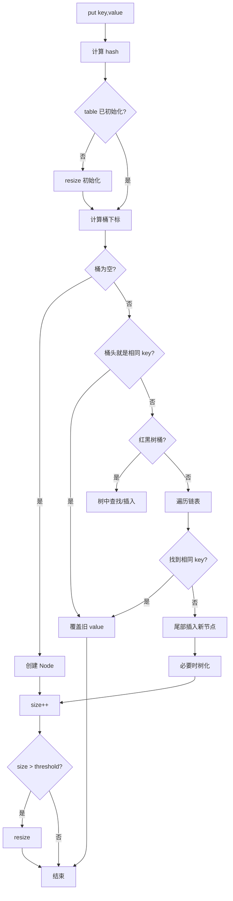

# HashMap 原理与源码深度分析

> **本章定位：面试主线章。**
>
> HashMap 不需要把源码每个分支都背下来。面试真正有区分度的只有几条主线：**底层结构 → hash 与桶定位 → put → 冲突与树化 → resize → equals/hashCode → 并发安全 → 工程选型**。
>
> 本章按这 8 条主线组织。每一部分先给“面试结论”，再解释为什么，最后给追问。低频字段、边角 API 和重复实验全部删掉。
>
> 实现语义以 **Java 21 / JDK 8+ HashMap** 为主。

---

## 04.1 先把 HashMap 的面试地图背下来

如果面试官问“讲一下 HashMap”，推荐先用下面这段开场：

> HashMap 是基于哈希表实现的 Map。JDK 8 之后底层主要是 **Node 数组 + 链表 + 红黑树**。put 时先对 key 的 hashCode 做扰动，再通过 `(n - 1) & hash` 定位桶；桶为空直接插入，发生冲突则在链表或红黑树中继续查找。链表达到树化阈值并且 table 容量足够大时会转红黑树。新增元素后如果 size 超过 `capacity × loadFactor` 对应的 threshold，会触发扩容，容量通常翻倍。HashMap 本身不是线程安全的，并发共享场景应该使用 ConcurrentHashMap。

这段不是最终答案，而是“目录”。面试官接下来大概率从这里挑一个点追问：

```text
HashMap
│
├─ 为什么是数组 + 链表 + 红黑树？
├─ 为什么容量必须是 2 的幂？
├─ hashCode 为什么还要扰动？
├─ put 到底怎么走？
├─ 为什么 8 不一定树化？
├─ resize 为什么只看 hash & oldCap？
├─ equals / hashCode 写错会怎样？
└─ HashMap 为什么线程不安全？
```

**本章的目标就是把这 8 个问题讲透。**

---

## 第一条主线：底层结构

### 04.2 为什么 HashMap 是“数组 + 冲突结构”

JDK 8+ 的 HashMap 可以先抽象成：

```text
Node<K,V>[] table

0        1           2                    3
↓        ↓           ↓                    ↓
null   Node A     Node B → Node C       TreeNode
                                      /          \
                                 TreeNode      TreeNode
```

理解时不要把它记成“三种数据结构拼在一起”，而要记住各自的职责：

```text
数组        → 快速定位桶
链表        → 解决普通 hash 冲突
红黑树      → 严重冲突时避免单桶退化得太严重
```

普通节点核心字段可以简化成：

```java
static class Node<K,V> {
    final int hash;
    final K key;
    V value;
    Node<K,V> next;
}
```

其中 `next` 就是同一个桶内的冲突链。

#### 为什么数组不能单独完成？

`hashCode()` 是 32 位 int，HashMap 不可能真的开一个覆盖整个 int 空间的数组；而且不同对象的 hashCode 本来也允许相同。因此必须把巨大 hash 空间压缩到有限桶数组中，压缩后冲突不可避免。

#### 为什么链表不够？

如果大量 key 都落到同一个桶：

```text
A → B → C → D → E → F ...
```

查找会逐个比较，最坏 O(n)。所以 JDK 8 加入红黑树，为恶劣冲突提供 O(log n) 级别的兜底。

#### ⭐ 面试重点

**HashMap 查询不是严格 O(1)。**

准确表达：

> 理想哈希分布下，通过数组可以快速定位桶，平均查询接近 O(1)；发生冲突后，还要在桶内继续查找，链表最坏 O(n)，树化后最坏约 O(log n)。

---

## 第二条主线：hash 与桶定位

### 04.3 为什么容量是 2 的幂，为什么 hash 还要扰动

这两个问题其实是一件事：**HashMap 怎么把 hash 均匀且高效地映射到数组下标。**

#### 1. 桶下标怎么算？

核心公式：

```java
index = (n - 1) & hash;
```

而不是普通的：

```java
hash % n;
```

当 `n` 是 2 的幂，比如 16：

```text
n     = 0001 0000
n - 1 = 0000 1111
```

于是：

```text
hash      = xxxx xxxx xxxx abcd
n - 1     = 0000 0000 0000 1111
-------------------------------- &
index     = 0000 0000 0000 abcd
```

低 4 位决定桶位置。

#### 2. 为什么容量要保持 2 的幂？

核心有两个原因。

**第一，`n - 1` 的低位全是 1。**

```text
16 - 1 = 0000 1111
32 - 1 = 0001 1111
64 - 1 = 0011 1111
```

这样 `&` 操作不会无缘无故屏蔽某些低位，桶分布更合理。

**第二，也是面试更重要的一点：方便扩容。**

容量从 16 变 32，只是多了一位参与下标计算，因此旧桶中的元素扩容后只可能：

```text
留在原 index
或
移动到 index + oldCap
```

后面 resize 会再次用到这个结论。

#### 3. 为什么 `hashCode()` 还要扰动？

JDK 8+ 可以概括成：

```java
int h;
return key == null ? 0 : (h = key.hashCode()) ^ (h >>> 16);
```

原因很直接：当 table 比较小时，只使用 hash 低位定位桶。

如果某类对象：

```text
高位分布很好
低位分布很差
```

直接使用低位会导致大量冲突。

所以：

```text
h ^ (h >>> 16)
```

把高 16 位的信息混到低 16 位，让高位也能影响桶下标。

#### ⭐ 面试口述版

> HashMap 容量保持 2 的幂，因此可以通过 `(n - 1) & hash` 高效定位桶，并且 `n - 1` 的低位连续为 1，有利于充分利用 hash 低位。因为小容量时主要使用 hash 的低位，所以 JDK 又通过 `h ^ (h >>> 16)` 把高位信息混入低位，改善分布。2 的幂还有一个更重要的价值：容量翻倍后，只需要看 hash 新参与计算的那一位，就可以判断节点留在原索引还是移动到 `oldIndex + oldCap`。

#### 常见追问

- `>>>` 为什么不用 `>>`？——无符号右移高位补 0，便于把高 16 位干净地移动下来。
- 扰动能消灭 hash 冲突吗？——不能，只是降低分布不均带来的冲突。

---

## 第三条主线：put

### 04.4 面试最重要：把 put 流程讲成一条线

先看完整流程：



真正要抓住的只有五步：

```text
1. 算 hash
2. 找桶
3. 找相同 key
4. 没有相同 key 就新增节点
5. 新增后判断是否扩容
```

#### ① table 没初始化怎么办？

默认：

```java
new HashMap<>();
```

并不是马上分配一个长度 16 的 Node 数组。

第一次真正 put 时，发现 table 为空，才通过 resize 完成实际数组初始化。

所以面试不要说：

> new HashMap 后立即创建长度 16 的数组。

应该说：

> 默认初始容量语义是 16，但 table 采用懒初始化，第一次插入时才真正分配。

#### ② 桶为空怎么办？

最简单：

```text
table[index] == null
```

直接放一个新 Node。

#### ③ 桶不为空，怎么判断 key 已存在？

核心判断可以理解为：

```java
p.hash == hash &&
(p.key == key || (key != null && key.equals(p.key)))
```

这里有一句非常重要：

> **hashCode 负责找到桶，equals 负责在桶里确认具体 key。**

hash 不同，没必要调用 equals；hash 相同，也不能直接认为 key 相同。

#### ④ key 已经存在怎么办？

例如：

```java
map.put("A", 1);
map.put("A", 2);
```

第二次不是新增节点，而是覆盖 value：

```text
size 仍然是 1
value 变成 2
put 返回旧值 1
```

#### ⑤ 没找到相同 key 怎么办？

根据桶结构：

```text
链表桶   → 遍历到尾部插入
树桶     → 走红黑树插入
```

真正新增节点后：

```text
size++
```

然后判断：

```text
size > threshold ?
```

超过就 resize。

#### ⭐ 60 秒面试版

> HashMap.put 首先计算 key 的 hash，如果 table 还没有初始化就先初始化。然后通过 `(n - 1) & hash` 定位桶。桶为空就直接创建 Node；桶不为空时，先判断桶头是否是相同 key，不是的话再根据桶是链表还是红黑树继续查找。链表中如果找到相同 key 就覆盖 value，没找到就在尾部插入；树结构则走树的查找和插入。链表过长时会判断是否树化。真正新增节点后 size 加一，如果超过 threshold 再触发扩容。

这段建议做到能不看笔记直接说出来。

---

## 第四条主线：冲突与树化

### 04.5 为什么“8、6、64”是 HashMap 必考数字

只需要记三个常量的含义：

```text
TREEIFY_THRESHOLD      = 8
UNTREEIFY_THRESHOLD    = 6
MIN_TREEIFY_CAPACITY   = 64
```

但不能只背数字，要理解设计动机。

#### 1. 链表达到 8 就一定树化吗？

**不一定。**

逻辑是：

```text
链表达到树化阈值
        ↓
table.length >= 64 ?
    ├─ 是 → 尝试树化
    └─ 否 → 优先扩容
```

为什么？

如果 table 还很小，长链表很可能只是因为：

```text
桶数量太少
```

这时先扩容，很多节点会自然分散到不同桶，没有必要过早承担红黑树维护成本。

如果 table 已经达到 64，链表仍然很长，才说明冲突确实比较严重，树化更有价值。

#### 2. 为什么树化阈值 8、退化相关阈值 6 不一样？

核心思想是避免结构在临界点附近反复震荡：

```text
8 → 树
7 → 链
8 → 树
7 → 链
```

这种频繁转换没有意义，所以留出缓冲区。

注意：不要机械理解成“树节点一删到 6 就一定当场退化”。真实退化还取决于具体删除、拆分路径；面试理解阈值设计思想即可。

#### 3. 为什么用红黑树，不用 AVL？

HashMap 需要的是查找、插入、删除之间的平衡。

AVL 更严格平衡，查询很强，但更新时平衡维护更敏感；红黑树是近似平衡，查找、插入、删除都能维持 O(log n)，维护成本更适合作为 HashMap 的冲突兜底结构。

#### ⭐ 面试口述版

> HashMap 链表达到 8 并不一定马上树化，还要看 table 容量是否至少达到 64。容量不足时优先扩容，因为冲突可能只是桶太少；容量已经足够大仍然形成长链表，才说明冲突严重，此时树化更有意义。树化阈值 8、退化相关阈值 6 则是为了留出缓冲，避免在临界点附近频繁链表和红黑树互转。

---

## 第五条主线：resize

### 04.6 resize 是最能拉开面试差距的一段

先区分四个概念：

```text
capacity   → table.length
size       → 当前键值对数量
loadFactor → 负载因子
threshold  → 触发下一次扩容的阈值
```

典型默认值：

```text
capacity   = 16
loadFactor = 0.75
threshold  = 12
```

#### 为什么不是等数组满了再扩容？

因为 HashMap 的“满”不是普通数组意义上的满。

随着元素越来越多：

```text
桶碰撞概率上升
→ 链表/树内查找增加
→ 哈希表性能下降
```

所以必须在 table 还没有塞满之前扩容。

#### 为什么默认负载因子是 0.75？

本质是工程折中：

```text
负载因子小
→ 冲突少
→ 但更浪费数组空间、扩容更早

负载因子大
→ 空间利用率高
→ 但冲突更多
```

因此 0.75 不是神奇常数，也不是数学上的唯一最优值，而是通用场景下对 **空间利用率和冲突概率** 的折中。

#### 真正重要：为什么 2 倍扩容后不用重新做完整取模？

假设：

```text
oldCap = 16
newCap = 32
```

旧掩码：

```text
15 = 0000 1111
```

新掩码：

```text
31 = 0001 1111
```

只多出一个参与索引计算的 bit。

因此节点扩容后的新位置只取决于：

```java
(e.hash & oldCap) == 0
```

如果为 0：

```text
newIndex = oldIndex
```

否则：

```text
newIndex = oldIndex + oldCap
```

例如旧桶 5：

```text
扩容前：
index 5: A → B → C → D

扩容后：
index 5 : A → C
index 21: B → D

21 = 5 + 16
```

所以 JDK 8 resize 可以把旧链表拆成：

```text
low 链
high 链
```

而不是对每个元素重新做一套普通 `% newCapacity` 运算。

#### ⭐ 90 秒面试版

> HashMap 新增节点后如果 size 超过 threshold 会触发扩容，threshold 通常由 capacity 和 loadFactor 决定，默认负载因子是 0.75。正常情况下容量翻倍。因为容量一直保持 2 的幂，新容量的索引掩码只比旧容量多一个有效位，所以旧桶节点只需要检查 `hash & oldCap`。结果为 0 就留在原 index，否则移动到 `oldIndex + oldCap`。因此 JDK 8 可以直接把一个旧桶拆成 low 和 high 两组，不需要重新做完整取模。

#### 工程追问：为什么大 Map 要预估初始容量？

如果明确要放几十万、上百万条数据，却从默认容量开始，会经历很多次：

```text
申请新数组
→ 迁移旧节点
→ 旧数组等待 GC
```

所以数据规模可预估时应该提前给合理容量。

但不要简单认为：

```java
new HashMap<>(1000)
```

就等于“一定能放 1000 个元素不扩容”。

还要考虑：

```text
loadFactor
+
容量向 2 的幂调整
```

如果目标是约 1000 个元素且尽量不扩容，至少要先考虑：

```text
1000 / 0.75 ≈ 1334
```

再考虑实际容量取整。

---

## 第六条主线：equals / hashCode

### 04.7 HashMap 正确性的地基不是源码，而是对象相等性契约

面试必须能说出：

> **hashCode 决定去哪一个桶，equals 决定桶里的哪个 key 是目标 key。**

#### equals 相等为什么必须 hashCode 相等？

因为 HashMap 先找桶。

如果：

```text
a.equals(b) == true
```

但：

```text
a.hashCode() != b.hashCode()
```

就可能出现：

```text
a → bucket 3
b → bucket 11
```

查 b 时根本不会去 bucket 3 比较 a，equals 再正确也没有机会执行。

所以 Java 的对象契约要求：

```text
equals 相等 → hashCode 必须相等
```

反过来不成立：

```text
hashCode 相等 ⇏ equals 相等
```

因为 hash 冲突是允许的。

#### 为什么可变对象做 key 很危险？

假设 key 的 hashCode 依赖 `name`：

```text
put 前：name = A → hash → bucket 5
```

put 后把 name 改成 B：

```text
get 时：name = B → 新 hash → bucket 12
```

但原节点仍然物理存在 bucket 5。

结果就是经典问题：

> **明明 put 进去了，却 get 不出来。**

#### 工程结论

HashMap key 最好使用身份稳定、不可变或近似不可变的类型：

```text
String
Integer / Long
Enum
不可变 Value Object
```

如果自定义对象做 key，首先检查的不是性能，而是：

```text
equals/hashCode 是否正确
参与 hash 的字段是否会变化
```

---

## 第七条主线：JDK 7、JDK 8 与并发安全

### 04.8 HashMap 为什么线程不安全，不要只回答“没加锁”

JDK 7 与 JDK 8 的面试差异先抓两点就够：

```text
JDK 7：数组 + 链表
JDK 8：数组 + 链表 + 红黑树
```

以及：

```text
JDK 8 resize 使用更清晰的 low/high 拆分逻辑
```

历史上经常讨论 JDK 7 并发 resize 时链表迁移可能造成结构异常甚至形成环。但这里最重要的结论不是背历史 bug，而是：

> **JDK 8 改进了实现，不代表 HashMap 从此线程安全。**

#### 为什么 JDK 8 仍然线程不安全？

因为这些操作都不是一个对多线程原子化的整体：

```text
put
resize
桶内链表/树修改
size 更新
modCount 更新
```

最简单的并发覆盖例子：

```text
线程 A：看到 table[index] == null
线程 B：也看到 table[index] == null

A 写 Node A
B 写 Node B

最终其中一个可能覆盖另一个
```

resize 更复杂，因为涉及：

```text
新数组
节点迁移
指针重连
threshold 更新
```

多个线程同时修改非常容易出现不可预测的结果。

#### 正确选型

```text
普通线程内 Map        → HashMap
需要顺序              → LinkedHashMap
需要排序              → TreeMap
多线程并发共享        → ConcurrentHashMap
```

`Collections.synchronizedMap(new HashMap<>())` 可以提供同步包装，但在高并发共享场景下，通常更应该优先考虑专门设计的 ConcurrentHashMap。

---

## 第八条主线：工程场景

### 04.9 后端开发真正应该会用 HashMap 解决什么问题

#### 场景一：用 Map 消除双重循环

这是比“会 put/get”更有价值的工程能力。

低效代码：

```java
for (OrderItem item : items) {
    for (Product product : products) {
        if (item.getProductId().equals(product.getId())) {
            // 业务处理
        }
    }
}
```

复杂度接近：

```text
O(n × m)
```

先建立索引：

```java
Map<Long, Product> productMap = products.stream()
        .collect(Collectors.toMap(Product::getId, Function.identity()));

for (OrderItem item : items) {
    Product product = productMap.get(item.getProductId());
}
```

整体可接近：

```text
O(n + m)
```

这类“先建索引再关联”的思维在订单、库存、SKU、用户、配置映射里非常常见。

#### 场景二：`Collectors.toMap` 重复 key

很多线上 bug 不是 HashMap 源码，而是这里：

```java
users.stream()
     .collect(Collectors.toMap(User::getDeptId, Function.identity()));
```

如果 deptId 重复，会发生 duplicate key 冲突。

可以技术上写 mergeFunction：

```java
.collect(Collectors.toMap(
    User::getDeptId,
    Function.identity(),
    (oldValue, newValue) -> oldValue
));
```

但 5 年+ 工程师真正应该先问：

```text
为什么会重复？
重复是脏数据？
应该覆盖？
还是业务上本来就是一对多，应该 groupingBy？
```

不要为了“不报错”随便吞掉一条数据。

#### 场景三：不要依赖 HashMap 遍历顺序

即使你测试发现：

```text
put A,B,C
遍历也是 A,B,C
```

也不能把它当成业务契约。

需要顺序时明确选：

```text
插入/访问顺序 → LinkedHashMap
key 排序       → TreeMap
```

#### 场景四：不要把无限增长 HashMap 当正式缓存

如果一个应用级 Map：

```java
private final Map<Long, Object> cache = new HashMap<>();
```

不断 put，从不淘汰：

```text
堆增长
→ GC 压力
→ Full GC
→ OOM
```

真正缓存至少要考虑：

```text
最大容量
过期时间
淘汰策略
并发安全
统计指标
```

专业场景通常使用 Caffeine 等成熟缓存，而不是自己维护一个永不清理的 HashMap。

---

## 源码阅读：只看关键入口

### 04.10 HashMap 源码不需要从第一行看到最后一行

为了面试，只建议按下面顺序读：

```text
hash(key)
   ↓
put()
   ↓
putVal()
   ↓
resize()
   ↓
treeifyBin()
   ↓
getNode()
```

它们分别回答：

| 入口 | 面试问题 |
|---|---|
| `hash()` | 为什么要扰动？null key 怎么处理？ |
| `putVal()` | put 的完整主流程是什么？ |
| `resize()` | 什么时候扩容？节点怎么迁移？ |
| `treeifyBin()` | 什么时候树化？为什么容量小先扩容？ |
| `getNode()` | hash 和 equals 如何配合查找？ |

阅读源码的目标不是默写，而是：

> 看到某个分支时，能说出它在解决什么数据结构问题、为什么必须这样设计。

---

## 高频面试题

### 04.11 18 个问题，覆盖 HashMap 绝大多数追问

#### 🔴 1. HashMap 底层结构是什么？

JDK 8+：Node 数组 + 链表 + 红黑树。数组定位桶，链表/红黑树解决冲突。

#### 🔴 2. HashMap 查询时间复杂度是多少？

平均接近 O(1)；冲突后链表最坏 O(n)，树桶约 O(log n)。

#### 🔴 3. 为什么容量是 2 的幂？

便于 `(n - 1) & hash` 定位桶，并让 2 倍扩容时节点只需判断留在原位置还是移动 `oldCap`。

#### 🔴 4. hash 为什么要做 `h ^ (h >>> 16)`？

让高位信息参与低位桶索引计算，改善小容量 table 下的分布。

#### 🔴 5. put 流程？

```text
算 hash → 初始化 table → 定位桶 → 查相同 key
→ 链表/树插入 → 必要时树化 → size++ → 必要时 resize
```

#### 🔴 6. HashMap 怎么判断两个 key 相同？

先 hash 相同，再判断 `==` 或 equals。

#### 🔴 7. 链表长度到 8 为什么不一定树化？

还要求 table 容量至少达到 64；容量不足时优先扩容。

#### 🔴 8. 为什么树化阈值 8，退化相关阈值 6？

形成缓冲区，减少结构在临界点附近频繁转换。

#### 🔴 9. 为什么用红黑树不用 AVL？

红黑树在查询、插入、删除和维护成本之间更均衡，适合作为冲突兜底。

#### 🔴 10. 为什么负载因子默认 0.75？

空间利用率和冲突概率之间的通用工程折中。

#### 🔴 11. resize 后节点为什么只会有两个位置？

容量翻倍后只多一个 bit 参与索引计算，通过 `hash & oldCap` 判断：0 留原位，1 移 `oldCap`。

#### 🔴 12. equals 相等为什么必须 hashCode 相等？

HashMap 先按 hash 找桶。hashCode 不同会进入不同桶，根本没有机会调用 equals 确认逻辑相等。

#### 🔴 13. 为什么不建议可变对象做 key？

参与 hashCode 的字段改变后，新的 hash 会定位到新桶，但节点仍在旧桶，可能 get/remove 不到。

#### 🔴 14. HashMap 为什么线程不安全？

put、resize、桶结构修改、size/modCount 更新都是多步骤操作，并发交错可能造成覆盖、丢失更新和结构竞争。

#### 🟡 15. JDK 7 和 JDK 8 主要区别？

JDK 8 引入红黑树，并重构扩容迁移为更清晰的 low/high 拆分；但仍然不线程安全。

#### 🟡 16. HashMap 为什么允许 null key？

内部把 null key 的 hash 处理为 0，随后正常参与桶定位和 key 判断。

#### 🟡 17. fail-fast 是线程安全机制吗？

不是。它通过 `modCount / expectedModCount` 尽早发现遍历期间的结构修改，但不提供并发正确性保证。

#### 🟡 18. HashMap / LinkedHashMap / TreeMap / ConcurrentHashMap 怎么选？

```text
普通查找 → HashMap
需要顺序 → LinkedHashMap
需要排序 → TreeMap
并发共享 → ConcurrentHashMap
```

---

## 易错点

### 04.12 面试前专门检查这 10 个坑

| 错误说法 | 正确理解 |
|---|---|
| HashMap 查询就是 O(1) | 平均接近 O(1)，冲突后取决于桶结构 |
| 链表到 8 一定树化 | 还要看容量是否至少 64 |
| new HashMap() 马上创建 16 长度数组 | table 是懒初始化 |
| hashCode 相同说明 key 相同 | 还要 equals |
| equals 相等但 hashCode 不同也没关系 | 会破坏 HashMap 查找契约 |
| 0.75 越改小越好 | 会增加空间浪费和扩容成本 |
| resize 就是重新 `% newCapacity` | JDK 8 可用 low/high 拆分 |
| JDK 8 HashMap 已经线程安全 | 完全错误 |
| HashMap 遍历看起来有顺序就能依赖 | 无业务顺序保证 |
| fail-fast 可以保证并发安全 | fail-fast 只是错误检测机制 |

---

## 最少实验

### 04.13 只保留 3 个最有记忆价值的实验

#### 实验一：只重写 equals 不重写 hashCode

```java
import java.util.HashMap;
import java.util.Map;

public class BadKeyDemo {
    static class User {
        private final int id;

        User(int id) {
            this.id = id;
        }

        @Override
        public boolean equals(Object o) {
            return o instanceof User u && id == u.id;
        }
        // 故意不重写 hashCode
    }

    public static void main(String[] args) {
        Map<User, String> map = new HashMap<>();
        map.put(new User(1), "A");

        System.out.println(map.get(new User(1))); // 通常取不到 A
    }
}
```

验证结论：**equals 相同但 hashCode 契约被破坏，HashMap 可能连同一个桶都找不到。**

#### 实验二：修改 key 后 get 不到

```java
import java.util.HashMap;
import java.util.Map;
import java.util.Objects;

public class MutableKeyDemo {
    static class Key {
        String name;

        Key(String name) {
            this.name = name;
        }

        @Override
        public boolean equals(Object o) {
            return o instanceof Key k && Objects.equals(name, k.name);
        }

        @Override
        public int hashCode() {
            return Objects.hash(name);
        }
    }

    public static void main(String[] args) {
        Map<Key, String> map = new HashMap<>();
        Key key = new Key("A");

        map.put(key, "value");
        System.out.println(map.get(key));

        key.name = "B";
        System.out.println(map.get(key)); // 可能为 null
    }
}
```

验证结论：**key 的 hash 身份不能在入 Map 后随意变化。**

#### 实验三：Map 消除双重循环

```java
Map<Long, Product> productMap = products.stream()
        .collect(Collectors.toMap(Product::getId, Function.identity()));

for (OrderItem item : items) {
    Product product = productMap.get(item.getProductId());
    // 业务处理
}
```

理解重点不是语法，而是复杂度从嵌套匹配的 O(n×m) 思路转成建立索引后的 O(n+m) 级别思路。

---

## 最终复习

### 04.14 一张图压缩整章

```text
HashMap
│
├─ 数据结构
│   └─ Node[] + 链表 + 红黑树
│
├─ 定位桶
│   ├─ hashCode
│   ├─ h ^ (h >>> 16)
│   └─ (n - 1) & hash
│
├─ put
│   ├─ 空桶直接插
│   ├─ 相同 key 覆盖
│   ├─ 链表/树处理冲突
│   └─ 新增后判断 resize
│
├─ 树化
│   ├─ 8：树化阈值
│   ├─ 6：退化相关阈值
│   └─ 64：最小树化容量
│
├─ resize
│   ├─ 默认 loadFactor = 0.75
│   ├─ 通常 2 倍扩容
│   └─ hash & oldCap
│       ├─ 0 → oldIndex
│       └─ 非0 → oldIndex + oldCap
│
├─ key 契约
│   ├─ hashCode 找桶
│   ├─ equals 找节点
│   └─ key 身份最好稳定
│
├─ 并发
│   └─ HashMap 非线程安全
│
└─ 工程
    ├─ 预估大 Map 容量
    ├─ Map 替换双重循环
    ├─ 不依赖遍历顺序
    └─ 不拿无限增长 Map 当缓存
```

### 04.15 最终面试口述版

> HashMap 是基于哈希表实现的 Map，JDK 8 之后底层是 Node 数组、链表和红黑树。put 时先对 key 的 hashCode 做高低位扰动，然后通过 `(n - 1) & hash` 定位桶。容量保持 2 的幂，一方面有利于桶定位，另一方面 2 倍扩容时可以通过 `hash & oldCap` 判断节点留在原 index 还是移动到 `oldIndex + oldCap`。桶为空直接插入；发生冲突时，通过 hash 和 equals 判断是否已有相同 key，没有则进入链表或红黑树。链表达到 8 并不是一定树化，还要看 table 容量是否至少达到 64，否则先扩容。默认负载因子 0.75 是空间利用率和冲突概率之间的工程折中。HashMap 本身不是线程安全的，并发共享应该用 ConcurrentHashMap。作为 key 的对象还必须正确实现 equals/hashCode，并且参与 hash 的字段最好保持稳定，否则可能出现 put 后 get 不到的问题。

---

### 04.16 本章掌握标准

如果下面这些都能脱口而出，就可以结束 HashMap，不需要继续背低频源码：

- 20 秒讲清底层结构；
- 60 秒讲清 put；
- 解释为什么容量是 2 的幂；
- 解释为什么要 hash 扰动；
- 解释 8 / 6 / 64；
- 90 秒讲清 resize 的 low/high 拆分；
- 解释 0.75 的取舍；
- 解释 hashCode 与 equals 的职责；
- 举例说明可变 key 的问题；
- 解释 HashMap 为什么线程不安全；
- 能在 HashMap / LinkedHashMap / TreeMap / ConcurrentHashMap 之间做基本选型。

下一章 `05-equals与hashCode及Hash集合契约` 再把对象相等性、HashSet 去重和哈希集合契约单独讲透。
